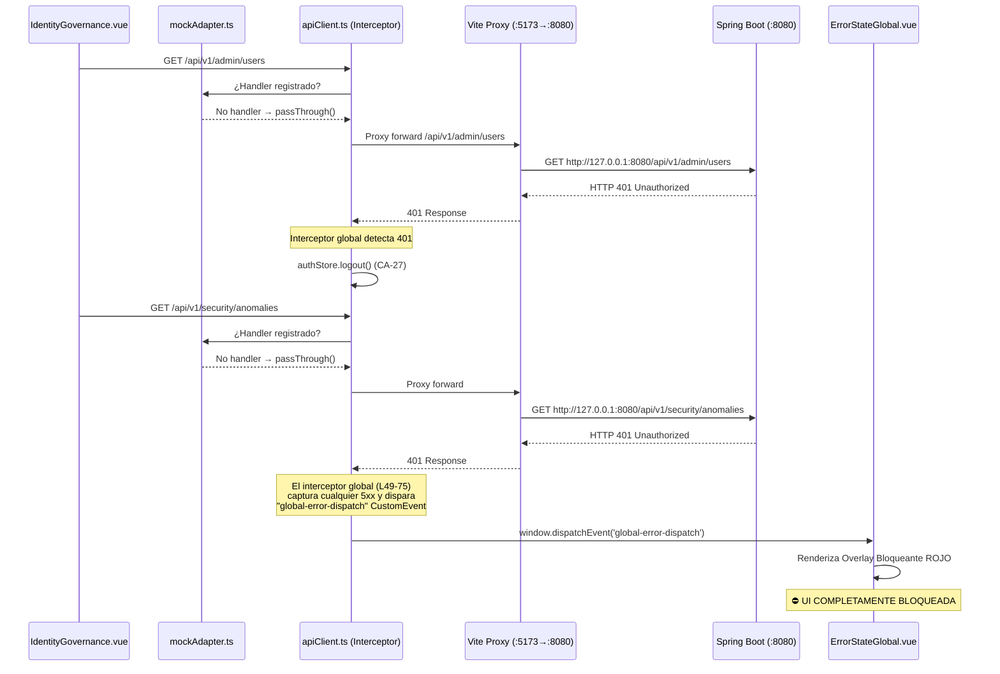
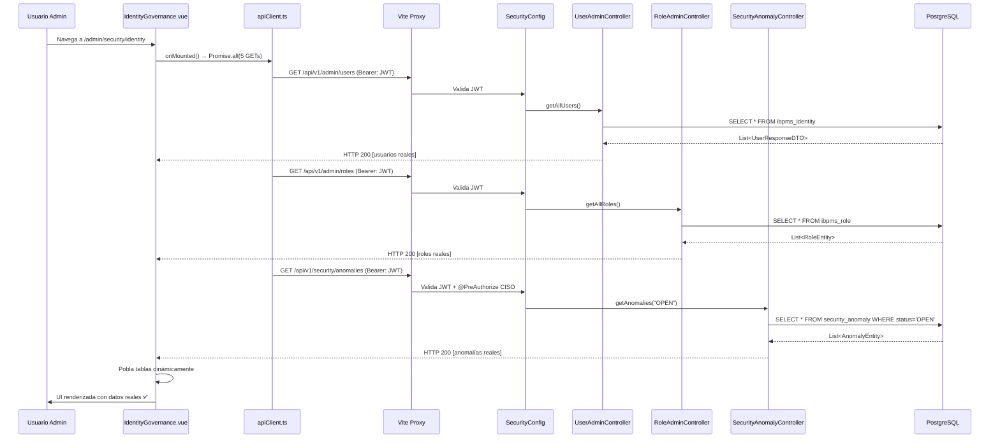

# 🔧 HANDOFF BACKEND — Validación de APIs para Identity Governance (E2E)
## Solicitud de Certificación: Endpoints Consumidos por Pantalla 14 (IdentityGovernance.vue)

**Fecha de Emisión:** 2026-04-22  
**Emitido por:** Agente Frontend (Antigravity)  
**Destinatario:** Arquitecto Líder / Equipo Backend  
**Protocolo:** Zero-Mock Policy | Gobernanza CA-5 | Sprint 6.2  
**Prioridad:** 🔴 BLOQUEANTE para Certificación UAT J-03  

---

## 📋 Resumen Ejecutivo

Durante la ejecución de la política **Zero-Mock** para habilitar pruebas E2E reales en la pantalla de **Gobernanza de Identidad** (`/admin/security/identity`), se eliminaron todos los datos hardcodeados (`mockRoles`, `mockUsers`, `mockProcesses`, `mockAuditLogs`, `mockAnomalies`) del componente `IdentityGovernance.vue`.

Al intentar consumir los endpoints reales del backend, se produjo un **colapso completo de la UI** (Pantalla Roja "ALERTA DEL SISTEMA: NIVEL 0"). La causa raíz fue identificada y mitigada en el frontend, pero **requiere acción del equipo backend** para completar la integración E2E.

---

## 🔴 Incidente Detectado: Análisis Forense

### Síntoma Observado
Al navegar a `http://localhost:5173/admin/security/identity`, la aplicación muestra:

```
⚠ ALERTA DEL SISTEMA: NIVEL 0
Colapso del Servidor / Integración Cíclica
Código de Error: 500
[REINICIAR CONTEXTO]
```

### Cadena Causal (Root Cause Analysis)



### Desglose Técnico

| Capa | Archivo | Hallazgo |
|------|---------|----------|
| **Frontend (Pantalla)** | `IdentityGovernance.vue` L875-894 | Los mocks fueron eliminados correctamente. El `onMounted` ahora hace `Promise.all` contra 5 endpoints reales. |
| **Frontend (Mock Adapter)** | `mockAdapter.ts` | **No tiene handlers** para `/admin/users`, `/admin/roles`, `/security/anomalies`, `/security/audit/reports`. Estos requests caen al `passThrough()` (L415) y se envían al backend real. |
| **Frontend (Interceptor)** | `apiClient.ts` L49-75 | El interceptor global **captura cualquier respuesta 5xx** y emite `global-error-dispatch`, activando el overlay rojo de `ErrorStateGlobal.vue`. Esto ocurre **antes** de que el `catch` local de la pantalla pueda procesar el error. |
| **Proxy (Vite)** | `vite.config.ts` L17-23 | El proxy reenvía `/api/*` a `http://127.0.0.1:8080`. Funciona correctamente. |
| **Backend (Spring Security)** | `SecurityConfig.java` L61-79 | Los endpoints `/api/v1/admin/users`, `/api/v1/admin/roles` y `/api/v1/security/anomalies` **NO están en la whitelist** de `permitAll()`. Requieren JWT Bearer Token válido (`.anyRequest().authenticated()`). |
| **Backend (Respuesta)** | Verificación manual con PowerShell | Los endpoints responden **HTTP 401 Unauthorized** (4 de 5) y **HTTP 500** (1 de 5: `/design/form-definitions`). |

### Evidencia de Verificación Backend (PowerShell)

```powershell
# Ejecutado: 2026-04-22T21:23:44-05:00
/api/v1/admin/users              -> 401 Unauthorized
/api/v1/admin/roles              -> 401 Unauthorized
/api/v1/design/form-definitions  -> 500 InternalServerError
/api/v1/security/anomalies       -> 401 Unauthorized
/api/v1/security/audit/reports   -> 401 Unauthorized
```

### Mitigación Frontend Aplicada

Se aplicó `validateStatus: () => true` en los llamados Axios de `IdentityGovernance.vue` para evitar que el interceptor global dispare el overlay rojo. Esto permite que la pantalla cargue con tablas vacías si el backend no responde con datos válidos:

```typescript
// ANTES (provocaba crash):
apiClient.get('/admin/users').catch(() => ({ data: [] }))

// DESPUÉS (resiliente):
apiClient.get('/admin/users', { validateStatus: () => true }).catch(() => ({ data: [] }))
```

---

## 📋 Contrato de APIs Requerido

La pantalla de Identity Governance necesita los siguientes **5 endpoints operativos** para funcionar en modo E2E sin mocks:

### EP-1: Listar Usuarios del Sistema

| Atributo | Valor |
|----------|-------|
| **Endpoint** | `GET /api/v1/admin/users` |
| **Controller** | `UserAdminController.java` L53-56 |
| **Método** | `getAllUsers()` → `userService.listAll()` |
| **DTO Response** | `List<UserResponseDTO>` |
| **Estado Backend** | ✅ Controller existe, lógica implementada |
| **Estado Security** | ❌ Requiere JWT — No en `permitAll()` |
| **Campos esperados por FE** | `id`, `username`, `email`, `roles[]`, `isActive`, `isExternalIdp` |

### EP-2: Listar Roles del Sistema

| Atributo | Valor |
|----------|-------|
| **Endpoint** | `GET /api/v1/admin/roles` |
| **Controller** | `RoleAdminController.java` L29-32 |
| **Método** | `getAllRoles()` → `roleService.getAllRoles()` |
| **DTO Response** | `List<RoleEntity>` |
| **Estado Backend** | ✅ Controller existe, lógica implementada |
| **Estado Security** | ❌ Requiere JWT — No en `permitAll()` |
| **Campos esperados por FE** | `id` (UUID), `name` |

### EP-3: Catálogo de Procesos BPMN Desplegados

| Atributo | Valor |
|----------|-------|
| **Endpoint** | `GET /api/v1/design/processes/catalog` |
| **Controller** | No existe controller backend real (solo mock en `mockAdapter.ts` L319-323) |
| **Método** | N/A |
| **DTO Response** | Se espera `List<{ id, name, version, status, deployedAt }>` |
| **Estado Backend** | ❌ **NO IMPLEMENTADO** — Solo existe como mock en el frontend |
| **Estado Security** | ⚠️ Path `/api/v1/design/processes/**` está en `permitAll()` (L78) |
| **Campos esperados por FE** | `id`, `name` (mínimo para la Matriz de Concesiones) |

> [!CAUTION]
> Este es el endpoint más crítico. Sin él, la **Matriz de Concesiones Zod (CA-4)** de la Fábrica de Roles queda completamente vacía. El frontend necesita saber qué procesos existen en el motor Camunda para construir las columnas de la matriz `Proceso × Rol`.

### EP-4: Listar Anomalías de Seguridad (CISO)

| Atributo | Valor |
|----------|-------|
| **Endpoint** | `GET /api/v1/security/anomalies` |
| **Controller** | `SecurityAnomalyController.java` L28-31 |
| **Método** | `getAnomalies(status)` → `anomalyService.getAnomaliesByStatus(status)` |
| **DTO Response** | `List<?>` (depende de `SecurityAnomalyService`) |
| **Estado Backend** | ✅ Controller existe |
| **Estado Security** | ❌ Requiere `ROLE_CISO` o `ROLE_SUPER_ADMIN` (`@PreAuthorize`) |
| **Campos esperados por FE** | `id`, `type`, `severity`, `user`, `desc`, `timestamp`, `status` |

### EP-5: Reportes de Auditoría CISO

| Atributo | Valor |
|----------|-------|
| **Endpoint** | `GET /api/v1/security/audit/reports` (Listado general) |
| **Controller** | `AuditReportController.java` — Solo expone `GET /iso27001/role-matrix` (CSV) |
| **Método** | `downloadIso27001RoleMatrix()` |
| **Estado Backend** | ⚠️ **PARCIAL** — Existe solo el sub-endpoint de descarga CSV, no un listado JSON para la tabla del frontend |
| **Estado Security** | ❌ Requiere JWT |
| **Campos esperados por FE** | `id`, `timestamp`, `adminId`, `action`, `delta` (JSON) |

> [!WARNING]
> El `AuditReportController` solo expone un endpoint de **descarga CSV** (`/iso27001/role-matrix`), no un listado JSON de eventos de auditoría. El frontend necesita un endpoint `GET /api/v1/security/audit/reports` que devuelva un `List<AuditLogDTO>` con los campos `id`, `timestamp`, `adminId`, `action` y `delta`.

---

## 🔲 Tareas Solicitadas al Arquitecto Líder

### BACK-IGV-001: Validar Conectividad E2E con JWT en Identity Governance
**Prioridad:** 🔴 BLOQUEANTE | **US:** US-036, US-048

Validar que los 4 endpoints existentes (`EP-1`, `EP-2`, `EP-4`, `EP-5`) respondan correctamente cuando se invoca con un JWT válido generado por el flujo de Emergency Login (`POST /api/v1/auth/emergency-login`).

**Criterio de Aceptación:**
```gherkin
DADO un administrador autenticado vía Emergency Login con roles [ROLE_SUPER_ADMIN, ROLE_CISO]
CUANDO el frontend invoca GET /api/v1/admin/users con el Bearer Token
ENTONCES la respuesta es HTTP 200 con un array JSON de UserResponseDTO
Y la tabla "Usuarios y Sesiones" se puebla dinámicamente
```

**Opciones de Resolución:**
1. **Opción A (Recomendada para UAT local):** Agregar los endpoints de Identity Governance al bloque `permitAll()` en `SecurityConfig.java` para simplificar la validación E2E durante el sprint.
2. **Opción B (Producción):** Verificar que el JWT emitido por Emergency Login incluya los claims `roles: [ROLE_SUPER_ADMIN, ROLE_CISO]` y que el `JwtAuthenticationConverter` los parsee correctamente.

---

### BACK-IGV-002: Implementar Endpoint de Catálogo de Procesos para Matriz RBAC
**Prioridad:** 🔴 BLOQUEANTE | **US:** US-036 CA-4

El endpoint `GET /api/v1/design/processes/catalog` **no existe en el backend real**. Solo existe como mock en `mockAdapter.ts`. Se necesita un controller que consulte las Process Definitions desplegadas en el motor Camunda y devuelva su catálogo.

**Prescripción Sugerida:**
```java
// En un nuevo ProcessCatalogController.java o dentro de un controller existente
@GetMapping("/catalog")
public ResponseEntity<List<Map<String, Object>>> getProcessCatalog() {
    List<ProcessDefinition> definitions = repositoryService.createProcessDefinitionQuery()
            .latestVersion()
            .list();
    
    List<Map<String, Object>> catalog = definitions.stream()
            .map(pd -> Map.<String, Object>of(
                "id", pd.getKey(),
                "name", pd.getName() != null ? pd.getName() : pd.getKey(),
                "version", pd.getVersion(),
                "deployedAt", pd.getDeploymentId()
            ))
            .collect(Collectors.toList());
    
    return ResponseEntity.ok(catalog);
}
```

---

### BACK-IGV-003: Implementar Endpoint de Listado de Logs de Auditoría (JSON)
**Prioridad:** 🟡 MEDIA | **US:** US-036 CA-17

El `AuditReportController` actual solo expone un endpoint de **descarga CSV** para ISO 27001. Se necesita un endpoint complementario que devuelva los eventos de auditoría administrativa en formato JSON para poblar la tabla del Tab "Auditoría CISO".

**Prescripción Sugerida:**
```java
@GetMapping
public ResponseEntity<List<AuditLogDTO>> getAuditLogs(
        @RequestParam(defaultValue = "0") int page,
        @RequestParam(defaultValue = "50") int size) {
    // Consultar tabla de audit_log o crear un AuditLogRepository
    return ResponseEntity.ok(auditService.getRecentLogs(page, size));
}
```

---

## 📊 Matriz de Estado Consolidada

| # | Endpoint | Controller | Security | Lógica | FE Ready | Veredicto |
|---|----------|-----------|----------|--------|----------|-----------|
| EP-1 | `GET /admin/users` | ✅ Existe | ❌ 401 | ✅ | ✅ | **Solo falta JWT** |
| EP-2 | `GET /admin/roles` | ✅ Existe | ❌ 401 | ✅ | ✅ | **Solo falta JWT** |
| EP-3 | `GET /design/processes/catalog` | ❌ No existe | ⚠️ permitAll | ❌ | ✅ | **Requiere implementación** |
| EP-4 | `GET /security/anomalies` | ✅ Existe | ❌ 401 + PreAuth | ✅ | ✅ | **Solo falta JWT + Rol** |
| EP-5 | `GET /security/audit/reports` | ⚠️ Solo CSV | ❌ 401 | ⚠️ | ✅ | **Requiere endpoint JSON** |

---

## 🔄 Diagrama de Flujo E2E Esperado (Post-Remediación)



---

## 📎 Archivos Modificados en Frontend (Referencia)

| Archivo | Cambio | Líneas |
|---------|--------|--------|
| `IdentityGovernance.vue` | Purga de `mockRoles`, `mockUsers`, `mockProcesses`, `mockAuditLogs`, `mockAnomalies` | L557-568, L678-690, L845-855 |
| `IdentityGovernance.vue` | Nuevo `onMounted` con `Promise.all` a 5 endpoints reales + `validateStatus` bypass | L867-910 |
| `IdentityGovernance.vue` | Migración de `mockProcesses` de `const` a `ref()` + ajuste de `.value` en 4 iteraciones | L706-754 |

---

> [!IMPORTANT]
> **Acción requerida del Arquitecto Líder:** Confirmar cuál de las dos opciones de resolución para `BACK-IGV-001` se prefiere (permitAll temporal vs. JWT completo), e indicar si el endpoint de catálogo de procesos (`BACK-IGV-002`) ya existe bajo otra ruta no documentada. Sin esta validación, el Journey J-03 de certificación UAT queda **bloqueado**.

---

*Emitido bajo protocolo de Gobernanza Zero-Trust. Cualquier modificación a los endpoints documentados debe ser trazada en el SSOT del sprint.*
