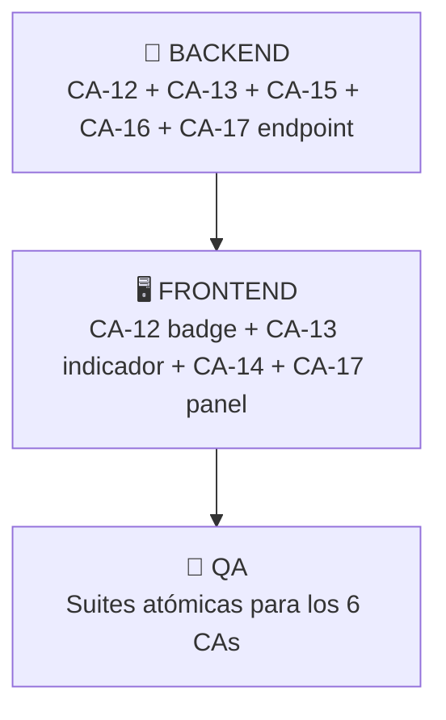

# 🎯 Handoff Iteración 74-DEV — US-028 CA-12 a CA-17
## Remediaciones Post-Análisis Funcional (Zod Sandbox)

> **Fecha:** 2026-04-07 | **Sprint:** 74-DEV | **Rama:** `sprint-3/informe_auditoriaSprint1y2`
> **SSOT:** `v1_user_stories.md` líneas 1476–1541 | **US:** US-028 (Simulador de Contratos Zod en Memoria)

---

## 📋 Resumen Ejecutivo de los 6 CAs

| CA | Título | Capa Primaria | Dependencia |
|----|--------|--------------|-------------|
| CA-12 | Revocación Automática del Sello QA por Mutación del Esquema | **Backend** + Frontend | CA-11 (Sello) |
| CA-13 | Versionado del Sello por Generación del Esquema | **Backend** + Frontend | CA-12 |
| CA-14 | Anotación Explícita de Limitación del Fuzzer en SuperRefine | **Frontend** only | Ninguna |
| CA-15 | Truncamiento y Compresión del Payload en Audit Log | **Backend** only | CA-11 |
| CA-16 | Control de Concurrencia en Certificación Simultánea | **Backend** only | CA-11, CA-13 |
| CA-17 | Validación Cruzada de Coherencia BPMN↔Form en el Sandbox | **Frontend** + Backend | US-005 (formKey) |

> [!IMPORTANT]
> **Exclusiones V2:** Ninguno de estos 6 CAs referencia funcionalidades V2. Todos son remediaciones V1 de brechas detectadas en el análisis funcional. Se implementan **TODOS**.

---

## 🔄 Orden de Ejecución (Secuencial Estricto)



1. **FASE 1 — Backend** (ejecutar primero, ~4 tareas)
2. **FASE 2 — Frontend** (ejecutar después de Backend, ~4 tareas)
3. **FASE 3 — QA** (ejecutar último, validación cruzada)

> [!WARNING]
> **NO ejecutar en paralelo.** El Frontend necesita los endpoints y columnas DDL del Backend. El QA necesita ambas capas compilando.

---

## 🔧 FASE 1 — INSTRUCCIONES PARA EL AGENTE BACKEND

### Contexto Técnico del Entorno
- **Tabla existente:** `ibpms_form_definitions` (changelog `18-create-form-definitions.sql`) con columnas: `id UUID`, `form_id UUID`, `version_id INT`, `schema_content JSONB`, `created_by VARCHAR(50)`, `created_at TIMESTAMP`, `hash_sha256 VARCHAR(64)`
- **Entity existente:** `FormDefinitionEntity.java` en `com.ibpms.poc.infrastructure.jpa.entity`
- **Tabla audit existente:** `ibpms_audit_log` (changelog `20-us036-rbac-schema.sql`) con columnas: `id UUID`, `user_id VARCHAR(100)`, `action VARCHAR(100)`, `timestamp_utc TIMESTAMP`
- **Endpoint de certificación previo (CA-11):** `POST /api/v1/design/forms/{id}/certify` — debe existir o crearse como stub

---

### Tarea Backend 1 — DDL: Ampliar `ibpms_form_definitions` (CA-12 + CA-13)

**Archivo a crear:** `backend/ibpms-core/src/main/resources/db/changelog/25-us028-qa-certification-columns.sql`

```sql
--liquibase formatted sql
--changeset antigravity:25-us028-qa-certification-columns

-- CA-12: Columnas de certificación QA
ALTER TABLE ibpms_form_definitions ADD COLUMN is_qa_certified BOOLEAN NOT NULL DEFAULT FALSE;
ALTER TABLE ibpms_form_definitions ADD COLUMN certified_schema_hash VARCHAR(64);
ALTER TABLE ibpms_form_definitions ADD COLUMN certified_by VARCHAR(100);
ALTER TABLE ibpms_form_definitions ADD COLUMN certified_at TIMESTAMP;

-- CA-15: Columna de payload snapshot comprimido en audit_log
ALTER TABLE ibpms_audit_log ADD COLUMN IF NOT EXISTS payload_snapshot BYTEA;
ALTER TABLE ibpms_audit_log ADD COLUMN IF NOT EXISTS is_compressed BOOLEAN DEFAULT FALSE;
ALTER TABLE ibpms_audit_log ADD COLUMN IF NOT EXISTS truncated BOOLEAN DEFAULT FALSE;
ALTER TABLE ibpms_audit_log ADD COLUMN IF NOT EXISTS details JSONB;
```

**Registrar en el `db.changelog-master.yaml`** la inclusión de este changeset DESPUÉS del changeset 24.

---

### Tarea Backend 2 — Entity: Ampliar `FormDefinitionEntity.java` (CA-12 + CA-13)

**Archivo:** `backend/ibpms-core/src/main/java/com/ibpms/poc/infrastructure/jpa/entity/FormDefinitionEntity.java`

Agregar los siguientes campos JPA al entity existente:

```java
@Column(name = "is_qa_certified", nullable = false)
private Boolean isQaCertified = false;

@Column(name = "certified_schema_hash", length = 64)
private String certifiedSchemaHash;

@Column(name = "certified_by", length = 100)
private String certifiedBy;

@Column(name = "certified_at")
private LocalDateTime certifiedAt;
```

Agregar getters/setters correspondientes.

---

### Tarea Backend 3 — Service: Lógica de Certificación y Revocación (CA-12 + CA-13 + CA-15 + CA-16)

**Archivo a crear:** `backend/ibpms-core/src/main/java/com/ibpms/poc/application/service/FormCertificationService.java`

Este servicio debe implementar la siguiente lógica:

**CA-12 — Revocación automática por mutación:**
- Cuando se guarda un formulario (`POST /api/v1/forms/{formId}`), recalcular SHA-256 del `schema_content`.
- Si el nuevo hash difiere de `certified_schema_hash`, revocar: `is_qa_certified = false`, `certified_schema_hash = null`.
- Registrar en `ibpms_audit_log`: `{ action: 'QA_CERT_REVOKED', details: { reason: 'Schema modified post-certification', previousHash, newHash, modifiedBy, timestamp } }`.

**CA-13 — Versionado por generación:**
- Cada nueva versión (`version_id`) nace con `is_qa_certified = false`.
- El sello NO se hereda entre versiones.

**CA-15 — Truncamiento payload en audit log:**
- Al registrar certificación en `ibpms_audit_log`, aplicar:
  - Si JSON payload < 32KB → almacenar crudo en `payload_snapshot` como bytes.
  - Si 32KB ≤ payload < 64KB → comprimir GZIP → almacenar como `bytea` con `is_compressed = true`.
  - Si payload ≥ 64KB post-compresión → truncar a 32KB + `truncated = true`.

**CA-16 — Concurrencia optimista:**
- El endpoint `POST /api/v1/design/forms/{id}/certify` debe usar `schema_version` como token.
- Si ya fue certificada (verificar `is_qa_certified == true` + `certified_by != null`), retornar `HTTP 409 Conflict` con mensaje: `"Este esquema ya fue certificado por {QA-A} hace {N} segundos."`.
- Registrar AMBOS intentos (exitoso y rechazado) en `ibpms_audit_log`.

---

### Tarea Backend 4 — Endpoint: Diccionario Variables BPMN (CA-17)

**Archivo a crear o modificar:** Exponer endpoint `GET /api/v1/design/processes/{processKey}/variables`

- Retorna un `List<String>` con los nombres de las variables BPMN declaradas en la definición del proceso (Input/Output parameters de los User Tasks).
- Este endpoint será consumido por el Frontend para mostrar el panel de coherencia BPMN↔Zod.
- Si el proceso no existe o no tiene variables, retornar array vacío `[]`.

**Commit convention:**
```
fix(US-028): CA-12/13/15/16/17 Backend QA certification revocation, versioning, truncation, concurrency, and BPMN variable endpoint
```

---

## 🖥️ FASE 2 — INSTRUCCIONES PARA EL AGENTE FRONTEND

### Contexto Técnico del Entorno
- **Archivo principal:** `frontend/src/views/admin/Modeler/FormDesigner.vue` (~2037 líneas)
- **Sandbox Fuzzer existente:** Modal en líneas 771–803, lógica en líneas 1107–1157
- **ZodBuilder:** `frontend/src/views/admin/Modeler/ZodBuilder.ts` (generador de esquemas Zod)
- **API Client:** `frontend/src/services/apiClient.ts`

---

### Tarea Frontend 1 — Badge de Certificación Revocada (CA-12)

**Archivo:** `FormDesigner.vue` — Sección de cabecera del formulario (header)

Agregar un Badge visual condicionado al estado de certificación:
```html
<!-- CA-12: Badge de revocación QA -->
<span v-if="certificationState === 'revoked'"
      class="text-xs bg-amber-100 text-amber-800 border border-amber-300 px-2 py-0.5 rounded shadow-sm font-bold ml-2">
  ⚠️ Certificación QA revocada — Modificación detectada
</span>
<span v-else-if="certificationState === 'certified'"
      class="text-xs bg-green-100 text-green-800 border border-green-300 px-2 py-0.5 rounded shadow-sm font-bold ml-2">
  ✅ Certificado QA
</span>
```

**Estado reactivo:** Agregar `const certificationState = ref<'none' | 'certified' | 'revoked'>('none')` y hydratarlo desde la respuesta API del formulario.

---

### Tarea Frontend 2 — Indicador de Versión en Sandbox (CA-13)

**Archivo:** `FormDesigner.vue` — Dentro del modal Sandbox Fuzzer (línea ~775)

Agregar en la cabecera del modal:
```html
<!-- CA-13: Indicador de versión en Sandbox -->
<span class="text-xs bg-gray-100 text-gray-700 border border-gray-300 px-2 py-0.5 rounded font-mono ml-2">
  📋 Esquema V{{ currentSchemaVersion }} — 
  <span v-if="certificationState === 'certified'" class="text-green-700">Certificado ✅</span>
  <span v-else class="text-amber-700">Sin certificar ⚠️</span>
</span>
```

Agregar `const currentSchemaVersion = ref(1)` y hydratarlo desde API.

---

### Tarea Frontend 3 — Anotación SuperRefine en Fuzzer (CA-14)

**Archivo:** `FormDesigner.vue` — Función `runFuzzerZod()` (línea ~1118) y ZodBuilder

Modificar la función `runFuzzerZod`:
1. Después de ejecutar `schema.safeParse(payload)`, analizar los errores.
2. Si existen reglas `visualRules` (que se mapean a `.superRefine()`), los errores de origen cruzado deben pintarse en **NARANJA** (no ROJO).
3. Agregar indicador visual al inicio del panel de resultados:

```html
<!-- CA-14: Indicador de SuperRefine -->
<div v-if="superRefineCount > 0" class="text-orange-400 font-mono text-xs mb-2 border-b border-orange-800 pb-1">
  🔧 {{ superRefineCount }} validaciones cruzadas detectadas — Requieren corrección manual del QA
</div>
```

**Lógica:** `const superRefineCount = computed(() => visualRules.value.length)`.

Para diferenciar errores NARANJA vs ROJO:
- Los errores cuyo `path` coincida con un campo de `visualRules` (fieldA o fieldB) se pintan en **NARANJA** (`text-orange-400`).
- Los demás errores se pintan en **ROJO** (`text-red-400`).

---

### Tarea Frontend 4 — Panel de Coherencia BPMN↔Zod (CA-17)

**Archivo:** `FormDesigner.vue` — Dentro del modal Sandbox Fuzzer, agregar panel colapsable.

```html
<!-- CA-17: Panel de Coherencia BPMN ↔ Zod -->
<details v-if="formKey" class="mt-4 bg-gray-800 rounded p-3 border border-gray-700">
  <summary class="text-xs font-bold text-cyan-400 cursor-pointer">🔗 Coherencia BPMN ↔ Zod</summary>
  <div class="mt-2 space-y-1 text-xs font-mono">
    <div v-for="item in bpmnCoherenceResults" :key="item.name" :class="item.class">
      {{ item.icon }} {{ item.label }}
    </div>
  </div>
</details>
<div v-else class="mt-4 text-xs text-gray-500 italic">
  🔗 Sin proceso BPMN vinculado — Validación de coherencia no aplica
</div>
```

**Lógica:**
1. Al abrir el Sandbox, si el formulario tiene `formKey`, llamar `GET /api/v1/design/processes/{processKey}/variables`.
2. Comparar variables BPMN retornadas contra campos `camundaVariable` del esquema Zod:
   - **Match:** `✅ Variable BPMN '{name}' → Campo Zod '{name}'`
   - **BPMN sin Zod:** `⚠️ Variable BPMN '{name}' → No encontrada en esquema Zod`
   - **Zod sin BPMN:** `ℹ️ Campo Zod '{name}' → No declarado en BPMN`
3. Esta validación es **INFORMATIVA** (no bloqueante para certificación).

**API Client:** Agregar en `apiClient.ts`:
```ts
// CA-17: Variables BPMN para coherencia
getBpmnVariables: (processKey: string) => apiClient.get(`/design/processes/${processKey}/variables`),
```

**Commit convention:**
```
feat(frontend): US-028 CA-12/13/14/17 QA certification badge, version indicator, superRefine annotation, BPMN coherence panel
```

---

## 🧪 FASE 3 — INSTRUCCIONES PARA EL AGENTE QA

### Suite 1 — Backend Integration Test (REST Assured)

**Archivo a crear:** `backend/ibpms-core/src/test/java/com/ibpms/poc/infrastructure/web/FormCertificationTest.java`

**Tests requeridos (6 mínimo):**

| # | Test | CA | Aserción esperada |
|---|------|----|-------------------|
| 1 | Certificar formulario exitosamente | CA-11 | `POST /certify` → 200 + `is_qa_certified = true` |
| 2 | Revocar sello al modificar esquema | CA-12 | Guardar formulario modificado → `is_qa_certified = false` + audit log `QA_CERT_REVOKED` |
| 3 | Nueva versión nace sin sello | CA-13 | Crear version_id+1 → `is_qa_certified = false` |
| 4 | Payload >32KB se comprime | CA-15 | Payload grande → audit log `is_compressed = true` |
| 5 | Concurrencia: segundo intento → 409 | CA-16 | Dos POSTs → primero 200, segundo 409 |
| 6 | Endpoint variables BPMN retorna lista | CA-17 | `GET /variables` → `200 OK` con array |

### Suite 2 — Frontend Unit Test (Vitest)

**Archivo a crear:** `frontend/src/tests/views/FormDesignerQACert.spec.ts`

**Tests requeridos (4 mínimo):**

| # | Test | CA | Aserción esperada |
|---|------|----|-------------------|
| 1 | Badge muestra "revoked" cuando certification state cambia | CA-12 | Badge ⚠️ visible |
| 2 | Indicador de versión muestra V{N} + estado | CA-13 | Texto contiene `Esquema V` |
| 3 | Errores de superRefine se pintan en naranja | CA-14 | Clases CSS contienen `text-orange-400` |
| 4 | Panel de coherencia muestra matches y warnings | CA-17 | Lista contiene ✅ y ⚠️ |

**Commit convention:**
```
test(QA): US-028 CA-12/13/14/15/16/17 Backend integration + Frontend unit QA certification suites
```

---

## 📊 Actualización Requerida en `coverage_matrix.md`

Al completar cada fase, el agente responsable DEBE actualizar la sección US-028 con:

```markdown
| CA-12 | Revocación Sello Mutación | ✅ | ✅ | ❌ | 74-DEV | handoff_74DEV_US028_CA12_CA17 |
| CA-13 | Versionado Sello Schema | ✅ | ✅ | ❌ | 74-DEV | handoff_74DEV_US028_CA12_CA17 |
| CA-14 | Anotación SuperRefine Fuzzer | N/A | ✅ | ❌ | 74-DEV | handoff_74DEV_US028_CA12_CA17 |
| CA-15 | Truncamiento Payload Audit | ✅ | N/A | ❌ | 74-DEV | handoff_74DEV_US028_CA12_CA17 |
| CA-16 | Concurrencia Certificación | ✅ | N/A | ❌ | 74-DEV | handoff_74DEV_US028_CA12_CA17 |
| CA-17 | Coherencia BPMN↔Zod | ✅ | ✅ | ❌ | 74-DEV | handoff_74DEV_US028_CA12_CA17 |
```

---

## ✉️ Mensaje para el Humano (Copiar y Pegar a los Agentes)

### 📨 Para el Agente Backend:

> **Iteración 74-DEV | US-028 CA-12/13/15/16/17 | Prioridad: ALTA**
>
> Ejecuta las 4 tareas Backend del handoff `.agentic-sync/handoff_74DEV_US028_CA12_CA17.md`. Resumen:
> 1. **DDL** — Crear changeset `25-us028-qa-certification-columns.sql` con columnas `is_qa_certified`, `certified_schema_hash`, `certified_by`, `certified_at` en `ibpms_form_definitions` + columnas `payload_snapshot`, `is_compressed`, `truncated`, `details` en `ibpms_audit_log`.
> 2. **Entity** — Ampliar `FormDefinitionEntity.java` con los 4 campos nuevos + getters/setters.
> 3. **Service** — Crear `FormCertificationService.java` con lógica de: revocación automática por hash (CA-12), versionado sin herencia de sello (CA-13), truncamiento GZIP de payloads (CA-15) y concurrencia optimista 409 (CA-16).
> 4. **Endpoint** — Crear/exponer `GET /api/v1/design/processes/{processKey}/variables` para CA-17.
>
> **Convención:** `fix(US-028): CA-12/13/15/16/17 Backend QA certification revocation, versioning, truncation, concurrency, BPMN variable endpoint`
> **Compilación obligatoria:** `mvn clean compile -pl ibpms-core` — Si falla, reportar el error exacto.
> **Push a:** `sprint-3/informe_auditoriaSprint1y2`

---

### 📨 Para el Agente Frontend:

> **Iteración 74-DEV | US-028 CA-12/13/14/17 | Prioridad: ALTA | REQUIERE: Backend completado primero**
>
> Ejecuta las 4 tareas Frontend del handoff `.agentic-sync/handoff_74DEV_US028_CA12_CA17.md`. Resumen:
> 1. **Badge CA-12** — Agregar badge de certificación/revocación en la cabecera del `FormDesigner.vue`.
> 2. **Indicador CA-13** — Mostrar `📋 Esquema V{N} — Certificado/Sin certificar` en el header del modal Sandbox Fuzzer.
> 3. **SuperRefine CA-14** — En `runFuzzerZod()`, diferenciar errores de validaciones cruzadas (NARANJA) vs errores de tipo base (ROJO).
> 4. **Panel Coherencia CA-17** — Panel colapsable `🔗 Coherencia BPMN ↔ Zod` dentro del Sandbox que compara variables BPMN vs campos Zod. Agregar endpoint en `apiClient.ts`.
>
> **Convención:** `feat(frontend): US-028 CA-12/13/14/17 QA certification badge, version indicator, superRefine annotation, BPMN coherence panel`
> **Build obligatorio:** `npm run build` — Si falla, reportar el error exacto.
> **Push a:** `sprint-3/informe_auditoriaSprint1y2`

---

### 📨 Para el Agente QA:

> **Iteración 74-DEV | US-028 CA-12 a CA-17 | Prioridad: ALTA | REQUIERE: Backend + Frontend completados primero**
>
> Ejecuta las 2 suites QA del handoff `.agentic-sync/handoff_74DEV_US028_CA12_CA17.md`. Resumen:
> 1. **Backend Test** — Crear `FormCertificationTest.java` con 6 tests: certificar (CA-11), revocar por mutación (CA-12), versión nueva sin sello (CA-13), payload comprimido (CA-15), concurrencia 409 (CA-16), variables BPMN (CA-17).
> 2. **Frontend Test** — Crear `FormDesignerQACert.spec.ts` con 4 tests: badge revocación (CA-12), indicador versión (CA-13), errores naranja superRefine (CA-14), panel coherencia (CA-17).
>
> **Convención:** `test(QA): US-028 CA-12/13/14/15/16/17 Backend integration + Frontend unit QA certification suites`
> **Ejecución obligatoria:** Los tests pueden fallar si el Backend no tiene todos los endpoints implementados (TDD Gatekeeper mode). Reportar resultado exacto.
> **Push a:** `sprint-3/informe_auditoriaSprint1y2`
