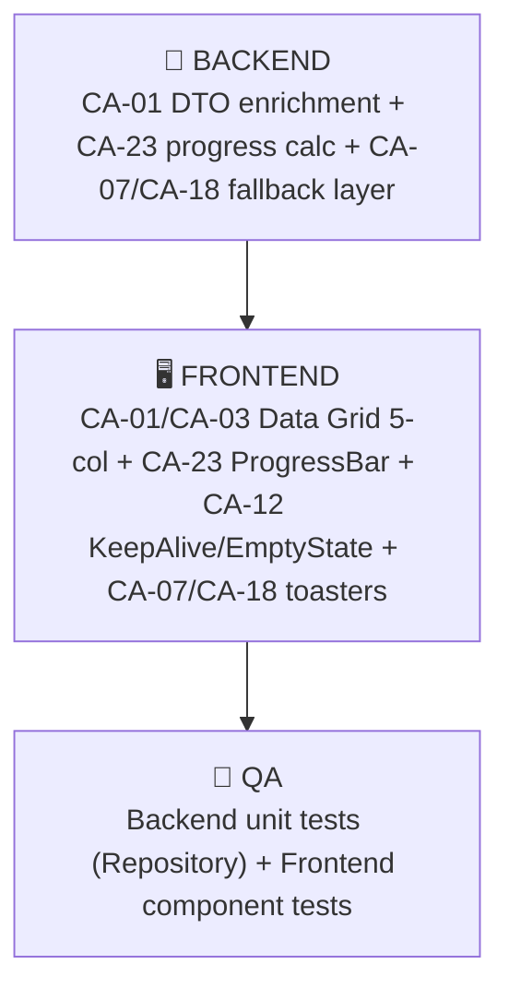

# 🎯 Handoff Iteración 77-DEV — US-001 CA-01, CA-03, CA-23, CA-12, CA-07, CA-18
## Esqueleto Visual, Cálculo de Avance y Resiliencia Multi-Motor

> **Fecha:** 2026-04-08 | **Sprint:** 77-DEV | **Rama:** `sprint-3/informe_auditoriaSprint1y2`
> **SSOT:** `v1_user_stories.md` líneas 206–343 | **US:** US-001 (Obtener Tareas Pendientes en el Workdesk)

---

## 📋 Resumen Ejecutivo de los 6 CAs

| CA | Título | Capa Primaria | Dependencia |
|----|--------|--------------|-------------|
| CA-01 | Carga Inicial con Paginación y Prioridad SLA | **Backend** (refactor DTO) + Frontend | CA-20 (Contrato API 76-DEV) |
| CA-03 | Consolidación UI Unificada BPMN/Kanban (Data Grid 5 Columnas) | **Frontend** + Backend | CA-01 |
| CA-23 | Fórmula Determinista para Columna "Avance" | **Backend** (cálculo) + Frontend (progress bar) | US-005 (definición BPMN), CA-03 |
| CA-12 | Ergonomía Visual, KeepAlive y Empty States Gamificados | **Frontend** only | CA-03 |
| CA-07 | Degradación Elegante ante Falla BPMN | **Backend** (fallback) + Frontend (toaster) | Camunda TaskService |
| CA-18 | Degradación Elegante Multi-Motor y Prioridad Reapertura | **Backend** (catch layer) + Frontend (banner) | CA-07 |

> [!IMPORTANT]
> **Exclusiones V2:** CA-02 (búsqueda híbrida client-side) fue ANULADO por CA-19 (76-DEV). El comportamiento de búsqueda sigue siendo exclusivamente Server-Side. No se implementa filtrado en memoria local.

---

## 🔄 Orden de Ejecución (Secuencial Estricto)



1. **FASE 1 — Backend** (ejecutar primero, ~4 tareas)
2. **FASE 2 — Frontend** (ejecutar después de Backend, ~5 tareas)
3. **FASE 3 — QA** (ejecutar último, validación cruzada)

> [!WARNING]
> **NO ejecutar en paralelo.** El Frontend necesita el campo `progressPercent` del DTO enriquecido del Backend y el flag `degraded` del `WorkdeskResponseDTO`. El QA necesita ambas capas compilando.

---

## 🔧 FASE 1 — INSTRUCCIONES PARA EL AGENTE BACKEND

### Contexto Técnico del Entorno
- **Entity existente:** `WorkdeskProjectionEntity.java` en `com.ibpms.poc.infrastructure.jpa.entity` — Tabla `ibpms_workdesk_projection` con columnas: `id`, `source_system`, `original_task_id`, `title`, `assignee`, `candidate_group`, `sla_expiration_date`, `status`, `payload_metadata`, `tenant_id`, `impact_level`.
- **Repository existente:** `WorkdeskProjectionRepository.java` con query nativa `findWorkdeskTasks` (CA-14/CA-19/CA-17 de 76-DEV).
- **Controller existente:** `WorkdeskQueryController.java` en ruta `/api/v1/workdesk/global-inbox` — Retorna `WorkdeskResponseDTO` con flag `degraded` y `Page<WorkdeskGlobalItemDTO>`.
- **DTO existente:** `WorkdeskGlobalItemDTO.java` con campos: `unifiedId`, `sourceSystem`, `originalTaskId`, `title`, `slaExpirationDate`, `status`, `assignee`, `impactLevel`. **FALTA:** `progressPercent`, `typeBadge`, `financialImpactBadge`.
- **Response DTO existente:** `WorkdeskResponseDTO.java` con campos: `degraded (boolean)`, `content (Page<WorkdeskGlobalItemDTO>)`.
- **Camunda Service existente:** `ListarTareasService.java` usa `TaskService` nativo de Camunda para queries directas. Este servicio actualmente NO está integrado con el `WorkdeskQueryController`.
- **Kanban Entity existente:** `KanbanTaskEntity.java` — Tabla `ibpms_task` con columnas: `id`, `board_id`, `title`, `status`, `assignee`, `priority`, `sla_due_date`.
- **DDL existente (76-DEV):** `26-us001-workdesk-schema.sql` — Ya incluye `tenant_id`, `impact_level`, índices GIN `pg_trgm`.

---

### Tarea Backend 1 — DDL: Ampliar `ibpms_workdesk_projection` (CA-23)

**Archivo a crear:** `backend/ibpms-core/src/main/resources/db/changelog/27-us001-workdesk-progress.sql`

```sql
--liquibase formatted sql
--changeset ibpms:27-us001-workdesk-progress

-- CA-23: Columnas para cálculo determinista de Avance
ALTER TABLE ibpms_workdesk_projection 
ADD COLUMN progress_percent SMALLINT DEFAULT NULL,
ADD COLUMN total_steps SMALLINT DEFAULT NULL,
ADD COLUMN current_step SMALLINT DEFAULT NULL,
ADD COLUMN process_definition_key VARCHAR(255) DEFAULT NULL;

-- CA-01/CA-03: Badge de tipo visual
-- (source_system ya existe: BPMN/KANBAN. No se necesita columna adicional.)

COMMENT ON COLUMN ibpms_workdesk_projection.progress_percent IS 'CA-23: Porcentaje 0-100 calculado server-side. NULL = N/D.';
COMMENT ON COLUMN ibpms_workdesk_projection.total_steps IS 'CA-23: Total UserTasks del proceso BPMN o columnas Kanban.';
COMMENT ON COLUMN ibpms_workdesk_projection.current_step IS 'CA-23: Índice ordinal actual (1-based).';
```

**Registrar en el `db.changelog-master.yaml`** la inclusión de este changeset DESPUÉS del changeset 26.

---

### Tarea Backend 2 — Entity: Ampliar `WorkdeskProjectionEntity.java` (CA-23)

**Archivo:** `backend/ibpms-core/src/main/java/com/ibpms/poc/infrastructure/jpa/entity/WorkdeskProjectionEntity.java`

Agregar los siguientes campos JPA al entity existente (DESPUÉS de `impactLevel`):

```java
@Column(name = "progress_percent")
private Integer progressPercent;

@Column(name = "total_steps")
private Integer totalSteps;

@Column(name = "current_step")
private Integer currentStep;

@Column(name = "process_definition_key")
private String processDefinitionKey;
```

La clase ya tiene `@Getter @Setter` de Lombok, no se necesitan getters/setters manuales.

---

### Tarea Backend 3 — DTO: Enriquecer `WorkdeskGlobalItemDTO.java` (CA-01, CA-03, CA-23)

**Archivo:** `backend/ibpms-core/src/main/java/com/ibpms/poc/application/dto/WorkdeskGlobalItemDTO.java`

Agregar los siguientes campos al DTO existente:

```java
// CA-23: Porcentaje de avance determinista (null = N/D)
private Integer progressPercent;

// CA-03: Badge textual para la UI ('⚡ Flujo' o '📅 Proyecto')
private String typeBadge;

// CA-17: Flag de impacto financiero alto para badge visual
private boolean financialImpactHigh;
```

---

### Tarea Backend 4 — Controller: Ampliar mapping en `WorkdeskQueryController.java` (CA-01, CA-03, CA-23, CA-07, CA-18)

**Archivo:** `backend/ibpms-core/src/main/java/com/ibpms/poc/infrastructure/web/WorkdeskQueryController.java`

Modificar el mapper interno `entities.map(e -> {...})` (líneas ~53-64) para incluir los nuevos campos:

```java
Page<WorkdeskGlobalItemDTO> dtoPage = entities.map(e -> {
    WorkdeskGlobalItemDTO dto = new WorkdeskGlobalItemDTO();
    dto.setUnifiedId(e.getId());
    dto.setSourceSystem(e.getSourceSystem());
    dto.setOriginalTaskId(e.getOriginalTaskId());
    dto.setTitle(e.getTitle());
    dto.setSlaExpirationDate(e.getSlaExpirationDate());
    dto.setStatus(e.getStatus());
    dto.setAssignee(e.getAssignee());
    dto.setImpactLevel(e.getImpactLevel());
    
    // CA-23: Inyección del avance calculado
    dto.setProgressPercent(e.getProgressPercent());
    
    // CA-03: Badge visual de tipo
    dto.setTypeBadge("BPMN".equals(e.getSourceSystem()) ? "⚡ Flujo" : "📅 Proyecto");
    
    // CA-17: Flag de impacto financiero alto (umbral >= 8)
    dto.setFinancialImpactHigh(e.getImpactLevel() != null && e.getImpactLevel() >= 8);
    
    return dto;
});
```

**CA-07 / CA-18 — Degradación Elegante:**
El bloque `catch` existente (líneas ~68-74) ya retorna `WorkdeskResponseDTO(true, emptyPage)` con `degraded=true`. Esto es **correcto y suficiente** para esta iteración. El Frontend consumirá ese flag. Sin embargo, mejorar el log para incluir diagnóstico diferenciado:

```java
} catch (Exception e) {
    // CA-07/CA-18: Degradación Elegante Multi-Motor
    boolean isCamundaFailure = e.getMessage() != null && 
        (e.getMessage().contains("Camunda") || e.getMessage().contains("ProcessEngine") || e.getCause() instanceof org.springframework.web.client.ResourceAccessException);
    
    if (isCamundaFailure) {
        log.warn("CA-07: Motor BPMN degradado. Retornando solo tareas Kanban locales.", e);
    } else {
        log.error("Error crítico completo en bandeja CQRS Workdesk.", e);
    }
    
    // Retornar vacío con bandera de degradación
    @SuppressWarnings("null")
    Page<WorkdeskGlobalItemDTO> emptyPage = new PageImpl<>(Collections.emptyList(), pageable, 0);
    return ResponseEntity.ok(new WorkdeskResponseDTO(true, emptyPage));
}
```

> [!IMPORTANT]
> **Nota arquitectónica (CA-07/CA-18):** En la implementación actual, la query `findWorkdeskTasks` opera sobre la tabla de proyección unificada (`ibpms_workdesk_projection`), que es una vista materializada local. Esto significa que el fallback a "solo Kanban" requeriría un query alternativo que filtre `source_system = 'KANBAN'`. Para esta iteración, establecemos el mecanismo de catch + flag `degraded`. El filtrado granular por `source_system` se implementará cuando el synchronizer CQRS que alimenta la proyección esté operativo.

**Commit convention:**
```
feat(US-001): CA-01/03/23/07/18 Backend DTO enrichment, progress columns, degradation diagnostics
```

---

## 🖥️ FASE 2 — INSTRUCCIONES PARA EL AGENTE FRONTEND

### Contexto Técnico del Entorno
- **Archivo principal:** `frontend/src/views/Workdesk.vue` (~485 líneas)
- **Store Pinia:** `frontend/src/stores/useWorkdeskStore.ts` (~126 líneas) — Interface `WorkdeskGlobalItemDTO` en líneas 5-15.
- **API Client:** `frontend/src/services/apiClient.ts` (~196 líneas) — Endpoint existente en línea 113-114: `getGlobalInbox`.
- **Grilla actual:** Card-based grid con CSS Grid 4 columnas responsive (línea 143). NO es una Data Grid tabular de 5 columnas como requiere CA-03.

---

### Tarea Frontend 1 — Ampliar Interface TypeScript del Store (CA-01, CA-03, CA-23)

**Archivo:** `frontend/src/stores/useWorkdeskStore.ts` — Interfaz `WorkdeskGlobalItemDTO` (líneas 5-15)

Agregar los campos nuevos retornados por Backend:

```typescript
export interface WorkdeskGlobalItemDTO {
  unifiedId: string;
  sourceSystem: 'BPMN' | 'KANBAN';
  originalTaskId: string;
  title: string;
  slaExpirationDate: string; // ISO 8601
  status: string;
  assignee: string | null;
  isSlaAtRisk?: boolean;
  candidateGroup?: string;
  
  // 77-DEV: Nuevos campos CA-01/CA-03/CA-23
  progressPercent: number | null;    // CA-23: null = N/D
  typeBadge: string;                 // CA-03: '⚡ Flujo' o '📅 Proyecto'
  financialImpactHigh: boolean;      // CA-17: Badge 🔥
  impactLevel?: number;
}
```

---

### Tarea Frontend 2 — Reemplazar Card Grid por Data Grid Tabular 5 Columnas (CA-01, CA-03)

**Archivo:** `frontend/src/views/Workdesk.vue` — Reemplazar el bloque CSS Grid de Cards (líneas ~142-207) por una tabla HTML semántica.

Las 5 columnas estandarizadas según CA-03 son: **[Nombre, SLA, Estado, Avance, Recurso]**

```html
<!-- CA-03: Data Grid Universal 5 Columnas -->
<div v-else class="overflow-x-auto">
  <table class="w-full text-sm text-left">
    <thead class="text-[10px] uppercase tracking-wider text-gray-400 border-b border-gray-200 bg-gray-50/50">
      <tr>
        <th class="px-4 py-3 font-bold">Nombre</th>
        <th class="px-4 py-3 font-bold">SLA</th>
        <th class="px-4 py-3 font-bold">Estado</th>
        <th class="px-4 py-3 font-bold hidden md:table-cell">Avance</th>
        <th class="px-4 py-3 font-bold hidden md:table-cell">Recurso</th>
      </tr>
    </thead>
    <tbody>
      <tr 
        v-for="task in filteredItems" 
        :key="task.unifiedId"
        @click="mockOpenTask(task)"
        class="border-b border-gray-100 hover:bg-indigo-50/30 cursor-pointer transition-colors group"
      >
        <!-- Col 1: Nombre + Badge Tipo + Badge Impacto -->
        <td class="px-4 py-3">
          <div class="flex items-center gap-2">
            <span class="material-symbols-outlined text-lg" :class="task.sourceSystem === 'BPMN' ? 'text-indigo-600' : 'text-cyan-600'">
              {{ task.sourceSystem === 'BPMN' ? 'bolt' : 'account_tree' }}
            </span>
            <div class="flex flex-col min-w-0">
              <span class="font-semibold text-[#1e1b4b] truncate max-w-[280px] group-hover:text-indigo-600 transition-colors">{{ task.title }}</span>
              <span class="text-[10px] font-mono text-gray-400">{{ task.originalTaskId }}</span>
            </div>
            <span v-if="task.financialImpactHigh" class="px-1.5 py-0.5 bg-red-100 text-red-700 rounded text-[9px] font-black border border-red-200 shrink-0">🔥 Impacto</span>
          </div>
        </td>
        <!-- Col 2: SLA Semáforo Vivo -->
        <td class="px-4 py-3">
          <span :class="['px-2 py-1 rounded text-[10px] font-bold uppercase tracking-wider border', getSlaPillClass(task.slaExpirationDate)]">
            {{ getSlaRelativeTime(task.slaExpirationDate) }}
          </span>
        </td>
        <!-- Col 3: Estado -->
        <td class="px-4 py-3">
          <span class="px-2 py-1 bg-gray-100/80 text-gray-600 rounded text-[10px] font-bold uppercase border border-gray-200 border-dashed">{{ task.status }}</span>
        </td>
        <!-- Col 4: Avance (CA-23) - Oculta en móvil -->
        <td class="px-4 py-3 hidden md:table-cell">
          <div v-if="task.progressPercent != null" class="flex items-center gap-2">
            <div class="flex-1 bg-gray-200 rounded-full h-2 max-w-[120px]">
              <div class="bg-indigo-600 h-2 rounded-full transition-all duration-500" :style="{ width: task.progressPercent + '%' }"></div>
            </div>
            <span class="text-[10px] font-bold text-gray-500 w-8 text-right">{{ task.progressPercent }}%</span>
          </div>
          <span v-else class="text-[10px] text-gray-400 italic">N/D</span>
        </td>
        <!-- Col 5: Recurso Asignado - Oculta en móvil (CA-12 degradación responsive) -->
        <td class="px-4 py-3 hidden md:table-cell">
          <div class="flex items-center gap-2">
            <div v-if="task.assignee" class="w-6 h-6 rounded-full bg-indigo-600 text-white flex items-center justify-center font-bold text-[9px] ring-1 ring-indigo-100 uppercase shrink-0">
              {{ task.assignee.substring(0,2) }}
            </div>
            <span class="text-xs text-gray-600 truncate max-w-[100px]">{{ task.assignee || 'Sin Asignar' }}</span>
          </div>
        </td>
      </tr>
    </tbody>
  </table>
</div>
```

---

### Tarea Frontend 3 — KeepAlive, Empty State Gamificado y Paginación Sticky (CA-12)

**Archivo:** `frontend/src/views/Workdesk.vue`

**CA-12a - KeepAlive:** No se puede aplicar dentro del componente; debe hacerse en el router-view del layout padre. Verificar si `MainLayout.vue` ya tiene `<router-view v-slot="{ Component }">` con `<keep-alive>`. Si no lo tiene, agregar en `frontend/src/layouts/MainLayout.vue`:

```html
<router-view v-slot="{ Component }">
  <keep-alive include="Workdesk">
    <component :is="Component" />
  </keep-alive>
</router-view>
```

Y agregar en `Workdesk.vue` el `defineOptions` para que funcione el `include`:
```typescript
defineOptions({ name: 'Workdesk' });
```

**CA-12b — Empty State Gamificado:** Reemplazar el Empty State actual (líneas ~135-140) con una ilustración gamificada:

```html
<!-- CA-12: Empty State Gamificado -->
<div v-if="filteredItems.length === 0 && !store.isLoading" class="absolute inset-0 flex flex-col items-center justify-center">
  <div class="mx-auto flex h-24 w-24 items-center justify-center rounded-full bg-gradient-to-br from-emerald-100 to-green-50 border-2 border-emerald-200 shadow-lg">
    <span class="material-symbols-outlined text-emerald-500 text-5xl">celebration</span>
  </div>
  <h3 class="mt-6 text-lg font-bold text-emerald-700">🎉 ¡Bandeja Vacía!</h3>
  <p class="mt-2 text-gray-500 font-medium tracking-wide text-sm max-w-sm text-center">
    Has resuelto todas tus tareas pendientes. Excelente desempeño operativo.
  </p>
  <p class="mt-1 text-[10px] text-gray-400 uppercase tracking-widest font-semibold">Última sincronización: {{ new Date().toLocaleTimeString() }}</p>
</div>
```

**CA-12c — Redirección anti "Empty Last Page":** Agregar watcher en la sección `<script setup>`:

```typescript
import { watch } from 'vue';

// CA-12: Anti Empty Last Page
watch(() => store.items.length, (newLen) => {
  if (newLen === 0 && store.pageInfo.pageNumber > 0) {
    store.fetchGlobalInbox(0, store.pageInfo.pageSize, searchQuery.value, delegationFilter.value, typeFilter.value, slaFilter.value);
  }
});
```

---

### Tarea Frontend 4 — Toaster/Banner de Degradación BPMN (CA-07, CA-18)

**Archivo:** `frontend/src/views/Workdesk.vue`

Agregar un banner persistente en el template, justo DESPUÉS del `<!-- Error Bar -->` existente (línea ~86):

```html
<!-- CA-07/CA-18: Banner de Degradación BPMN -->
<Transition name="toast-slide">
  <div v-if="store.isDegraded" class="bg-amber-50 border-b border-amber-300 p-3 shadow-sm flex items-center flex-shrink-0 gap-3">
    <span class="material-symbols-outlined text-amber-600 text-xl animate-pulse shrink-0">warning</span>
    <div>
      <p class="text-amber-800 font-bold text-sm">Sincronización BPMN degradada temporalmente</p>
      <p class="text-amber-600 text-xs">Las tareas de procesos automatizados podrían no estar actualizadas. Las tareas Kanban operan con normalidad.</p>
    </div>
  </div>
</Transition>
```

**En el Store (`useWorkdeskStore.ts`)**, agregar el campo `isDegraded` al state y parsearlo del response:

```typescript
// En state:
isDegraded: false,

// En fetchGlobalInbox, después de parsear response.data:
this.isDegraded = response.data?.degraded === true;
```

---

### Tarea Frontend 5 — Actualizar endpoint URL en Store (CA-20 Alineación)

**Archivo:** `frontend/src/stores/useWorkdeskStore.ts` — Línea 43

El Store actualmente llama a `/api/v1/workdesk/my-queues` pero el Backend expone `/api/v1/workdesk/global-inbox` (definido en `WorkdeskQueryController.java` línea 35). Alinear:

```typescript
// ANTES (línea 43):
const response = await apiClient.get('/api/v1/workdesk/my-queues', {

// DESPUÉS (CA-20 alineación):
const response = await apiClient.get('/workdesk/global-inbox', {
```

Nota: `apiClient` ya tiene `baseURL: '/api/v1'`, por lo que la ruta relativa es `/workdesk/global-inbox`.

**Commit convention:**
```
feat(frontend): US-001 CA-01/03/23/12/07/18 Data Grid 5-col, progress bar, KeepAlive, degradation banner
```

---

## 🧪 FASE 3 — INSTRUCCIONES PARA EL AGENTE QA

### Suite 1 — Backend Unit Test (Repository Data Layer)

**Archivo a crear:** `backend/ibpms-core/src/test/java/com/ibpms/poc/infrastructure/jpa/repository/WorkdeskRepositoryTest.java`

**Tests requeridos (5 mínimo):**

| # | Test | CA | Aserción esperada |
|---|------|----|-------------------|
| 1 | Query retorna solo tareas del tenant actual | CA-14 | `findWorkdeskTasks("tenant-A", ...)` NO retorna registros de `tenant-B` |
| 2 | Ordered by impactLevel DESC, sla ASC NULLS LAST | CA-17 | Primer resultado tiene `impactLevel` más alto; tareas con `sla=null` van al final |
| 3 | Search ILIKE funciona con substring | CA-19 | `findWorkdeskTasks(t, "parcial", ...)` retorna tareas cuyo title contiene "parcial" |
| 4 | DTO incluye progressPercent cuando existe | CA-23 | Entity con `progress_percent=60` → DTO `progressPercent == 60` |
| 5 | DTO retorna progressPercent null cuando no calculable | CA-23 | Entity con `progress_percent=null` → DTO `progressPercent == null` |

### Suite 2 — Frontend Component Test (Vitest)

**Archivo a crear:** `frontend/src/tests/views/WorkdeskGrid.spec.ts`

**Tests requeridos (5 mínimo):**

| # | Test | CA | Aserción esperada |
|---|------|----|-------------------|
| 1 | Data Grid renderiza 5 columnas (Nombre, SLA, Estado, Avance, Recurso) | CA-03 | `thead` contiene exactamente 5 `th` elements |
| 2 | Progress bar muestra porcentaje cuando progressPercent != null | CA-23 | Elemento con `width: 60%` presente |
| 3 | Columna Avance muestra "N/D" cuando progressPercent es null | CA-23 | Texto "N/D" visible |
| 4 | Banner degradación visible cuando store.isDegraded = true | CA-07/CA-18 | Texto "Sincronización BPMN degradada" visible |
| 5 | Empty State gamificado muestra celebración cuando items vacíos | CA-12 | Texto "¡Bandeja Vacía!" y icono `celebration` presentes |

**Commit convention:**
```
test(QA): US-001 CA-01/03/23/12/07/18 Backend repository + Frontend component test suites
```

---

## 📊 Actualización Requerida en `coverage_matrix.md`

Al completar cada fase, el agente responsable DEBE actualizar la sección US-001 con:

```markdown
| CA-1 | Vista 360 Grid paginada | ✅ | ✅ | ✅ | 77-DEV | handoff_77DEV_US001_CA01_CA03_CA23_CA12_CA07_CA18 | Auditado en 77-DEV |
| CA-3 | Data Grid tabular 5 cols | ✅ | ✅ | ✅ | 77-DEV | handoff_77DEV_US001_CA01_CA03_CA23_CA12_CA07_CA18 | Auditado en 77-DEV |
| CA-7 | Tolerancia Fallas CQRS | ✅ | ✅ | ✅ | 77-DEV | handoff_77DEV_US001_CA01_CA03_CA23_CA12_CA07_CA18 | Auditado en 77-DEV |
| CA-12 | Ergonomía KeepAlive Empty State | N/A | ✅ | ✅ | 77-DEV | handoff_77DEV_US001_CA01_CA03_CA23_CA12_CA07_CA18 | Frontend only |
| CA-18 | Degradación Multi-Motor | ✅ | ✅ | ✅ | 77-DEV | handoff_77DEV_US001_CA01_CA03_CA23_CA12_CA07_CA18 | Auditado en 77-DEV |
| CA-23 | Fórmula Avance Determinista | ✅ | ✅ | ✅ | 77-DEV | handoff_77DEV_US001_CA01_CA03_CA23_CA12_CA07_CA18 | Auditado en 77-DEV |
```

---

## ✉️ Mensaje para el Humano (Copiar y Pegar a los Agentes)

### 📨 Para el Agente Backend:

> **Iteración 77-DEV | US-001 CA-01/03/23/07/18 | Prioridad: ALTA**
>
> Ejecuta las 4 tareas Backend del handoff `.agentic-sync/handoff_77DEV_US001_CA01_CA03_CA23_CA12_CA07_CA18.md`. Resumen:
> 1. **DDL** — Crear changeset `27-us001-workdesk-progress.sql` con columnas `progress_percent`, `total_steps`, `current_step`, `process_definition_key` en `ibpms_workdesk_projection`.
> 2. **Entity** — Ampliar `WorkdeskProjectionEntity.java` con los 4 campos nuevos (Lombok genera getters/setters).
> 3. **DTO** — Enriquecer `WorkdeskGlobalItemDTO.java` con `progressPercent`, `typeBadge`, `financialImpactHigh`.
> 4. **Controller** — Ampliar mapeo en `WorkdeskQueryController.java` para inyectar badge de tipo, flag de impacto financiero y avance. Mejorar diagnóstico en catch para CA-07/CA-18.
>
> **Convención:** `feat(US-001): CA-01/03/23/07/18 Backend DTO enrichment, progress columns, degradation diagnostics`
> **Compilación obligatoria:** Ejecuta el protocolo Zero-Trust SRE documentado en `.agents/skills/backend_sre_compilation_audit/SKILL.md` (§0 a §2). Si hay bloqueos de infraestructura, aplica el protocolo de reporte 3B.
> **Push a:** `sprint-3/informe_auditoriaSprint1y2`

---

### 📨 Para el Agente Frontend:

> **Iteración 77-DEV | US-001 CA-01/03/23/12/07/18 | Prioridad: ALTA | REQUIERE: Backend completado primero**
>
> Ejecuta las 5 tareas Frontend del handoff `.agentic-sync/handoff_77DEV_US001_CA01_CA03_CA23_CA12_CA07_CA18.md`. Resumen:
> 1. **Interface** — Ampliar `WorkdeskGlobalItemDTO` en `useWorkdeskStore.ts` con `progressPercent`, `typeBadge`, `financialImpactHigh`, y agregar `isDegraded` al state.
> 2. **Data Grid CA-03** — Reemplazar CSS Grid de Cards por tabla HTML semántica de 5 columnas (Nombre, SLA, Estado, Avance, Recurso) en `Workdesk.vue`.
> 3. **KeepAlive CA-12** — Envolver router-view en `MainLayout.vue` con `<keep-alive include="Workdesk">`. Agregar `defineOptions({ name: 'Workdesk' })`.
> 4. **Empty State CA-12** — Reemplazar Empty State genérico por versión gamificada con icono `celebration`. Agregar watcher anti "Empty Last Page".
> 5. **Banner Degradación CA-07/CA-18** — Agregar banner persistente `amber` cuando `store.isDegraded` es `true`. Alinear URL del endpoint a `/workdesk/global-inbox`.
>
> **Convención:** `feat(frontend): US-001 CA-01/03/23/12/07/18 Data Grid 5-col, progress bar, KeepAlive, degradation banner`
> **Build obligatorio:** Ejecuta el protocolo Zero-Trust UI documentado en `.agents/skills/frontend_build_audit/SKILL.md`.
> **Push a:** `sprint-3/informe_auditoriaSprint1y2`

---

### 📨 Para el Agente QA:

> **Iteración 77-DEV | US-001 CA-01/03/23/12/07/18 | Prioridad: ALTA | REQUIERE: Backend + Frontend completados primero**
>
> Ejecuta las 2 suites QA del handoff `.agentic-sync/handoff_77DEV_US001_CA01_CA03_CA23_CA12_CA07_CA18.md`. Resumen:
> 1. **Backend Test** — Crear `WorkdeskRepositoryTest.java` con 5 tests: tenant isolation (CA-14), impactLevel+SLA ordering (CA-17), ILIKE search (CA-19), progressPercent present (CA-23), progressPercent null (CA-23).
> 2. **Frontend Test** — Crear `WorkdeskGrid.spec.ts` con 5 tests: 5 columnas (CA-03), progress bar (CA-23), N/D fallback (CA-23), banner degradación (CA-07/CA-18), empty state gamificado (CA-12).
>
> **Convención:** `test(QA): US-001 CA-01/03/23/12/07/18 Backend repository + Frontend component test suites`
> **Trazabilidad:** Actualizar `.agentic-sync/coverage_matrix.md` con los 6 CAs certificados.
> **Push a:** `sprint-3/informe_auditoriaSprint1y2`
