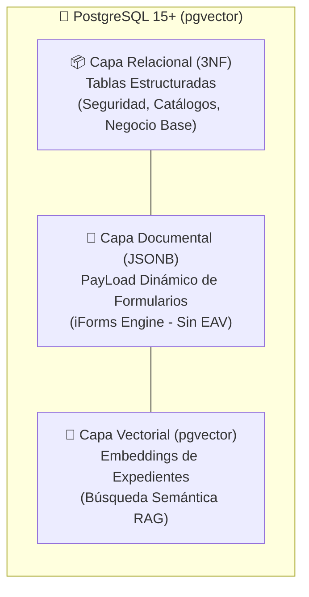

# Informe Forense y de Arquitectura de Bases de Datos (iBPMS)
> **Fecha:** 2026-06-06 | **Versión:** 1.0 (Línea Base)  
> **Autor:** Antigravity (Lead Software Architect & DB Administrator AI)  
> **Conformidad:** LEY GLOBAL 0, LEY GLOBAL 3 (SSOT) y ADR-015  

---

## 1. Ficha Técnica e Infraestructura de Conexiones

El sistema iBPMS implementa una topología de bases de datos que separa lógicamente el entorno de **Desarrollo (DEV)** del entorno de **Pruebas Automatizadas (E2E)**. Ambas se ejecutan de forma aislada mediante contenedores Docker y el motor de base de datos relacional/vectorial PostgreSQL:

### 1.1. Conexión de Desarrollo (DEV)
*   **Archivo de Origen:** [docker-compose.yml](file://wsl.localhost/Ubuntu/home/haroltandrsgmezagu/proyectos/ibpms-platform/docker-compose.yml) (Líneas 6-24)
*   **Motor de Base de Datos:** PostgreSQL 15+ (Imagen: `ankane/pgvector:latest`)
*   **Host / Puerto Físico:** `localhost:5433` (Puerto contenedor `5432` expuesto a `5433` en el Host)
*   **Nombre de Base de Datos (Database):** `ibpms_db`
*   **Usuario (Username):** `ibpms_user`
*   **Contraseña (Password):** `ibpms_password`
*   **Volumen Físico (Persistencia):** `postgres_data` (Montado en `/var/lib/postgresql/data`). Esto garantiza que los datos experimentales del desarrollador se mantengan intactos tras detener o reiniciar Docker.

### 1.2. Conexión de Pruebas Automatizadas (E2E)
*   **Archivo de Origen:** [docker-compose.e2e.yml](file://wsl.localhost/Ubuntu/home/haroltandrsgmezagu/proyectos/ibpms-platform/docker-compose.e2e.yml) (Líneas 3-16)
*   **Motor de Base de Datos:** PostgreSQL 15+ (Imagen: `ankane/pgvector:latest`)
*   **Host / Puerto Físico:** `localhost:5434` (Puerto contenedor `5432` expuesto a `5434` en el Host)
*   **Nombre de Base de Datos (Database):** `ibpms_e2e`
*   **Usuario (Username):** `ibpms`
*   **Contraseña (Password):** `ibpms_e2e_pass`
*   **Volumen Físico (Persistencia):** **Ninguno (Efímero).** No cuenta con mapeo de volumen persistente en el host. Esto responde directamente a la directiva de pruebas limpias, permitiendo levantar y destruir la base de datos entera de E2E sin arrastrar remanentes de estado de ejecuciones previas de Playwright o REST Assured.

---

## 2. Naturaleza e Identidad de la Base de Datos

Ambas bases de datos operan como **Sistemas Híbridos Relacionales, Documentales y Vectoriales (RDBMS + Document + Vector DB)**.



1.  **Naturaleza Relacional (SQL Estándar):** Asegura transaccionalidad estricta (ACID), integridad referencial y soporte nativo para el motor BPM Camunda 7 y las entidades operativas del Core iBPMS.
2.  **Naturaleza Documental (JSON/JSONB):** Permite almacenar esquemas semánticos variables y variables de negocio recolectadas mediante el motor de formularios dynamic sin mutar el esquema DDL y sin caer en el antipatrón EAV.
3.  **Naturaleza Vectorial (pgvector):** Permite almacenar vectores de incrustación (de 768 o 1536 dimensiones) en columnas nativas (`VECTOR`) para consultas de similitud semántica.

---

## 3. Análisis de Normalización Relacional vs. Denormalización JSONB

El esquema de negocio de iBPMS aplica un balance calculado entre normalización académica y optimización documental:

### 3.1. Normalización Estricta (Tercera Forma Normal - 3NF)
Las tablas de metadatos del negocio, estructura de catálogo e identidades se encuentran estructuradas bajo la **Tercera Forma Normal (3NF)**:
*   **1NF (Primera Forma Normal):** Cada columna contiene valores atómicos simples (sin grupos repetitivos) y cada tabla cuenta con una clave primaria definida (`id` de tipo `UUID` o `CHAR(36)`).
*   **2NF (Segunda Forma Normal):** Se cumple al estar en 1NF y asegurar que todas las columnas que no forman parte de la clave primaria dependan por completo de la clave primaria en su totalidad. Por ejemplo, en `sys_catalog_item`, todas las columnas (`code`, `label`, `is_active`) dependen funcionalmente de su ID.
*   **3NF (Tercera Forma Normal):** No existen dependencias transitivas entre columnas no clave. Por ejemplo, en la relación de seguridad, la tabla de unión `ibpms_security_user_roles` descompone la relación N:N, asociando llaves primarias directamente para evitar transitividad redundante.

### 3.2. Denormalización Estratégica (JSON / JSONB)
Para contrarrestar el desgaste de rendimiento y la complejidad del patrón **Entity-Attribute-Value (EAV)** (múltiples uniones JOIN para recuperar un formulario dinámico), se ha denormalizado intencionalmente la persistencia de datos dinámicos:
*   **Campos de Negocio Dinámicos:** Almacenados en la columna `payload` de la tabla `ibpms_case`. En lugar de crear una tabla relacional para cada campo variable de la interfaz, el motor de Vue renderiza dinámicamente el JSON persistido en `ibpms_case.payload`.
*   **Optimizador de Lecturas (Local CQRS):** Dado que la búsqueda en campos `JSON` pesados genera un costo computacional significativo, el sistema implementa la tabla plana de indexación intermedia `ibpms_metadata_index`. En tiempo de guardado (Submit), los metadatos críticos de búsqueda se extraen en filas planas con índices B-Tree específicos, evitando escaneos secuenciales masivos sobre el documento JSON.

---

## 4. Segregación del Motor BPM: Patrón "Dual-Schema"

Bajo el lineamiento del **ADR-015**, PostgreSQL mantiene una segregación lógica absoluta entre:
1.  **Esquema de Negocio (`ibpms_*` y `sys_*`):** Tablas gobernadas por el equipo de desarrollo que almacenan expedientes, tareas unificadas, documentos e información de seguridad.
2.  **Esquema del Motor BPM (`ACT_*` de Camunda):** Tablas internas autogestionadas por el motor Camunda 7 empotrado (`ACT_RU_TASK`, `ACT_RU_EXECUTION`, `ACT_RE_PROCDEF`, etc.).

```
┌─────────────────────────────────────────────────────────────┐
│                 PostgreSQL (Single Instance)                │
├──────────────────────────────┬──────────────────────────────┤
│  Esquema Negocio (ibpms_*)   │    Esquema Camunda (ACT_*)   │
│                              │                              │
│  - ibpms_case                │  - ACT_RU_TASK               │
│  - ibpms_task                │  - ACT_RU_EXECUTION          │
│  - ibpms_document            │  - ACT_RE_PROCDEF            │
└──────────────┬───────────────┴──────────────┬───────────────┘
               │                              │
               └────── INTEGRACIÓN EN JAVA ───┘
                    (Prohibido JOINs en SQL)
```

### Regla de Cero Excepciones (Out-of-Bounds Queries):
Queda estrictamente prohibido realizar `JOIN`s en SQL entre ambos mundos. La correspondencia se efectúa en la capa de aplicación Spring Boot a través de claves lógicas:
*   `ibpms_case.process_instance_id` se asocia con el ID de instancia de Camunda.
*   `ibpms_task.camunda_task_id` se asocia con el ID de tarea de Camunda.
Esta decisión garantiza que en la V2 del roadmap, cuando se reemplace el motor empotrado por un orquestador distribuido externo (Zeebe/Camunda 8), el esquema `ibpms_*` no requiera ninguna reestructuración de base de datos.

---

## 5. Esquema de Seguridad, Aislamiento de Tenant y RBAC/ABAC Físico

La arquitectura física de la base de datos implementa las directrices de seguridad consolidadas del sistema:

### 5.1. Tablas Core de Seguridad
*   `ibpms_security_user`: Almacena las identidades locales o mapeadas de IDPs externos, hashes de contraseñas, estados y metadatos JSON de habilidades (`skills`).
*   `ibpms_security_role`: Modela el catálogo de roles, soportando herencia de roles jerárquicos mediante la relación recursiva autorreferencial `parent_role_id` (Constraint: `fkbtjbgid18uu1gbplu9htysvqj`).
*   `ibpms_security_user_roles`: Tabla intermedia de resolución N:N que implementa una clave primaria compuesta sobre `(user_id, role_id)`, garantizando unicidad física de relaciones y acelerando los JOINs de verificación de seguridad.

### 5.2. Multi-Tenancy (Tenant Isolation)
El aislamiento de datos se modela de manera física mediante:
*   `ibpms_tenant`: Tabla padre que almacena el identificador único `slug` (PK) y el estado del inquilino.
*   En las proyecciones rápidas como `ibpms_workdesk_projection` y las tablas transaccionales, se vincula físicamente una columna `tenant_id` que actúa como restricción lógica (Foreign Key) para asegurar que ningún usuario pueda consultar expedientes de un tenant diferente (aislamiento de datos lógicos en la misma BD).

---

## 6. Secuencia Cronológica de Migraciones (Liquibase)

El esquema de la base de datos se construye dinámicamente mediante la ejecución secuencial de los changelogs mapeados en [db.changelog-master.yaml](file://wsl.localhost/Ubuntu/home/haroltandrsgmezagu/proyectos/ibpms-platform/backend/ibpms-core/src/main/resources/db/changelog/db.changelog-master.yaml). La traza exacta de ejecución y su correspondiente lógica de rollbacks es:

1.  **Esquema Inicial Estructural (`001-initial-schema.xml`):** Crea las tablas bases `sys_catalog`, `sys_catalog_item`, `ibpms_case` (con columna `payload` tipo JSON), `ibpms_task`, `ibpms_document`, e `ibpms_metadata_index`.
2.  **Módulos Operacionales Core (`05` al `11`):** Inicializa tablas para plantillas de proyectos (`ibpms_project_template`), log de auditoría de tareas, diseños BPMN y tablas del motor de formularios.
3.  **Esquema RBAC/Identity Inicial (`12-create-identity-rbac-tables.sql`):** Estructura el esquema inicial de permisos e identidades.
4.  **Capa RAG y Proyecciones (`13-create-workdesk-projection-tables.sql` y `14-create-knowledge-vector-tables.sql`):** Inicializa la tabla de proyecciones rápidas del workdesk y la tabla `ai_knowledge_vectors` para almacenamiento vectorial.
5.  **Refactor de Tipos (`17-cast-to-uuid.sql`):** Convierte columnas de identificadores de tipo `CHAR(36)` a `UUID` nativo de PostgreSQL para el módulo de plantillas de proyectos, optimizando el rendimiento físico del motor en los JOINs.
6.  **Formularios Versionados (`18-create-form-definitions.sql` y `21-us039-generic-form-schema.sql`):** Modela la tabla `ibpms_form_definitions` para soportar esquemas de formulario versionados mediante hashing SHA-256 e inyecta la lógica de certificación de formularios.
7.  **Seguridad y Consolidación de Roles (`20-us036-rbac-schema.sql`, `28-consolidate-delegation.sql`, `29-consolidate-roles.sql`):** Sanea el esquema unificando tablas de roles legacy en la jerarquía unificada de `ibpms_security_role` y estableciendo claves primarias limpias en la tabla intermedia `ibpms_security_user_roles`.
8.  **Particionamiento de Auditoría (`37-us005-audit-log-partitioning-fix.sql`):** Migra la tabla `ibpms_bpmn_design_audit_log` para convertirla en una tabla particionada nativamente por rangos de tiempo mensuales (`PARTITION BY RANGE (timestamp)`).
9.  **Borradores de Formulario (`39-us029-form-execution-schema.sql` y `40-us029-draft-expiration.sql`):** Introduce soporte de persistencia transitoria de borradores (`task_drafts`) con expiración lógica.
10. **Lógica de Tenant y Event Store (`015-create-tenant-config.sql` y `016-create-cqrs-event-store.sql`):** Introduce configuraciones multi-inquilino y el almacén de eventos de CQRS Local.
11. **Seeds y Datos de Pruebas (Contextuales):** Ejecuta scripts de llenado de datos (`seed-dev.sql`, `seed-e2e.sql`, seeds de historias de usuario) únicamente si los perfiles o contextos de Liquibase son `dev` o `test`.

---

## 7. Recomendaciones de Optimización de Alto Rendimiento

Dado que todo el esfuerzo operacional, documental y de inteligencia artificial de la V1 recae en una sola máquina virtual de PostgreSQL, se plantean las siguientes directrices de optimización física:

### 7.1. Búsqueda Vectorial (`pgvector`)
*   **Operador Correcto:** Toda consulta de similitud semántica contra `ai_knowledge_vectors` debe realizarse utilizando el operador de distancia de coseno `<=>` y estar estrictamente acotada por un límite (`LIMIT N`).
*   **Creación de Índices HNSW:** Para evitar búsquedas secuenciales pesadas (*Sequential Table Scans*) en producción, se debe construir un índice de tipo HNSW (Hierarchical Navigable Small World) sobre la columna de vectores:
    ```sql
    CREATE INDEX idx_knowledge_vectors_hnsw ON ai_knowledge_vectors USING hnsw (embedding vector_cosine_ops);
    ```
    *Justificación:* HNSW ofrece tiempos de búsqueda sub-lineales en comparación con el índice IVFFlat, manteniendo una precisión muy alta sin necesidad de recalcular centroides.

### 7.2. Consulta de Atributos JSONB
*   **Índices GIN (Generalized Inverted Index):** Para evitar la consulta secuencial en campos JSONB grandes en tablas transaccionales, se debe crear un índice GIN.
    *   *Ejemplo en log de auditoría:*
        ```sql
        CREATE INDEX idx_audit_log_details_gin ON ibpms_audit_log USING GIN (details);
        ```
    *   *Uso del operador `@>`:* Las consultas de persistencia deben formularse con operadores de inclusión de PostgreSQL para permitir al planificador de consultas explotar el índice GIN:
        ```sql
        SELECT * FROM ibpms_audit_log WHERE details @> '{"status": "APPROVED"}';
        ```

### 7.3. Indexación B-Tree en Columnas Planas
*   Aplicar índices B-Tree estándar sobre todas las llaves foráneas (`case_id` en `ibpms_task`, `case_id` en `ibpms_document`) y sobre las columnas utilizadas para búsquedas recurrentes en el Workdesk, tales como `assignee`, `status` y `due_date`.
*   Esto garantiza un rendimiento óptimo al construir las proyecciones de lectura en el patrón de Local CQRS.

### 7.4. Extensión del Table Partitioning
*   El particionamiento implementado en `ibpms_bpmn_design_audit_log` debe ser extendido a la tabla de auditoría global `ibpms_audit_log` y a `ibpms_agile_sla_changelog` utilizando particionamiento por rango mensual basado en `created_at`.
*   Esto previene el crecimiento desmedido de las tablas (*Ever-Growing Tables*) y facilita la purga periódica de datos antiguos descargando particiones a almacenamiento en frío en Azure Blob y ejecutando `DROP PARTITION`, minimizando el impacto en la memoria compartida (`shared_buffers`) de la VM.

---

## 8. Conclusiones

*   **DEV vs E2E:** Comparten el mismo linaje de base de datos estructural a través de Liquibase, diferenciándose en sus puertos físicos (`5433` vs `5434`), credenciales de acceso y la volatilidad absoluta (E2E efímero sin volumen mapeado vs DEV persistido).
*   **Modelo Híbrido Exitoso:** El diseño relacional se mantiene puro bajo la Tercera Forma Normal (3NF) para el core operativo y de seguridad, delegando de manera segura el dinamismo de los formularios a columnas `JSONB` e indexaciones en `ibpms_metadata_index`.
*   **Desacoplamiento BPM:** El patrón Dual-Schema aísla de forma hermética el dominio de negocio de Camunda, garantizando la mantenibilidad y evolución hacia arquitecturas Cloud-Native (V2) sin deuda técnica estructural en el almacenamiento.
