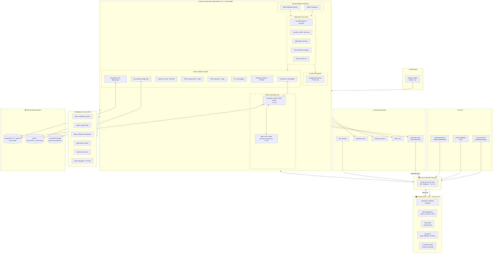
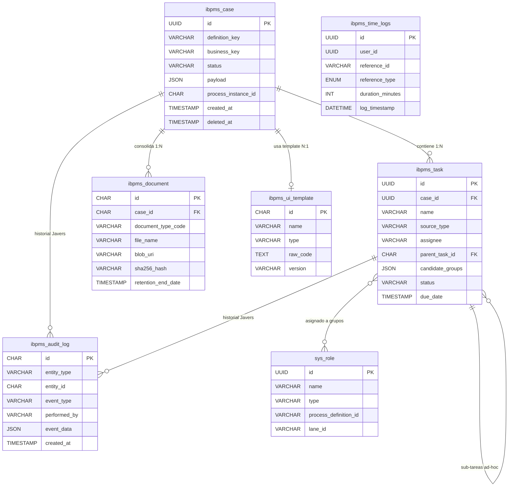
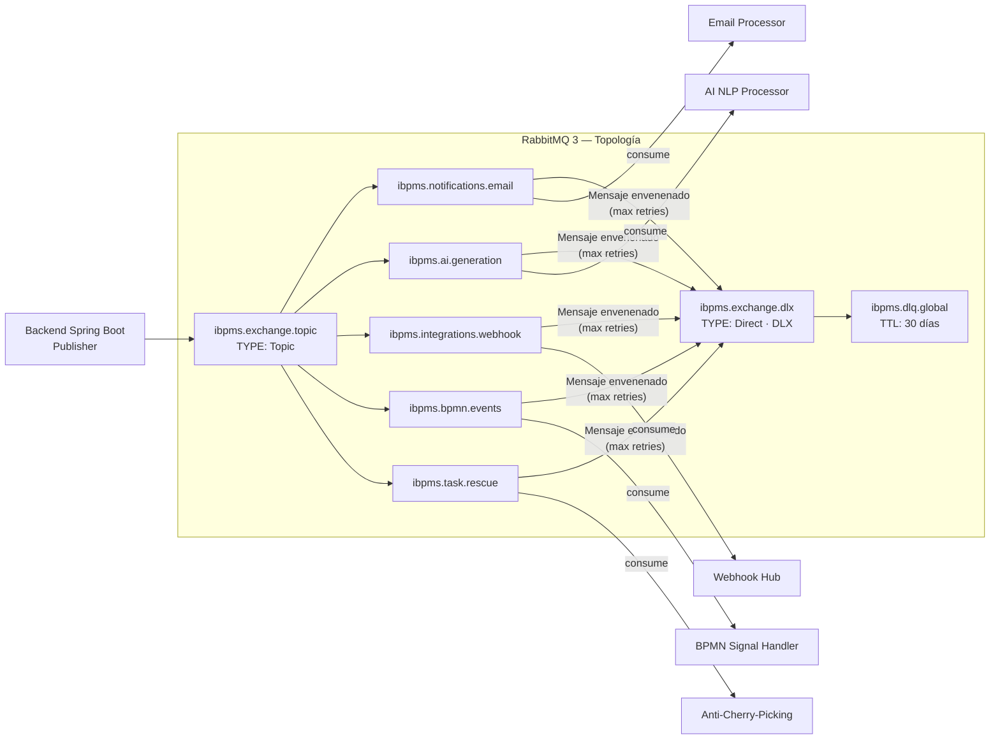
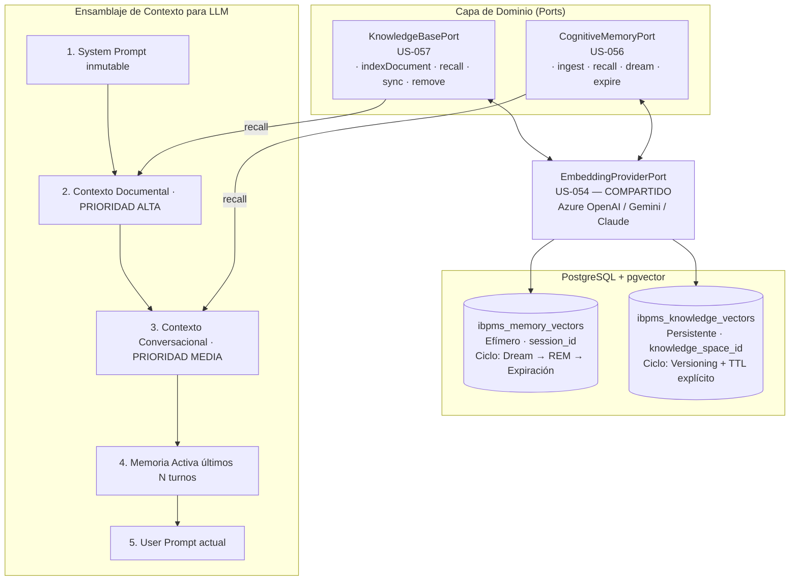
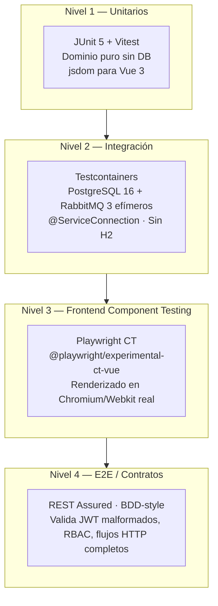
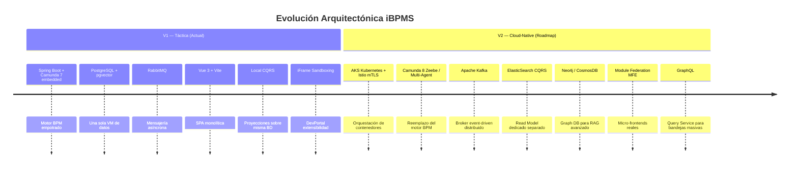
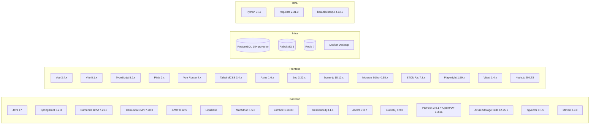

# 🏛️ Arquitectura iBPMS Platform — Resumen Ejecutivo Completo

> **Base de conocimiento:** Lectura directa y literal de los 22 documentos en `docs/architecture/`.  
> **Fuentes leídas:** 13 ADRs + C4 V1 + C4 V2 + ERD + RabbitMQ Topology + UI Schema + BPMN Mapping + Architecture Audit Consolidated.  
> **Zero alucinaciones. Zero inferencias.**

---

## 1. ¿Qué es iBPMS?

**iBPMS** (Intelligent Business Process Management System) es una plataforma empresarial de orquestación de procesos de negocio. Su propósito central es digitalizar, automatizar y auditar flujos de trabajo corporativos complejos (expedientes, aprobaciones, contratos, gestión documental), añadiendo capacidades de Inteligencia Artificial (RAG, LLM) para procesos cognitivos avanzados.

La plataforma está diseñada en **dos etapas evolutivas**:
- **V1 (Táctica / PoC):** Monolito modular sobre Azure IaaS VMs con Camunda 7 empotrado.
- **V2 (Estratégica / Cloud-Native):** Multi-Agent System sobre Kubernetes (AKS), con CQRS distribuido, Kafka y LLMs como motor de decisiones.

---

## 2. Diagrama de Capas de la Arquitectura V1

---

## 3. Decisiones de Arquitectura (ADRs) — Mapa Completo

| ADR | Título | Decisión Central | Estado |
|-----|--------|-----------------|--------|
| **ADR-001** | Arquitectura Hexagonal y DDD | Dominio aislado de frameworks. Puertos & Adaptadores obligatorios. | ✅ Aceptado |
| **ADR-002** | Vue 3 + Vite para Frontend | Vue 3 (Composition API + Script Setup) empacado con Vite 5. | ✅ Aceptado |
| **ADR-003** | Camunda 7 Embedded (Motor BPM) | Camunda 7 como `.jar` empotrado en Spring Boot. Deuda técnica aceptada para V1. | ✅ Aceptado |
| **ADR-004** | Almacenamiento de Binarios | **PROHIBICIÓN** de BLOB en DB. Azure Blob Storage con patrón Claim Check. Solo metadata en PostgreSQL. | ✅ Aprobado |
| **ADR-005** | Extensibilidad / DevPortal | Súper Módulos vía **iFrames sandboxed** en V1. Module Federation (V2). JWT Custom Claims para auth. | ✅ Aceptado |
| **ADR-006** | Motor Low-Code iForms (Vue 3) | Formularios dinámicos JSON→UI vía Server-Driven UI. Zod Factory Pattern. Sin `eval()`. | ✅ Aprobado |
| **ADR-007** | CMMN vs Kanban | **RECHAZO ROTUNDO** de CMMN. Kanban = Máquinas de Estado Relacionales puras (JPA/Spring) | ✅ Aprobado |
| **ADR-008** | Time Tracking Universal | Tabla `ibpms_time_logs` polimórfica con `reference_type (BPMN/AGILE/GANTT)`. Componente `<UniversalSlaTimer/>`. | ✅ Aprobado |
| **ADR-009** | PostgreSQL + pgVector | Migración de MySQL 8 a **PostgreSQL 15+ con pgvector**. Motor relacional + vectorial en 1 VM. | ✅ Aceptado |
| **ADR-010** | Pirámide de Testing (4 niveles) | Testcontainers reemplaza H2. REST Assured para contratos. Playwright CT para Frontend. | ✅ Aceptado |
| **ADR-011** | Local CQRS V1 | CQRS lógico (no físico) sobre PostgreSQL único. Proyecciones DTO, sin ElasticSearch en V1. | ✅ Aceptado |
| **ADR-012** | Integración LLM Agnóstica | Puertos `LlmChatProvider` + `LlmEmbeddingProvider`. **PROHIBICIÓN** de LangChain/Spring-AI. REST raw. | ✅ Aceptado |
| **ADR-013** | Estrategia RAG Dual | `CognitiveMemoryPort` (sesión/efímero) vs `KnowledgeBasePort` (documental/persistente). Tablas separadas en pgvector. | ✅ Aceptado |

---

## 4. Modelo de Datos — Entidades Clave (ERD)

> **Nota crítica de datos:** Hay **2 esquemas separados** en la misma BD PostgreSQL:
> - `ibpms_*` → Tablas de negocio propias (el equipo las controla).
> - `ACT_*` → Tablas nativas de Camunda (NUNCA tocar directamente con SQL).

---

## 5. Topología de Mensajería RabbitMQ

---

## 6. Estrategia RAG Dual (Inteligencia Artificial)

**Regla de priorización:** Si el token budget es insuficiente, el **conocimiento documental tiene prioridad** sobre el historial conversacional.

---

## 7. Patrones y Principios Arquitectónicos

### 7.1 Patrones de Aplicación

| Patrón | Aplicación Concreta en iBPMS |
|--------|------------------------------|
| **Hexagonal / Ports & Adapters** (ADR-001) | Dominio Java puro (POJO sin `@Entity`). Camunda solo existe en la capa de adaptadores. |
| **DDD / Bounded Contexts** | Módulos: Case Management, DMN, SGDEA, TimeTracking, AI Core. |
| **Server-Driven UI** | Backend expone JSON Schema semántico → Frontend Vue 3 renderiza dinámicamente sin recompilación. |
| **Local CQRS** (ADR-011) | Commands: JPA/Spring Data. Queries: Proyecciones DTO + JDBC Template + Materialized Views. |
| **Claim Check** (ADR-004) | Frontend sube archivo → Azure Blob Storage → DB guarda solo `blob_uri + sha256_hash`. |
| **Transactional Outbox** | Spring Modulith Event Publication Registry para publicar a RabbitMQ sin riesgo de pérdida. |
| **Polimorfismo Relacional** (ADR-008) | `ibpms_time_logs.reference_type` ∈ {BPMN, AGILE, GANTT} — un solo módulo de tiempo para todos. |
| **Strangler Fig** | Patrón de migración: APIM como fachada que irá enrutando gradualmente de V1 a V2. |

### 7.2 Patrones de Resiliencia

| Patrón | Estado |
|--------|--------|
| **Circuit Breaker** (Resilience4j) | Implementado para CRM (`slidingWindowSize: 10, failureRateThreshold: 50%`) |
| **Dead Letter Queue (DLQ)** | ✅ Implementado — TTL 30 días, 5 colas de negocio con DLX |
| **Rate Limiting** | Bucket4j implementado como Anti-DoS |
| **Retry con Backoff** | Spring Retry para Camunda Adapter |
| **Feature Flags / Circuit Breaker Manager** | Toggles para modo degradado de CRM (caché Redis) |

### 7.3 Patrones de Seguridad

| Patrón | Implementación |
|--------|----------------|
| **Zero-Trust JWT** | APIM valida en borde. Backend valida autónomamente en `SecurityFilterChain`. |
| **RBAC + ABAC** | JWT liviano (roles) + `SecurityPolicyUseCase` cruza contra matrices relacionales en PostgreSQL. |
| **Auto-generación de Roles BPMN** | Al desplegar un archivo `.bpmn`, un Deployment Hook lee los Lanes y crea roles `BPMN_Proceso_Carril` automáticamente. |
| **Scopes JWT para DevPortal** | Audience: `ibpms.extensibility.supermodules`. `@PreAuthorize` en Spring Boot valida scope. |
| **Inmutabilidad Documental** | `sha256_hash` + `Javers Audit Ledger` — Before/After de cada cambio. Cumplimiento ISO 9001. |
| **Zero Secrets en código** | Azure Key Vault + Managed Identities. API Keys de LLM inyectadas por CI/CD, nunca en código. |

---

## 8. Pirámide de Testing (ADR-010)

> **Regla:** H2 está **prohibido** para integration tests. Todo test de integración debe levantar contenedores Docker reales vía Testcontainers. Requiere Docker Desktop activo.

---

## 9. Hoja de Ruta V1 → V2

---

## 10. Interfaces de Usuario (Pantallas) y su Mapa Arquitectónico

Según los documentos, la plataforma tiene al menos **18 pantallas funcionales** identificadas. Las principales y su relación arquitectónica:

| Pantalla | Nombre | Tecnología Backend | Tecnología Frontend |
|----------|--------|--------------------|---------------------|
| **P0** | Inicio / Catálogo de Procesos | Start Event Camunda | Vue Router |
| **P1** | Bandeja Unificada (Workdesk) | `CaseManagement UseCase` + CQRS Queries | Vue 3 + Pinia |
| **P2** | Formulario Dinámico de Tarea | JSON Schema → `ibpms_ui_template` | `<FormRenderer/>` + Zod |
| **P3** | Tablero Kanban Ágil | JPA State Machine (sin CMMN) | vuedraggable |
| **P4** | Taller de Reglas IA (DMN) | `ibpms-dmn-engine` + Camunda DMN | dmn-js + Monaco Editor |
| **P5** | Rastreador de Casos | CQRS Read + `ibpms_audit_log` | Vue 3 |
| **P6** | Modelador BPMN | Deploy Hook auto-roles | bpmn-js |
| **P7** | iForm Builder (Low-Code) | `ibpms_ui_template` | Monaco Editor + Vue Render |
| **P8** | Template Builder (Gantt/WBS) | frappe-gantt backend | frappe-gantt |
| **P11** | Hub de Integraciones | Webhook adapter + RabbitMQ | Vue 3 |
| **P12** | SGDEA / Bóveda Documental | Azure Blob + `ibpms_document` | Vue 3 multipart |
| **P13** | DevPortal | iFrame sandbox + JWT scopes | iframe + postMessage |
| **P14** | Gestión de Usuarios y Roles | `sys_role` + Auto-generación BPMN | Vue 3 |
| **P18** | Portal B2B Clientes | RLS Seguro | Vue 3 separado |

---

## 11. Stack Tecnológico Completo

---

## 12. Resumen Ejecutivo en 5 Líneas

1. **iBPMS es un BPM empresarial** con orquestación BPMN/DMN (Camunda 7), gestión de expedientes, formularios dinámicos, Kanban ágil, SGDEA y capacidades de IA (RAG dual con pgvector).

2. **La arquitectura base es Hexagonal + DDD** (ADR-001): el dominio Java puro nunca importa frameworks. Camunda, JPA, Redis y los servicios externos son meros adaptadores reemplazables.

3. **La infraestructura V1 es austera y deliberada**: un monolito Spring Boot sobre una VM Azure, una PostgreSQL que sirve simultáneamente como BD relacional, vectorial (pgvector) y almacén de estado Camunda. RabbitMQ para async. Redis para locks y caché.

4. **El Frontend es Server-Driven UI**: el backend expone JSON Schemas semánticos que Vue 3 renderiza dinámicamente sin recompilación, habilitando formularios cambiantes sin nuevos despliegues.

5. **La V2 es una evolución, no una reescritura**: el Patrón Strangler (APIM como fachada), la Arquitectura Hexagonal y la separación de esquemas de datos `ibpms_*` vs `ACT_*` permiten migrar gradualmente a Kubernetes + Kafka + Multi-Agent sin romper el dominio de negocio construido en V1.
