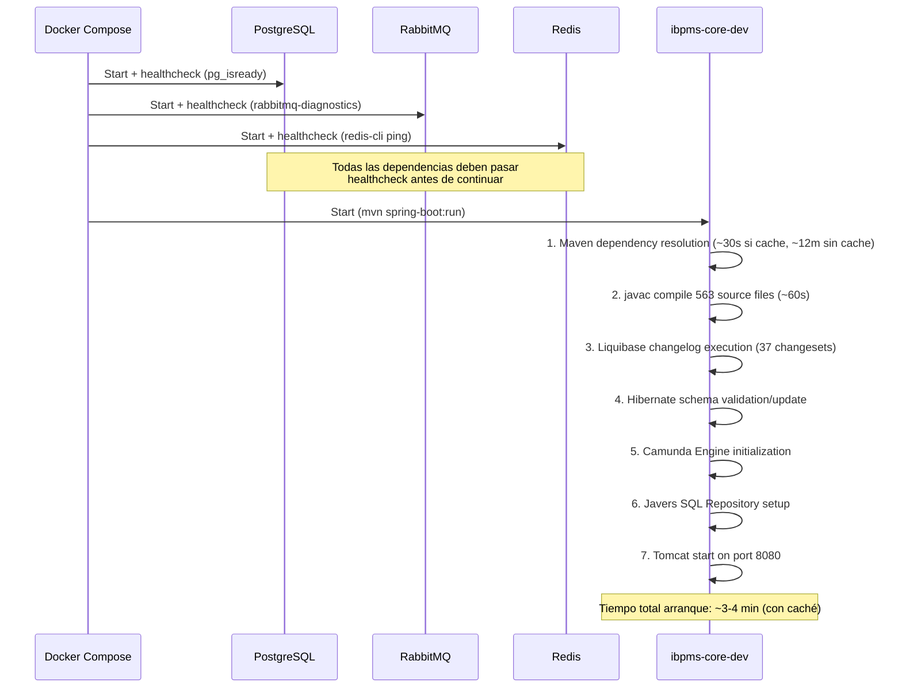

# ADR: Arquitectura Docker Runtime del iBPMS

> **Autor:** Arquitecto Líder AI  
> **Fecha:** 2026-04-20  
> **Sprint:** 6.2  
> **Estado:** Aprobado  

---

## 1. Contexto y Propósito

Este documento es la **referencia canónica** para que cualquier agente arquitecto futuro comprenda con precisión cómo funciona el ecosistema Docker de la plataforma iBPMS. Fue creado tras un incidente crítico de "Integración Cíclica" (Error 500) causado por la falta de conocimiento sobre la relación entre el bind-mount del host Windows y la compilación incremental Maven dentro del contenedor.

> [!IMPORTANT]
> **Lectura obligatoria** antes de cualquier refactorización de entidades JPA, renombrado de clases, o eliminación de archivos Java en el backend.

---

## 2. Topología de Servicios Docker

El archivo fuente es [docker-compose.yml](file:///c:/Users/HaroltAndr%C3%A9sG%C3%B3mezAgu/ProyectoAntigravity/ibpms-platform/docker-compose.yml).

```
┌─────────────────────────────────────────────────────────────────────┐
│                    Docker Compose Network (default)                  │
│                                                                     │
│  ┌──────────────────┐  ┌────────────────┐  ┌─────────────────┐     │
│  │  ibpms-postgres   │  │ ibpms-rabbitmq │  │   ibpms-redis   │     │
│  │  (pgvector:latest)│  │ (3-management) │  │ (7-alpine)      │     │
│  │  Puerto: 5432     │  │ AMQP: 5672     │  │ Puerto: 6379    │     │
│  │  Container:       │  │ Admin: 15672   │  │ Container:      │     │
│  │  ibpms-postgres-  │  │ Container:     │  │ ibpms-redis-uat │     │
│  │  uat              │  │ ibpms-rabbitmq │  │                 │     │
│  │                   │  │ -uat           │  │                 │     │
│  └───────┬───────────┘  └──────┬─────────┘  └───────┬─────────┘     │
│          │ healthcheck          │ healthcheck         │ healthcheck  │
│          └──────────────┬───────┴─────────────────────┘              │
│                         │ depends_on (service_healthy)               │
│                         ▼                                            │
│  ┌──────────────────────────────────────────────────────────┐       │
│  │                 ibpms-core (ibpms-core-dev)               │       │
│  │  Imagen: maven:3.9.6-eclipse-temurin-21                   │       │
│  │  Comando: mvn spring-boot:run                             │       │
│  │  Puerto: 8080:8080                                        │       │
│  │  WorkDir: /app/ibpms-core                                 │       │
│  │                                                           │       │
│  │  VOLÚMENES:                                               │       │
│  │    ./backend  ─bind-mount─►  /app        (código fuente) │       │
│  │    maven_data ─volume─────►  /root/.m2   (caché Maven)   │       │
│  │                                                           │       │
│  │  ENV VARS:                                                │       │
│  │    POSTGRES_HOST = ibpms-postgres                         │       │
│  │    RABBITMQ_HOST = ibpms-rabbitmq                         │       │
│  │    REDIS_HOST    = ibpms-redis                            │       │
│  └──────────────────────────────────────────────────────────┘       │
└─────────────────────────────────────────────────────────────────────┘
```

### 2.1 Inventario de Contenedores

| Servicio | Container Name | Imagen | Puerto Host | Puerto Container | Tipo de Dato |
|---|---|---|---|---|---|
| PostgreSQL + PgVector | `ibpms-postgres-uat` | `ankane/pgvector:latest` | 5432 | 5432 | Transacciones BPM + Vectores RAG |
| RabbitMQ | `ibpms-rabbitmq-uat` | `rabbitmq:3-management` | 5672, 15672 | 5672, 15672 | Eventos asíncronos (correos, webhooks) |
| Redis | `ibpms-redis-uat` | `redis:7-alpine` | 6379 | 6379 | Caché paramétrico + Locks distribuidos |
| Backend Spring Boot | `ibpms-core-dev` | `maven:3.9.6-eclipse-temurin-21` | 8080 | 8080 | API REST + Camunda Engine |

### 2.2 Contenedores E2E (Stack Paralelo)

Existe un **stack paralelo de E2E** que se levanta independientemente con puertos distintos para evitar colisiones:

| Servicio E2E | Container Name | Puerto Host |
|---|---|---|
| PostgreSQL E2E | `ibpms-platform-postgres-e2e-1` | 5433 |
| RabbitMQ E2E | `ibpms-platform-rabbitmq-e2e-1` | 5673, 15673 |
| Redis E2E | `ibpms-platform-redis-e2e-1` | 6380 |
| Camunda E2E | `ibpms-platform-camunda-e2e-1` | 8085 |

> [!NOTE]
> El perfil `application-e2e.yml` apunta a los puertos E2E (`5433`, `5673`, `6380`, `8085`). El perfil por defecto `application.yml` usa environment variables con fallback a `localhost` en los puertos estándar.

---

## 3. Modelo de Volúmenes (CRÍTICO)

### 3.1 Bind-Mount del Backend (Fuente del Incidente Crítico)

```yaml
volumes:
  - ./backend:/app          # BIND-MOUNT: Host ↔ Container
  - maven_data:/root/.m2    # NAMED VOLUME: solo Container
```

**Implicación arquitectónica fundamental:**

El directorio `./backend` del host Windows se **monta bidirecionalmente** en `/app` dentro del contenedor Linux. Esto significa:

1. **Cualquier archivo creado/modificado en el host** se refleja instantáneamente dentro del contenedor.
2. **Cualquier archivo creado por Maven (`target/`) dentro del contenedor** se refleja en el host.
3. **Al renombrar o eliminar un archivo `.java`**, el compilador Maven incremental dentro del contenedor **NO elimina el `.class` compilado previamente** del directorio `target/classes/`.

> [!CAUTION]
> ### Regla de Oro para Refactorizaciones JPA
> Cada vez que se **renombre, mueva o elimine** una clase de entidad JPA (archivos `*Entity.java`), se **DEBE** ejecutar uno de estos procedimientos antes de validar:
>
> **Opción A - Limpieza desde el Host (Rápida):**
> ```powershell
> Remove-Item -Recurse -Force ".\backend\ibpms-core\target" -ErrorAction SilentlyContinue
> docker-compose restart ibpms-core
> ```
>
> **Opción B - Limpieza desde Dentro del Container:**
> ```bash
> docker exec ibpms-core-dev mvn clean
> docker-compose restart ibpms-core
> ```
>
> **Nunca confiar en que la compilación incremental limpiará artefactos huérfanos.**

### 3.2 Named Volume de Maven

El volumen `maven_data` persiste la caché `~/.m2/repository` entre reinicios - esto **reduce los tiempos de arranque** de ~15 minutos a ~3 minutos al evitar re-descarga de dependencias.

> [!WARNING]
> Si se cambian dependencias en el `pom.xml` y la compilación falla por artefactos corruptos, ejecutar:
> ```powershell
> docker volume rm ibpms-platform_maven_data
> docker-compose up ibpms-core
> ```

### 3.3 Volúmenes de Datos Persistentes

| Volumen | Contenedor | Ruta | Propósito |
|---|---|---|---|
| `postgres_data` | ibpms-postgres-uat | `/var/lib/postgresql/data` | Datos relacionales (no se pierden al apagar) |
| `rabbitmq_data` | ibpms-rabbitmq-uat | `/var/lib/rabbitmq` | Colas y mensajes pendientes |
| `redis_data` | ibpms-redis-uat | `/data` | Snapshot AOF de caché |

---

## 4. Ciclo de Vida del Contenedor Backend

### 4.1 Secuencia de Arranque



### 4.2 Política de Reinicio

```yaml
restart: unless-stopped
```

El contenedor se reinicia automáticamente si:
- La aplicación falla (`BUILD FAILURE`)
- El proceso Java muere
- Docker Desktop se reinicia

**Efecto colateral:** Si hay un error de compilación recurrente (como el incidente del bytecode huérfano), el contenedor entra en **bucle infinito de reinicio**, consumiendo CPU sin lograr servir tráfico. El puerto `8080` permanece abierto (Docker lo reserva) pero devuelve `Empty reply from server`.

### 4.3 Cómo Detectar un Contenedor en Bucle

```powershell
# 1. Verificar cuántas veces se ha reiniciado
docker inspect ibpms-core-dev --format="{{.RestartCount}}"

# 2. Verificar logs del último intento de arranque
docker logs ibpms-core-dev --tail 50

# 3. Buscar el patrón de error cíclico
docker logs ibpms-core-dev --tail 200 | findstr "BUILD FAILURE"
```

---

## 5. Resolución de Variables de Entorno

El `application.yml` utiliza una cadena de resolución con fallback:

```
${ENV_VAR:default_value}
```

### Tabla de Resolución

| Variable | Valor en Docker (ibpms-core-dev) | Fallback Local (sin Docker) |
|---|---|---|
| `POSTGRES_HOST` | `ibpms-postgres` (DNS de red Docker) | `localhost` |
| `POSTGRES_PORT` | `5432` (default) | `5432` |
| `POSTGRES_DB` | `ibpms_db` (default) | `ibpms_db` |
| `RABBITMQ_HOST` | `ibpms-rabbitmq` (DNS de red Docker) | `localhost` |
| `REDIS_HOST` | `ibpms-redis` (DNS de red Docker) | `localhost` |

> [!IMPORTANT]
> Dentro del contenedor `ibpms-core-dev`, la conexión a PostgreSQL se resuelve como `jdbc:postgresql://ibpms-postgres:5432/ibpms_db` gracias al DNS de la red Docker. Desde el host Windows, se resuelve como `jdbc:postgresql://localhost:5432/ibpms_db`.

---

## 6. Comandos de Operación (Cheat Sheet)

### 6.1 Levantar el Stack Completo
```powershell
docker-compose up -d
```

### 6.2 Ver Logs en Tiempo Real
```powershell
docker logs -f ibpms-core-dev
```

### 6.3 Reiniciar Solo el Backend (Sin Tocar Infraestructura)
```powershell
docker-compose restart ibpms-core
```

### 6.4 Forzar Rebuild Limpio del Backend
```powershell
Remove-Item -Recurse -Force ".\backend\ibpms-core\target" -ErrorAction SilentlyContinue
docker-compose restart ibpms-core
```

### 6.5 Verificar Salud de Todos los Servicios
```powershell
docker ps --format "table {{.Names}}\t{{.Status}}\t{{.Ports}}"
```

### 6.6 Ejecutar Comandos Dentro del Backend
```powershell
docker exec ibpms-core-dev mvn clean compile    # Limpiar y recompilar
docker exec ibpms-core-dev jps                   # Ver procesos Java
docker exec ibpms-core-dev bash                  # Shell interactivo
```

### 6.7 Resetear Base de Datos Completamente
```powershell
docker-compose down -v    # Elimina todos los volúmenes
docker-compose up -d      # Recrea todo desde cero
```

### 6.8 Verificar si el Backend Responde
```powershell
curl.exe -s -o NUL -w "%{http_code}" http://localhost:8080/actuator/health
```

---

## 7. Diferencia entre Dockerfile y Docker-Compose (Dev vs Prod)

| Aspecto | `Dockerfile` (Producción) | `docker-compose.yml` (Desarrollo) |
|---|---|---|
| JDK | Eclipse Temurin **17** | Eclipse Temurin **21** |
| Build | Multi-stage (`mvn clean package`) | Live (`mvn spring-boot:run`) |
| Código fuente | Copiado al imagen (`COPY src`) | Montado en bind-mount (`./backend:/app`) |
| Hot-reload | No | Sí (Spring DevTools via classpath watcher) |
| Usuario | Non-root (`appuser`) | Root (Maven default) |
| Tamaño imagen | Mínimo (JRE Alpine) | Pesado (Maven SDK completo) |

> [!WARNING]
> El Dockerfile usa **Java 17** mientras que docker-compose usa **Java 21**. Esto puede causar incompatibilidades si se usan features de Java 21 en el código fuente. Se recomienda alinear ambos a **Java 21** cuando se prepare el release de producción.

---

## 8. Lecciones Aprendidas (Incidentes Documentados)

### 8.1 Incidente "Integración Cíclica" (2026-04-20)

- **Síntoma:** Frontend mostraba `Error 500 - Colapso del Servidor / Integración Cíclica` al intentar emergency-login.
- **Causa:** Renombramiento de `KanbanBoardEntity.java` → `KanbanV2BoardEntity.java` sin purga de `target/`. El archivo `.class` viejo persistía en el bind-mount y Hibernate encontraba dos entidades incompatibles.
- **Resolución:** `Remove-Item target/ + docker-compose restart ibpms-core`.
- **Referencia:** [walkthrough_cyclic_integration_500.md](./walkthrough_cyclic_integration_500.md)

### 8.2 Incidente "Port 8080 Already in Use"

- **Síntoma:** `Web server failed to start. Port 8080 was already in use.`
- **Causa:** Un proceso Java zombie del host o la instancia de Docker cuando intentas correr `mvn spring-boot:run` directamente en Windows estando Docker activo.
- **Resolución:** Usar siempre Docker para el backend. Si se necesita local: `docker stop ibpms-core-dev` primero.

### 8.3 Incidente "Falso 500 por Enmascaramiento Frontend" (2026-04-20)

- **Síntoma:** Frontend mostraba `Error 500 - Colapso del Servidor` incluso después de que el backend se recuperó del bootloop JPA. El equipo invirtió ~3 horas adicionales buscando un error 500 inexistente en los controladores de auth.
- **Causa:** El interceptor `apiClient.ts` agrupa los códigos `[500, 502, 503, 504]` bajo un solo mensaje genérico. El proxy Vite devolvía **502 Bad Gateway** (backend en bootloop), pero la UI lo reportaba como "Error 500".
- **Resolución:** Diagnóstico diferenciado documentado en [ADR-014](../adr_014_frontend_error_observability.md). Se creó un [Runbook de Diagnóstico de Auth](./RUNBOOK_AUTH_DIAGNOSTICS.md) con árbol de decisión para evitar recurrencia.
- **Lección Clave:** Ante cualquier "Error 500" reportado por la UI, **siempre validar el código HTTP real** haciendo una petición directa al backend (sin proxy Vite) antes de asumir que el controlador tiene un bug.

### 8.4 Incidente "Credenciales Inválidas Post-Remediación" (2026-04-20)

- **Síntoma:** Tras resolver el bootloop y el enmascaramiento, el login seguía fallando con 401.
- **Causa:** La base de datos UAT (`ibpms-postgres-uat`) solo contiene un usuario: `root@ibpms.local`. Las pruebas se hacían con emails como `admin@empresa.com` que no existen en la tabla `ibpms_security_user`.
- **Resolución:** Documentar las credenciales válidas de prueba en el [Runbook §4](./RUNBOOK_AUTH_DIAGNOSTICS.md#4-validación-de-credenciales).

---

## 9. Checklist Pre-Refactorización de Entidades JPA

Antes de tocar cualquier archivo `*Entity.java`:

- [ ] Verificar que no hay `.class` huérfanos: `dir .\backend\ibpms-core\target\classes\ -Recurse -Filter "*.class" | Select Name`
- [ ] Confirmar que `docker ps` muestra el contenedor `ibpms-core-dev` en estado `Up` (no `Restarting`)
- [ ] Tras el cambio, siempre ejecutar: `Remove-Item -Recurse -Force .\backend\ibpms-core\target`
- [ ] Reiniciar el contenedor: `docker-compose restart ibpms-core`
- [ ] Esperar ~3 minutos y verificar: `docker logs ibpms-core-dev --tail 5 | findstr "Started Application"`
- [ ] Confirmar respuesta HTTP: `curl.exe -s -o NUL -w "%{http_code}" http://localhost:8080/actuator/health`
