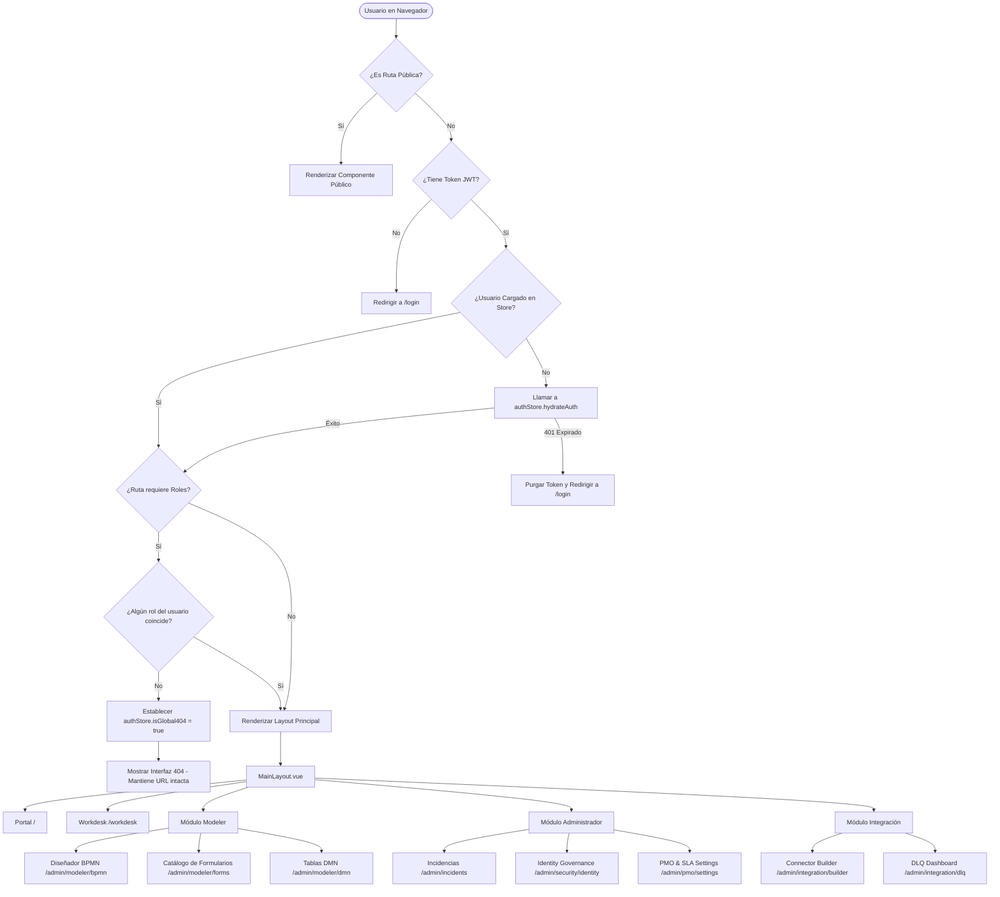

# Auditoría Exhaustiva de Frontend - Plataforma iBPMS

**Fecha**: 2026-05-29  
**Estado**: Finalizado  
**Idioma**: Español  
**Objetivo**: Analizar la topología de pantallas, flujos de navegación, botonera crítica, modelo de control de accesos (RBAC/ABAC) y vulnerabilidades de seguridad en el módulo de frontend de la plataforma iBPMS.

---

## R1. Identificación Completa de Pantallas

Se ha mapeado por completo el catálogo de 46 archivos `.vue` en el directorio de vistas del frontend. Este catálogo se compone de 32 vistas principales (detalladas en la siguiente tabla) y 14 subcomponentes auxiliares (detallados en la sección posterior de componentes auxiliares) en `src/views/` junto con sus rutas asociadas en `src/router/index.ts`. A continuación se detalla su objetivo de negocio, ruta y estado:

### Catálogo de 32 Componentes de Vista Principal

| Componente Vista (`.vue`) | Ruta Asociada | Objetivo de Negocio / Alcance Técnico | Estado / Uso |
| :--- | :--- | :--- | :--- |
| `src/views/Login.vue` | `/login` | Autenticación de usuarios a través de credenciales de Active Directory, decodificación de tokens JWT, almacenamiento de sesión en Pinia y sincronización del perfil del usuario. | **Activo** |
| `src/views/Portal.vue` | `/` | Portal principal de aterrizaje del usuario. Muestra resúmenes de actividades, KPI operativos y accesos directos al buzón de tareas. | **Activo** |
| `src/views/Workdesk.vue` | `/workdesk` | Bandeja de entrada universal (Workbox) que permite a los analistas ver, reclamar, liberar y ejecutar tareas humanas provenientes de Camunda BPM. | **Activo** |
| `src/views/IntakeTriageView.vue` | `/intake-triage` | Consola operativa para clasificar, priorizar y enrutar las solicitudes entrantes (intakes) de clientes. | **Activo** |
| `src/views/kanban/KanbanView.vue` | `/kanban` | Vista ágil de las tareas del equipo organizadas en tableros Kanban interactivos para seguimiento visual. | **Activo** |
| `src/views/admin/SettingsView.vue` | `/admin` | Panel de configuración administrativa para gestionar integraciones globales, webhooks y usuarios. | **Activo** |
| `src/views/admin/GenericForm/GenericFormView.vue` | *Ninguna (Sin ruta)* | Gestión de Tareas, restauración de borradores CA-85, confirmación de cambios pendientes. | **Inactivo / Sin ruta / huérfano** |
| `src/views/admin/IncidentCenter.vue` | `/admin/incidents` | Centro de monitoreo y remediación de incidentes técnicos en procesos activos del motor BPMN. | **Activo** |
| `src/views/admin/Modeler/BpmnDesigner.vue` | `/admin/modeler/bpmn` | Diseñador visual de flujos de procesos BPMN implementado en base a `bpmn-js` con soporte para despliegues controlados. | **Activo** |
| `src/views/admin/Modeler/FormList.vue` | `/admin/modeler/forms` | Repositorio y catálogo de formularios dinámicos creados y versionados para su renderización dinámica. | **Activo** |
| `src/views/admin/Modeler/FormDesigner.vue` | `/admin/modeler/forms/designer` | IDE de diseño visual Drag-and-Drop de formularios dinámicos con generación automática de esquemas Zod en tiempo real. | **Activo** |
| `src/views/admin/Modeler/DmnIntelligence.vue` | `/admin/modeler/dmn` | Interfaz de modelado de tablas de decisión DMN y configuración de reglas de decisión automatizadas con NLP. | **Activo** |
| `src/views/admin/Modeler/InstancesManager.vue` | *Ninguna (Sin ruta)* | Gestor de instancias de procesos que permite la inspección de variables locales y re-enrutado de tokens. | **Inactivo / Sin ruta** |
| `src/views/inbox/InboxView.vue` | `/inbox` | Buzón personal secundario del analista para notificaciones del sistema y mensajería interna. | **Activo** |
| `src/views/admin/ServiceDelivery/IntakeManual.vue` | `/admin/intake` | Formulario de entrada manual para que agentes internos registren solicitudes a nombre de clientes. | **Activo** |
| `src/views/admin/ServiceDelivery/Customer360.vue` | `/admin/customer360` | Consola de visualización de información integrada del cliente (Customer 360), historial y SLA de trámites activos. | **Activo** |
| `src/views/public/CustomerPortal.vue` | `/portal/tracking` | Portal público sin credenciales para que los clientes finales realicen seguimiento a sus radicados y solicitudes. | **Activo** |
| `src/views/public/PublicIntake.vue` | `/public/start/:processKey` | Página pública para iniciar solicitudes anónimas o trámites huérfanos sin autenticación (CA-15). | **Activo** |
| `src/views/admin/ProjectBuilder/ProjectBuilder.vue` | `/admin/project-builder` | Herramienta de definición de Estructuras de Descomposición de Trabajo (WBS) y fases de proyectos de entrega. | **Activo** |
| `src/views/admin/ProjectBuilder/ProjectManager.vue` | `/admin/projects/manager` | Consola de gestión de cronogramas, control de hitos de entrega y asignación de recursos. | **Activo** |
| `src/views/admin/ProjectBuilder/AgileHub.vue` | `/admin/projects/agile-hub/:projectId?` | Consola de tareas de PMO que integra backlogs de proyecto, asignaciones de sprint y tableros ágiles. | **Activo** |
| `src/views/admin/Analytics/DashboardBAM.vue` | `/admin/analytics/bam` | Dashboard de BAM (Business Activity Monitoring) para análisis de cuellos de botella e indicadores de productividad. | **Activo** |
| `src/views/admin/Integration/ConnectorCatalog.vue` | `/admin/integration/catalog` | Catálogo central de conectores SOAP, REST, bases de datos y RabbitMQ. | **Activo** |
| `src/views/admin/Integration/ConnectorBuilder.vue` | `/admin/integration/builder` | Interfaz de construcción de cabeceras, endpoints, credenciales y scripts de transformación de datos para conectores. | **Activo** |
| `src/views/admin/Integration/VisualMapper.vue` | `/admin/integration/mapper` | Diseñador gráfico de mapeo de variables entre campos BPMN y esquemas XML/JSON externos. | **Activo** |
| `src/views/admin/Integration/DlqDashboard.vue` | `/admin/integration/dlq` | Consola de monitoreo de la cola de fallos (Dead Letter Queue) de mensajería asíncrona. | **Activo** |
| `src/views/admin/SGDEA/DocumentGrid.vue` | `/sgdea/vault` | Repositorio oficial y visor de expedientes y documentos adjuntos en cumplimiento de estándares de archivo digital. | **Activo** |
| `src/views/admin/AI/PromptLibrary.vue` | `/ai/prompts` | Biblioteca de plantillas y configuraciones de prompts para el motor cognitivo de inteligencia artificial. | **Activo** |
| `src/views/admin/AI/SacConfigManager.vue` | `/admin/mailboxes` | Consola de administración de la sincronización de buzones institucionales vía MS Graph API. | **Activo** |
| `src/views/admin/Security/IdentityGovernance.vue` | `/admin/security/identity` | Tablero de control de sincronización de Active Directory, revocación de sesiones concurrentes e informes ISO 27001. | **Activo** |
| `src/views/admin/PMO/PmoSettings.vue` | `/admin/pmo/settings` | Ajustes globales para parámetros de proyectos, cronogramas de feriados de países y reglas de escalamiento. | **Activo** |
| `src/views/admin/RbacManager/RbacManagerView.vue` | *Ninguna (Sin ruta)* | Interfaz de administración granular de roles RBAC sustituida por IdentityGovernance.vue en producción. | **Inactivo / Sin ruta / huérfano** |

### Catálogo de 14 Subcomponentes Auxiliares y Reutilizables (No enrutados de forma directa)

Alojados dentro del directorio `src/views/`, estos componentes sirven como auxiliares internos incrustados en las pantallas principales:
- **`src/views/admin/ProjectBuilder/` (Componentes del WBS Builder)**:
  - `PropertyInspector.vue`: Panel lateral para definir y guardar propiedades de elementos WBS.
  - `ResourcePanel.vue`: Consola lateral de asignación de recursos y presupuestos por tarea.
  - `TemplateBuilder.vue`: Diseñador de plantillas de metadatos de hitos.
  - `WbsTreeView.vue`: Visor jerárquico dinámico del cronograma de desglose.
- **`src/views/admin/SGDEA/` (Visor de Archivos)**:
  - `PdfViewerPane.vue`: Visor nativo integrado de documentos PDF resguardados en el vault de SGDEA.
- **`src/views/admin/Integration/` (Auxiliares de Integración)**:
  - `OutboundDispatcherConfig.vue`: Formulario de configuración de envíos asíncronos externos.
  - `PgpValidator.vue`: Componente criptográfico para verificar firmas PGP de integraciones.
- **`src/views/admin/RbacManager/` (Vistas secundarias en RBAC)**:
  - `RbacTabs.vue`, `GlobalRolesTable.vue`, `ProcessRolesTable.vue`, `ServiceAccountsTable.vue`, `RbacDelegationLog.vue`, `SecurityAnomalyTable.vue`, `SecurityAuditLog.vue`: Subcomponentes del módulo descontinuado RbacManagerView (los cuales están listados bajo `admin/RbacManager`).

---

## R2. Mapa de Botones y Flujos de Navegación

### Diagrama de Navegación y Flujo de Intercepción (Mermaid)

El siguiente flujo representa el ciclo de enrutamiento y las transiciones desde que un usuario accede al sistema hasta que las pantallas principales del Layout se cargan:



### Mapa Detallado de Botonera Crítica (Acciones Transaccionales)

A continuación se mapea la botonera que ejecuta mutaciones críticas sobre el estado de la aplicación, detallando sus disparadores, componentes, endpoints y mecanismos de tolerancia a fallos:

| Componente Vista | Etiqueta de Botón | Selector HTML / Test ID | Manejador de Click | Store Pinia & Acción | Endpoint HTTP & Payload | Mecanismo de Tolerancia a Fallos / Rollback |
| :--- | :--- | :--- | :--- | :--- | :--- | :--- |
| `views/Workdesk.vue` | **Reclamar** | `data-testid="claim-button-{id}"` | `onClaimTask(task)` | `useWorkdeskStore().claimTask` | **POST** `/api/v1/workbox/tasks/{id}/claim`<br>*Payload: Vacío* | **UI Optimista**: Asigna `assignee = 'analista'` y `_isConfirming = true` localmente de inmediato. **Reintento Exponencial**: En errores de red (429/503) reintenta 3 veces (2s, 4s, 8s). **Rollback**: Si falla el reintento, revierte el listado de tareas e inyecta el toast de error `#claim-rollback-toast` en el DOM. |
| `components/workdesk/TaskPreviewModal.vue` | **Reclamar Tarea** | `data-test="btn-claim"` | `handleClaim()` | `useWorkdeskStore().claimTask` | **POST** `/api/v1/workbox/tasks/{id}/claim`<br>*Payload: Vacío* | Establece `isClaiming = true`. En caso de conflicto concurrente (HTTP 409) cambia a `isAlreadyClaimed = true` y bloquea la interfaz mostrando el badge de tarea ocupada. |
| `views/Workdesk.vue` | **Liberar (Unclaim)** | `data-testid="btn-release-task"` | `onReleaseTask(task)` | `useWorkdeskStore().unclaimTask` | **POST** `/api/v1/workbox/tasks/{id}/unclaim`<br>*Payload: `{ mensajeInterno: '' }`* | **UI Optimista**: Elimina temporalmente la tarea de la bandeja "Mis Tareas". **Rollback**: Si el backend responde con error, restaura el listado usando la copia instantánea en memoria. |
| `views/Workdesk.vue` | **Confirmar Salto** | `data-testid="confirm-skip"` | `submitSkip()` | `useWorkdeskStore().skipAndNext` | **POST** `/api/v1/workdesk/attend-next/skip`<br>*Payload: `{ taskId, skipReason, skipReasonDetail }`* | **Validación Previa**: Requiere justificación de más de 10 caracteres si la razón es `OTHER`. En caso de éxito, realiza transición directa al cargar la siguiente tarea prioritaria devuelta por la API en `openedTask.value`. |
| `views/admin/Integration/DlqDashboard.vue` | **Confirmar Purga** | *Ninguno* | `executePurge()` | `useIntegrationStore().delete` | **DELETE** `/api/v1/admin/queues/dlq/purge`<br>*Payload: `{ justification }`* | **Hard Validation**: El botón se bloquea a menos que el analista escriba una justificación de al menos 20 caracteres. Al completarse la petición de purga, se invoca `fetchDLQ` para actualizar el estado del dashboard de RabbitMQ. |
| `views/admin/ProjectBuilder/TemplateBuilder.vue` | **Publicar Plantilla** | *Ninguno* | `publishTemplate()` | `useProjectTemplateStore().publishTemplate` | **POST** `/api/v1/design/projects/templates/{id}/publish`<br>*Payload: Vacío* | **UI Guard**: Deshabilitado a menos que la estructura cuente con al menos una tarea por hito y todas las tareas tengan un `formKey` definido. Cambia el estado visual a inmutable (`PUBLISHED`). |
| `views/admin/Modeler/BpmnDesigner.vue` | **Desplegar (BPMN)** | `data-testid="btn-confirm-deploy"` | `confirmDeploy()` | `useIntegrationStore().deployProcess` | **POST** `/api/v1/design/processes/deploy`<br>*Payload: FormData (comentario, estrategia, blob XML)* | **Hard Validation**: Comentario obligatorio de al menos 10 caracteres. Se eliminó la casilla de omitir advertencias. En error de compilación de Camunda (HTTP 422), captura los fallos e inyecta los marcadores en la consola de diagnósticos lateral. |
| `views/admin/Modeler/DmnIntelligence.vue` | **Publicar Ahora** | *Ninguno* | `executeControlledDeploy()` | `useDmnStore().saveDmn` | **PUT** `/api/v1/dmn-models/{id}`<br>*Payload: `{ key, name, xmlData, formPattern }`* | **Password Gate**: Requiere la confirmación explícita escribiendo el texto `CONFIRMO_V2`. Al confirmarse, realiza el deploy del DMN y purga las instantáneas de borradores del LocalStorage. |

---

## R3. Matriz de Control de Accesos (RBAC/ABAC)

La plataforma utiliza un modelo mixto para asegurar las transiciones de ruta, las peticiones HTTP y los controles interactivos dentro de las pantallas.

### 1. Matriz de Rutas y Permisos Requeridos

A continuación se presenta el control de accesos configurado para cada una de las rutas declaradas en el router del frontend:

| Ruta | Componente de Vista | Tipo de Autenticación | Roles Autorizados (`meta.roles`) | Validación de Seguridad / Acciones |
| :--- | :--- | :--- | :--- | :--- |
| `/login` | `Login.vue` | Pública | *Ninguno* | `meta.isPublic: true` |
| `/public/start/:processKey` | `PublicIntake.vue` | Pública | *Ninguno* | `meta.isPublic: true` (Lanza workflows anónimos) |
| `/portal/tracking` | `CustomerPortal.vue` | Pública | *Ninguno* | `meta.isPublic: true` (Acceso con número de radicado) |
| `/` | `Portal.vue` | Autenticado | *Ninguno* | JWT Válido |
| `/workdesk` | `Workdesk.vue` | Autenticado | *Ninguno* | JWT Válido |
| `/kanban` | `KanbanView.vue` | Autenticado | *Ninguno* | JWT Válido |
| `/inbox` | `InboxView.vue` | Autenticado | *Ninguno* | JWT Válido |
| `/admin/incidents` | `IncidentCenter.vue` | Autenticado | *Ninguno* (Ver Hallazgo 2) | JWT Válido (Permite reintentar tokens BPMN) |
| `/admin/modeler/bpmn` | `BpmnDesigner.vue` | Autenticado | *Ninguno* (Ver Hallazgo 2) | JWT Válido |
| `/admin/modeler/forms` | `FormList.vue` | Autenticado | *Ninguno* (Ver Hallazgo 2) | JWT Válido |
| `/admin/modeler/forms/designer` | `FormDesigner.vue` | Autenticado | *Ninguno* (Ver Hallazgo 2) | JWT Válido |
| `/admin/modeler/dmn` | `DmnIntelligence.vue` | Autenticado | *Ninguno* (Ver Hallazgo 2) | JWT Válido |
| `/admin/intake` | `IntakeManual.vue` | Autenticado | *Ninguno* | JWT Válido |
| `/admin/customer360` | `Customer360.vue` | Autenticado | *Ninguno* | JWT Válido |
| `/admin/project-builder` | `ProjectBuilder.vue` | Autenticado | *Ninguno* | JWT Válido |
| `/admin/projects/manager` | `ProjectManager.vue` | Autenticado | *Ninguno* | JWT Válido |
| `/admin/projects/agile-hub/:projectId?` | `AgileHub.vue` | Autenticado | *Ninguno* | JWT Válido |
| `/admin/analytics/bam` | `DashboardBAM.vue` | Autenticado | *Ninguno* (Ver Hallazgo 2) | JWT Válido |
| `/admin/integration/catalog` | `ConnectorCatalog.vue` | Autenticado | *Ninguno* | JWT Válido |
| `/admin/integration/builder` | `ConnectorBuilder.vue` | Autenticado | *Ninguno* (Ver Hallazgo 2) | JWT Válido |
| `/admin/integration/mapper` | `VisualMapper.vue` | Autenticado | *Ninguno* | JWT Válido |
| `/sgdea/vault` | `DocumentGrid.vue` | Autenticado | *Ninguno* | JWT Válido |
| `/intake-triage` | `IntakeTriageView.vue` | RBAC Estricto | `['Global Admin', 'ROLE_SUPER_ADMIN']` | Filtro por Roles |
| `/admin` | `SettingsView.vue` | RBAC Estricto | `['ROLE_SUPER_ADMIN', 'Global Admin']` | Filtro por Roles |
| `/ai/prompts` | `PromptLibrary.vue` | RBAC Estricto | `['Global Admin', 'prompt_engineer']` | Filtro por Roles |
| `/admin/mailboxes` | `SacConfigManager.vue` | RBAC Estricto | `['Global Admin']` | Filtro por Roles |
| `/admin/security/identity` | `IdentityGovernance.vue` | RBAC Estricto | `['ROLE_SUPER_ADMIN', 'SUPER_ADMIN', 'Global Admin', 'ibpms_rol_SUPER_ADMIN']` | Filtro por Roles |
| `/admin/pmo/settings` | `PmoSettings.vue` | RBAC Estricto | `['Global Admin', 'ROLE_SUPER_ADMIN']` | Filtro por Roles |
| `/admin/integration/dlq` | `DlqDashboard.vue` | **BYPASS** | *Ninguno* (Ver Hallazgo 1) | **Vulnerable**: Utiliza `requiredRole` |

### 2. Arquitectura de Seguridad y Guardias de Rutas (`RouteGuards.ts`)

La protección de rutas se organiza mediante dos piezas de lógica fundamentales:
- **Mitigación de la Amnesia del F5**: Cuando un analista recarga la aplicación presionando F5, el estado volátil de Pinia se pierde temporalmente, pero el token permanece almacenado en `localStorage`. El interceptor `rbacGuard` captura esta condición (línea 36) e invoca de manera síncrona `authStore.hydrateAuth()`, cargando el perfil y restaurando los roles antes de evaluar si el usuario tiene acceso a la pantalla destino.
- **Seguridad por Oscuridad (Falso 404)**: En lugar de redirigir a un clásico aviso de "Acceso Denegado (403)", que confirmaría la existencia de un recurso sensible, el interceptor modifica la bandera reactiva `authStore.isGlobal404 = true` y continúa el ciclo de navegación. Esto fuerza que la aplicación renderice una pantalla estándar "404 Not Found" mientras mantiene la barra de direcciones intacta.

### 3. Normalización y Limpieza de Roles (`authStore.ts`)

El frontend de iBPMS está integrado con proveedores de identidad externos (como Microsoft EntraID). El store `authStore.ts` se encarga de normalizar los roles para que coincidan con la estructura esperada por los guards de la aplicación:
- **Conversión de Prefijos**: Las identidades que entran con el prefijo de grupo del Ingress (`ibpms_rol_`) son normalizadas mediante expresiones regulares (líneas 106 y 167):
  ```typescript
  const roles = (payload.roles || []).map((r: string) => r.replace('ibpms_rol_', 'ROLE_'));
  ```
  Esto significa que el rol `ibpms_rol_SUPER_ADMIN` se procesa y guarda localmente en el cliente bajo el nombre estandarizado `ROLE_SUPER_ADMIN`.
- **Anomalía en Definición de Rutas**: En la definición de la ruta para `/admin/security/identity`, se especificó `roles: [..., 'ibpms_rol_SUPER_ADMIN']`. Dado que la normalización purga dicho prefijo al iniciar sesión, este rol específico nunca producirá una coincidencia positiva en el cliente. El usuario solo logra ingresar debido a la presencia alternativa de `'ROLE_SUPER_ADMIN'` o `'Global Admin'` en el arreglo de metadatos.

### 4. Modelo de Control de Accesos Basado en Atributos (ABAC)

La plataforma aplica restricciones de permisos sobre elementos de control interactivos (botoneras de guardado, inputs de texto, etc.) en tiempo de ejecución:
- **Gating de Solo Escritura / Auditoría**: En `authStore.ts` (línea 199-206), se expone una propiedad computada que evalúa los atributos de los roles activos del analista:
  ```typescript
  const hasWritePermission = computed(() => {
      if (!user.value || !user.value.roles) return false;
      const writeRoles = user.value.roles.filter(r => !r.toUpperCase().includes('READONLY') && !r.toUpperCase().includes('READ_ONLY') && r !== 'ROLE_AUDITOR');
      return writeRoles.length > 0;
  });
  ```
  Si el analista tiene un rol que contiene los términos `READONLY`, `READ_ONLY` o es un `ROLE_AUDITOR`, los componentes deshabilitan inmediatamente los botones de guardar, editar y borrar (ej. `:disabled="!authStore.hasWritePermission"`).

### 5. Características de Gobernanza Avanzada (`IdentityGovernance.vue`)

- **Revocación de Roles en Tiempo Real (SSE)**: La aplicación abre una conexión persistente a la API `/api/v1/security/stream`. Si un administrador revoca un permiso desde la consola central, el backend emite un mensaje con el evento `[ROLE_REVOKED]`, lo que provoca que `authStore` destruya la sesión en tiempo real de forma reactiva e invalide el token local.
- **Detección y Mitigación de Anomalías**: Mediante el consumo del endpoint `/security/anomalies`, los oficiales de seguridad (CISO) pueden monitorizar accesos inusuales (como inicios de sesión en ubicaciones distantes con diferencia de minutos) y ejecutar la invalidación remota del token mediante un botón de pánico que bloquea la sesión activa.
- **Generación de Reportes ISO 27001**: Permite solicitar al backend la compilación criptográfica de las trazas de acceso, accesos otorgados y delegaciones activas a través de consultas a `/security/audit/reports/iso27001` para certificar la gobernanza ante auditores.
- **Delegación Temporal de Autoridad (US-001)**: Interfaz para transferir temporalmente permisos de aprobación y firma electrónica a un asistente o suplente durante periodos de vacaciones o incapacidad, gestionada en el frontend bajo rangos estrictos de fecha.

---

## R4. Hallazgos Críticos de Seguridad e Integridad

### Hallazgo 1: Omisión Completa de Seguridad en el DLQ Dashboard (Efecto Bypass)

* **Referencias de Archivos**:
  - `ibpms-platform/frontend/src/router/index.ts` (Líneas 149-155 / 159-163)
  - `ibpms-platform/frontend/src/router/RouteGuards.ts` (Líneas 47-59)
  - `ibpms-platform/frontend/src/views/admin/Integration/DlqDashboard.vue`
* **Descripción del Fallo**:
  La ruta administrativa encargada de gestionar y purgar la cola de mensajes huérfanos (Dead Letter Queue) fue configurada con una propiedad de metadatos equivocada:
  ```typescript
  {
      path: 'admin/integration/dlq',
      name: 'DlqDashboard',
      component: () => import('@/views/admin/Integration/DlqDashboard.vue'),
      meta: { requiresAuth: true, requiredRole: 'ADMIN_IT' }
  }
  ```
  Por otro lado, el interceptor central de control de accesos (`rbacGuard` en `RouteGuards.ts`) está programado de forma estricta para evaluar las autorizaciones basadas únicamente en la propiedad `meta.roles` en formato de arreglo:
  ```typescript
  if (to.meta.roles && Array.isArray(to.meta.roles)) {
      const userRoles = authStore.roles;
      const hasAccess = userRoles.some(r => (to.meta.roles as string[]).includes(r));
      // ...
  }
  ```
  Debido a que `/admin/integration/dlq` declara `requiredRole` en lugar de `roles`, el condicional del guard evalúa a `undefined` y se salta completamente la validación. Adicionalmente, el componente de vista `DlqDashboard.vue` no realiza ninguna validación de rol interna.
* **Impacto**:
  **Escalada de Privilegios Crítica**. Cualquier usuario autenticado en la plataforma (incluso con el nivel de acceso más bajo de la organización, como un rol de consultas externas) puede acceder directamente mediante URL a `/admin/integration/dlq`. Esto expone datos privados y permite ejecutar purgas masivas destructivas sobre la cola RabbitMQ, interrumpiendo transacciones legítimas del negocio.
* **Remediación**:
  Corregir de forma inmediata la declaración de metadatos de la ruta en `router/index.ts` reemplazando la propiedad `requiredRole` por el arreglo de roles esperado:
  ```typescript
  meta: { title: 'DLQ Dashboard', requiresAuth: true, roles: ['ROLE_ADMIN_IT', 'ROLE_SUPER_ADMIN'] }
  ```

---

### Hallazgo 2: Rutas Administrativas y de Modeler Desprotegidas

* **Referencias de Archivos**:
  - `ibpms-platform/frontend/src/router/index.ts`
  - `ibpms-platform/frontend/src/views/admin/IncidentCenter.vue`
  - `ibpms-platform/frontend/src/views/admin/Integration/ConnectorBuilder.vue`
  - `ibpms-platform/frontend/src/views/admin/Modeler/DmnIntelligence.vue`
  - `ibpms-platform/frontend/src/views/admin/Analytics/DashboardBAM.vue`
* **Descripción del Fallo**:
  Múltiples pantallas destinadas a operaciones de infraestructura, flujos BPMN y analíticas de alto nivel no definen ninguna restricción en su metadatos de ruta (`meta.roles`), permitiendo el acceso general de cualquier usuario con un token válido:
  - **Incident Center (`/admin/incidents`)**: Carece de protección por rol en el router y de controles a nivel de componente. Un usuario sin privilegios puede forzar reintentos de transacciones fallidas de Camunda.
  - **Connector Builder (`/admin/integration/builder`)**: Permite la edición e inserción de credenciales y código de integración de conectores SOAP/REST de manera abierta en borrador. Únicamente el botón de aprobación final está restringido en el UI, pero la creación de borradores no lo está.
  - **DMN Intelligence (`/admin/modeler/dmn`)**: Cualquier analista puede modificar las tablas de reglas automáticas de decisión sin validación previa.
  - **BAM Dashboard (`/admin/analytics/bam`)**: Si bien el botón del widget BAM en la vista de `Workdesk.vue` se muestra de manera condicional para los roles `ROLE_SUPER_ADMIN` y `Global Admin`, la ruta directa en el router se encuentra desprotegida. Esto permite saltarse la restricción del menú visual ingresando la dirección URL directamente en el navegador.
* **Impacto**:
  Bypass de las restricciones del menú lateral. Los usuarios básicos pueden alterar la estructura de integración, observar trazas operativas y cambiar variables del negocio a través de la edición de reglas DMN.
* **Remediación**:
  Asignar de forma explícitamente las restricciones de roles en las rutas correspondientes en `router/index.ts`:
  ```typescript
  {
      path: 'admin/incidents',
      name: 'IncidentCenter',
      component: () => import('@/views/admin/IncidentCenter.vue'),
      meta: { title: 'Incident Center', requiresAuth: true, roles: ['ROLE_SUPER_ADMIN', 'ROLE_ADMIN_IT'] }
  },
  {
      path: 'admin/modeler/dmn',
      name: 'DmnIntelligence',
      component: () => import('@/views/admin/Modeler/DmnIntelligence.vue'),
      meta: { title: 'DMN Intelligence', requiresAuth: true, roles: ['ROLE_SUPER_ADMIN', 'ROLE_ANALYST_IT'] }
  }
  ```

---

### Hallazgo 3: Bypass del Log de Auditoría en la Visualización de Credenciales (apiSecret)

* **Referencias de Archivos**:
  - `ibpms-platform/frontend/src/views/admin/Integration/ConnectorBuilder.vue` (Líneas 77-93 y 240-247)
* **Descripción del Fallo**:
  En el componente de construcción de conectores (`ConnectorBuilder.vue`), la clave secreta de conexión (`apiSecret`) se mantiene cargada en texto plano dentro del estado reactivo del cliente desde que se monta la página.
  La interfaz oculta visualmente el valor usando asteriscos, y define que al presionar el botón "👁️ Monitorear" se invoque la función `revealWithAudit()`, la cual dispara un POST hacia el servicio de auditoría del servidor (`/audit/events`) para dejar constancia de quién visualizó la credencial.
  Sin embargo, debido a que el valor real ya está cargado en el cliente (`apiSecret = ref('ibpms_sk_live_9f8g7h6j...')`), un usuario técnico puede leer la clave secreta directamente inspeccionando las variables en memoria a través de herramientas de desarrollo (Vue DevTools) o mediante comandos por consola, sin presionar el botón y por ende sin dejar rastro de auditoría.
* **Impacto**:
  Exfiltración silenciosa de credenciales y claves secretas corporativas de producción, evadiendo los mecanismos forenses requeridos por las políticas de cumplimiento del sistema (CA-10).
* **Remediación**:
  - La API de backend no debe enviar la clave real en la carga inicial de datos del conector; en su lugar, debe devolver un marcador enmascarado (por ejemplo, `••••••••••••`).
  - Para revelar la credencial, el cliente debe realizar una petición POST específica al backend. El backend registrará el evento de auditoría en la base de datos de manera atómica antes de retornar la clave en claro en la respuesta HTTP.

---

### Hallazgo 4: Degradación del Rendimiento por Guardado en LocalStorage en FormDesigner

* **Referencias de Archivos**:
  - `ibpms-platform/frontend/src/views/admin/Modeler/FormDesigner.vue` (Líneas 1314-1317 y 1270-1289)
  - `ibpms-platform/frontend/src/stores/useFormDesignerStore.ts`
* **Descripción del Fallo**:
  El diseñador de formularios utiliza un observador profundo (`deep watcher`) sobre el arreglo reactivo `canvasFields`. Ante cualquier cambio detectado, se invoca inmediatamente de forma sincrónica la función `saveLocalSnapshot()`, que realiza una serialización completa a cadena JSON y la guarda en la clave `form_local_snapshots` del `localStorage`.
  Al realizarse este proceso continuo en cada pulsación de teclado o movimiento de drag-and-drop, y dado que no cuenta con un temporizador o mecanismo de debounce, el hilo principal se bloquea repetidamente cuando el formulario crece y se aproxima al límite de los 200 componentes (`isHighDensityForm`).
* **Impacto**:
  Degradación severa del rendimiento de la interfaz (lag visual, congelamiento temporal de componentes al arrastrar) y el riesgo inminente de saturar el almacenamiento de `localStorage` (límite de 5MB del navegador) provocando excepciones de ejecución del navegador que impiden guardar el trabajo del analista.
* **Remediación**:
  Implementar un mecanismo de retardo controlado (`debounce` de 1500ms a 2000ms) a la ejecución del auto-guardado de instantáneas locales en `FormDesigner.vue` para asegurar que el proceso de serialización se ejecute únicamente cuando el usuario pausa su actividad de diseño.

---

### Hallazgo 5: Duplicación de Prefijo de Endpoint en Acciones de Pinia Store (useWorkdeskStore.ts)

* **Referencias de Archivos**:
  - `ibpms-platform/frontend/src/stores/useWorkdeskStore.ts` (Líneas 210 y 247)
* **Descripción del Fallo**:
  Las acciones `unclaimTask` and `bulkClaimTasks` del store de Pinia (`useWorkdeskStore.ts`) realizan llamadas HTTP utilizando el cliente `apiClient`. Sin embargo, concatenan manualmente el prefijo `/api/v1` en las rutas de sus endpoints correspondientes:
  - En `unclaimTask` (Línea 210):
    ```typescript
    const { data } = await apiClient.post(`/api/v1/workbox/tasks/${taskId}/unclaim`, payload);
    ```
  - En `bulkClaimTasks` (Línea 247):
    ```typescript
    const { data } = await apiClient.post('/api/v1/workbox/tasks/bulk-claim', taskIds);
    ```
  Dado que la instancia `apiClient` ya está preconfigurada con un `baseURL` que incluye `/api/v1` como prefijo base para todas las llamadas, esta concatenación manual causa una duplicación del prefijo.
* **Impacto**:
  En entornos estrictos o de producción, las solicitudes de Axios se resuelven a rutas mal formadas del tipo `/api/v1/api/v1/workbox/tasks/...`, lo que resulta en respuestas de error `404 Not Found`. Esto impide que los analistas liberen tareas humanas de forma individual o las reclamen de forma masiva en lotes en la bandeja de entrada.
* **Remediación**:
  Eliminar el prefijo `/api/v1` redundante en ambas acciones dentro del store, de forma que los endpoints utilicen rutas relativas que se resuelvan correctamente contra el `baseURL` de `apiClient`:
  - Modificar `/api/v1/workbox/tasks/${taskId}/unclaim` a `/workbox/tasks/${taskId}/unclaim`.
  - Modificar `/api/v1/workbox/tasks/bulk-claim` a `/workbox/tasks/bulk-claim`.

---

### Hallazgo 6: Inconsistencias y Fallos en la Suite de Pruebas Unitarias (Vitest)

* **Referencias de Archivos**:
  - Suite de pruebas unitarias Vitest en `ibpms-platform/frontend`
* **Descripción del Fallo**:
  Al ejecutar la suite de pruebas unitarias del frontend mediante el comando `npx vitest run`, se registran exactamente 30 aserciones fallidas distribuidas a lo largo de 15 archivos de prueba (sobre un total de 421 pruebas unitarias).
  Se identifican los siguientes fallos específicos y sus causas de raíz:
  1. **`DlqDashboard.spec.ts`**: Falla lanzando un error `ERR_INVALID_URL_SCHEME` proveniente de la función `fileURLToPath` de Node.js al intentar resolver rutas absolutas de componentes ejecutadas en entornos Windows.
  2. **`WorkdeskGrid.spec.ts`**: Falla en la validación de texto debido a que la aserción espera encontrar la cadena `"Sincronización BPMN degradada temporalmente"`, mientras que el componente real en producción renderiza el texto `"Sincronización Degradada"`.
  3. **`ImpersonationBanner.spec.ts`**: Falla debido a que los selectores y las pruebas de cuenta regresiva (countdown) se comparan contra cadenas vacías, no coincidiendo con el valor numérico dinámico de la sesión.
  4. **`WorkdeskTabs.spec.ts`**: Falla en las aserciones de estilos visuales al esperar la clase de Tailwind CSS `border-blue-600`, la cual difiere de las clases y estilos aplicados actualmente en la interfaz.
  5. **`DmnPublishModal.spec.ts`**: Falla la validación debido a que las llamadas simuladas (mocks) al endpoint del cliente de API (`apiClient.post`) no coinciden en número o firma con los parámetros del servicio real.
  6. **`us036_missing_coverage.spec.ts` y `useWorkdeskStore.spec.ts`**: Fallan debido a problemas de concurrencia y timeouts en la resolución de promesas asíncronas, sumado a inconsistencias al verificar la estructura y distribución del layout de bandeja de entrada.
* **Impacto**:
  **Compromiso de la Integridad de Pruebas y CI/CD**. La suite de pruebas rota oculta errores reales de regresión en el código de producción, impide automatizar con éxito el pipeline de Integración Continua (CI/CD) y erosiona la confianza del equipo en la calidad del software entregado.
* **Remediación**:
  - Refactorizar las pruebas unitarias y actualizar las aserciones de texto (ej. en `WorkdeskGrid.spec.ts`) y de clases (ej. en `WorkdeskTabs.spec.ts`) para alinearlas con el comportamiento de la interfaz real de producción.
  - Modificar la resolución de rutas en `DlqDashboard.spec.ts` para utilizar utilidades de manejo de rutas que soporten la compatibilidad multiplataforma de manera nativa (por ejemplo, normalizando rutas de Windows).
  - Corregir los mocks de `apiClient` en `DmnPublishModal.spec.ts` para reflejar la firma actual de la API del motor DMN.
  - Optimizar los tiempos de resolución y esperas asíncronas (`waitFor`, `flushPromises` o `vi.advanceTimersByTime`) en los archivos de store/cobertura con timeouts.

---

## Conclusiones de la Auditoría

1. **Vulnerabilidades de Rutas**: La discrepancia entre la propiedad `requiredRole` y el chequeo estricto del router (`meta.roles`) expone de forma directa la consola de RabbitMQ (DLQ) a cualquier usuario logueado en el sistema, lo que requiere una corrección inmediata en la configuración de la ruta.
2. **Modelo RBAC Sólido pero Incompleto**: El frontend posee un sistema de normalización e hidratación (mitigación de F5) maduro, pero se detectan fallos de configuración de metadatos en varias vistas críticas de administración que anulan el control a nivel de menú lateral.
3. **Optimización de Interfaz y Auditoría**: Es necesario separar la carga de metadatos básicos de los datos sensibles (credenciales) y optimizar el ciclo de serialización en el modelador de formularios para mantener una experiencia fluida e impedir el agotamiento de memoria del cliente.
4. **Duplicación de Rutas en API**: Los errores de concatenación en `useWorkdeskStore.ts` representan un fallo en la estandarización del uso de clientes HTTP, requiriendo eliminar la redundancia de prefijos para evitar fallos de enrutamiento 404 en el backend.
5. **Estabilidad de la Suite de Pruebas**: La acumulación de 30 fallos en pruebas de Vitest compromete el proceso de regresión. Se requiere una limpieza y alineamiento exhaustivo de aserciones de estilos, textos de UI y mocks de API para habilitar una automatización de despliegues robusta.
