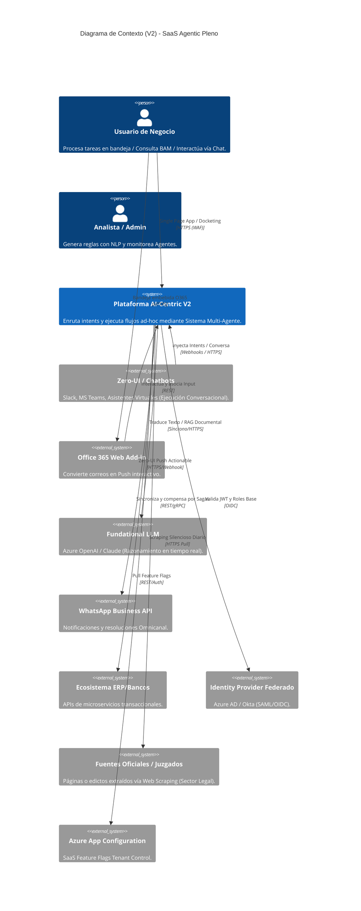
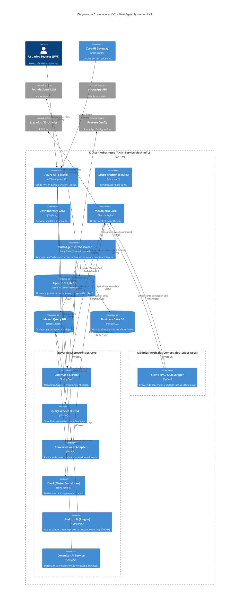

# Modelo C4 - Estratégico (V2): Plataforma iBPMS (AI-Centric / Agentic Workflows)

Este documento contiene la representación de la Arquitectura **V2 (Estado Futuro Estratégico)**, asumiendo su madurez y migración completa hacia un modelo SaaS Multitenant desplegado sobre Kubernetes, apoyado por el **Patrón Strangler** introducido en V1. El diseño abandona el BPMN rígido en favor de un **Sistema Multi-Agente** basado en resolución de Intents y RAG (Retrieval-Augmented Generation).

## Nivel 1: Diagrama de Contexto (System Context V2)

## Nivel 2: Diagrama de Contenedores (Container Diagram V2)

Abre la plataforma AI-Centric mostrando su partición en microservicios, Agentes Activos y Base de Datos Vectorial/Grafos.

---

## Decisiones Arquitectónicas Justificadas (ADR Addendum)

Las siguientes ambigüedades funcionales de la V1 fueron resueltas para este diseño Cloud-Native (V2):

### 1. Motor DMN: ¿Empotrado (.jar) vs DaaS (Microservicio Síncrono Libre)?
En la Fase V1 se usa **empotrado** dentro de Spring Boot ("`.jar`") para simplificar la infraestructura monolítica (una sola VM levanta todo). Sin embargo, en la V2, la separación como **DaaS (Decisions-as-a-Service)** expuesta como un pod de Kubernetes trae múltiples **beneficios de escalamiento asimétrico**. 
*   **Justificación:** Un simulador de tarjetas de crédito o "Tabulador de Riesgos" complejo requiere miles de transacciones por segundo al motor DMN que *no tocan* el estado de un de Workflow, por ello escalar el `DmnContainer` a 15 réplicas (mientra el Motor de Flujo de Tareas se queda en 2 réplicas) ahorra inmensamente los costos de CPU/RAM en la nube.

### 2. Manejo de Roles Complejo (ABAC) ¿JWT Front vs Spring Boot DB?
*   **Problema:** El "Permiso por Rol" (RBAC - Ej. `AdminRole`) es muy pequeño y viaja fácilmente en el payload de un token JWT al hacer *Log-in* a la aplicación. Sin embargo, el **ABAC** promete permisos por Atributo de Entidad (Ej: "Solo puedo ver los expedientes asigandos al Sub-departamento Zona Sur con Riesgo Alto"). Ese nivel granular generaría un JWT de 5 Megabytes, provocando rechazo HTTP y violación de seguridad si el token se roba.
*   **Solución (V1/V2):** El Frontend usará un token JWT **liviano** filtrado por el APIM para saber de quién es la sesión general. Pese a ello, las llamadas REST exigirán un Componente especializado en Spring Boot (`AuthUseCase / PolicyEngine`) que cruzará la identidad del token (ID) contra las matrices relacionales locales y delegaciones en vivo dentro de la Base de Datos antes de pintar los resultados de la `Tasklist`, manteniendo así al 100% de la funcionalidad de *Case Management*.
