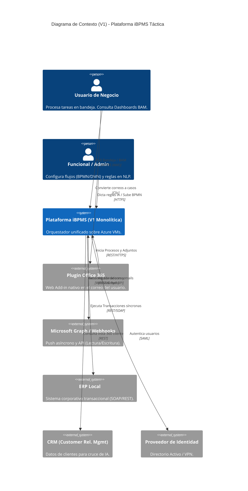
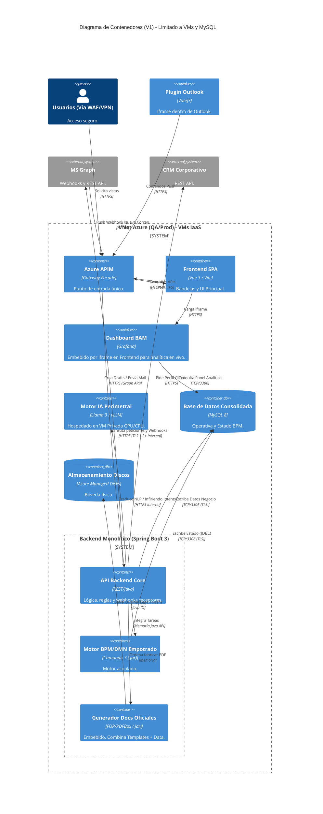
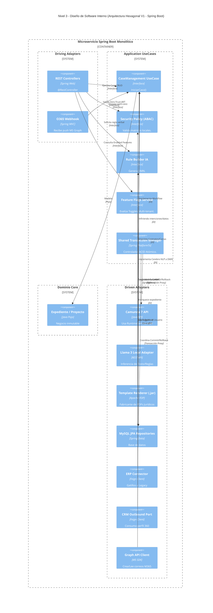

# Modelo C4 - Táctico (V1): Plataforma iBPMS (PoC)

Este documento contiene la representación de la Arquitectura **V1 (Estado Actual Táctico)**, la cual asume las actuales limitaciones de infraestructura (Azure VMs cerradas, acoplamiento transaccional y dependencia estricta de MySQL Relacional).

## Nivel 1: Diagrama de Contexto (System Context V1)

Muestra los actores que interactúan con la plataforma bajo el esquema de integración inicial.

## Nivel 2: Diagrama de Contenedores (Container Diagram V1)

Abre la iBPMS mostrando el monolito transaccional obligado por el uso del motor Camunda 7 sobre MySQL.

## Nivel 3: Diagrama de Componentes Lógicos (Software Design View V1)

Demuestra cómo, a pesar de las limitaciones de V1, el backend empotrado y monolítico se protege internamente usando **Arquitectura Hexagonal**.

