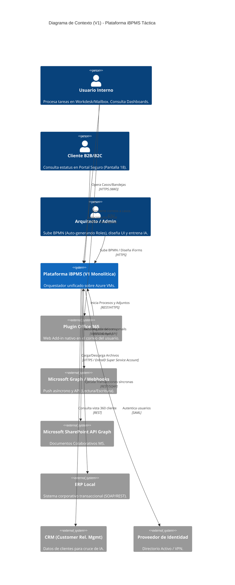

# Modelo C4 - Táctico (V1): Plataforma iBPMS (PoC)

Este documento contiene la representación de la Arquitectura **V1 (Estado Actual Táctico)**, la cual asume las actuales limitaciones de infraestructura (Azure VMs cerradas, acoplamiento transaccional y dependencia estricta de PostgreSQL 15+).

## Nivel 1: Diagrama de Contexto (System Context V1)

Muestra los actores que interactúan con la plataforma bajo el esquema de integración inicial.



## Nivel 2: Diagrama de Contenedores (Container Diagram V1)

Abre la iBPMS mostrando el monolito transaccional obligado por el uso del motor Camunda 7 sobre PostgreSQL.

```mermaid
C4Container
    title Diagrama de Contenedores (V1) - Limitado a VMs y PostgreSQL
    
    Person(cliente, "Cliente B2B/B2C", "Acceso segregado.")
    Container(plugin_o365, "Plugin Outlook", "Vue/JS", "Iframe dentro de Outlook.")
    
    System_Boundary(c1, "VNet Azure (QA/Prod) - VMs IaaS") {
        Container(apim, "Azure APIM", "Gateway Facade", "Punto de entrada único.")
        
        System_Boundary(fe_apps, "Plataforma Frontend V1 (Vue 3 / Vite)") {
             Container(webapp, "Workdesk & Portal B2B", "Vue 3", "Gestión operativa e Inbox.")
             Container(web_modelers, "Modeladores Web (IDE)", "bpmn-js / dmn-js / Zod", "Diseño de Procesos, Reglas DMN y Formularios (iForms Maestro).")
        }
        
        Container(grafana, "Dashboard BAM", "Grafana", "Embebido por iframe en Frontend para analítica en vivo.")
        
        System_Boundary(be_vm, "Backend Monolítico (Spring Boot 3)") {
            Container(backend, "API Backend Core", "REST/Java", "Orquesta Vue, Zod, SLAs, y Auto-Genera Roles BPMN (Hook).")
            Container(engine, "Motor BPM/DMN", "Camunda 7 (.jar)", "Motor empotrado que gatilla despliegues.")
            Container(doc_gen, "Generador Docs Oficiales", "FOP/PDFBox (.jar)", "Imprime PDFs.")
            Container(cache_db, "Catálogo Caché (Resilience)", "PostgreSQL/Redis", "Modo degradado de CRM.")
        }
        
        Container(llm_local, "Motor AI & Tutor", "Llama 3 / OpenAI", "Copiloto M365 y Tutor Pre-Flight BPMN.")
        Container(rag_engine, "RAG Embedder Engine", "Python / Vector DB", "Generador de Embeddings AI.")
        Container(rabbitmq, "Message Broker", "RabbitMQ", "Bus asíncrono de mensajería.")
        
        ContainerDb(db, "Base de Datos Consolidada", "PostgreSQL 15+", "Operativa y Estado BPM.")
        ContainerDb(doc_vault, "Document Vault", "Azure Managed Disks/Blob", "Bóveda física segura.")
    }
    
    System_Ext(o365_graph, "MS Graph", "Webhooks y REST API.")
    System_Ext(sharepoint, "Microsoft SharePoint API Graph", "Documentos Colaborativos MS.")
    System_Ext(crm_sys, "CRM Corporativo", "REST API (Catálogo Federado).")
    
    Rel(usuario, apim, "Opera Plataforma y Diseña", "HTTPS")
    Rel(cliente, apim, "Consulta Portal B2B", "HTTPS")
    Rel(plugin_o365, apim, "Comandos Push", "HTTPS")
    Rel(apim, webapp, "Sirve UI Operativa", "HTTPS")
    Rel(apim, web_modelers, "Sirve Modeler IDEs", "HTTPS")
    Rel(webapp, apim, "Consume APIs", "JSON/HTTPS")
    Rel(web_modelers, apim, "Consume APIs y Despliega XML", "JSON/Base64/HTTPS")
    Rel(webapp, grafana, "Carga Iframe", "HTTPS")
    Rel(apim, backend, "Enruta peticiones y Webhooks", "HTTPS (TLS 1.2+ Interno)")
    
    Rel(backend, engine, "Integra Tareas", "Memoria Java API")
    Rel(backend, doc_gen, "Ordena fabricar PDF", "Memoria")
    Rel(doc_gen, doc_vault, "Salva Original", "Java IO")
    Rel(backend, cache_db, "Lee/Escribe Catálogos Caché", "TCP")
    Rel(backend, llm_local, "Audita XML (Tutor) / Infiriendo Intents", "HTTPS Interno")
    
    Rel(o365_graph, apim, "Push Webhook Nuevo Correo", "HTTPS")
    Rel(backend, o365_graph, "Crea Drafts / Envía Mail", "HTTPS (Graph API)")
    Rel(backend, sharepoint, "API Llamadas", "HTTPS (EntraID Super Service Account)")
    Rel(backend, crm_sys, "Pide Perfil Cliente", "HTTPS")
    
    Rel(doc_vault, rabbitmq, "Publica evento de documento", "Async Flow / AMQP")
    Rel(rabbitmq, rag_engine, "Consume para indexación vectorial", "Async Flow / AMQP")
    
    Rel(engine, db, "Escribe Estado (JDBC)", "TCP/3306 (TLS)")
    Rel(grafana, db, "Consulta Panel Analítico", "TCP/3306")
    Rel(backend, db, "Escribe Datos Negocio", "TCP/3306 (TLS)")
```

## Nivel 3: Diagrama de Componentes Lógicos (Software Design View V1)

Demuestra cómo, a pesar de las limitaciones de V1, el backend empotrado y monolítico se protege internamente usando **Arquitectura Hexagonal**.

```mermaid
C4Component
    title Nivel 3 - Diseño de Software Interno (Arquitectura Hexagonal V1 - Spring Boot)
    
    Container_Boundary(api_app, "Microservicio Spring Boot Monolítico") {
        System_Boundary(puertos_entrada, "Driving Adapters") {
            Component(rest_ctrl, "REST Controllers", "Spring Web", "@RestController")
            Component(webhook_ctrl, "O365 Webhook", "Spring MVC", "Recibe push MS Graph")
        }

        System_Boundary(aplicacion, "Application UseCases") {
            Component(cm_usecase, "CaseManagement UseCase", "Interface", "Casos estructurados e Intake Kanban.")
            Component(auth_usecase, "Security & RBAC UseCase", "Interface", "Protege Endpoints y auto-genera roles XML.")
            Component(template_usecase, "App Builder UseCase", "Interface", "Compila y sirve iForms de Vue/Zod.")
            Component(ff_usecase, "Circuit Breaker Manager", "Interface", "Alterna entre CRM Vivo y Caché.")
            Component(tx_manager, "Javers Audit & TX", "Spring Javers/Tx", "Audita Before/After e inmutabilidad.")
        }

        System_Boundary(dominio, "Dominio Core") {
            Component(expediente, "Expediente / Proyecto", "Java Pojo", "Negocio inmutable")
        }

        System_Boundary(puertos_salida, "Driven Adapters") {
            Component(camunda_adapter, "Camunda 7 API", "Java API", "Usa RuntimeService local")
            Component(ai_adapter, "Llama 3 Local Adapter", "REST API", "Inferencia de Texto/Reglas")
            Component(doc_adapter, "Template Renderer (.jar)", "Apache FOP", "Fabricante de PDFs Jurídicos")
            Component(jpa_adapter, "PostgreSQL JPA Repositories", "Spring Data", "Base de datos")
            Component(erp_adapter, "ERP Connector", "Feign Client", "Gatillos a Legacy")
            Component(crm_adapter, "CRM Outbound Port", "Feign Client", "Consumo perfil 360")
            Component(graph_adapter, "Graph API Client", "MS SDK", "Crea/Lee correos M365")
        }
    }

    Rel(rest_ctrl, cm_usecase, "Ejecuta Case CRUD", "Interface")
    Rel(rest_ctrl, auth_usecase, "Valida Zero-Trust JWT", "Interface")
    Rel(rest_ctrl, rule_usecase, "Solicita regla verbal", "Interface")
    Rel(rest_ctrl, ff_usecase, "Consulta Enabled Features", "Interface")
    Rel(webhook_ctrl, cm_usecase, "Dispara auto-caso", "Interface")
    
    Rel(cm_usecase, expediente, "Modela", "Pojo")
    
    Rel(tx_manager, camunda_adapter, "Coordina Commit/Rollback", "Transacción Proxy")
    Rel(tx_manager, jpa_adapter, "Coordina Commit/Rollback", "Transacción Proxy")
    
    Rel(ff_usecase, jpa_adapter, "Lee Toggles V1", "Query")
    Rel(camunda_adapter, cm_usecase, "Implementa Workflow", "DI")
    Rel(camunda_adapter, auth_usecase, "Gatilla XML Role Hook", "DeploymentEvent")
    Rel(ai_adapter, cm_usecase, "Infiriendo intenciones/datos", "DI")
    Rel(ai_adapter, rule_usecase, "Implementa Cerebro NLP a DMN", "DI")
    Rel(doc_adapter, cm_usecase, "Imprime Contratos/Cartas", "DI")
    Rel(jpa_adapter, auth_usecase, "Carga/Guarda Matrices ABAC & Roles Auto-Generados", "Spring Data")
    Rel(erp_adapter, cm_usecase, "Sincroniza External", "DI")
    Rel(crm_adapter, cm_usecase, "Enriquece expediente", "DI")
    Rel(graph_adapter, cm_usecase, "Envía Drafts al Usuario", "DI")
```
