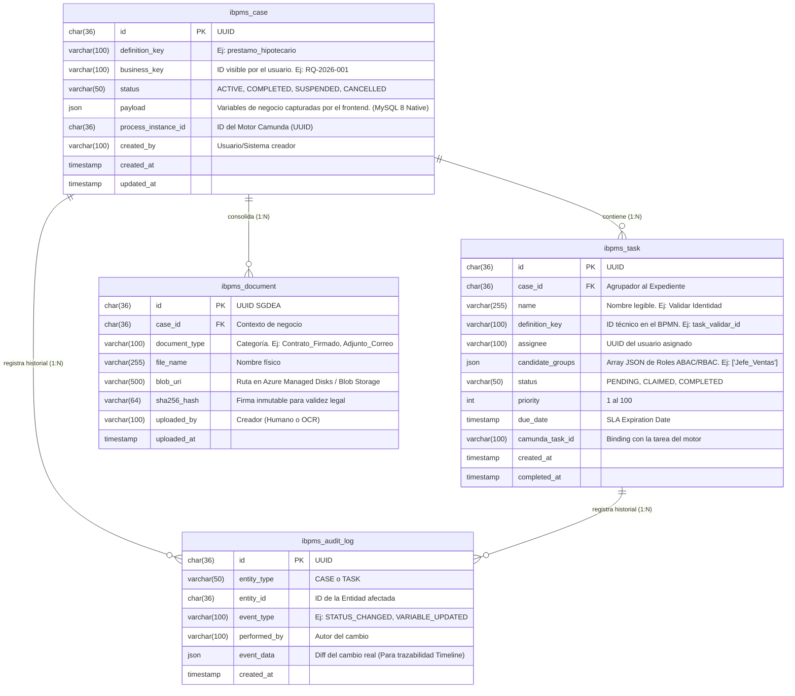

# Arquitectura de Datos (V1) - Modelo Físico MySQL 8

Este documento define el diseño de la base de datos relacional (Entity-Relationship Diagram - ERD) para la **Versión 1 (V1)** de la Plataforma iBPMS. 

Al estar fundamentados en **Arquitectura Hexagonal y Domain-Driven Design (DDD)**, es críticamente importante entender la demarcación de responsabilidades entre nuestras "Tablas de Negocio" (Hexágono Core) y las "Tablas del Motor de Procesos" (Camunda 7).

## 1. Patrón Dual-Schema (Core vs. Motor)

Debido a que hemos "empotrado" el motor Camunda 7 dentro del backend Spring Boot como un adaptador para acelerar el Time-to-Market (TTM), la base de datos MySQL consolidada contendrá dos mundos separados que **nunca interactúan directamente mediante Foreign Keys a nivel de SQL**:

1.  **Esquema del Motor (Camunda `ACT_*`):** Tablas nativas que el motor BPM usa para la tokenización de flujos y estado (`ACT_RU_EXECUTION`, `ACT_RU_TASK`, `ACT_HI_PROCINST`, etc.). **El equipo de desarrollo NUNCA debe hacer `SELECT` o `INSERT` directo sobre estas tablas.** Toda interacción es mediada por la API Java de Camunda.
2.  **Esquema de Negocio (iBPMS Core `ibpms_*`):** Las tablas construidas por nosotros para almacenar los Expedientes (Casos de uso agnósticos), los payloads JSON de los formularios (Apalancando la columna `JSON` nativa de MySQL 8) y la referencia documental (SGDEA). 

*Esta separación garantiza que en la V2, cuando reemplacemos Camunda 7 por Kubernetes/Zeebe, nuestra base de datos core `ibpms_*` quedará intacta.*

---

## 2. Diagrama Entidad-Relación (ERD) - Capa de Negocio Core

El siguiente diagrama Mermaid ilustra el modelo físico exclusivo para las entidades de negocio.

---

## 3. Diccionario Físico y Decisiones Técnicas Clave

### A. Uso del Tipo Nativo `JSON` (MySQL 8)
*   **Columna:** `ibpms_case.payload` e `ibpms_task.candidate_groups`
*   **Justificación:** Históricamente, las plataformas de procesos sufren del antipatrón *Entity-Attribute-Value (EAV)*, creando tablas gigantescas de clave-valor para guardar las variables del negocio. Al explotar la columna nativa `JSON` de MySQL 8, logramos:
    1.  Ocultar la estructura dinámica (Formularios "Lego") directamente en una sola fila.
    2.  Permitir indexación secundaria: MySQL 8 permite generar "Generated Columns" virtuales sobre campos del JSON e indexarlos con B-Trees si necesitamos buscar, por ejemplo, todos los casos donde `$.payload.monto_aprobado > 1000`.

### B. Llaves Primarias como UUID v4 (`char(36)`)
*   **Justificación:** Se prohíbe el uso de `BIGINT AUTO_INCREMENT` para los IDs primarios obligando el uso de `UUID`. Esta es una decisión anticipada al ecosistema Cloud-Native (V2) para evitar colisiones en la creación asíncrona de expedientes y prevenir ataques de enumeración (Insecure Direct Object Reference).

### C. La Conexión con Camunda (Acoplamiento Suave)
*   Las columnas `ibpms_case.process_instance_id` y `ibpms_task.camunda_task_id` son las **únicas anclas** que amarran nuestro Dominio Hexagonal con el Motor BPM empotrado.
*   Si el Motor Camunda ordena un salto de tarea, nuestra capa de *Application Service* en Spring Boot atrapa el evento mediante la API de Java y simplemente replica el estado a nuestra tabla independiente `ibpms_task`. 

### D. Inmutabilidad Documental y Legal (`ibpms_document`)
*   Se almacena obligatoriamente una columna `sha256_hash` al momento de inyectar un documento o captura (OCR).
*   La tabla en sí NO guarda binarios (Antipatrón). Se utiliza `blob_uri` apuntando físicamente a Azure Storage. La validación del hash en cada descarga certifica que el archivo en el volumen no fue alterado físicamente por un ransomware o un administrador curioso.

---

## 4. Diccionario de Datos Físico (Data Dictionary)

A continuación se detalla la estructura física de las tablas del esquema principal (`ibpms_*` y `sys_*`). Esta tabulación es la **fuente de verdad universal** para la construcción de los scripts DDL / Liquibase.

### 4.1. Esquema Maestro (Reference Data)

**Tabla:** `sys_catalog`
| Columna | Tipo de Dato | Llave | Nulable | Descripción |
| :--- | :--- | :--- | :--- | :--- |
| `id` | `VARCHAR(50)` | PK | NO | Identificador único del catálogo (Ej. `TIPO_IDENTIFICACION`). |
| `description` | `VARCHAR(100)` | | NO | Nombre legible del catálogo. |

**Tabla:** `sys_catalog_item`
| Columna | Tipo de Dato | Llave | Nulable | Descripción |
| :--- | :--- | :--- | :--- | :--- |
| `id` | `CHAR(36)` | PK | NO | UUID v4. |
| `catalog_id` | `VARCHAR(50)` | FK | NO | Referencia limitante a `sys_catalog.id`. |
| `code` | `VARCHAR(50)` | | NO | Código técnico alfanumérico del ítem (Ej. `CC`, `NIT`). |
| `label` | `VARCHAR(100)` | | NO | Etiqueta a mostrar en la UI de los formularios (Ej. `Cédula de Ciudadanía`). |
| `is_active` | `BOOLEAN` | | NO | Control de vigencia lógica. Default `true`. |

### 4.2. Esquema Core (Expedientes y Tareas)

**Tabla:** `ibpms_case`
| Columna | Tipo de Dato | Llave | Nulable | Descripción |
| :--- | :--- | :--- | :--- | :--- |
| `id` | `CHAR(36)` | PK | NO | UUID v4 genérico del expediente. |
| `type` | `VARCHAR(50)` | | NO | Clasificador de orquestación (`BPMN`, `KANBAN`, `CASE_MGMT`). |
| `definition_key` | `VARCHAR(100)` | | NO | Identificador estático de la definición del proceso de negocio. |
| `business_key` | `VARCHAR(100)` | | NO | Radicado o Código de negocio visible corporativo (Ej. `RQ-2026-001`). Indexado. |
| `status` | `VARCHAR(50)` | | NO | Estado macro (`ACTIVE`, `COMPLETED`, `SUSPENDED`, `CANCELLED`). |
| `payload` | `JSON` | | SÍ | Instancia de un Object JSON masivo con la data capturada interactiva de UI. |
| `process_instance_id` | `CHAR(36)` | | SÍ | ID lógico de enganche asíncrono hacia el Motor Camunda 7. |
| `created_at` | `TIMESTAMP` | | NO | Fecha de radiqué o inicio inmutable. |
| `deleted_at` | `TIMESTAMP` | | SÍ | Marcador para funcionalidad de Borrado Lógico (Soft-Delete). |

**Tabla:** `ibpms_task`
| Columna | Tipo de Dato | Llave | Nulable | Descripción |
| :--- | :--- | :--- | :--- | :--- |
| `id` | `CHAR(36)` | PK | NO | UUID v4 de la Tarea Unificada. |
| `case_id` | `CHAR(36)` | FK | NO | Enlace irrompible al flujo padre (`ibpms_case.id`). Indexado. |
| `name` | `VARCHAR(255)` | | NO | Actividad legible pintada gráficamente en la Bandeja Unificada. |
| `source_type` | `VARCHAR(50)` | | NO | Conector de API subyacente de origen (`BPMN` o `KANBAN`). |
| `ref_id` | `VARCHAR(100)` | | NO | ID real en la capa oscura de Camunda o la tarjeta ágil. |
| `assignee` | `VARCHAR(100)` | | SÍ | UUID OIDC (Log-in de correo) o persona física vinculada. |
| `candidate_groups`| `JSON` | | SÍ | Matriz literal de ABAC roles permitidos (Ej. `["Admin", "Revisor"]`). |
| `status` | `VARCHAR(50)` | | NO | Ciclo de acción (`PENDING`, `CLAIMED`, `COMPLETED`). |
| `due_date` | `TIMESTAMP` | | SÍ | Fecha lógicia de expiramiento o caducidad roja para escalamientos operacionales (SLA). Indexado. |
| `created_at` | `TIMESTAMP` | | NO | Timestmap milisegundo de disponibilidad generacional a Bandeja. |
| `deleted_at` | `TIMESTAMP` | | SÍ | Indicador de eliminación lógica de tarea caducada. |

### 4.3. Esquema de Metadatos y Optimización

**Tabla:** `ibpms_metadata_index`
| Columna | Tipo de Dato | Llave | Nulable | Descripción |
| :--- | :--- | :--- | :--- | :--- |
| `id` | `CHAR(36)` | PK | NO | UUID v4 autogenerado en Java Backend. |
| `case_id` | `CHAR(36)` | FK | NO | Ancla al expediente a optimizar. |
| `search_key` | `VARCHAR(100)` | | NO | Key desmenuzada del JSON crudo (Ej. `monto_aprobado_2`). Indexada altamente por B-Tree. |
| `search_value_string` | `VARCHAR(255)` | | SÍ | Relleno exclusivo al ser variable textual o Fechas normalizadas ISO8601. |
| `search_value_number` | `DECIMAL(19,4)`| | SÍ | Relleno exclusivo al usar numémericos para poder evaluar `>`, `<`, `BETWEEN`. |

### 4.4. Esquema Legal y Bóveda SGDEA

**Tabla:** `ibpms_document`
| Columna | Tipo de Dato | Llave | Nulable | Descripción |
| :--- | :--- | :--- | :--- | :--- |
| `id` | `CHAR(36)` | PK | NO | UUID SGDEA corporativo interno. |
| `case_id` | `CHAR(36)` | FK | NO | Expediente envoltorio originario. |
| `document_type_code`| `VARCHAR(100)` | | NO | Relación laxa (`code`) del sys catalog. (`RECIBO_PAGO`, etc). |
| `file_name` | `VARCHAR(255)` | | NO | String estético con la extensión detectada `.pdf, .docx, .png`. |
| `blob_uri` | `VARCHAR(500)` | | NO | Puntero Universal Absoluto a capa IaaS Azure Managed/Blob. |
| `sha256_hash` | `VARCHAR(64)` | | NO | Clave Hash determinística evaluada previo guardado validando NO repudio. |
| `retention_end_date`| `TIMESTAMP` | | SÍ | Cálculo futuro basado en el Archivo General de la Nación (TRD). |

### 4.5. Esquema Histórico y Trazabilidad

**Tabla:** `ibpms_audit_log`
| Columna | Tipo de Dato | Llave | Nulable | Descripción |
| :--- | :--- | :--- | :--- | :--- |
| `id` | `CHAR(36)` | PK | NO | UUID v4. |
| `entity_type` | `VARCHAR(50)` | | NO | Enfoque impactado (`CASE`, `TASK`, `DOC`). |
| `entity_id` | `CHAR(36)` | | NO | Vínculo físico sobre dicha entidad superior. |
| `event_type` | `VARCHAR(100)` | | NO | Tipo textual preprogramado de la alteración (`STATUS_CHANGED`, etc) |
| `performed_by`| `VARCHAR(100)` | | NO | Sujeto ejecutor final, puede ser `Auto-Timer` o `User UUID`. |
| `event_data` | `JSON` | | SÍ | Archivo instantáneo para viajar en el tiempo o pintar `Before/After` Diff values. |
| `created_at` | `TIMESTAMP` | | NO | **Regla DDL de Interfaz Física: MYSQL TABLE PARTITION KEY BY RANGE.** Fecha. |
