# 🏗️ Diagrama de Despliegue TO-BE v2.1: Integración de Servicio Autónomo SGDEA (Hardened & Production-Ready)
> **Autor:** Arquitecto Líder de Software  
> **Fecha:** 2026-07-23  
> **Versión:** 2.1 (Remediada: Anti-Drift Nginx Gateway, MinIO Unificado, Transactional Outbox & JVM Capping)  
> **Reemplaza:** `diagrama_despliegue_sgdea_tobe.md` v2.0

---

## 1. 🔬 Remediación Arquitectónica de Puntos Ciegos (AS-IS ➔ TO-BE v2.1)

Esta versión v2.1 corrige 5 riesgos críticos identificados en la revisión forense de diseño:

1. **Eliminación del Drift Dev-vs-Prod (Nginx Gateway Local):** Se añade un contenedor `nginx-gateway-e2e` (puerto `8000`) en la red Docker para simular el API Gateway/Ingress real de producción, en lugar de depender del proxy de desarrollo de Vite.
2. **Unificación de Bóveda Documental (MinIO Unificado):** Se elimina el contenedor Azurite y se consolida MinIO (puertos `9000`/`9001`) como único motor S3 para la plataforma, aislando buckets `ibpms-core-attachments` y `ibpms-sgdea-vault`.
3. **Aislamiento Estricto de Persistencia JDBC:** BDs `ibpms_e2e` y `sgdea_e2e` con **usuarios JDBC independientes** (`ibpms_core_user` y `sgdea_user`) sin permisos de lectura/escritura cruzada.
4. **Garantía de Consistencia Eventual (Transactional Outbox Pattern):** `ibpms-core` registra eventos en una tabla outbox local dentro de la misma transacción de BD antes de despachar a RabbitMQ (`ibpms.sgdea.exchange`), evitando pérdida de mensajes por fallos de red.
5. **SRE Capping de Memoria en WSL2:** Topes de JVM Heap fijados a `-Xmx512m` por microservicio para evitar el OOM Killer (exit code 137) en estaciones locales de desarrollo.

---

## 2. 📐 Diagrama de Despliegue TO-BE v2.1 (Mermaid C4 / Flowchart)

```mermaid
flowchart TB
    subgraph WindowsHost["💻 Host OS (Windows 11)"]
        UserBrowser["🌐 Navegador Web / Cliente QA\n(Chrome / Edge)"]
    end

    subgraph WSL2["🐧 Entorno Virtual WSL 2 (Ubuntu 22.04 LTS)"]
        
        subgraph ViteNode["⚡ Servidor Frontend (Node.js Process)"]
            ViteDev["📦 Vite Dev Server (Vue 3 + Pinia)\nPuerto Host: 5174"]
        end

        subgraph JVMCore["☕ Servidor iBPMS Core (JVM Process 1 - Heap Cap: 512M)"]
            SpringCore["⚙️ iBPMS Core Service\nArtifact: /tmp/ibpms-poc-e2e.jar\nPuerto Directo: 8080\nParams: -Xmx512m"]
            
            subgraph CoreModules["Componentes Core"]
                CamundaEngine["🔄 Camunda 7 Engine (.jar)"]
                OutboxPublisher["📬 Transactional Outbox Publisher"]
                LiquibaseCore["📜 Liquibase Migrator (ibpms_e2e)"]
            end
            SpringCore --- CamundaEngine
            SpringCore --- OutboxPublisher
            SpringCore --- LiquibaseCore
        end

        subgraph JVMSGDEA["📄 Servidor SGDEA (JVM Process 2 - Heap Cap: 512M)"]
            SpringSGDEA["📑 iBPMS SGDEA Service\nArtifact: /tmp/ibpms-sgdea-e2e.jar\nPuerto Directo: 8081\nParams: -Xmx512m"]
            
            subgraph SGDEAModules["Componentes SGDEA"]
                TRDEngine["📚 Motor TRD / TVD & Ingesta"]
                LiquibaseSGDEA["📜 Liquibase Migrator (sgdea_e2e)"]
                SecurityPDF["🔐 OpenPDF & BouncyCastle (Firmas)"]
                TikaParser["🔍 Apache Tika (Indexación OCR)"]
            end
            SpringSGDEA --- TRDEngine
            SpringSGDEA --- LiquibaseSGDEA
            SpringSGDEA --- SecurityPDF
            SpringSGDEA --- TikaParser
        end

        subgraph DockerNetwork["🐳 Red Docker Compose (ibpms-platform_default)"]
            direction TB
            
            NginxCont["🌐 nginx-gateway-e2e (Local API Gateway)\nProxy Ingress: /api/v1/sgdea/* ➔ SGDEA:8081 | /api/v1/* ➔ Core:8080\nPuerto Mapeado: 8000 -> 80"]

            PostgresCont["🐘 postgres-e2e (pgvector)\nBD 1: ibpms_e2e (User: ibpms_core_user)\nBD 2: sgdea_e2e (User: sgdea_user)\nPuerto Mapeado: 5434 -> 5432"]
            
            RedisCont["🟥 redis-e2e (Redis 7)\nShared L2 Cache & JWT Blacklist\nPuerto Mapeado: 6380 -> 6379"]
            
            RabbitCont["🐇 rabbitmq-e2e (RabbitMQ 3.12)\nExchanges: ibpms.exchange.topic & ibpms.sgdea.exchange\nAMQP: 5673 | Admin: 15673"]
            
            MinioCont["🪣 minio-e2e (MinIO S3 Vault Unificado)\nBucket Core: ibpms-core-attachments\nBucket SGDEA: ibpms-sgdea-vault (WORM Inmutable)\nAPI S3: 9000 | Web Console: 9001"]
        end
    end

    %% Relaciones de Tráfico Frontend y Gateway
    UserBrowser -- "HTTP / HTML & JS (Port 5174)" --> ViteDev
    ViteDev -- "Unified API BaseURL (Port 8000)" --> NginxCont
    NginxCont -- "Proxy Pass /api/v1/sgdea/*" --> SpringSGDEA
    NginxCont -- "Proxy Pass /api/v1/*" --> SpringCore

    %% Conexiones Backend Core
    SpringCore -- "JDBC (User: ibpms_core_user)" --> PostgresCont
    SpringCore -- "RESP Protocol (Caché L2)" --> RedisCont
    SpringCore -- "AMQP Outbox Dispatcher" --> RabbitCont
    SpringCore -- "S3 API (ibpms-core-attachments)" --> MinioCont

    %% Conexiones Backend SGDEA
    SpringSGDEA -- "JDBC (User: sgdea_user + pgvector)" --> PostgresCont
    SpringSGDEA -- "RESP Protocol (JWT Blacklist)" --> RedisCont
    SpringSGDEA -- "AMQP (ibpms.sgdea.exchange)" --> RabbitCont
    SpringSGDEA -- "S3 API (ibpms-sgdea-vault WORM)" --> MinioCont

    %% Consistencia Event-Driven (Outbox Pattern)
    OutboxPublisher == "Publicación Garantizada (Transactional Outbox)" ==> RabbitCont
    RabbitCont == "Consumo e Ingesta Documental" ==> SpringSGDEA

    %% Estilos Visuales
    classDef windows fill:#e1f5fe,stroke:#0288d1,stroke-width:2px,color:#01579b;
    classDef wsl fill:#f3e5f5,stroke:#7b1fa2,stroke-width:2px,color:#4a148c;
    classDef process fill:#fff3e0,stroke:#f57c00,stroke-width:2px,color:#e65100;
    classDef sgdea fill:#e0f2f1,stroke:#00897b,stroke-width:2px,color:#004d40;
    classDef container fill:#e8f5e9,stroke:#388e3c,stroke-width:2px,color:#1b5e20;
    classDef gateway fill:#eceff1,stroke:#455a64,stroke-width:2px,color:#263238;

    class WindowsHost windows;
    class WSL2 wsl;
    class ViteDev,SpringCore,CamundaEngine,OutboxPublisher,LiquibaseCore process;
    class SpringSGDEA,TRDEngine,LiquibaseSGDEA,SecurityPDF,TikaParser sgdea;
    class NginxCont gateway;
    class PostgresCont,RedisCont,RabbitCont,MinioCont container;
```



---

## 📊 3. Matriz de Componentes, Puertos y Protocolos TO-BE v2.1

| Componente / Servicio | Modo de Ejecución | Puerto Host (WSL) | Puerto Interno | Protocolo | Función Arquitectónica |
| :--- | :--- | :--- | :--- | :--- | :--- |
| **Frontend Vite (Vue 3)** | WSL 2 (Node.js) | `5174` | `5174` | HTTP / WS | SPA Unificada. Apunta todas las APIs al Gateway (`8000`). |
| **Nginx Local Gateway** | Docker (`nginx-gateway-e2e`) | **`8000`** | `80` | HTTP / Reverse Proxy | **API Gateway Local.** Simula el Ingress de Prod enrutando `/api/v1/sgdea/*` ➔ `8081` y `/api/v1/*` ➔ `8080`. |
| **iBPMS Core Service** | WSL 2 (JVM 1: `-Xmx512m`) | `8080` | `8080` | HTTP / REST / STOMP | Motor BPMN Camunda 7, Kanban, Auth, Transactional Outbox. |
| **iBPMS SGDEA Service** | WSL 2 (JVM 2: `-Xmx512m`) | `8081` | `8081` | HTTP / REST | Expedientes Electrónicos, TRD/TVD, OCR, Firma Digital. |
| **PostgreSQL (pgvector)** | Docker (`postgres-e2e`) | `5434` | `5432` | JDBC Native | BD `ibpms_e2e` (`ibpms_core_user`) y BD `sgdea_e2e` (`sgdea_user`). |
| **Redis Cache** | Docker (`redis-e2e`) | `6380` | `6379` | RESP Protocol | Caché L2 compartida y comprobación de invalidación de Tokens JWT. |
| **RabbitMQ AMQP Broker** | Docker (`rabbitmq-e2e`) | `5673` | `5672` | AMQP 0-9-1 | Bus de eventos (`ibpms.exchange.topic` y `ibpms.sgdea.exchange`). |
| **MinIO S3 Unificado** | Docker (`minio-e2e`) | `9000` / `9001` | `9000` / `9001` | HTTP (S3 API) | **Bóveda S3 Única.** Buckets aislados: `ibpms-core-attachments` e `ibpms-sgdea-vault` (WORM). |

---

## 🛡️ 4. Reglas Innegociables de Gobernanza e Integración

1. **Cero Drift Dev-vs-Prod:**
   * Queda estrictamente prohibido usar el Proxy de Vite (`vite.config.ts`) para resolver microservicios en código. El cliente HTTP del frontend (`apiClient.ts`) debe consumir exclusivamente la URL unificada del Nginx Gateway (`http://localhost:8000`).
2. **Aislamiento Total de BD (Strict Isolation):**
   * El servicio SGDEA **no tiene permisos de lectura ni escritura** sobre la base de datos `ibpms_e2e`. Toda consulta sobre procesos o usuarios se realiza vía APIs REST del Core o eventos de RabbitMQ.
3. **Garantía de Entrega mediante Outbox Pattern:**
   * Las transacciones de negocio que requieran acción en el SGDEA escribirán un registro en la tabla `tbl_transactional_outbox` de `ibpms_e2e`. Un dispatcher asíncrono publicará la novedad a RabbitMQ, garantizando consistencia eventual incluso ante caídas de red.
4. **Capping de Recursos JVM (SRE Enforcement):**
   * Los scripts de ejecución local (`start_local_e2e.sh`) deben incluir obligatoriamente `-Xmx512m -XX:+UseG1GC` en los argumentos de inicio de ambas JVMs.

---

## 🏥 5. Comandos de Verificación de Supervivencia TO-BE v2.1

```bash
# 1. Healthcheck Ingress Gateway (Nginx)
curl -s http://localhost:8000/actuator/health

# 2. Direct Healthcheck iBPMS Core Service
curl -s http://localhost:8080/actuator/health

# 3. Direct Healthcheck iBPMS SGDEA Service
curl -s http://localhost:8081/actuator/health

# 4. Verificación de Bóveda MinIO S3 Unificada
curl -s http://localhost:9000/minio/health/live

# 5. Estado de Contenedores Docker (incluyendo nginx-gateway-e2e y minio-e2e)
docker compose -f docker-compose.e2e.yml ps
```
