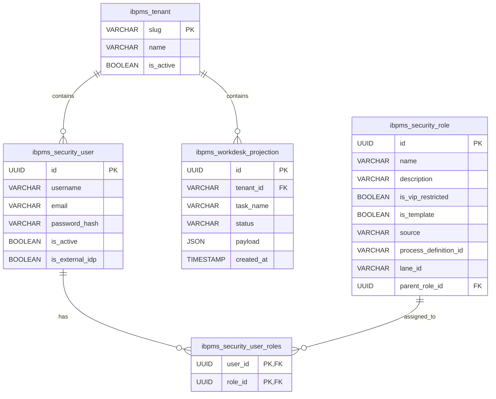

# iBPMS Canonical ER Model

## Security & RBAC Schema (Post-Consolidation V2)

This diagram reflects the consolidated Role-Based Access Control (RBAC) architecture after eliminating the legacy tripartite schemes (`sys_role`, `ibpms_roles`). The core permissions model now solely relies on `ibpms_security_role` mapping to users via the `ibpms_security_user_roles` cross-reference table (with composite PK to enforce unique constraint).

We also introduced `ibpms_tenant` to strictly enforce multi-tenancy, including referential integrity on cross-cutting projections like `ibpms_workdesk_projection`. Legacy proxy tables such as `user_delegation` and `user_roles` have been permanently eliminated.

