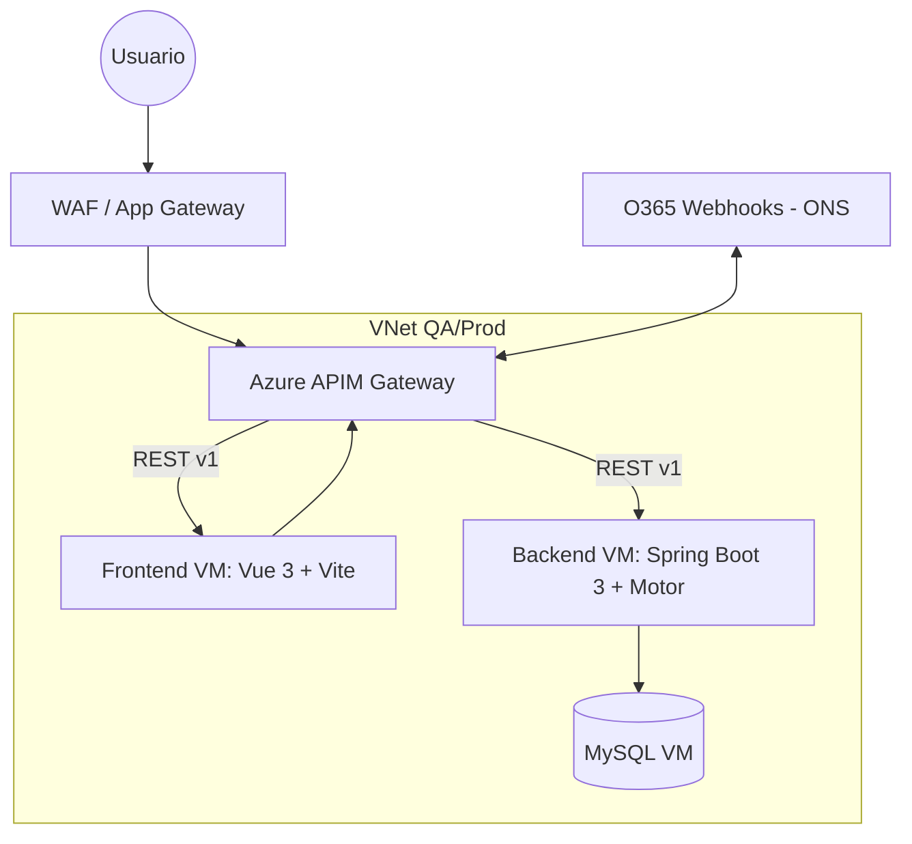
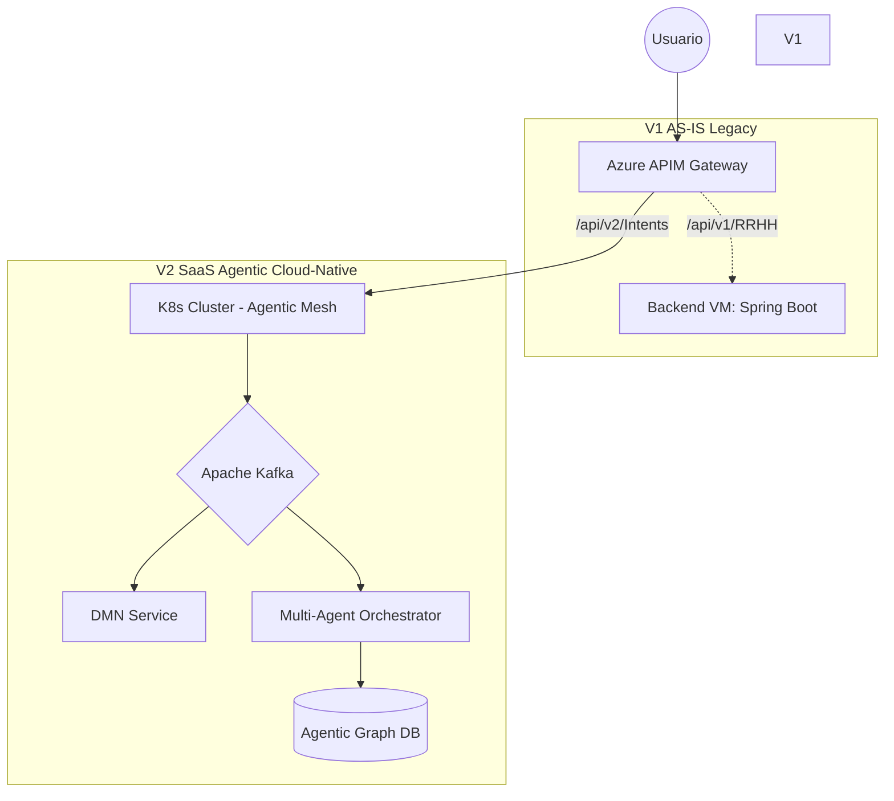
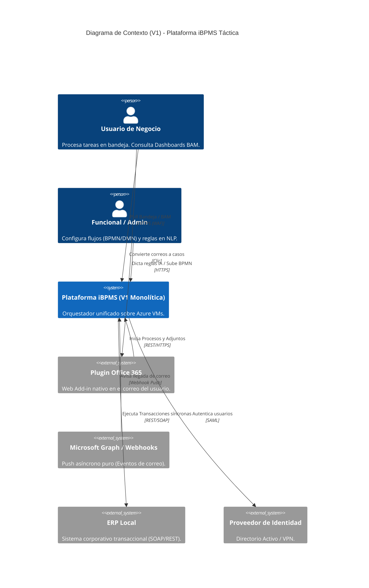
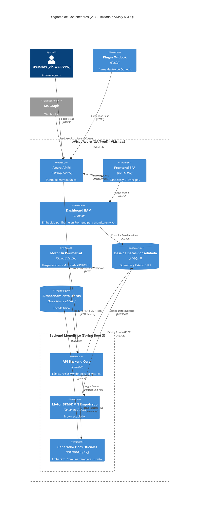
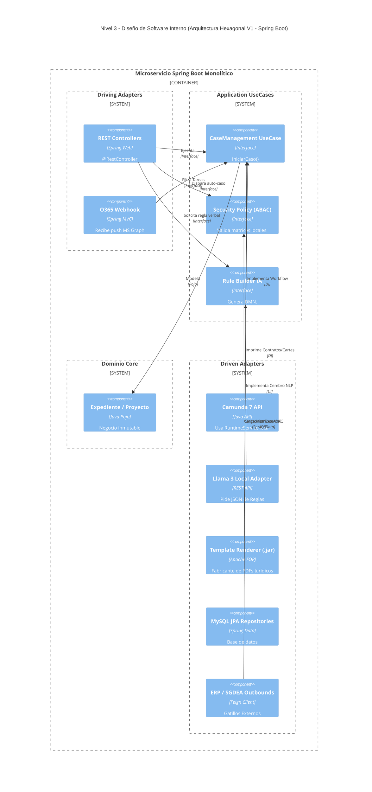

# Arquitectura Base: Plataforma de Automatización Inteligente (iBPMS + Case Management + DMN)

## Visión General
Este documento define la arquitectura de alto nivel para resolver la necesidad de una plataforma corporativa escalable, gobernable y reutilizable, diseñada para el cambio rápido y la configuración por parte del negocio (Low-Code/No-Code) apoyada por TI.
Responde a los principios de separación estricta entre proceso (orquestación), reglas (decisión) y UI (formularios), así como al manejo de flujos estructurados, no estructurados (Case Management) e integración gobernada.

### Plataforma Base vs. Desarrollo de Productos Empaquetados (Ecosistema SaaS)
La plataforma no debe verse como una herramienta cerrada, sino como un Sistema Operativo Funcional ("Core Fabric"):
*   **SDK Platform / Core:** El equipo no iniciará desarrollos verticales desde cero; consumirá el motor para la lógica de estados, DMN para decisiones y el SGDEA para guardar documentos. Esto acorta el *Time-to-Market* de nuevas aplicaciones.
*   **Módulos Verticales Comerciales (Super Apps V2):** Extendiendo la arquitectura Event-Driven y las APIs nativas, la plataforma está diseñada para hospedar productos pre-empacados monetizables por industria. El Roadmap Oficial de Plataforma ya contempla arquitectónicamente:
    *   **LegalTech - RAG + LLM Drafting:** App conectada al SGDEA (Histórico), Inputs UI (Caso), DB Externa Vectorial (Jurisprudencia) y FOP (Plantillas), para que la IA ensamble contestaciones a tutelas/demandas automatizadas de inicio a fin.
    *   **LegalTech - Silenced RPA Scraping:** Bots trabajadores sin UI que inyectan eventos vía `Inbound Listener / Kafka` recolectando data oficial de las cortes para mutar automáticamente los expedientes en el Backend Core.
    *   **LegalTech - Módulo de Docketing:** "Super App" sobre el módulo base de Kanban (Case Management). Fusiona un calendario maestro de plazos perentorios y alertas de O365, con un árbol riguroso de trazabilidad vinculando notificaciones del juzgado hacia la Tarea de un abogado en tiempo real.
    *   **Hotelero - OCR / ICR Input Engine:** Receptor cognitivo desacoplado en el APIM que extrae texto de facturas o listados (polizas, consumos) pasándolo a un JSON Schema pre-validado para despertar Sagas y flujos masivos de conciliación hotelera.
El diseño garantiza una altísima adaptabilidad ante disrupciones del mercado mediante:
1.  **Arquitectura de Eventos Desacoplada:** (Broker / Kafka en V2). Al conectarlo todo por eventos en lugar de código "Hardcoded", si la empresa compra otra compañía y necesita cambiar su ERP, el motor de procesos ni se entera. Simplemente el Outbound Connector se actualiza para enviar el mismo evento hacia el nuevo ERP.
2.  **API Gateway + Patrón Strangler:** El APIM permite derivar un 10%, 50% o el 100% del tráfico paulatinamente desde modelos de negocio viejos hacia sistemas modernizados.
3.  **Composición Funcional ("Lego"):** Si el mercado lanza nuevas normativas urgentes (ej. leyes de privacidad), el negocio ajusta y añade "Bloques de Reglas DMN" independientemente del código compilado de la aplicación de RR.HH., inyectando políticas instantáneas a la producción sin "refactorizaciones" dolorosas.

## Estrategia de Despliegue Evolutiva (V1 a V2)
Para asegurar un primer producto funcional costo-efectivo (V1) que apalanque la viabilidad comercial, y garantizar la evolución hacia un modelo SaaS Multitenant ideal (V2), la arquitectura utilizará el Patrón Strangler (Strangler Fig Pattern).

### Etapa 1 (V1) - Arquitectura Táctica (AS-IS Azure)

**Infraestructura Detallada**
La infraestructura actual está montada en Azure (región East US) bajo un enfoque de “nube privada” entendido como entorno aislado por red y controles. En Azure se implementaron dos redes virtuales (VNets) separadas para QA y Producción, como medida de segmentación y reducción de impacto entre ambientes. 
El acceso externo está protegido en el perímetro con Application Gateway con WAF y la exposición/consumo de APIs se gobierna mediante Azure API Management (APIM – Basic, 1 unidad), que actúa como puerta de entrada lógica.

El cómputo es principalmente IaaS sobre VMs Linux:
*   **QA:** 2 VMs (Frontend y Backend).
*   **Producción:** 3 VMs (Frontend, Backend y Base de Datos).
La base de datos es MySQL (en la VM de BD en producción) con almacenamiento sobre Managed Disks.

**Seguridad y Operación:**
*   **VPN Gateway (P2S)** para administración orientada a un grupo controlado de equipos.
*   **Gestión de Secretos:** Implementación obligatoria de **Azure Key Vault** y *Managed Identities* en las VMs para evitar el Hardcoding de candados (ClientSecrets, Connection Strings).
*   **Zero Trust (Validación intra-VNet):** El Microservicio Spring Boot no asume confianza táctica del APIM. Validará de manera autónoma la firma criptográfica del JWT (SAML/OIDC) y las peticiones deberán viajar forzosamente por **TLS 1.2+ Interno** cifrando la VNet para evitar *Man-in-the-Middle* local.
*   **Azure Monitor** para monitoreo y telemetría (logs/métricas/alertas según configuración).
*   **Azure Backup** para respaldos de los recursos definidos.
*   **Defender for Cloud** habilitado para postura de seguridad y recomendaciones.

Esto deja el “AS-IS” como una arquitectura por capas en VMs, con control perimetral y un gateway de APIs que habilita el camino gradualmente hacia SOA; microservicios u otra arquitectura más gobernada y eficiente.

**Cómputo / Stack V1:**
*   **Infraestructura como Código (IaC):** Provisión inmutable de VMs mediante Terraform/Bicep prohibiendo la mutación manual ("Snowflake servers"). Uso de **VMSS (Virtual Machine Scale Sets)** en producción para Elasticidad Horizontal basada en carga.
*   **Frontend:** Aplicación web moderna en Vue 3 (Composition API / Script Setup) construida con Vite, con diseño optimista de UI (Manejo de consistencia eventual).
    > [!TIP]
    > **Validación Positiva (Vue 3 + Vite):** Cierra la brecha de seguridad normativa al estar en LTS activo. La Composition API facilita crear Micro-frontends (formularios "Lego") desacoplados.
*   **Backend / APIs:** Microservicios y lógica en Java 17 con Spring Boot 3.
    > [!TIP]
    > **Validación Positiva (Spring Boot 3):** Decisión óptima. Soporta Virtual Threads (Loom) y compilación nativa (GraalVM). Arrancan en milisegundos, ideal para la V2 Kubernetes.
    >
    > **[SECURITY FIX] Validación JSON Schema:** Para mitigar el riesgo de *NoSQL/JSON Injection* en la BD MySQL 8, el Backend Java interceptará todo payload dinámico del Frontend pasándolo por un validador fuerte (librería `networknt/json-schema-validator`) contra un catálogo de Schemas de negocio aprobados. Las PII (como tarjetas o diagnósticos) estarán bajo **TDE (Transparent Data Encryption)**.
    >
    > **[PERFORMANCE FIX] Patrón Metadata Indexing:** Está prohibido buscar nativamente en listas masivas escaneando el interior de los campos JSON. Todo atributo "buscable" será extraído en tiempo de Ingestión hacia tablas relacionales planas para búsquedas B-Tree sub-segundo.
    >
    > **[PERFORMANCE FIX] Auditoría Particionada:** Para prevenir la degradación de Base de Datos por obesidad mórbida del historial de logs transaccionales, el componente de MySQL exigirá **MySQL Table Partitioning por Rango (Fechas)** a nivel DDL, agilizando el Data Archiving.
    >
    > **[ARCHITECTURE FIX] Transaccionalidad Atómica (ACID):** *Validado por Arquitecto de Software.* Es MANDATORIO que Spring Boot y el motor embebido Camunda 7 compartan exactamente el mismo `DataSource` y `PlatformTransactionManager`. Toda operación de Application Service estará anotada con `@Transactional`. Si un estado de negocio explota, Camunda también deshará su avance en la misma transacción aislando inconsistencias.
*   **Motor:** Desplegado On-VM, conectado a la base MySQL con estrategia de retención de datos **Data Archiving TTL** (ej: vaciado a Cold Storage de procesos concluidos de +90 días).

#### Reglas de Gobierno de Integración (APIM Obligatorio)
Para garantizar el orden y el futuro desacople (Patrón Strangler), se establecen las siguientes reglas arquitectónicas:
1. **Compuerta Única:** Toda comunicación Front -> Back, o Integración Externa -> Back, debe pasar por el Azure APIM. No hay conexiones directas a las VMs.
2. **Contratos (OpenAPI):** Es obligatorio publicar la especificación OpenAPI de cada API en el APIM antes de su consumo.
3. **Versionado Fuerte:** Toda API debe estar versionada. Todo cambio que rompa compatibilidad exige desplegar una v2.
4. **Feature Flags (Tenant Settings):** Dado el objetivo Multitenant SaaS, se prohíben condicionales rígidos (`if tenant == "X"`). En la V1 las banderas funcionales ("Features") se leerán de una tabla nativa en Base de Datos de configuración. Para la V2 se migrará esta centralización operacional a *Azure App Configuration* o *LaunchDarkly*.

### Etapa 2 (V2) - Arquitectura SaaS "To-Be" (Cloud-Native)
*   **Evolución por Patrón Strangler:** El Azure API Management (APIM) actual será la pieza arquitectónica clave. Actuará como "Enrutador Facade". A medida que se construyan microservicios Cloud-Native en V2, el APIM redirigirá granularmente las llamadas de las APIs monolíticas antiguas (VMs) hacia los nuevos clústeres de Kubernetes (`v2`), sin impacto en el Frontend.

*   **Service Mesh y mTLS:** Incorporación de una malla de servicios (Ej: Istio/Linkerd) garantizando que todo el tráfico lateral interno entre los contenedores interconectados sea encriptado mediante certificados mutuos automáticos (mTLS).
*   **Escalabilidad y Stack:** Transición hacia clústeres de Kubernetes (AKS), motores de orquestación Multi-Agente (ej. LangChain / Semantic Kernel en lugar de BPMN tradicional), Apache Kafka como Event Broker Central, Bases de Datos de Grafos (Neo4j) para RAG context awareness, y despliegue asilado por Tenant en un modelo PaaS real.

## Componentes Arquitectónicos

### 1. Capa de Experiencia y Portales ("Workbenches")
*   **Micro-Frontends de Formularios:** Motores de renderizado (React/Angular/Vue) que interpretan JSON Schemas estandarizados. Agnósticos al proceso.
*   **Bandejas Unificadas (Tasklists):** Comunicación vía API (GraphQL/REST) para hacer "Pull" de las tareas basadas en el rol (Soporta ABAC/RBAC).
*   **Workspace "Agile" (Case Management):** Vistas tipo expediente/Kanban donde el usuario interactúa con hitos y tareas ad-hoc de un caso.

### 2. Capa de Orquestación (Core iBPMS & Agentic Workflows)
*   **Motor Táctico V1 (Event-Driven):** Motor determinista embebido que opera bajo BPMN estricto para flujos transaccionales conocidos (PoC).
*   **Multi-Agent Orchestrator V2:** Sistema avanzado que reemplaza el BPMN rígido. Funciona evaluando "Intents" (intenciones de lenguaje o sistema) y enruta tareas ad-hoc consultando una Base de Datos de Grafos y razonamiento LLM en tiempo real.
*   **Gestor de Casos Dinámico:** Combina flujos estructurados con tareas generadas dinámicamente por la IA ante excepciones.

### 3. Capa de Decisiones y Reglas (DMN)
*   **Decisiones como Servicio (DaaS):** Motor DMN centralizado, consultado síncronamente vía API.
*   **Traductor IA a DMN (NLP to Json):** En V1 se usará un **Modelo Perimetral (Llama 3/vLLM)** en VM propia por privacidad. En V2 se transicionará a **Azure OpenAI Enterprise** para máximo escalamiento.
*   **Guardrails:** Catálogo de decisiones con testing antes de promover a producción.

### 4. Capa de Integración e Interoperabilidad (Low-Code/Conectores)

**Flujo Clave: Disparadores por Correo (O365 Inbound)**
La integración opera bajo un modelo *Event-Driven* y Push (Webhook) sin polling pasivo:
1. **Webhook:** O365 avisa al APIM sobre correos nuevos.
2. **Petición Segura:** APIM pasa el aviso al Inbound Connector.
3. **Extracción:** MS Graph API extrae el cuerpo y adjuntos.
4. **Almacenamiento (SGDEA):** Los binarios se van vivos al SGDEA. Jamás ensucian la Base de Datos transaccional del motor.
5. **Generación del Evento:** Se publica evento en Kafka (con URIs de los archivos).
6. **Ejecución del Motor:** Motor responde al *Message Start Event*.

*   **Inbound Listeners:** MS Graph. Redirección de mensajes inprocesables a **Dead Letter Queues (DLQ)**.
*   **Outbound Connectors:** Sagas y eventos compensatorios al ERP, blindados con **Circuit Breaker** (Ej. Resilience4J) y Bulkheads frente a latencias del núcleo bancario externo.
*   **Event Broker Central:** Kafka/RabbitMQ como corazón asíncrono. Sincronía segura lograda mediante un **Patrón Transactional Outbox** en base de datos.

### 5. Capa de Contenido / SGDEA (Generación y Resguardo)
*   **Generador Documental Jurídico:** Motor de *Template Rendering*. En la V1 operará como **Librería Embebida (.jar como Apache FOP/PDFBox)** dentro del Backend. En V2 evolucionará a un **Microservicio Dedicado Elástico** para soportar concurrencia masiva.
*   **SGDEA Nativo (Built-in):** Control absoluto de UX y no pago de licencias costosas en versión SaaS, nativo a la auditoría.
*   **Interoperabilidad Opcional (BYO-ECM):** Patrón de CMIS vía adaptadores si un banco u organismo gubernamental exige SharePoint local.

### 6. Capa de Auditoría, Gobernanza y Consultoría AI
*   **Audit Ledger (Event Sourcing):** Bitácora *append-only* de cambios históricos y decisiones tomadas.
*   **Auditor Digital AI (V2):** Pod satelital ML que lee pasivamente el Audit Ledger e inspecciona logs buscando anomalías, riesgos o brechas de normativa ISO 9001. Genera hallazgos accionables.
*   **Consultor Funcional AI (V2):** Ingiere el histórico de millones de instancias y propone rediseños de la arquitectura de la regla para acortar el Time-to-Value, basado en métricas empíricas.
*   **Business Activity Monitoring (BAM):** Se integrará nativamente **Grafana (o Kibana) embebido (Iframe)** en los Micro-frontends para mediciones "Out of the box".

---

## Solution-Architecture View (Modelo C4)

### Nivel 1: Diagrama de Contexto (System Context)

### Nivel 2: Diagrama de Contenedores (Container Diagram)

### Nivel 3: Diagrama de Componentes Lógicos (Software Design View)
Se apalanca la **Arquitectura Hexagonal (Puertos y Adaptadores)** y DDD dentro de Spring Boot:

#### Contratos de Integración (API-First / OpenAPI)
Las APIs se basarán en JSON para enrutamiento por un "Facade" que oculte la fealdad del motor BPM asíncrono. Para mitigar fallas de red asíncronas, todos los REST Controllers exigirán **Idempotency-Keys**.
1. `/api/v1/expedientes`: Trata el inicio formal del flujo.
2. `/api/v1/tareas`: La API de bandejas (ABAC/RBAC).

## Verification Plan
1. Validación arquitectónica integral (V1 táctica Azure -> V2 nube nativa Multitenant).
2. Avanzar hacia la Pruebra de Concepto (PoC) en código validando el desacople de "Expediente" usando Hexagonal.
