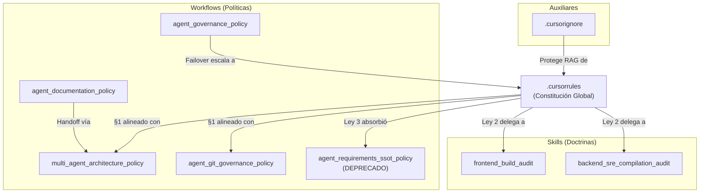

# Análisis del Ecosistema de Gobernanza Multi-Agente (iBPMS)

> **Última Auditoría:** 2026-04-04 | **Versión del Ecosistema:** V2.1 (Post-Saneamiento de Ramas y SSOT)

Este documento centraliza el inventario, análisis y estado de salud de todos los artefactos (rules, workflows, skills y auxiliares) que rigen el comportamiento de la Inteligencia Artificial dentro del proyecto `ibpms-platform`.

---

## 1. Inventario y Clasificación de Artefactos (17 artefactos auditados)

### 🏛️ Constitución Global (Rule)

| # | Archivo | Tipo | Objetivo Principal |
|---|---------|------|-------------------|
| 1 | `.cursorrules` | **Rule (Constitución)** | Ley suprema del proyecto. Contiene 4 Leyes Globales + 4 Reglas Operativas que rigen a TODOS los agentes sin excepción. |

**Leyes Globales contenidas:**

| Ley | Nombre | Cobertura |
|-----|--------|-----------|
| Ley 0 | RAG-First Deep Context | Prohíbe actuar a ciegas. Obliga escaneo RAG cruzado antes de cualquier acción. |
| Ley 1 | Etiquetado de Identidad Visual (Avatares) | Obliga collar de identificación por rol en cada mensaje. |
| Ley 2 | Zero-Trust Compilation & SRE Immunity | Backend: Docker obligatorio. Frontend: `npm run build` obligatorio. |
| Ley 3 | Directriz SSOT (Bóveda de Requerimientos) | Jerarquía de 4 niveles de lectura documental + reglas de resolución de discrepancias. |

**Reglas Operativas contenidas:**

| Regla | Nombre | Cobertura |
|-------|--------|-----------|
| §1 | Gatekeeper Zero-Trust Git (Ramas Especializadas) | Prohíbe commits a `main`. Autoriza `git commit` solo en ramas `sprint-*/...` o `agent/...`. |
| §2 | Auditoría por Deltas | Obliga a usar `git diff main...rama` para revisiones. |
| §3 | Inteligencia Generadora Controlada | Permite helpers/utils pero prohíbe tocar Stores globales, interceptores Axios y librerías core. |
| §4 | Integración Visual Conservadora | Prohíbe fusiones automáticas de UI estática contra componentes funcionales `.vue`. |

**Aplica a:** Todos los agentes (Arquitecto, Backend, Frontend, QA, PO).

---

### 📜 Políticas Descentralizadas (Workflows)

**Ubicación:** `scaffolding/workflows/`

| # | Archivo | Tipo | Objetivo | Agentes Impactados |
|---|---------|------|----------|-------------------|
| 2 | `agent_git_governance_policy.md` | **Workflow** | Topología de ramas (sprints, hotfixes, po, humanas), flujo paso a paso de creación/merge/eliminación de ramas, y resolución de conflictos Git. | Todos |
| 3 | `agent_governance_policy.md` | **Workflow** | Centraliza la autoridad técnica en el Arquitecto Líder. Regula escalamiento, aprobaciones y protocolo de Failover al Humano. | Todos los subagentes |
| 4 | `agent_documentation_policy.md` | **Workflow** | Monorepositorio estricto: jerarquía oficial de carpetas (`docs/`, `frontend/`, `backend/`, `rpa/`, `infra/`), protocolo Agentic Handoff vía `.agentic-sync/`, y lineamientos de documentación en código. | Todos |
| 5 | `multi_agent_architecture_policy.md` | **Workflow** | Arquitectura de chats separados con memorias aisladas. Define roles (Arquitecto, Backend, Frontend, QA) y su mecanismo de interacción vía archivos `.agentic-sync/`. | Todos |
| 6 | `agent_requirements_ssot_policy.md` | **Workflow (DEPRECADO)** | Originalmente forzaba la jerarquía SSOT documental. Su contenido fue promovido a la Ley Global 3 del `.cursorrules`. Ahora solo contiene un aviso de redirección. | Ninguno (solo referencia) |

---

### 🛠️ Doctrinas Operativas Especializadas (Skills)

**Ubicación:** `.agents/skills/`

| # | Archivo | Tipo | Objetivo | Agente Impactado |
|---|---------|------|----------|-----------------|
| 7 | `backend_sre_compilation_audit/SKILL.md` | **Skill** | Obliga al agente Backend a compilar vía `docker compose up -d ibpms-core`, auditar los logs buscando `Tomcat started on port 8080`, y generar migraciones DDL para cada `@Entity` modificada. Al finalizar: `git commit` en su rama. | Backend |
| 8 | `frontend_build_audit/SKILL.md` | **Skill** | Obliga al agente Frontend a ejecutar `npm run build` + `npm run lint`, verificar correspondencia API, y al finalizar: `git commit` en su rama. | Frontend |

---

### 📋 Workflows Operativos (Automatizaciones de Agente)

**Ubicación:** `.agent/workflows/`

| # | Archivo | Tipo | Objetivo |
|---|---------|------|----------|
| 9 | `analisisEcoGobernanza.md` | **Workflow** | Este workflow: auditoria integral de gobernanza. |
| 10 | `analisisEntendimientoUs.md` | **Workflow** | Análisis de comprensión de User Stories. |
| 11 | `auditoriaIntegralUs.md` | **Workflow** | Auditoría integral de User Stories vs código. |
| 12 | `cierreDeudaTecCriteriosAceptacion.md` | **Workflow** | Cierre de deuda técnica en Criterios de Aceptación. |
| 13 | `generar-auditoria-iteracion.md` | **Workflow** | Generación de reporte de auditoría por iteración. |
| 14 | `pruebasUatE2e.md` | **Workflow** | Ejecución de pruebas UAT End-to-End. |
| 15 | `pruebasUatVisibles.md` | **Workflow** | Pruebas UAT con evidencia visual. |
| 16 | `pruebasUatVisiblesAutomatizadas.md` | **Workflow** | Pruebas UAT automatizadas con Playwright. |
| 17 | `refinamientoFuncionalUs.md` | **Workflow** | Refinamiento funcional de User Stories. |

---

### 🛡️ Filtros Auxiliares (Archivos de Entorno)

| # | Archivo | Tipo | Objetivo |
|---|---------|------|----------|
| 18 | `.cursorignore` | **Auxiliar** | Blindaje cognitivo del RAG. Excluye `node_modules/`, `target/`, `dist/`, `docs/requirements/future_roadmap/`, `doc.json`, `temp_tree.txt` y archivos `us*.txt` para liberar ~4MB de tokens y prevenir alucinaciones por scope creep. |

---

## 2. Cobertura e Impacto por Agente

| Agente | Rules | Workflows | Skills | Restricciones Clave |
|--------|-------|-----------|--------|---------------------|
| **Arquitecto Líder** | `.cursorrules` (todas las leyes) | Gobernanza, Documentación, Multi-Agent, Git | Ninguna | Único autorizado para Merge→main. Prohibido programar código funcional. |
| **Backend** | `.cursorrules` (Ley 0, 1, 2, 3, §1-§3) | Git, Multi-Agent | `backend_sre_compilation_audit` | Docker obligatorio. Commit solo en ramas `sprint-*/...`. |
| **Frontend** | `.cursorrules` (Ley 0, 1, 2, 3, §1-§4) | Git, Multi-Agent | `frontend_build_audit` | `npm run build` obligatorio. Commit solo en ramas `sprint-*/...`. |
| **QA / DevOps** | `.cursorrules` (Ley 0, 1, 3) | Gobernanza (excepción UAT), Pruebas UAT (3 workflows) | Ninguna | Puede coordinar directamente con el Humano para lotes de prueba. |
| **Product Owner** | `.cursorrules` (Ley 0, 1, 3) | Git (`po/refinement/...`), Refinamiento US | Ninguna | Trabaja en ramas `po/...` sin bloquear desarrollo. |

---

## 3. 🚨 Hallazgos: Contradicciones, Reglas Rotas y Brechas

### ✅ CONFLICTO RESUELTO: `git stash` vs `git commit` en ramas

**Estado anterior:** Existía una contradicción crítica donde `.cursorrules` y `multi_agent_architecture_policy.md` exigían `git stash`, mientras que `agent_git_governance_policy.md` exigía `git commit` en ramas.

**Resolución aplicada (2026-04-04):**
- `.cursorrules` §1 actualizado: autoriza `git commit` y `git push` exclusivamente en ramas `sprint-*/...` o `agent/...`.
- `multi_agent_architecture_policy.md` actualizado: cambiado de `git stash` a `git commit en rama propia`.
- `backend_sre_compilation_audit/SKILL.md` actualizado: cambiado empaquetado a `git commit` en rama.
- `frontend_build_audit/SKILL.md` actualizado: cambiado empaquetado a `git commit` en rama.

**Estado actual:** ✅ **RESUELTO**. El ecosistema es coherente con el modelo de Feature-Branches.

---

### 🔴 CONFLICTO ACTIVO 1: Referencia residual a `git stash` en `agent_governance_policy.md`

**Dónde ocurre:**
- `scaffolding/workflows/agent_governance_policy.md`, Línea 63 (Protocolo de Failover, punto 4):
  > *"Esta excepción NO otorga al subagente permiso para hacer `git commit`. El empaquetado sigue siendo obligatoriamente vía `git stash`."*

**Impacto:**
Contradicción directa con la nueva política de §1 del `.cursorrules` que SÍ autoriza commits en ramas aisladas. Si un agente aplicara el Failover, su directriz de empaquetado chocaría con la regla maestra, creando un loop de indecisión.

**Recomendación:**
Alinear la Línea 63 de `agent_governance_policy.md` para que diga: *"El empaquetado sigue siendo obligatoriamente vía `git commit` en la rama respectiva del agente (`sprint-*/...`). Queda prohibido el commit directo a `main`."*

---

### 🟡 CONFLICTO ACTIVO 2: Referencia residual a `stash` en triggers de Skills

**Dónde ocurre:**
- `backend_sre_compilation_audit/SKILL.md`, Línea 5 (trigger):
  > *"Cuando el agente Backend termine de escribir código Java y se prepare para hacer el stash o reportar completitud."*
- `frontend_build_audit/SKILL.md`, Línea 5 (trigger):
  > *"Cuando el agente Frontend termine de escribir código Vue/TypeScript y se prepare para hacer el stash o reportar completitud."*

**Impacto:**
Menor (cosmético), pero puede confundir a un agente que lea literalmente el trigger y busque un comando `git stash` que ya no es la política oficial.

**Recomendación:**
Actualizar los triggers reemplazando "hacer el stash" por "consolidar su trabajo vía commit en su rama".

---

### 🟡 BRECHA 3: Ausencia de Skill dedicada para QA/DevOps

**Observación:**
Los agentes Backend y Frontend tienen Skills de auto-validación obligatoria (`backend_sre_compilation_audit`, `frontend_build_audit`). El agente QA/DevOps no tiene una Skill equivalente que estandarice su protocolo de ejecución de pruebas E2E.

**Impacto:**
El QA depende exclusivamente de los workflows operativos (3 archivos de pruebas UAT) pero carece de una doctrina obligatoria tipo "SKILL" que le impida entregar reportes sin evidencia empírica.

**Recomendación:**
Crear `.agents/skills/qa_e2e_validation_audit/SKILL.md` que obligue al agente QA a: (1) ejecutar la suite Playwright completa, (2) adjuntar screenshots/video de evidencia, y (3) no reportar "pass" sin logs verificables.

---

### 🟡 BRECHA 4: `agent_requirements_ssot_policy.md` sigue existiendo como archivo

**Observación:**
El archivo fue marcado como `[ESTADO: PROMOVIDA A LEY GLOBAL]` y su contenido fue absorbido por la Ley Global 3 del `.cursorrules`. Sin embargo, el archivo sigue existiendo físicamente en `scaffolding/workflows/`, consumiendo tokens RAG y potencialmente confundiendo a agentes que lo indexen.

**Impacto:**
Bajo (el archivo contiene solo un aviso de redirección), pero viola el principio de "Cero Duplicidad" de la propia `agent_documentation_policy.md`.

**Recomendación:**
Eliminar el archivo y agregar una línea en el `.cursorignore` para referencia: `scaffolding/workflows/agent_requirements_ssot_policy.md` (si se opta por conservarlo como histórico).

---

### 🟢 BRECHA MENOR 5: Falta de versionamiento en Workflows

**Observación:**
Solo el `.cursorrules` tiene fecha y versión explícita (`V2.0, 2026-04-03`). Los demás workflows y skills no tienen marcas de versión ni fechas de última actualización.

**Recomendación:**
Agregar un campo `> Última Actualización: YYYY-MM-DD | Versión: X.X` en el frontmatter de cada workflow y skill para facilitar la trazabilidad.

---

## 4. Mapa de Relaciones entre Artefactos

---

## 5. Resumen Ejecutivo

| Métrica | Valor |
|---------|-------|
| **Total de artefactos auditados** | 18 |
| **Conflictos resueltos** | 1 (git stash→commit) |
| **Conflictos activos (Rojo)** | 1 (Failover en `agent_governance_policy.md` L63) |
| **Conflictos activos (Amarillo)** | 2 (triggers de Skills, SSOT residual) |
| **Brechas identificadas** | 2 (Skill QA ausente, falta de versionamiento) |
| **Salud general del ecosistema** | **🟡 BUENA con acciones correctivas menores pendientes** |

---

## 6. Acciones Correctivas Recomendadas (Prioridad)

| # | Acción | Prioridad | Archivo Afectado |
|---|--------|-----------|------------------|
| 1 | Corregir referencia a `git stash` en Protocolo de Failover | 🔴 Alta | `agent_governance_policy.md` L63 |
| 2 | Actualizar triggers de Skills eliminando "stash" | 🟡 Media | `backend_sre_compilation_audit/SKILL.md` L5, `frontend_build_audit/SKILL.md` L5 |
| 3 | Evaluar eliminación de `agent_requirements_ssot_policy.md` | 🟡 Media | `agent_requirements_ssot_policy.md` |
| 4 | Crear Skill de validación para QA/E2E | 🟢 Baja | `.agents/skills/qa_e2e_validation_audit/SKILL.md` (nuevo) |
| 5 | Agregar versionamiento a todos los workflows/skills | 🟢 Baja | Todos los archivos en `scaffolding/workflows/` y `.agents/skills/` |
