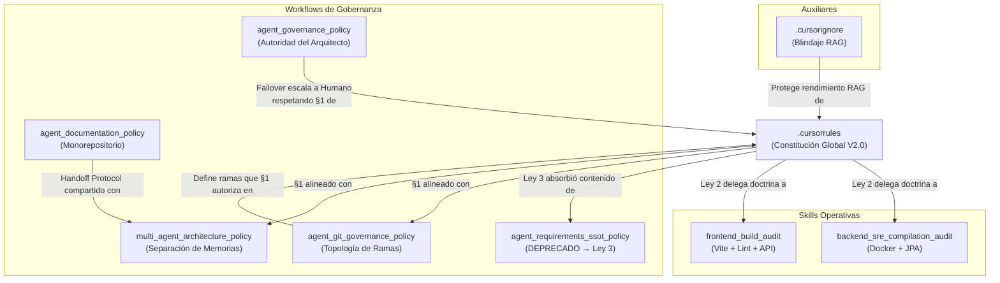

# Análisis del Ecosistema de Gobernanza Multi-Agente (iBPMS)

> **Última Auditoría:** 2026-04-04T02:04 (COT) | **Versión del Ecosistema:** V2.2 (Post-Saneamiento Completo)

Este documento centraliza el inventario, análisis y estado de salud de todos los artefactos (rules, workflows, skills y auxiliares) que rigen el comportamiento de la Inteligencia Artificial dentro del proyecto `ibpms-platform`.

---

## 1. Inventario y Clasificación de Artefactos (18 artefactos auditados)

### 🏛️ Constitución Global (Rule)

| # | Archivo | Tipo | Objetivo Principal |
|---|---------|------|-------------------|
| 1 | `.cursorrules` | **Rule (Constitución)** | Ley suprema del proyecto. Contiene 4 Leyes Globales + 4 Reglas Operativas que rigen a TODOS los agentes sin excepción. V2.0, actualizada 2026-04-03. |

**Leyes Globales contenidas:**

| Ley | Nombre | Cobertura |
|-----|--------|-----------|
| Ley 0 | RAG-First Deep Context | Prohíbe actuar a ciegas. Obliga escaneo RAG cruzado antes de cualquier acción. Prohíbe comandos destructivos (`git restore`, `rm`, sobreescritura masiva). |
| Ley 1 | Etiquetado de Identidad Visual (Avatares) | Obliga collar de identificación por rol en cada mensaje ([⚙️ BACKEND], [🎨 FRONTEND], [🧠 ARQUITECTO], [🕵️ QA]). |
| Ley 2 | Zero-Trust Compilation & SRE Immunity | Backend: Docker obligatorio (`docker-compose up`). Frontend: `npm run build` obligatorio. Delega doctrina detallada a Skills. |
| Ley 3 | Directriz SSOT (Bóveda de Requerimientos) | Jerarquía de 4 niveles de lectura documental (PRD→Gherkin→MoSCoW→NFR) + reglas de resolución de discrepancias. Absorbió el contenido de `agent_requirements_ssot_policy.md`. |

**Reglas Operativas contenidas:**

| Regla | Nombre | Cobertura |
|-------|--------|-----------|
| §1 | Gatekeeper Zero-Trust Git (Ramas Especializadas) | Prohíbe commits a `main`. Autoriza `git commit` y `git push` solo en ramas `sprint-*/...` o `agent/...`. Solo el Arquitecto puede hacer Merge→main. |
| §2 | Auditoría por Deltas | Obliga a usar `git diff main...rama-del-agente` para revisiones. 3 pilares: ADRs, Stack V1, Integración real. |
| §3 | Inteligencia Generadora Controlada | Permite helpers/utils pero prohíbe tocar Stores globales Pinia, interceptores Axios y librerías core (bpmn-js). |
| §4 | Integración Visual Conservadora | Prohíbe fusiones automáticas de UI estática contra componentes funcionales `.vue`. Inyección pieza a pieza. |

**Aplica a:** Todos los agentes (Arquitecto, Backend, Frontend, QA, PO).
**No contempla:** Flujo operativo paso a paso de Git (delegado a `agent_git_governance_policy.md`), ni detalles de compilación (delegados a Skills).

---

### 📜 Políticas Descentralizadas (Workflows de Gobernanza)

**Ubicación:** `scaffolding/workflows/`

| # | Archivo | Tipo | Objetivo | Agentes | Qué no contempla |
|---|---------|------|----------|---------|-------------------|
| 2 | `agent_git_governance_policy.md` | **Workflow** | Topología completa de ramas: sprints (`sprint-{n}/{rol}/us-{n}`), hotfixes (`architect/hotfix/...`), PO (`po/refinement/...`), humanas (`human/...`). Flujo paso a paso de creación, commit, push, merge y eliminación de ramas. Resolución de conflictos y sincronización con GitHub. | Todos | No define el mecanismo de compilación pre-commit (delegado a Skills). |
| 3 | `agent_governance_policy.md` | **Workflow** | Centraliza la autoridad técnica en el Arquitecto Líder como único aprobador. Regula escalamiento, aprobaciones, y protocolo de Failover al Humano tras 2 intentos fallidos. Excepción UAT para QA. | Todos los subagentes | No define roles ni separación de memorias (delegado a `multi_agent_architecture_policy.md`). |
| 4 | `agent_documentation_policy.md` | **Workflow** | Monorepositorio estricto: jerarquía oficial de carpetas (`docs/`, `frontend/`, `backend/`, `rpa/`, `infra/`, `scaffolding/`). Regla "Leer antes de Escribir". Protocolo Agentic Handoff (`.agentic-sync/`). Sincronización obligatoria C4/Implementation Plan. Lineamientos de documentación en código. | Todos | No define formato de Handoff Reports (solo estructura mínima). |
| 5 | `multi_agent_architecture_policy.md` | **Workflow** | Arquitectura de chats separados con memorias aisladas. Define 4 roles (Arquitecto, Backend, Frontend, QA) con límites estrictos. Mecanismo de delegación vía archivos `.agentic-sync/`. Flujo: Orquestación→Invocación→Ejecución→Auditoría. | Todos | No define al agente Product Owner (presente en la política Git pero no aquí). |
| 6 | `agent_requirements_ssot_policy.md` | **Workflow (DEPRECADO)** | Stub de redirección. Contenido original promovido a Ley Global 3 del `.cursorrules`. | Ninguno activo | Solo contiene aviso de redirección. |

---

### 🛠️ Doctrinas Operativas Especializadas (Skills)

**Ubicación:** `.agents/skills/`

| # | Archivo | Tipo | Objetivo | Agente | Qué no contempla |
|---|---------|------|----------|--------|-------------------|
| 7 | `backend_sre_compilation_audit/SKILL.md` | **Skill** | Obliga al agente Backend a: (1) compilar vía `docker compose up -d ibpms-core`, (2) auditar logs buscando `Tomcat started on port 8080`, (3) generar migraciones DDL para cada `@Entity` modificada, y (4) `git commit` en su rama respectiva. | Backend | No cubre pruebas unitarias JUnit (asumidas como responsabilidad del agente). |
| 8 | `frontend_build_audit/SKILL.md` | **Skill** | Obliga al agente Frontend a: (1) ejecutar `npm run build`, (2) ejecutar `npm run lint`, (3) verificar correspondencia API con contratos Backend, y (4) `git commit` en su rama respectiva. | Frontend | No cubre pruebas E2E de UI (delegadas al agente QA). |

---

### 📋 Workflows Operativos (Automatizaciones de Agente)

**Ubicación:** `.agent/workflows/`

| # | Archivo | Tipo | Propósito |
|---|---------|------|-----------|
| 9 | `analisisEcoGobernanza.md` | **Workflow** | Auditoría integral de gobernanza (este mismo análisis). |
| 10 | `analisisEntendimientoUs.md` | **Workflow** | Análisis de comprensión de User Stories. |
| 11 | `auditoriaIntegralUs.md` | **Workflow** | Auditoría integral de User Stories vs código fuente. |
| 12 | `cierreDeudaTecCriteriosAceptacion.md` | **Workflow** | Cierre de deuda técnica en Criterios de Aceptación. |
| 13 | `generar-auditoria-iteracion.md` | **Workflow** | Generación de reporte de auditoría por iteración/sprint. |
| 14 | `pruebasUatE2e.md` | **Workflow** | Ejecución de pruebas UAT End-to-End con Docker. |
| 15 | `pruebasUatVisibles.md` | **Workflow** | Pruebas UAT con evidencia visual y capturas. |
| 16 | `pruebasUatVisiblesAutomatizadas.md` | **Workflow** | Pruebas UAT automatizadas con Playwright + Docker. |
| 17 | `refinamientoFuncionalUs.md` | **Workflow** | Refinamiento funcional de User Stories. |
| 18 | `renumeracionCriteriosAceptacionUs.md` | **Workflow** | Renumeración secuencial de Criterios de Aceptación. |

---

### 🛡️ Filtros Auxiliares (Archivos de Entorno)

| # | Archivo | Tipo | Objetivo |
|---|---------|------|----------|
| 19 | `.cursorignore` | **Auxiliar** | Blindaje cognitivo del RAG. Excluye: `node_modules/`, `target/`, `dist/`, `build/`, `.git/`, `.idea/`, `logs/`, `*.log`, `.DS_Store`, `docs/requirements/future_roadmap/`, `doc.json`, `temp_tree.txt`, `us*.txt`. Libera ~4MB de tokens para el Semantic Search. |

---

## 2. Cobertura e Impacto por Agente

| Agente | Rules | Workflows Gobernanza | Skills | Workflows Operativos | Restricciones Clave |
|--------|-------|---------------------|--------|---------------------|---------------------|
| **Arquitecto Líder** | Todas las leyes y reglas | Gobernanza, Documentación, Multi-Agent, Git | Ninguna | Auditoría de iteración | Único autorizado para Merge→main. Prohibido programar código funcional (Vue/Java). |
| **Backend** | Leyes 0-3, §1-§3 | Git, Multi-Agent | `backend_sre_compilation_audit` | — | Docker obligatorio. Commit solo en ramas `sprint-*/...`. Migraciones DDL obligatorias. |
| **Frontend** | Leyes 0-3, §1-§4 | Git, Multi-Agent | `frontend_build_audit` | — | `npm run build` + lint obligatorio. Commit solo en ramas `sprint-*/...`. Inyección visual pieza a pieza. |
| **QA / DevOps** | Leyes 0, 1, 3 | Gobernanza (excepción UAT) | Ninguna | UAT E2E, UAT Visibles, UAT Automatizadas | Puede coordinar directamente con Humano para lotes de validación. No puede refactorizar código fuente. |
| **Product Owner** | Leyes 0, 1, 3 | Git (`po/refinement/...`) | Ninguna | Refinamiento US, Renumeración CA | Trabaja en ramas `po/...` sin bloquear desarrollo. |

---

## 3. Análisis Transversal: Contradicciones, Reglas Rotas y Brechas

### ✅ CONFLICTO RESUELTO: Mecanismo de Empaquetado — `git stash` vs `git commit` (Histórico)

**Estado:** RESUELTO (2026-04-04)

**Descripción histórica:** Existía una contradicción crítica donde la constitución (`.cursorrules`) y varias políticas exigían `git stash save`, mientras que `agent_git_governance_policy.md` ya exigía `git commit` en ramas aisladas.

**Correcciones aplicadas:**
1. `.cursorrules` §1 → Autoriza `git commit`/`push` en ramas `sprint-*/...` o `agent/...`. Prohíbe solo en `main`.
2. `multi_agent_architecture_policy.md` → Cambiado de `git stash` a `git commit en rama propia` para Backend, Frontend y flujo general.
3. `backend_sre_compilation_audit/SKILL.md` → Handoff final cambiado a `git commit` en rama.
4. `frontend_build_audit/SKILL.md` → Handoff final cambiado a `git commit` en rama.
5. `agent_governance_policy.md` L63 → Failover cambiado de `git stash` a `git commit en rama del agente`.
6. Triggers de ambas Skills → Cambiados de "hacer el stash" a "consolidar su trabajo vía commit en su rama".

**Verificación:** Búsqueda transversal `grep -ri "git stash"` confirma **cero referencias operativas** a `git stash` en artefactos de gobernanza. Las únicas menciones son históricas en este mismo documento de análisis.

---

### ✅ SIN CONTRADICCIONES ACTIVAS DETECTADAS

Tras el saneamiento completo, se verificó la alineación cruzada entre los 19 artefactos:

| Verificación | Resultado |
|-------------|-----------|
| §1 `.cursorrules` vs `agent_git_governance_policy.md` | ✅ Alineados: ambos exigen ramas aisladas, prohíben commits a main |
| §1 `.cursorrules` vs `multi_agent_architecture_policy.md` | ✅ Alineados: ambos usan `git commit` en ramas como mecanismo de empaquetado |
| §1 `.cursorrules` vs `agent_governance_policy.md` (Failover) | ✅ Alineados: Failover exige commit en rama, no en main |
| Ley 2 vs Skills (Backend/Frontend) | ✅ Alineados: constitución delega doctrina a Skills, Skills la implementan fielmente |
| Ley 3 vs `agent_requirements_ssot_policy.md` | ✅ Alineados: SSOT original deprecado con redirección a Ley 3 |
| Skills (triggers) vs política de ramas | ✅ Alineados: triggers dicen "consolidar vía commit en su rama" |

---

## 4. Brechas y Oportunidades de Mejora

### 🟡 BRECHA 1: Ausencia de Skill dedicada para QA/DevOps

**Observación:** Backend y Frontend tienen Skills de auto-validación obligatoria. QA/DevOps no tiene una Skill equivalente.

**Impacto:** El QA puede entregar reportes sin evidencia empírica verificable, violando el espíritu de Zero-Trust.

**Recomendación:** Crear `.agents/skills/qa_e2e_validation_audit/SKILL.md` que obligue a: (1) ejecutar suite Playwright completa, (2) adjuntar screenshots/video de evidencia, (3) no reportar "pass" sin logs verificables.

---

### 🟡 BRECHA 2: `agent_requirements_ssot_policy.md` sigue como archivo físico

**Observación:** Marcado como deprecado pero sigue consumiendo tokens RAG.

**Recomendación:** Eliminar el archivo o agregarlo al `.cursorignore`. Su contenido vive en la Ley Global 3.

---

### 🟡 BRECHA 3: Rol Product Owner definido en Git pero no en Multi-Agent

**Observación:** `agent_git_governance_policy.md` define ramas para el PO (`po/refinement/...`) y le asigna un rol claro. Sin embargo, `multi_agent_architecture_policy.md` solo define 4 roles (Arquitecto, Backend, Frontend, QA) y no menciona al PO.

**Impacto:** Bajo. El PO opera principalmente sobre documentación, no sobre código. Pero un agente que lea *solo* la política de multi-agente desconocerá la existencia del rol PO.

**Recomendación:** Agregar una sección breve para el rol PO en `multi_agent_architecture_policy.md`.

---

### 🟢 BRECHA MENOR 4: Falta de versionamiento en Workflows y Skills

**Observación:** Solo el `.cursorrules` tiene fecha y versión explícita. Los demás artefactos carecen de trazabilidad temporal.

**Recomendación:** Agregar `> Última Actualización: YYYY-MM-DD | Versión: X.X` en cada artefacto.

---

### 🟢 BRECHA MENOR 5: `.cursorignore` no bloquea reportes pesados de Playwright

**Observación:** Los reportes HTML y screenshots generados por Playwright (`playwright-report/`, `test-results/`) pueden saturar el RAG si no se excluyen.

**Recomendación:** Agregar `playwright-report/` y `test-results/` al `.cursorignore`.

---

## 5. Mapa de Relaciones entre Artefactos

---

## 6. Resumen Ejecutivo

| Métrica | Valor |
|---------|-------|
| **Total de artefactos auditados** | 19 |
| **Contradicciones activas (Rojo)** | **0** ✅ |
| **Conflictos resueltos (Histórico)** | 1 (git stash→commit, con 6 correcciones aplicadas) |
| **Brechas amarillas** | 3 (Skill QA ausente, SSOT residual, PO sin definir en Multi-Agent) |
| **Brechas verdes (menores)** | 2 (versionamiento, Playwright en .cursorignore) |
| **Salud general del ecosistema** | **🟢 SALUDABLE** |

---

## 7. Acciones Correctivas Pendientes (Prioridad)

| # | Acción | Prioridad | Archivo Afectado |
|---|--------|-----------|------------------|
| 1 | Crear Skill de validación para QA/E2E | 🟡 Media | `.agents/skills/qa_e2e_validation_audit/SKILL.md` (nuevo) |
| 2 | Eliminar o ignorar `agent_requirements_ssot_policy.md` | 🟡 Media | `scaffolding/workflows/agent_requirements_ssot_policy.md` |
| 3 | Agregar rol PO a `multi_agent_architecture_policy.md` | 🟡 Media | `scaffolding/workflows/multi_agent_architecture_policy.md` |
| 4 | Agregar versionamiento a todos los workflows/skills | 🟢 Baja | Todos los archivos en `scaffolding/workflows/` y `.agents/skills/` |
| 5 | Agregar `playwright-report/` y `test-results/` al `.cursorignore` | 🟢 Baja | `.cursorignore` |
