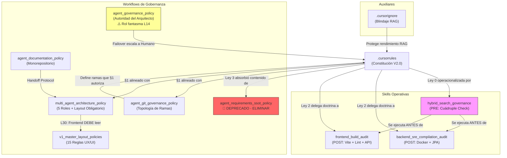

# Análisis del Ecosistema de Gobernanza Multi-Agente (iBPMS)

> **Última Auditoría:** 2026-04-05T05:10 (COT) | **Versión del Ecosistema:** V4.0 (Post-Eliminación SSOT Fantasma + Integración Layout + Tono Crítico)

Este documento centraliza el inventario, análisis y estado de salud de todos los artefactos (rules, workflows, skills y auxiliares) que rigen el comportamiento de la Inteligencia Artificial dentro del proyecto `ibpms-platform`.

---

## 1. Inventario y Clasificación de Artefactos (21 artefactos auditados)

### 🏛️ Constitución Global (Rule)

| # | Archivo | Tipo | Objetivo Principal |
|---|---------|------|-------------------|
| 1 | `.cursorrules` | **Rule (Constitución)** | Ley suprema del proyecto. Contiene 4 Leyes Globales + 4 Reglas Operativas que rigen a TODOS los agentes sin excepción. V2.0, actualizada 2026-04-03. |

**Leyes Globales contenidas:**

| Ley | Nombre | Cobertura | Crítica |
|-----|--------|-----------|---------|
| Ley 0 | RAG-First Deep Context | Prohíbe actuar a ciegas. Obliga escaneo RAG cruzado. Prohíbe comandos destructivos. **Operacionalizada por Skill `hybrid_search_governance` (v2.0).** | ✅ Sólida. La Skill cierra el gap operativo que antes la hacía declarativa. |
| Ley 1 | Etiquetado de Identidad Visual (Avatares) | Collar de identificación por rol. Cláusula Anti-Alucinación de Rol incluida. | 🟡 **Debilidad:** No define penalización ni protocolo de recuperación si un agente se auto-asigna un rol incorrecto más allá de "detener la ejecución". ¿Quién detecta que se detuvo? |
| Ley 2 | Zero-Trust Compilation & SRE Immunity | Docker Backend + `npm run build` Frontend. Delega a Skills. | ✅ Bien delegada. Pero **no cubre al QA** — un agente QA puede reportar "pass" sin prueba empírica. |
| Ley 3 | Directriz SSOT (Bóveda de Requerimientos) | Jerarquía de 4 niveles (PRD→Gherkin→MoSCoW→NFR) + resolución de discrepancias. | 🟡 **Gap crítico:** No incluye documentos de arquitectura (`c4-model.md`, `ibpms_core_erd.md`) ni el nuevo `v1_master_layout_policies.md` como lectura condicional. Un Backend que necesite el ERD no lo encontrará en la jerarquía. |

**Reglas Operativas contenidas:**

| Regla | Nombre | Cobertura | Crítica |
|-------|--------|-----------|---------|
| §1 | Gatekeeper Zero-Trust Git | Prohíbe commits a `main`. Solo ramas `sprint-*/...` o `agent/...`. | ✅ Alineada transversalmente con todas las políticas y Skills. |
| §2 | Auditoría por Deltas | `git diff main...rama-del-agente`. 3 pilares. | ✅ Correcta. |
| §3 | Inteligencia Generadora Controlada | No tocar Stores Pinia, interceptores Axios, libs core. | ✅ Correcta. |
| §4 | Integración Visual Conservadora | No fusionar UI estática contra `.vue` funcionales. Pieza a pieza. | ✅ Correcta. |

---

### 📜 Políticas Descentralizadas (Workflows de Gobernanza)

**Ubicación:** `scaffolding/workflows/`

| # | Archivo | Tipo | Objetivo | Agentes | Crítica |
|---|---------|------|----------|---------|---------|
| 2 | `agent_git_governance_policy.md` | **Workflow** | Topología de ramas: sprints, hotfixes, PO, humanas. Flujo paso a paso. Resolución de conflictos. Sincronización GitHub. | Todos | 🟡 **Incoherencia interna en §2 (L42-45):** El "Flujo Operativo" dice `git checkout -b agent/{mi-rol}/...` pero la §1 "Topología de Ramas" (L19) dice `sprint-{n}/us-{n}-{desc}`. Son dos nomenclaturas diferentes para lo mismo. Un agente nuevo se confundiría sobre cuál usar. La convención debería ser una sola. |
| 3 | `agent_governance_policy.md` | **Workflow** | Autoridad centralizada del Arquitecto. Failover al Humano tras 2 intentos. Excepción UAT para QA. Excepción Ley 0 para alertas de contradicción SSOT. | Todos | 🔴 **Rol fantasma L14:** Lista al "Analista de Configuraciones" como parte del equipo pero NINGÚN otro artefacto lo define, le asigna ramas ni responsabilidades. Es un stub muerto que confunde. |
| 4 | `agent_documentation_policy.md` | **Workflow** | Monorepositorio estricto. "Leer antes de Escribir". Protocolo `.agentic-sync/`. Sincronización C4/Implementation Plan. | Todos | ✅ Sólida. Sin contradicciones detectadas. |
| 5 | `multi_agent_architecture_policy.md` | **Workflow** | 5 roles definidos (PO, Arquitecto, Backend, Frontend, QA). Separación de memorias. Protocolo `.agentic-sync/`. **V4.0: Frontend con lectura obligatoria de Layout.** | Todos | ✅ Actualizada correctamente. El Frontend ahora tiene `v1_master_layout_policies.md` como lectura obligatoria (L30). |
| 6 | `agent_requirements_ssot_policy.md` | **Workflow (DEPRECADO)** | Stub de redirección a Ley Global 3. | Ninguno | 🔴 **Peso muerto: 735 bytes que siguen consumiendo tokens RAG.** Debería eliminarse o agregarse al `.cursorignore`. Su mera presencia inyecta ruido innecesario al índice semántico. Llevan 2 auditorías señalándolo. |
| 7 | `v1_master_layout_policies.md` | **Workflow (NUEVO en esta ruta)** | 15 reglas de UX/UI: Master Layout, CSS Grid, Z-Index, responsive, A11y, FABs prohibidos, Empty States centrados. | Frontend (directo), QA (validación visual) | 🟡 **Le falta frontmatter YAML** (no tiene bloque `---` con `description:`). Esto significa que no será descubierto automáticamente por frameworks de Skills que parseen el frontmatter. Debería tenerlo para ser consistente con los demás workflows. |

---

### 🛠️ Doctrinas Operativas Especializadas (Skills)

**Ubicación:** `.agents/skills/`

| # | Archivo | Tipo | Objetivo | Agente | Crítica |
|---|---------|------|----------|--------|---------|
| 8 | `backend_sre_compilation_audit/SKILL.md` | **Skill (POST)** | Docker compile + audit logs + DDL migrations + git commit. | Backend | ✅ Sólida. Alineada con Ley 2. |
| 9 | `frontend_build_audit/SKILL.md` | **Skill (POST)** | `npm run build` + lint + verificación API contracts + git commit. | Frontend | 🟡 **No referencia `v1_master_layout_policies.md`**. La lectura de Layout está en `multi_agent_architecture_policy.md` pero la Skill POST que valida el build no verifica que las 15 reglas se respetaron. Es un gap de enforcement. El build pasa pero los breakpoints pueden estar mal. |
| 10 | `hybrid_search_governance/SKILL.md` | **Skill (PRE) — v2.0** | Cuádruple Check: KIs → Semántica (top-3) → Estructural (grep anti-ruido) → SSOT (view_file paginado). Embargo para `/domain/ports/`, SSOT, `.cursorrules`. | Arquitecto, Backend, Frontend | ✅ La pieza más robusta del ecosistema. Operacionaliza Ley 0 con herramientas concretas. |

**Cadena de Ciclo de Vida de las Skills:**
```
[Ticket] → SKILL: hybrid_search_governance (PRE) → [Codificación] → SKILL: backend/frontend_audit (POST) → [git commit en rama]
```

---

### 📋 Workflows Operativos (Automatizaciones de Agente)

**Ubicación:** `.agent/workflows/`

| # | Archivo | Propósito |
|---|---------|-----------|
| 11 | `analisisEcoGobernanza.md` | Auditoría integral de gobernanza (este análisis). |
| 12 | `analisisEntendimientoUs.md` | Análisis de comprensión de User Stories. |
| 13 | `auditoriaIntegralUs.md` | Auditoría integral de US vs código fuente. |
| 14 | `cierreDeudaTecCriteriosAceptacion.md` | Cierre de deuda técnica en Criterios de Aceptación. |
| 15 | `generar-auditoria-iteracion.md` | Reporte de auditoría por iteración/sprint. |
| 16 | `pruebasUatE2e.md` | Pruebas UAT E2E con Docker. |
| 17 | `pruebasUatVisibles.md` | Pruebas UAT con evidencia visual. |
| 18 | `pruebasUatVisiblesAutomatizadas.md` | UAT automatizadas con Playwright + Docker. |
| 19 | `refinamientoFuncionalUs.md` | Refinamiento funcional de US. |
| 20 | `renumeracionCriteriosAceptacionUs.md` | Renumeración secuencial de CA. |

---

### 🛡️ Filtros Auxiliares (Archivos de Entorno)

| # | Archivo | Tipo | Objetivo | Crítica |
|---|---------|------|----------|---------|
| 21 | `.cursorignore` | **Auxiliar** | Blindaje cognitivo del RAG. Excluye: `node_modules/`, `target/`, `dist/`, `build/`, `.git/`, `.idea/`, `logs/`, `*.log`, `.DS_Store`, `docs/requirements/future_roadmap/`, `doc.json`, `temp_tree.txt`, `us*.txt`. | 🟡 **Faltan exclusiones conocidas:** `playwright-report/`, `test-results/`, `agent_requirements_ssot_policy.md` (deprecado). Cada uno inyecta ruido al índice semántico innecesariamente. |

---

## 2. Cobertura e Impacto por Agente

| Agente | Rules | Workflows | Skills PRE | Skills POST | Restricciones Clave |
|--------|-------|-----------|------------|-------------|---------------------|
| **Product Owner** | Leyes 0, 1, 3 | Git, Multi-Agent | Ninguna | Ninguna | No toca código. Guardián del SSOT. Gatekeeper MoSCoW. |
| **Arquitecto** | Todas | Gobernanza, Docs, Multi-Agent, Git | `hybrid_search_governance` | Ninguna | Único para Merge→main. Prohibido programar. |
| **Backend** | Leyes 0-3, §1-§3 | Git, Multi-Agent | `hybrid_search_governance` | `backend_sre_compilation_audit` | Docker obligatorio. DDL obligatorio. |
| **Frontend** | Leyes 0-3, §1-§4 | Git, Multi-Agent, **Layout** | `hybrid_search_governance` | `frontend_build_audit` | Build+Lint obligatorio. 15 reglas Layout obligatorias. |
| **QA** | Leyes 0, 1, 3 | Gobernanza (excepción UAT) | Ninguna | **Ninguna** 🔴 | **Sin enforcement Zero-Trust.** Puede reportar "pass" sin evidencia. |

---

## 3. Análisis Transversal Crítico: Contradicciones, Reglas Rotas y Brechas

### ✅ Conflictos Resueltos (Histórico)

| # | Conflicto | Fecha | Correcciones |
|---|-----------|-------|-------------|
| 1 | `git stash` vs `git commit` | 2026-04-04 | 6 archivos limpiados. `grep -ri "git stash"` = 0 en `scaffolding/`. |
| 2 | PO no definido en Multi-Agent | 2026-04-04 | Añadido como primer rol en `multi_agent_architecture_policy.md`. |
| 3 | Ley 0 era declarativa sin doctrina | 2026-04-04 | Skill `hybrid_search_governance` v2.0 la operacionaliza. |
| 4 | `v1_ssot_agentic_rules.md` redundante y conflictivo | 2026-04-05 | **ELIMINADO.** Competía con Ley 3 y contenía referencia fantasma a `v2_m365_ai_copilot_prd.md` (archivo inexistente). |
| 5 | `v1_master_layout_policies.md` huérfano en `docs/requirements/` | 2026-04-05 | **MOVIDO** a `scaffolding/workflows/`. Referencia integrada en `multi_agent_architecture_policy.md` (L30). |

### ✅ SIN CONTRADICCIONES ACTIVAS DETECTADAS

Verificación cruzada post-saneamiento V4.0:

| Verificación | Resultado |
|-------------|-----------|
| §1 `.cursorrules` vs `agent_git_governance_policy.md` | ✅ Alineados: ramas aisladas, prohibición de main |
| §1 `.cursorrules` vs `multi_agent_architecture_policy.md` | ✅ Alineados: `git commit` en ramas |
| §1 `.cursorrules` vs `agent_governance_policy.md` (Failover) | ✅ Alineados: Failover en rama, no en main |
| Ley 0 vs `hybrid_search_governance/SKILL.md` | ✅ Alineados: Skill implementa fielmente |
| Ley 2 vs Skills (Backend/Frontend) | ✅ Alineados: doctrina delegada e implementada |
| Ley 3 vs `agent_requirements_ssot_policy.md` | ✅ Stub deprecado con redirección |
| Skills (triggers) vs política de ramas | ✅ Alineados |
| `hybrid_search_governance` §2.2 vs §1 `.cursorrules` | ✅ Alineados: escritura en ramas, embargo en archivos protegidos |
| PO en Multi-Agent vs PO en Git Policy | ✅ Alineados: límites consistentes |
| Frontend en Multi-Agent (L30) vs `v1_master_layout_policies.md` | ✅ Alineados: referencia cruzada activa |
| `v1_ssot_agentic_rules.md` | ✅ **ELIMINADO** — 0 referencias residuales en el ecosistema |
| `git stash` en `scaffolding/` | ✅ 0 referencias operativas |

---

## 4. Brechas y Oportunidades de Mejora (Tono Crítico)

### 🔴 BRECHA CRÍTICA 1: QA opera sin cinturón de seguridad

**Observación sin rodeos:** Backend tiene Docker obligatorio. Frontend tiene `npm run build` obligatorio. QA no tiene **NADA**. Puede decir "todo pasa" sin ejecutar una sola línea de Playwright, sin adjuntar un screenshot, sin demostrar un log. Esto es una violación directa del espíritu de la Ley 2 (Zero-Trust).

**Impacto:** Un agente QA alucinado puede "certificar" código roto, creando una falsa sensación de seguridad que contamina la rama `main` tras el merge.

**Recomendación:** Crear `.agents/skills/qa_e2e_validation_audit/SKILL.md` con: (1) ejecución obligatoria de `npx playwright test`, (2) adjuntar screenshots/video como evidencia, (3) prohibición de reportar "pass" sin logs de consola verificables. **Llevan 3 auditorías detectando esto.**

---

### 🔴 BRECHA CRÍTICA 2: `agent_requirements_ssot_policy.md` sigue vivo como peso muerto

**Observación sin rodeos:** Este archivo fue marcado como "DEPRECADO" hace semanas. Su contenido útil fue promovido a Ley 3. Pero sigue físicamente en `scaffolding/workflows/`, consumiendo 735 bytes de tokens RAG en cada indexación semántica. Es basura digital que no debería existir.

**Impacto:** Contamina el índice semántico con contenido redundante. Un agente que busque "SSOT" podría encontrar este stub antes de la Ley 3 real.

**Recomendación:** Eliminar el archivo o agregarlo al `.cursorignore`. No hay excusa para mantenerlo una auditoría más.

---

### 🔴 BRECHA CRÍTICA 3: Rol fantasma "Analista de Configuraciones"

**Observación sin rodeos:** `agent_governance_policy.md` L14 lista al "Analista de Configuraciones" como parte del equipo. Pero:
- `multi_agent_architecture_policy.md`: No lo define.
- `agent_git_governance_policy.md`: No le asigna ramas.
- Ninguna Skill le aplica.
- Ningún workflow lo referencia.

Es un **rol fantasma** que confunde a cualquier agente que lea la política de gobernanza y se pregunte: "¿Y ese quién es?"

**Recomendación:** Eliminarlo de la línea 14 de `agent_governance_policy.md` o definirlo formalmente en todos los artefactos necesarios. Si es un rol futuro, no debería estar en un documento operativo vigente.

---

### 🟡 BRECHA 4: Nomenclatura de ramas inconsistente en Git Policy

**Observación:** `agent_git_governance_policy.md` define dos nomenclaturas incompatibles:
- §1 "Topología de Ramas" (L19): `sprint-{n}/us-{n}-{desc}` (por US compartida)
- §2 "Flujo Operativo" (L45): `agent/{mi-rol}/{nombre-corto-tarea}` (por rol individual)

Un agente nuevo no sabe cuál usar. La intención es clara (la §1 es la nomenclatura preferida tras el modelo de "Carrera de Relevos"), pero la §2 no fue actualizada para reflejarlo.

**Recomendación:** Unificar la §2 para que use la misma convención que la §1, o añadir una nota aclaratoria de cuándo aplica cada una.

---

### 🟡 BRECHA 5: `v1_master_layout_policies.md` sin frontmatter YAML

**Observación:** Todos los workflows de gobernanza tienen bloque `---` con `description:`. Este archivo recién migrado NO lo tiene. Eso lo hace invisible para cualquier parser automatizado que busque `description:` en el frontmatter.

**Recomendación:** Agregar frontmatter:
```yaml
---
description: Políticas obligatorias de UX/UI, geometría responsive, accesibilidad y diseño para el Agente Frontend.
---
```

---

### 🟡 BRECHA 6: Ley 3 no incluye documentos de arquitectura ni Layout

**Observación:** La Ley 3 define 4 niveles de lectura obligatoria (PRD, Gherkin, MoSCoW, NFR). Pero el Backend a menudo necesita `c4-model.md`, `ibpms_core_erd.md` y `ui_components_schema.md`, y el Frontend ahora tiene `v1_master_layout_policies.md` como lectura obligatoria fuera de la cadena SSOT.

**Impacto:** Medio. La Skill `hybrid_search_governance` cubre parcialmente esto con la FASE 2 (grep en carpetas de arquitectura), pero la Ley 3 textual no lo refleja.

**Recomendación:** Agregar un "Nivel 5 (Condicional por Rol)" a la Ley 3 que liste documentos de arquitectura como lectura opcional pero recomendada.

---

### 🟢 BRECHA MENOR 7: `.cursorignore` no bloquea reportes de Playwright

**Observación:** `playwright-report/` y `test-results/` pueden saturar el RAG.

**Recomendación:** Agregar ambas rutas al `.cursorignore`.

---

### 🟢 BRECHA MENOR 8: Falta de versionamiento en la mayoría de artefactos

**Observación:** Solo `.cursorrules` y `hybrid_search_governance` tienen fecha y versión. Los demás 19 artefactos no.

**Recomendación:** Agregar `> Última Actualización: YYYY-MM-DD | Versión: X.X` en cada artefacto.

---

## 5. Mapa de Relaciones entre Artefactos



---

## 6. Resumen Ejecutivo

| Métrica | Valor |
|---------|-------|
| **Total de artefactos auditados** | 21 |
| **Contradicciones activas (Rojo)** | **0** ✅ |
| **Conflictos resueltos (Histórico)** | 5 (git stash, PO, Ley 0, SSOT fantasma, Layout huérfano) |
| **Brechas ROJAS (acción urgente)** | 3 (Skill QA ausente, SSOT peso muerto, Rol fantasma) |
| **Brechas AMARILLAS (acción media)** | 3 (nomenclatura Git, frontmatter Layout, Ley 3 incompleta) |
| **Brechas VERDES (menores)** | 2 (Playwright en .cursorignore, versionamiento) |
| **Salud general del ecosistema** | **🟡 ESTABLE CON DEUDA** |

---

## 7. Acciones Correctivas Pendientes (Prioridad)

| # | Acción | Prioridad | Archivo Afectado | Auditorías que lo señalan |
|---|--------|-----------|------------------|--------------------------|
| 1 | Crear Skill de validación para QA/E2E | 🔴 Alta | `.agents/skills/qa_e2e_validation_audit/SKILL.md` (nuevo) | V2.2, V3.0, **V4.0** |
| 2 | Eliminar o ignorar `agent_requirements_ssot_policy.md` | 🔴 Alta | `scaffolding/workflows/agent_requirements_ssot_policy.md` | V2.2, V3.0, **V4.0** |
| 3 | Eliminar "Analista de Configuraciones" de `agent_governance_policy.md` L14 | 🔴 Alta | `scaffolding/workflows/agent_governance_policy.md` | V3.0, **V4.0** |
| 4 | Unificar nomenclatura de ramas en `agent_git_governance_policy.md` §2 | 🟡 Media | `scaffolding/workflows/agent_git_governance_policy.md` | **V4.0** (nuevo hallazgo) |
| 5 | Agregar frontmatter YAML a `v1_master_layout_policies.md` | 🟡 Media | `scaffolding/workflows/v1_master_layout_policies.md` | **V4.0** (nuevo hallazgo) |
| 6 | Agregar Nivel 5 condicional a Ley 3 (docs de arquitectura + Layout) | 🟡 Media | `.cursorrules` | **V4.0** (nuevo hallazgo) |
| 7 | Agregar `playwright-report/` y `test-results/` al `.cursorignore` | 🟢 Baja | `.cursorignore` | V2.2, V3.0, V4.0 |
| 8 | Agregar versionamiento a todos los workflows/skills | 🟢 Baja | Todos | V2.2, V3.0, V4.0 |

---

## 8. Changelog de Auditoría

| Versión | Fecha | Cambios |
|---------|-------|---------|
| V2.2 | 2026-04-04 02:04 | Saneamiento git stash→commit (6 correcciones). 19 artefactos. 0 contradicciones. |
| V3.0 | 2026-04-05 03:40 | +Skill `hybrid_search_governance`. PO integrado. 3 brechas históricas cerradas. 20 artefactos. |
| V4.0 | 2026-04-05 05:10 | **Eliminado** `v1_ssot_agentic_rules.md` (redundante/conflictivo). **Movido** `v1_master_layout_policies.md` a `scaffolding/workflows/`. **Integrada** lectura obligatoria de Layout en Frontend (L30 Multi-Agent). 3 nuevos hallazgos críticos (nomenclatura Git, frontmatter, Ley 3 incompleta). Tono crítico aplicado. Salud degradada a 🟡 ESTABLE CON DEUDA por brechas ROJAS recurrentes (QA sin Skill, SSOT peso muerto × 3 auditorías). 21 artefactos totales. |
