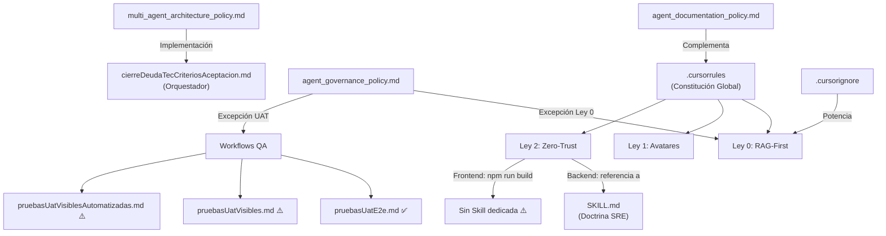

# Análisis del Ecosistema de Gobernanza iBPMS
> **Fecha:** 2026-04-03 | **Autor:** Antigravity (Auditoría Cruzada de 4 Pilares)

---

## 1. Inventario General

| # | Archivo | Tipo | Pilar |
|---|---|---|---|
| 1 | `.cursorrules` | **Rule (Constitución Global)** | Raíz |
| 2 | `.cursorignore` | **Auxiliar (Filtro RAG)** | Raíz |
| 3 | `scaffolding/workflows/agent_governance_policy.md` | **Policy (Gobernanza)** | Políticas |
| 4 | `scaffolding/workflows/agent_documentation_policy.md` | **Policy (Documental)** | Políticas |
| 5 | `scaffolding/workflows/multi_agent_architecture_policy.md` | **Policy (Arquitectura)** | Políticas |
| 6 | `scaffolding/workflows/agent_requirements_ssot_policy.md` | **Policy (Deprecada)** | Políticas |
| 7 | `.agent/workflows/cierreDeudaTecCriteriosAceptacion.md` | **Workflow (Orquestador)** | Workflows |
| 8 | `.agent/workflows/analisisEntendimientoUs.md` | **Workflow (Análisis)** | Workflows |
| 9 | `.agent/workflows/refinamientoFuncionalUs.md` | **Workflow (Refinamiento)** | Workflows |
| 10 | `.agent/workflows/renumeracionCriteriosAceptacionUs.md` | **Workflow (Documental)** | Workflows |
| 11 | `.agent/workflows/auditoriaIntegralUs.md` | **Workflow (QA)** | Workflows |
| 12 | `.agent/workflows/pruebasUatE2e.md` | **Workflow (QA E2E)** | Workflows |
| 13 | `.agent/workflows/pruebasUatVisibles.md` | **Workflow (QA Visual)** | Workflows |
| 14 | `.agent/workflows/pruebasUatVisiblesAutomatizadas.md` | **Workflow (QA Playwright)** | Workflows |
| 15 | `.agent/workflows/generar-auditoria-iteracion.md` | **Workflow (Roadmap)** | Workflows |
| 16 | `.agents/skills/backend_sre_compilation_audit/SKILL.md` | **Skill (SRE Backend)** | Skills |

---

## 2. Análisis Detallado por Artefacto

---

### PILAR 1: CONSTITUCIÓN GLOBAL (Raíz)

---

#### 📜 `.cursorrules` — Constitución Global del Enjambre

| Campo | Detalle |
|---|---|
| **Tipo** | Rule Global (se inyecta automáticamente en cada prompt) |
| **Objetivo** | Establecer las leyes supremas que rigen a TODOS los agentes en CADA interacción |
| **Alcance** | Universal — aplica a todo rol y todo chat |
| **Agentes impactados** | Arquitecto, Backend, Frontend, QA, cualquier agente futuro |

**Qué controla (bloques internos):**

| Bloque | Descripción resumida |
|---|---|
| §1 Gatekeeper Git | Subagentes NO hacen commit. Usan `git stash`. Solo el Arquitecto hace commit tras auditoría |
| §2 Auditoría por Deltas | El Arquitecto revisa código vía `git diff`, no leyendo archivos completos |
| §3 Libertad con Límites | Permite crear helpers/utils, prohíbe tocar Stores Pinia globales o interceptores Axios |
| §4 Integración Visual | Prohíbe fusión automática de CSS/diseño contra `.vue` funcionales |
| SSOT (Líneas 24–71) | Jerarquía de 4 niveles de documentación obligatoria (PRD → Gherkin → MoSCoW → NFR) |
| **Ley 0** RAG-First | Escaneo RAG profundo obligatorio antes de actuar. Cero suposiciones. Alertar al Humano ante contradicciones |
| **Ley 1** Avatares | Todo mensaje debe abrir con collar de identificación (`[⚙️ BACKEND - JAVA]`, etc.) |
| **Ley 2** Zero-Trust | Backend: `docker-compose up -d --build ibpms-core` + logs. Frontend: `npm run build` |

**Qué NO contempla:**
- No define reglas específicas para el agente **Product Owner** ni para el **Analista de Configuraciones** (mencionados en la gobernanza)
- No establece un protocolo para agentes que operan fuera del IDE principal (Mobile, RPA)
- No tiene versionamiento interno (no se sabe cuándo fue la última actualización de cada ley)

> [!TIP]
> **Recomendación:** Agregar un encabezado con `Última Actualización: YYYY-MM-DD` al inicio del archivo para trazabilidad de cambios constitucionales.

---

#### 🚫 `.cursorignore` — Filtro de Blindaje RAG

| Campo | Detalle |
|---|---|
| **Tipo** | Archivo auxiliar de gobernanza |
| **Objetivo** | Evitar que el motor RAG indexe carpetas de compilación o de alcance futuro |
| **Alcance** | Aplica a nivel de IDE (indexación de archivos) |
| **Agentes impactados** | Todos (indirectamente, al limitar qué pueden "ver") |

**Qué controla:**
- Excluye: `node_modules/`, `target/`, `dist/`, `build/`, `.git/`, `.idea/`, `logs/`, `*.log`, `.DS_Store`
- Excluye: `docs/requirements/future_roadmap/` (blindaje anti-Scope Creep)

**Qué NO contempla:**
- No excluye `doc.json` (2.7 MB en la raíz) que podría saturar tokens
- No excluye `temp_tree.txt` (1.2 MB) ni los archivos `us0XX.txt` sueltos en la raíz

> [!TIP]
> **Recomendación:** Añadir `doc.json`, `temp_tree.txt` y `us*.txt` al ignore para liberar ~4 MB de capacidad RAG.

---

### PILAR 2: POLÍTICAS DESCENTRALIZADAS (`scaffolding/workflows/`)

---

#### 🏛️ `agent_governance_policy.md` — Cadena de Mando

| Campo | Detalle |
|---|---|
| **Tipo** | Policy / Gobernanza |
| **Objetivo** | Centralizar toda autorización técnica en el Arquitecto Líder |
| **Alcance** | Relaciones inter-agente (quién aprueba a quién) |
| **Agentes impactados** | Backend, Frontend, QA (como subordinados), Arquitecto (como autoridad) |

**Qué controla:**
- Prohibición de que subagentes pidan aprobación al humano
- Excepción Ley 0: contradicción SSOT → alerta directa al Humano
- Excepción UAT: QA puede coordinar lotes de prueba directamente con el Humano

**Qué NO contempla:**
- No define qué pasa si el Arquitecto Líder "muere" (contexto agotado/corrompido). No hay protocolo de sucesión
- No cubre la relación del PO con los demás agentes

> [!TIP]
> **Recomendación:** Añadir cláusula de "Failover": si el Arquitecto no responde en N intentos, el subagente escala al Humano con evidencia.

---

#### 📂 `agent_documentation_policy.md` — Custodio del Repositorio

| Campo | Detalle |
|---|---|
| **Tipo** | Policy / Gestión Documental |
| **Objetivo** | Mantener orden clínico en el monorepositorio. Prevenir duplicados y basura digital |
| **Alcance** | Creación y modificación de archivos en todo el proyecto |
| **Agentes impactados** | Todos |

**Qué controla:**
- Regla "Leer Antes de Escribir": verificar si un documento ya existe antes de crear uno nuevo
- Rutas oficiales: `docs/` para documentación, `scaffolding/` para logística, `backend/` para código
- Sincronización obligatoria C4 Model ↔ Implementation Plan
- Protocolo Handoff vía `.agentic-sync/`

**Qué NO contempla:**
- No menciona la carpeta `frontend/` como ruta oficial (solo dice `backend/`)
- No define política para archivos en la carpeta `rpa/` ni `infra/`
- Menciona herramienta `find_by_name` que no existe en todos los IDEs

> [!TIP]
> **Recomendación:** Actualizar la jerarquía oficial para incluir `frontend/`, `rpa/` e `infra/` explícitamente.

---

#### 🏗️ `multi_agent_architecture_policy.md` — Separación de Memorias

| Campo | Detalle |
|---|---|
| **Tipo** | Policy / Arquitectura de Agentes |
| **Objetivo** | Definir la separación estricta de roles, memorias y contextos entre agentes |
| **Alcance** | Estructura operativa del squad completo |
| **Agentes impactados** | Arquitecto, Backend, Frontend, QA |

**Qué controla:**
- Cada agente opera en una ventana de chat independiente (memoria aislada)
- El Arquitecto tiene prohibido programar código funcional
- Protocolo `.agentic-sync/` para comunicación inter-agente
- Flujo: Handoff → Invocación en Sala Limpia → Stash → Auditoría → Commit

**Qué NO contempla:**
- No cubre el agente Mobile ni el agente RPA (mencionados en carpetas del proyecto)
- No define límites de tiempo o TTL para un handoff pendiente

> [!NOTE]
> Este archivo es **complementario** y no contradictorio con el Orquestador (`cierreDeudaTecCriteriosAceptacion.md`). Uno es la teoría, el otro es la ejecución paso a paso.

---

#### 📖 `agent_requirements_ssot_policy.md` — **DEPRECADA**

| Campo | Detalle |
|---|---|
| **Tipo** | Policy (Inactiva) |
| **Estado** | **Promovida a Ley Global** en `.cursorrules` |
| **Contenido actual** | Redirección al `.cursorrules` |

> [!NOTE]
> Este archivo fue vaciado y deprecado en esta sesión para eliminar redundancia de tokens.

---

### PILAR 3: WORKFLOWS OPERATIVOS (`.agent/workflows/`)

---

#### ⚡ `cierreDeudaTecCriteriosAceptacion.md` — El Orquestador Principal

| Campo | Detalle |
|---|---|
| **Tipo** | Workflow de Ejecución (el más importante) |
| **Objetivo** | Coordinar la implementación de una US completa usando arquitectura multi-agente |
| **Alcance** | Ciclo de vida completo: Planificación → Handoffs → Delegación → Aprobación → Auditoría → Commit |
| **Agentes impactados** | Arquitecto (ejecutor principal), Backend/Frontend (receptores de handoff) |

**Qué controla:**
- Fase 1: Creación de handoffs en `.agentic-sync/`
- Instrucciones operativas inyectadas en cada handoff (planning → approval_request → stash)
- Fase 2: Instrucciones al Humano Cartero
- Fase 3: Buzón de aprobaciones del Arquitecto
- Fase 4: Gatekeeper con `git stash pop` + `git diff` + commit/reset

**Qué NO contempla:**
- No incluye fase de QA post-implementación (se asume que el humano lo invoca después por separado)
- No menciona Docker ni compilación (delegado a Ley Global 2)

---

#### 🔍 Grupo de Workflows de Análisis y Documentación

| Workflow | Rol asignado | Objetivo resumido |
|---|---|---|
| `analisisEntendimientoUs.md` | Analista de Producto Senior | Entender una US antes de desarrollarla: objetivo, alcance, funcionalidades, brechas, exclusiones |
| `refinamientoFuncionalUs.md` | PO Senior / QA Funcional | Generar 45 preguntas estratificadas (Funcional, Seguridad, UX, Performance) para refinar una US |
| `renumeracionCriteriosAceptacionUs.md` | Analista de Requerimientos | Limpiar y renumerar los IDs de Criterios de Aceptación (CA-01, CA-02...) sin alterar contenido |
| `generar-auditoria-iteracion.md` | Arquitecto Líder | Extender iterativamente el roadmap de auditoría técnica, agrupando US por dominio de negocio |

**Agentes impactados:** Cualquier agente al que se le asigne el rol descrito en el workflow.

**Qué NO contempla este grupo:**
- Ninguno de estos 4 workflows referencia la Ley Global 2 (Docker), pero esto es correcto — son flujos **documentales**, no de compilación.

---

#### 🧪 Grupo de Workflows de QA (3 variantes)

| Workflow | Variante | Max CA/Lote | Setup Backend | Evidencia |
|---|---|---|---|---|
| `pruebasUatE2e.md` | QA Forense (4 capas) | 5 CA | ✅ Docker (parchado hoy) | Logs + Network |
| `pruebasUatVisibles.md` | QA Visual Narrado | 3 CA | ⚠️ `mvn spring-boot:run` (sin parchar) | Screenshots + Narración en vivo |
| `pruebasUatVisiblesAutomatizadas.md` | QA Playwright SDET | 3 CA | ⚠️ No especificado | Scripts `.spec.ts` + Modo UI |

**Agentes impactados:** QA / DevOps / SDET.

> [!WARNING]
> **Hallazgo nuevo:** Los workflows `pruebasUatVisibles.md` (línea 15) y `pruebasUatVisiblesAutomatizadas.md` (línea 32) aún mencionan `mvn spring-boot:run` directamente en el Host. Solo `pruebasUatE2e.md` fue parchado a Docker en esta sesión. Las otras 2 variantes siguen inconsistentes con la Ley Global 2.

---

### PILAR 4: SKILLS (`.agents/skills/`)

---

#### 🛠️ `backend_sre_compilation_audit/SKILL.md` — Doctrina SRE del Backend

| Campo | Detalle |
|---|---|
| **Tipo** | Skill (Doctrina técnica especializada) |
| **Objetivo** | Forzar al agente Backend a validar compilación y arranque antes de cualquier handoff |
| **Alcance** | Solo agente Backend (Java/Spring Boot) |
| **Agentes impactados** | Backend exclusivamente |

**Qué controla:**
- Prohibido handoff ciego: obligatorio `docker compose up -d ibpms-core`
- Auditoría de arranque: `docker compose logs -f ibpms-core`
- Ley DDL: si modificas `@Entity`, obligatorio generar migración Liquibase/Flyway
- Validación hasta ver `Tomcat started on port(s): 8080`

**Qué NO contempla:**
- No existe una Skill equivalente para el Frontend (no hay `frontend_build_audit/SKILL.md`)
- No existe una Skill para QA (validaciones E2E automatizadas)

> [!TIP]
> **Recomendación:** Crear `frontend_build_audit/SKILL.md` que obligue a ejecutar `npm run build` y `npm run lint` antes de empaquetar.

---

## 3. Mapa de Relaciones entre Artefactos

---

## 4. Hallazgos Consolidados

| # | Severidad | Hallazgo | Ubicación |
|---|---|---|---|
| 1 | 🔴 Crítico | 2 de 3 workflows QA aún usan `mvn spring-boot:run` local, contradiciendo la Ley Global 2 | `pruebasUatVisibles.md` (L15), `pruebasUatVisiblesAutomatizadas.md` (L32) |
| 2 | 🟡 Moderado | No existe Skill para Frontend. La Ley 2 obliga a `npm run build`, pero no hay doctrina detallada | `.agents/skills/` (vacío para Frontend) |
| 3 | 🟡 Moderado | `.cursorignore` no bloquea archivos pesados sueltos en la raíz (`doc.json` 2.7MB, `temp_tree.txt` 1.2MB) | `.cursorignore` |
| 4 | 🟢 Bajo | `agent_documentation_policy.md` no incluye `frontend/`, `rpa/`, `infra/` en su jerarquía oficial | `agent_documentation_policy.md` (L20-23) |
| 5 | 🟢 Info | `agent_requirements_ssot_policy.md` correctamente deprecada y redirigida | Sin acción |

---

## 5. Recomendaciones de Mejora Consolidadas

| # | Acción | Impacto | Esfuerzo |
|---|---|---|---|
| 1 | **Parchar `pruebasUatVisibles.md` y `pruebasUatVisiblesAutomatizadas.md`** para reemplazar `mvn spring-boot:run` por `docker-compose` | 🔴 Alto — elimina la última contradicción con Ley 2 | 5 min |
| 2 | **Crear `frontend_build_audit/SKILL.md`** con la doctrina de validación Frontend | 🟡 Medio — cierra la asimetría Backend/Frontend | 15 min |
| 3 | **Ampliar `.cursorignore`** con `doc.json`, `temp_tree.txt`, `us*.txt` | 🟡 Medio — libera ~4MB de capacidad RAG | 2 min |
| 4 | **Agregar versionamiento** al `.cursorrules` (fecha de última actualización por ley) | 🟢 Bajo — mejora trazabilidad | 2 min |
| 5 | **Actualizar jerarquía documental** en `agent_documentation_policy.md` para incluir `frontend/`, `rpa/`, `infra/` | 🟢 Bajo — mejora cobertura organizacional | 5 min |
| 6 | **Añadir protocolo de Failover** en `agent_governance_policy.md` para cuando el Arquitecto no responde | 🟢 Bajo — resiliencia operativa | 5 min |
