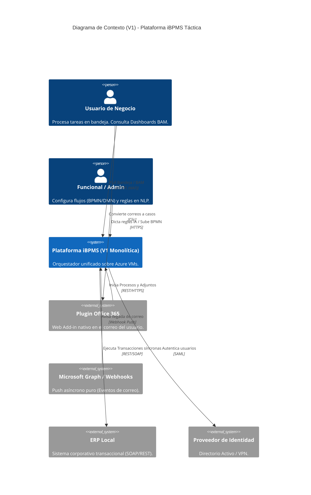
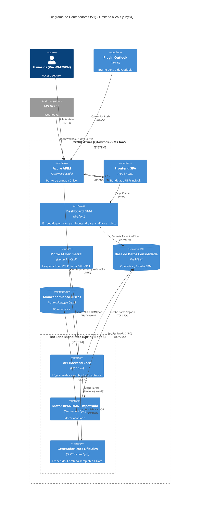
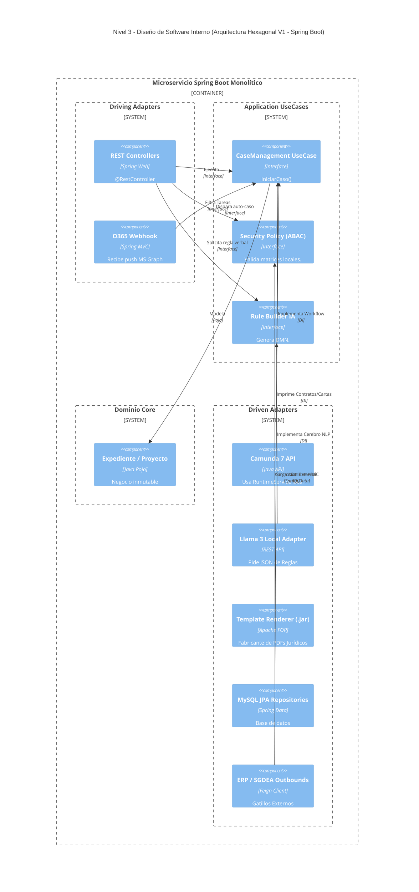

# 🎓 Guía de Onboarding: Arquitectura iBPMS V1 para Desarrolladores

**¡Bienvenidos al equipo de la Plataforma iBPMS!** 🚀

Si estás leyendo esto, es porque vas a ser parte del equipo de construcción de la **Versión 1 (V1) de nuestra Plataforma de Automatización de Procesos**. Como arquitecto del proyecto, he diseñado esta guía especialmente para ti y para todo el equipo de desarrollo.

El objetivo de este documento es explicarte, como si estuviéramos en una clase de la universidad, **cómo funciona el sistema por debajo, por qué tomamos ciertas decisiones y cuáles son las reglas de oro** que debes cumplir al escribir tu código Java o Vue.js.

Olvídate de términos ultra complejos por un momento; vamos a entender la plataforma desde sus cimientos.

---

## 1. ¿Qué estamos construyendo? (La Foto Completa)

Imagina que estamos construyendo el **Cerebro Digital de la Empresa**. Hoy en día, las empresas tienen procesos lentos (ej: aprobar un contrato, contratar a un empleado, pedir vacaciones) que dependen de enviar correos electrónicos de un lado a otro. 

Nuestra plataforma iBPMS (Intelligent Business Process Management System) va a **orquestar** todo esto. Le dirá a la persona "A" qué formulario llenar, luego le pasará la pelota a la persona "B" para que firme, y luego se conectará al Banco para hacer un pago. Todo esto guardando un historial inborrable.

Veamos cómo se ve esto desde el cielo con nuestro **Diagrama de Contexto (Nivel 1)**:

### 👨‍🏫 Explicación para Dummies:
*   El cuadro azul del centro (`Plataforma iBPMS`) es el código que tú vas a escribir.
*   A nuestro sistema entrarán personas normales (usuarios) y analistas, pero también **sistemas externos**.
*   Por ejemplo, Microsoft Office 365 nos enviará un "silbido" (Webhook) cuando llegue un correo, y nosotros debemos atraparlo y convertirlo en un trámite.
*   No guardamos contraseñas; delegamos eso al "Proveedor de Identidad" (IAM) que actúa como el cadenero de un club pidiendo la identificación.

---

## 2. Abriendo la Caja: ¿De qué está hecho nuestro Sistema?

Ahora vamos a quitarle el techo a ese cuadro azul y ver de qué servidores, bases de datos y lenguajes está hecho por dentro. A esto lo llamamos **Diagrama de Contenedores (Nivel 2)**.

### 👨‍🏫 El ADN de nuestro Backend y Frontend:
1.  **Frontend (Vue 3):** Es la cara bonita. Lo hicimos con Vue porque nos permite empaquetar formularios como si fueran piezas de Lego (Micro-frontends). 
2.  **API Gateway (APIM):** Piensa que es el Director de Tránsito. Nadie, absolutamente nadie, puede hablar directo con nuestro código Java o con la Base de datos. Todos deben pasar por esta puerta, enseñando un "Token" de seguridad.
3.  **El Backend (Spring Boot 3 + Java 17):** Aquí van a programar ustedes. Es el músculo de la operación. Adentro tiene a su disposición a "Camunda" (el motor que sabe fluir tareas de un punto A a un punto B) y un generador de PDFs.
4.  **Base de Datos (MySQL):** Aquí vivirá nuestra información. Es crucial que la base de datos se limite a almacenar estado, no quiero reglas de negocio escritas en procedimientos almacenados (Triggers/SPs).

---

## 3. Las Entrañas del Código: Arquitectura Hexagonal

Aquí llegamos a la parte más importante para ti como desarrollador. Para organizar el código Java, hemos decidido usar **Arquitectura Hexagonal (o Puertos y Adaptadores)**. Nuestro Diagrama de Componentes (Nivel 3) lo ilustra:

### 👨‍🏫 Explicación para Dummies: La Regla de la Caja Fuerte
Imagina que el **Dominio Core** (el corazón del sistema) es un diamante dentro de una caja fuerte de titanio. Ese diamante son nuestras Entidades Java puras (Ej: `Expediente.java`, `Tarea.java`).

**Las reglas inquebrantables de desarrollo son:**

1.  **El diamante no sabe del mundo exterior:** Una clase dentro de la carpeta `domain` **jamas** debe tener importaciones de `@Entity`, `@Table`, `Camunda`, `Spring` o bases de datos. Son objetos de negocio puros.
2.  **Los Controladores son Mensajeros Tontos:** Si estás programando un `@RestController`, tu trabajo es solo recibir el JSON de internet y pasárselo a un `UseCase` (Caso de Uso). ¡No pongas `if(monto > 1000)` en el controlador! La lógica de negocio no va ahí.
3.  **Los Adaptadores son Enchufes:** Camunda, MySQL o el ERP son "tecnologías externas" (Driven Adapters). Si mañana decidimos cambiar MySQL por una base de datos más moderna (ej. PostgreSQL), tú solo tendrás que cambiar el "adaptador" de salida. El diamante (Dominio) no se toca, porque el diamante nunca supo en qué base de datos se guardaba.

### 📜 Código de Ejemplo Real en este Repositorio:
Si vas a `ibpms-platform/backend/ibpms-core/src/main/java.../domain/model/Expediente.java`, notarás que es un objeto con **Inmutabilidad**. ¿Qué significa? Que si actualizas el estado de un expediente a "CERRADO", no modificas las variables; creas una copia exacta nueva del objeto con el nuevo estado. Esto nos salva la vida contra errores muy difíciles de detectar causados por "concurrencia" (cuando dos usuarios dan click al mismo tiempo).

---

## 4. Próximos pasos para ti
1. Da un vistazo a las carpetas `ibpms-core`. Mira cómo están separadas visualmente las carpetas de `in` (lo que entra por REST) y `out` (lo que sale a base de datos).
2. Familiarízate con la compilación vía Maven y asegura que tienes tu JDK 17 activo.
3. La "Versión 2" de este sistema usará Inteligencia Artificial directamente en Kubernetes, pero no te preocupes, si respetas estas reglas y cuidas el diamante (Dominio Core), escalar a V2 será automático y natural.

**¡A codificar duro, equipo! Construyamos el mejor sistema de la empresa.**
