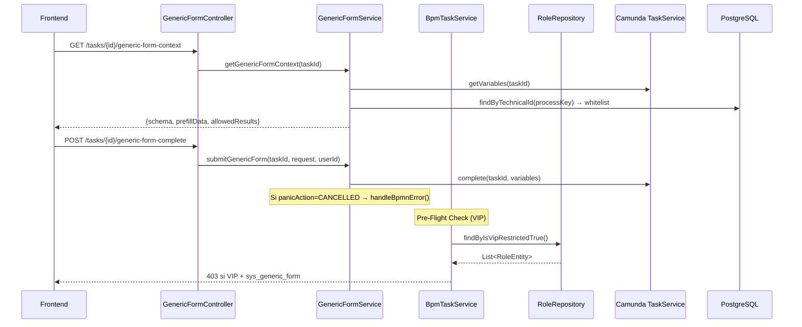

# 🔧 HANDOFF BACKEND — Iteración 3 (Sprint 6.2)
## Auditoría Arquitectural: US-003 (iForm Maestro) + US-039 (Formulario Genérico)

**Fecha de Emisión:** 2026-04-20  
**Emitido por:** Arquitecto Líder (Antigravity)  
**Destinatario:** Equipo Backend  
**Protocolo:** Zero-Hallucination | Gobernanza CA-5  

---

## 📋 Resumen Ejecutivo

Este handoff consolida **todas las tareas de backend** derivadas de la auditoría forense de las US-003 y US-039. Algunas ya fueron ejecutadas directamente por el arquitecto; se documentan como **CERRADAS** para trazabilidad. Las tareas **ABIERTAS** requieren acción del equipo.

---

## 1. Tareas CERRADAS (Ya Ejecutadas — Solo Verificación)

### ✅ REM-039-A: Eliminación de VIP Hardcoding en BpmTaskService

> **[GRADUADO AL SSOT]** Este hallazgo fue consolidado como CA-6 en [epic_B_formularios_bpmn.md](../epics/epic_B_formularios_bpmn.md)

---

### ✅ REM-039-B: Validación @Size(max=10) en Whitelist DTO

> **[GRADUADO AL SSOT]** Este hallazgo fue consolidado como CA-5 en [epic_B_formularios_bpmn.md](../epics/epic_B_formularios_bpmn.md)

---

## 2. Tareas ABIERTAS (Requieren Acción del Equipo)

### 🔲 BACK-001: Integrar Endpoint de Configuración de Whitelist en ProcessDesignController

**Origen:** CA-5 (US-039) | **Prioridad:** Alta

**Contexto:** El endpoint `PUT /{processKey}/generic-form-config` existe en `ProcessDesignController`, pero necesita verificar:

1. Que el `@Valid` esté anotado en el parámetro `@RequestBody GenericFormConfigUpdateRequest request`.  
2. Que la persistencia invoque correctamente `BpmnProcessDesignEntity.setGenericFormWhitelist(objectMapper.writeValueAsString(request.getWhitelist()))`.

**Criterio de Aceptación:**
```
DADO un administrador autenticado con ROLE_CONFIGURADOR
CUANDO invoca PUT /api/v1/design/processes/{key}/generic-form-config 
  CON body: { "whitelist": ["Case_ID", "amount", "priority"] }
ENTONCES el campo generic_form_whitelist de ibpms_bpmn_process_design se actualiza con el JSON array
Y un GET posterior desde GenericFormService devuelve solo esas 3 variables en prefillData.
```

---

### 🔲 BACK-002: Implementar Caché L1 para VIP Role Lookup

**Origen:** REM-039-A (Optimización) | **Prioridad:** Media

**Contexto:** El cambio REM-039-A ahora consulta la BD en cada invocación de `getGenericTaskPayload()`. Para producción, se recomienda implementar un caché de 5 minutos.

**Prescripción:**
```java
// En BpmTaskService.java, usar @Cacheable de Spring
@Cacheable(value = "vipRoles", key = "'ALL'", unless = "#result.isEmpty()")
public List<String> getVipRoleNames() {
    return roleRepository.findByIsVipRestrictedTrue()
            .stream().map(r -> "ROLE_" + r.getName())
            .collect(Collectors.toList());
}
```

**Configuración adicional (si no existe):**
```yaml
# application.yml
spring:
  cache:
    type: caffeine
    caffeine:
      spec: maximumSize=100,expireAfterWrite=5m
```

---

### 🔲 BACK-003: Resolver Deuda Técnica en AgileProjectController

**Origen:** Auditoría transversal | **Prioridad:** Media

**Archivo:** `backend/ibpms-core/src/main/java/com/ibpms/poc/infrastructure/web/AgileProjectController.java`

**Problema:** Variables quemadas:
- `createdBy = "admin"` (hardcoded en vez de extraer del JWT)
- `hasAnyRole('OPERADOR', 'ADMIN')` sin integración con modelo de roles dinámico

**Prescripción:**
```diff
 // Reemplazar hardcoding
-entity.setCreatedBy("admin");
+String currentUser = SecurityContextHolder.getContext().getAuthentication().getName();
+entity.setCreatedBy(currentUser);
```

---

### 🔲 BACK-004: Validación de managementResult contra Enum Server-Side

**Origen:** CA-4 (US-039) | **Prioridad:** Baja

**Contexto:** `GenericFormSubmitRequest.managementResult` acepta cualquier String. Se recomienda validar contra el catálogo de resultados permitidos.

**Prescripción:**
```java
// En GenericFormService.submitGenericForm()
List<String> ALLOWED_RESULTS = List.of("APPROVED", "REJECTED", "PENDING_INFO", "ESCALATED");
if (!ALLOWED_RESULTS.contains(request.getManagementResult())) {
    throw new ResponseStatusException(HttpStatus.BAD_REQUEST, 
        "managementResult must be one of: " + ALLOWED_RESULTS);
}
```

---

## 3. Contratos API Relevantes

| Endpoint | Método | DTO | US |
|---|---|---|---|
| `/api/v1/workbox/tasks/{id}/generic-form-context` | GET | `GenericFormContextResponse` | US-039 |
| `/api/v1/workbox/tasks/{id}/generic-form-complete` | POST | `GenericFormSubmitRequest` | US-039 |
| `/api/v1/design/processes/{key}/generic-form-config` | PUT | `GenericFormConfigUpdateRequest` | US-039 |
| `/api/v1/drafts/{taskId}` | GET/PUT/DELETE | `GenericFormDraft` (JSON) | US-003/039 |

---

## 4. Diagrama de Flujo Backend



---

> [!IMPORTANT]
> **Priorización sugerida:** BACK-001 (sprint actual) → BACK-002 (pre-producción) → BACK-003 (deuda técnica) → BACK-004 (hardening)
