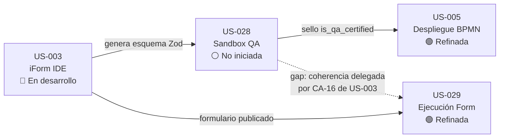

# Análisis de Entendimiento Funcional — US-028
## Simulador de Contratos Zod en Memoria (In-Browser QA Sandbox)

**Analista:** Product Owner / Analista de Producto Senior  
**Fecha:** 2026-04-06  
**SSOT:** `docs/requirements/v1_user_stories.md` (líneas 1373-1459)  
**Scope Master:** SHOULD HAVE | Estado: No iniciada | Pantalla 7  
**FR asociado:** FR-06 (functional_requirements.md)

---

## 1. Resumen del Entendimiento

La US-028 describe un **entorno de pruebas en tiempo real integrado directamente dentro del IDE web de diseño de formularios (Pantalla 7)** que permite a un Ingeniero de QA o Arquitecto Frontend inyectar datos ficticios (payloads) contra las reglas de validación Zod de un formulario — todo ejecutándose en la memoria del navegador, sin generar archivos de test al disco ni depender de pipelines CI/CD.

En términos simples: es un **"laboratorio de pruebas"** empotrado en el mismo lugar donde se diseñan los formularios. El QA presiona un botón, el sistema genera datos falsos automáticamente, los pasa contra las reglas del formulario y muestra visualmente qué pasa: ¿todo verde? El contrato Zod está sano. ¿Rojo? Hay reglas que no se cumplen.

**El diferenciador clave** es que este simulador NO prueba la interfaz gráfica del formulario, NI las llamadas a APIs externas. Prueba **exclusivamente** la lógica de validación matemática del esquema Zod: ¿acepta lo que debería aceptar? ¿rechaza lo que debería rechazar?

---

## 2. Objetivo Principal

| Dimensión | Descripción |
|---|---|
| **Objetivo de negocio** | Garantizar la calidad de los contratos de validación de formularios ANTES de que se vinculen a procesos BPMN, reduciendo defectos en producción y evitando formularios que acepten datos inválidos o rechacen datos legítimos. |
| **Objetivo funcional** | Proveer una herramienta de testing reactivo en el navegador que ejecute `zod.safeParse()` contra payloads generados automáticamente o editados manualmente, mostrando los resultados de forma visual y legible. |
| **Objetivo de gobernanza** | Establecer un "sello de certificación QA" (`is_qa_certified`) que actúe como guardrail: un formulario sin sello no puede ir a producción a través de la Pantalla 6 (Despliegue BPMN). |

---

## 3. Alcance Funcional Definido

### Dentro del alcance (lo que la US-028 SÍ define):

El alcance se limita estrictamente a la **validación de contratos Zod en memoria del navegador**, integrada como un panel dentro de la Pantalla 7 (iForm IDE). No abarca testing de UI, testing de integración ni testing end-to-end.

**Frontera de inicio:** El Arquitecto BPM ya tiene un formulario con esquema Zod generado en la Pantalla 7 (dependencia: US-003).

**Frontera de fin:** El QA presiona el botón "CERTIFICAR CONTRATO ZOD" y el sistema persiste el sello en base de datos, bloqueando despliegues BPMN sin certificación.

### Fuera del alcance (lo que la US-028 NO cubre):

- Testing de la interfaz gráfica del formulario (ciclo de vida Vue: `onMounted`, etc.)
- Llamadas a APIs externas (Data Sources, Camunda, CRM)
- Mocking de servicios externos (MSW, vi.mock)
- Librería de payloads reutilizables o fixtures compartidos entre formularios
- Tests de regresión automatizados (CI/CD pipeline)
- Validación de formularios en runtime (eso es US-029)
- Optimización con Web Workers (explícitamente prohibida en V1: CA-8)

---

## 4. Lista de Funcionalidades Incluidas

### F-01: Sandbox In-Browser (CA-1)
- Botón `[🧪 SIMULAR CONTRATO ZOD]` en el IDE de Pantalla 7
- Panel de Consola QA en vista dividida (Split View) integrado en el mismo IDE
- Ejecución en RAM del navegador, sin descarga de archivos `.spec.ts` al disco
- **Sin dependencia de CI/CD**

### F-02: Generación Automática de Payloads (CA-2)
- Auto-generación de Payload Dummy basado en los tipos y restricciones de Zod
  - String con `.min(5)` → genera `"AAAAA"`
  - Number → genera un número basura tipificado
- Dos evaluaciones automáticas:
  - **Path Feliz:** Payload válido generado automáticamente → espera `success: true`
  - **Path Triste:** Payload vacío `{}` → espera errores de `Required`

### F-03: Editor Manual In-Situ (CA-3)
- Mini-editor de texto incrustado para editar el JSON del payload manualmente
- Reevaluación instantánea en tiempo real al teclear/borrar
- Permite al QA probar Regex complejos (cédulas, NITs) manualmente

### F-04: Aislamiento Puro (CA-4)
- Ejecuta ÚNICAMENTE `zod.safeParse()` sobre el esquema estático
- **NO** dispara ciclo de vida Vue (no `onMounted`, no efectos)
- **NO** genera peticiones de red (Axios/Fetch)
- **NO** requiere librerías de mocking (MSW/vi.mock)

### F-05: Fuzzing Recursivo para Estructuras Anidadas (CA-5)
- DataGrids o Grupos Repetibles (`z.array().min(2)`) generan sub-objetos automáticos
- Shallow Fuzzing: crea exactamente el mínimo requerido de ítems
- El QA solo corrige los valores semánticos, no la estructura

### F-06: Dropdown Multi-Etapa (CA-6)
- Para formularios iForm Maestro que cambian según la fase (`Current_Stage`)
- Dropdown en la cabecera del Sandbox: `[ 🎭 Etapa a Simular: Radicación 🔻 ]`
- Al cambiar etapa, el esquema Zod muta en caliente y el fuzzer regenera el Payload
- Previene falsos positivos por validaciones aplanadas de etapas no seleccionadas

### F-07: Vista Dual Split-Panel (CA-7)
- Panel izquierdo **editable**: `[ 📥 Payload Crudo ]` (lo que digita el usuario)
- Panel derecho **read-only**: `[ 📤 Payload Parseado ]` (lo que viajaría a Camunda)
- Permite visualizar transformaciones Zod (`.transform()`, `.default()`, drop keys)

### F-08: Tolerancia a Bloqueo Síncrono (CA-8)
- Web Workers **prohibidos en V1** (decisión explícita de complejidad)
- Acepta bloqueo síncrono sub-milimétrico de `.safeParse`
- Si el Regex o `.superRefine()` falla contra el dato dummy, pinta de ROJO
- El humano debe entrar al mini-editor y corregir manualmente (responsabilidad QA)

### F-09: Errores Legibles (CA-9)
- Traduce `ZodError` críptico a listado HTML con viñetas amigables
- Formato: `"❌ [campo.subcampo] - Mensaje de error legible."`
- **Prohibido** renderizar el array JSON crudo del `ZodError`

### F-10: Persistencia Local del Payload (CA-10)
- Usa `@vueuse/core` → `useLocalStorage('zod_mock_form_{ID}')`
- Si el usuario cierra la pestaña o refresca (F5), el JSON artesanal se recupera
- Evita destrucción por amnesia en sesiones largas del QA

### F-11: Sello de Certificación QA (CA-11)
- Botón: `[ 🏆 CERTIFICAR CONTRATO ZOD ]`
- `POST /api/v1/design/forms/{id}/certify`
- Persiste `ibpms_forms.is_qa_certified = true` en BD
- Registra en `ibpms_audit_log`: tester, versión, fecha, payload exacto
- **Guardrail en Pantalla 6:** bloquea despliegue BPMN si el formulario no tiene sello

---

## 5. Brechas, GAPs y Ambigüedades

### GAP-028-01: ¿Quién revoca el sello de certificación?
**Severidad:** 🟡 Media  
El CA-11 define que se puede certificar, pero **no define qué pasa cuando el Arquitecto modifica el formulario después de que el QA lo certificó.** ¿Se revoca automáticamente `is_qa_certified = false`? ¿El sistema lo detecta por cambio de hash del esquema? ¿O sigue certificado con datos obsoletos?

**Impacto:** Si no se revoca automáticamente, un formulario modificado después de la certificación podría desplegarse a producción con el sello válido de una versión anterior → bugs en producción.

### GAP-028-02: Granularidad del sello por versión
**Severidad:** 🟡 Media  
El CA-11 dice "certificó la V2 del Formulario", pero **no define el mecanismo de versionado del formulario.** ¿Cada vez que se publica un cambio incrementa la versión? ¿El sello pertenece a la versión X y la versión X+1 nace sin sello? Esto depende de cómo US-003 gestiona el versionado, que no está documentado explícitamente como mecanismo.

### GAP-028-03: Validaciones cruzadas entre campos (`.superRefine`)
**Severidad:** 🟡 Media  
El CA-8 menciona `.superRefine()` con lógica temporal cruzada (Ej: `FechaInicio > FechaFin`) pero **el fuzzer genera datos "basura" que probablemente violarán TODAS las reglas de superRefine**. El CA-8 dice que "es responsabilidad del QA corregir", pero no define si el Path Feliz autogenerado debe intentar respetar las relaciones cruzadas o si simplemente las ignora y pinta todo de rojo.

**Impacto:** Si el fuzzer genera payloads que siempre fallan en `.superRefine`, el "Path Feliz" nunca será feliz automáticamente para formularios con lógica compleja → la utilidad del autogenerador se reduce drásticamente en formularios avanzados.

### GAP-028-04: Límites del Payload en auditoría
**Severidad:** ⚪ Baja  
El CA-11 registra "Payload utilizado: {JSON...}" en el audit log. **No define un límite de tamaño.** Un formulario Maestro complejo podría generar un JSON de 50KB+ que se almacenaría en la tabla de auditoría. ¿Hay truncamiento? ¿Se comprime?

### GAP-028-05: Concurrencia de certificación
**Severidad:** ⚪ Baja  
No se define qué pasa si **dos QAs intentan certificar el mismo formulario simultáneamente.** ¿El último gana? ¿Se levanta conflicto 409? Esto es un edge case pero podría generar registros de auditoría inconsistentes.

### GAP-028-06: Relación con US-029 (Ejecución de Formulario)
**Severidad:** 🟡 Media  
La US-003 CA-16 dice explícitamente que la coerción de coherencia entre el Frontend/Zod y el Motor Central **"recaerá estrictamente sobre el ciclo de QA automatizado (US-028)"**. Esto implica que la US-028 tiene una responsabilidad no documentada en sus CAs: **validar la coherencia entre las variables del BPMN y los campos del formulario Zod.** Sin embargo, ningún CA de la US-028 menciona esta validación cruzada.

**Impacto:** La US-003 delega responsabilidad a la US-028, pero la US-028 solo valida el contrato Zod aislado. El gap de coherencia BPMN↔Form queda sin dueño.

---

## 6. Exclusiones y Aspectos Fuera de Alcance

| # | Aspecto | Justificación |
|---|---|---|
| 1 | **Testing de UI** (renderizado visual, CSS, layout) | CA-4 lo excluye explícitamente: "la prueba valida el contrato de datos final y no la interfaz gráfica" |
| 2 | **Testing de integración con APIs** | CA-4: "Zero-Network Mocking". No se disparan Axios/Fetch. |
| 3 | **CI/CD pipeline integration** | CA-1: "sin generar código muerto ni depender de pipelines de CI/CD externos" |
| 4 | **Web Workers / Optimización de performance** | CA-8: "la optimización prematura (Web Workers) está prohibida en V1" |
| 5 | **Mocking de servicios externos** | CA-4: "ni se requieran librerías de Mocking complejas (MSW/vi.mock)" |
| 6 | **Persistencia de payloads en servidor** | Solo se persiste el sello (CA-11). Los payloads de prueba viven en LocalStorage (CA-10), no en el servidor. |
| 7 | **Validación de coherencia BPMN↔Form** | Aunque US-003 CA-16 delega esto a US-028, ningún CA de US-028 la incluye formalmente (ver GAP-028-06) |
| 8 | **Ejecución de formularios renderizados** | Eso pertenece a US-029 (Ejecución y Envío) |
| 9 | **Creación del esquema Zod** | Eso pertenece a US-003 (iForm IDE) |
| 10 | **Pruebas de regresión automatizadas** | No hay CA que defina re-ejecución automática de tests ante cambios |

---

## 7. Observaciones de Alineación y Riesgos

### 7.1 Clasificación MoSCoW: SHOULD HAVE

> [!IMPORTANT]
> La US-028 está clasificada como **SHOULD HAVE** en el `scope_master_v1.md`. Esto significa que es diferible hasta 30 días post-launch. Es una de las solo 2 US SHOULD del backlog (junto con US-010). Cualquier inversión en desarrollo debe considerar que esta US puede posponerse si los recursos aprietan.

### 7.2 Dependencia Bloqueante: US-003

La US-028 **no puede existir sin la US-003** (iForm IDE). El Sandbox opera sobre esquemas Zod generados en la Pantalla 7. Si la US-003 no está completada con el motor de generación de esquemas Zod, la US-028 no tiene materia prima sobre la cual trabajar.

- **US-003:** En desarrollo (scope_master_v1.md)
- **US-028:** No iniciada

**Riesgo:** Si US-003 no estabiliza su modelo de datos Zod, la US-028 construiría un Sandbox sobre arena movediza.

### 7.3 Dependencia Downstream: US-005 (Despliegue BPMN)

El CA-11 crea un guardrail que **bloquea el despliegue en Pantalla 6** si el formulario no tiene sello QA. Esto significa que la US-005 (Desplegar BPMN) debe consumir la bandera `is_qa_certified` y aplicar la restricción antes de permitir el despliegue.

**Riesgo:** Si US-005 se implementa sin conocimiento de este guardrail, los formularios irán a producción sin certificación QA.

### 7.4 Actor principal: Ingeniero de QA

El `actors_catalog.md` actual **no incluye explícitamente un rol "Ingeniero de QA"** entre los 12 actores del sistema. La US-028 define como actor al "Ingeniero de Calidad (QA) / Arquitecto Frontend". En el catálogo, el Arquitecto de Procesos (BPM Analyst) tiene acceso a Pantalla 7, pero no hay un actor "QA" formal.

**SUPUESTO:** Se asume que el Arquitecto BPM o un Super Admin ejecutan las funciones de QA en V1. Si se requiere un rol separado de QA con permisos restringidos (solo puede certificar, no puede modificar formularios), debe crearse en el `actors_catalog.md`.

### 7.5 Valor del Sello como Guardrail de Producción

El CA-11 establece una **cadena de custodia auditora**: Diseño (US-003) → Certificación QA (US-028) → Despliegue (US-005). Esta cadena es crítica para cumplimiento ISO 9001/27001 porque garantiza que todo formulario en producción pasó por validación explícita.

**Si se pospone la US-028** (por ser SHOULD), la cadena se rompe y los formularios pueden ir a producción sin certificación formal. El riesgo operativo aumenta.

### 7.6 Resumen de Dependencias

---

## 8. Tabla de Resumen de Gaps

| ID | Tipo | Descripción | Severidad | Requiere decisión de |
|---|---|---|---|---|
| GAP-028-01 | Ambigüedad | Revocación automática del sello tras modificación del formulario | 🟡 Media | PO + Arquitecto |
| GAP-028-02 | Ambigüedad | Granularidad del sello por versión del formulario | 🟡 Media | PO |
| GAP-028-03 | Limitación | Fuzzer no respeta `.superRefine()` — Path Feliz será siempre rojo en formularios complejos | 🟡 Media | Arquitecto |
| GAP-028-04 | No definido | Límite de tamaño del payload en audit log | ⚪ Baja | Arquitecto |
| GAP-028-05 | No definido | Concurrencia de certificación simultánea | ⚪ Baja | Arquitecto |
| GAP-028-06 | Delegación sin dueño | US-003 CA-16 delega coherencia BPMN↔Form a US-028, pero ningún CA de US-028 la incluye | 🟡 Media | PO |

---

## Historial de Cambios

| Fecha | Cambio | Autor |
|---|---|---|
| 2026-04-06 | Creación del análisis funcional de US-028 | PO (Antigravity) |
