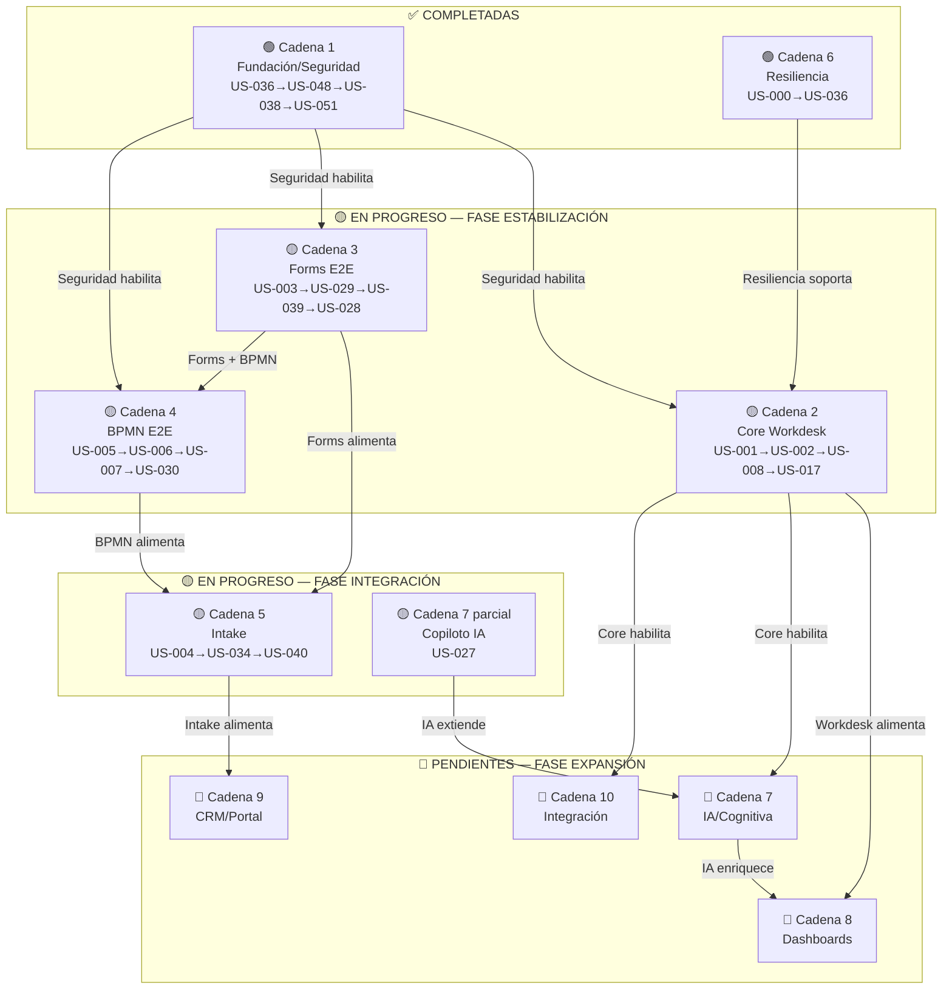
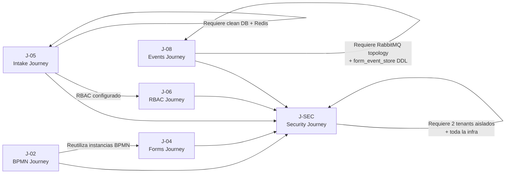
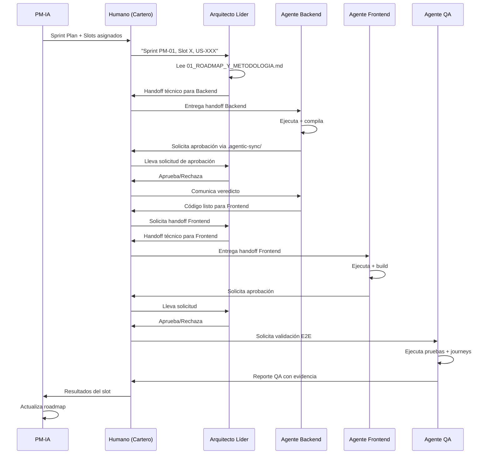

# 🏛️ IBPMS Platform — Roadmap Maestro y Metodología de Gobernanza

| Campo         | Valor                                      |
|---------------|--------------------------------------------|
| **Fecha**     | 2026-06-02                                 |
| **Versión**   | v1.0                                       |
| **Autor**     | PM-IA (Project Manager — Inteligencia Artificial) |
| **Estado**    | ✅ ACTIVO                                   |
| **Documento** | `docs/sprints/gobernanza_pm/01_ROADMAP_Y_METODOLOGIA.md` |

---

## 1. Resumen Ejecutivo

El proyecto IBPMS Platform se encuentra en un estado de **caos controlable pero urgente**. De las 56 Historias de Usuario distribuidas en 7 Épicas, solo 12 (21%) están genuinamente completadas, mientras que un 55% permanece sin iniciar. La cobertura de QA global es de apenas ~15%, y varias US declaradas como "completadas" poseen 0% de validación QA, lo que las convierte en **falsos positivos operativos**. El caso más grave es US-008, declarada operativa con apenas un 10% de scaffolding y datos hardcodeados con mocks.

La causa raíz no es falta de capacidad técnica sino **ausencia de gobernanza de integración**. Los agentes de IA y desarrolladores humanos han trabajado en silos, completando Criterios de Aceptación individuales sin considerar las dependencias funcionales entre Historias de Usuario. Esto ha producido un ecosistema donde componentes "terminados" no pueden interoperar: el Kanban (US-008) no consume datos reales del Workdesk (US-002), el motor BPMN (US-005) tiene desalineación Entity/DDL, y la tabla `form_event_store` — crítica para CQRS — simplemente no existe, bloqueando toda la cadena de formularios.

Este documento establece la **Metodología de Cadenas de Capacidad (Capability Chains)** como marco rector. En lugar de desarrollar Historias de Usuario aisladas, el desarrollo seguirá cadenas funcionales donde cada US habilita a la siguiente. Se definen 3 fases (Estabilización, Integración, Expansión), una Definición de Terminado (DoD) estricta sin tolerancia a mocks, y un ciclo de vida de sprint de 10 días con roles claramente delimitados entre PM-IA, Arquitecto Líder, Agentes Especialistas y los 2 desarrolladores humanos que actúan como "Carteros" de mensajes inter-agente.

---

## 2. Diagnóstico del Estado Actual

### 2.1 Métricas Globales

| Métrica                              | Valor          | Evaluación  |
|--------------------------------------|----------------|-------------|
| Total de Historias de Usuario        | 56             | —           |
| Épicas                               | 7 (A–G)        | —           |
| US Completadas                       | 12 (21%)       | 🔴 Crítico  |
| US en Construcción (>60%)            | 6              | 🟡 En riesgo|
| US en Construcción (<50%)            | 2              | 🟡 En riesgo|
| US en Scaffolding                    | 5              | 🔴 Crítico  |
| US Pendientes (sin iniciar)          | 31 (55%)       | 🔴 Crítico  |
| Cobertura QA Global                  | ~15%           | 🔴 Crítico  |
| US "Completadas" con 0% QA           | Varias         | 🔴 Crítico  |
| Conflictos de merge activos          | 4 bloques en `coverage_matrix.md` | 🔴 Bloqueante |
| Falsos positivos detectados          | US-008 (10% real, declarada operativa) | 🔴 Crítico |
| Antigüedad de la matriz de cobertura | 4 sprints desactualizada | 🔴 Crítico |
| Sprints documentados                 | S0–S7 (actualmente Sprint 7) | —  |
| Escenarios UAT definidos             | 277 en 12 journeys | 🟢 Bueno |
| US cubiertas por UAT                 | 21/56 (37.5%)  | 🟡 Parcial  |
| Archivos en `.agentic-sync/`         | 516            | ⚠️ Inflación|
| Workflows de gobernanza              | 27             | ⚠️ Excesivo |
| Skills de agente                     | 14             | —           |

### 2.2 Stack Tecnológico

| Capa          | Tecnología                                                |
|---------------|-----------------------------------------------------------|
| **Backend**   | Java 17, Spring Boot, Arquitectura Hexagonal (`com.ibpms.poc`), Layered (`com.ibpms.core`) |
| **Frontend**  | Vue 3, Pinia, TypeScript, Vitest                          |
| **Infra**     | Spring Boot en host (`:8080`), PostgreSQL + Redis + RabbitMQ en Docker |
| **Equipo**    | 2 desarrolladores humanos + múltiples agentes IA orquestados via Antigravity |
| **Modelo de Comunicación** | Humano como "Cartero" entre Arquitecto Líder y Agentes Especialistas |

### 2.3 Archivos Frontend Problemáticos (Deuda Técnica)

| Archivo                        | Tamaño | Problema                     |
|--------------------------------|--------|------------------------------|
| `Workdesk.vue`                 | 71 KB  | Componente monolítico        |
| `useFormDesignerStore.ts`      | 84 KB  | Store excesivamente grande   |

### 2.4 Gaps Críticos Identificados

| ID       | Descripción                                              | Severidad | Cadena Afectada |
|----------|----------------------------------------------------------|-----------|-----------------|
| B-J04-01 | `form_event_store` no existe → CQRS falla completamente | P0        | Cadena 3 (Forms) |
| OBS-1    | US-005 CA-68: Desalineación Entity/DDL en motor BPMN     | P1        | Cadena 4 (BPMN)  |
| —        | US-008 Kanban usa datos mock hardcodeados                | P1        | Cadena 2 (Workdesk) |
| —        | US-025 Dashboard Cards al 11% con datos mock             | P2        | Cadena 8 (Dashboards) |
| —        | US-043 CA-6: Deuda técnica en alertas SLA                | P2        | Cadena 5 (Intake) |

---

## 3. Metodología: Cadenas de Capacidad (Capability Chains)

### 3.1 Concepto Fundamental

> **REGLA CARDINAL**: No se desarrollan más Historias de Usuario aisladas. Todo desarrollo sigue una **Cadena de Capacidad** donde cada US habilita funcionalmente a la siguiente.

Una Cadena de Capacidad es una secuencia ordenada de Historias de Usuario que, en conjunto, entregan una **capacidad de negocio completa y verificable End-to-End**. El principio es simple:

- **US-A → US-B** significa que US-B **depende** de que US-A esté genuinamente completa (no solo declarada completa).
- Una US no puede considerarse "terminada" si la US que depende de ella no puede consumir sus servicios reales.
- El avance se mide por **cadenas cerradas**, no por US individuales.

Este enfoque erradica el problema histórico del proyecto: US que individualmente parecen "completas" pero que no interoperan porque fueron desarrolladas sin considerar sus dependencias funcionales.

### 3.2 Inventario de Cadenas

#### 🟢 Cadena 1 — Fundación / Seguridad
**Capacidad**: Infraestructura de seguridad base (autenticación, autorización, tenant isolation).

| Orden | US     | Descripción                | Estado  | QA   |
|-------|--------|----------------------------|---------|------|
| 1     | US-036 | Infraestructura de seguridad base | ✅ Done | —    |
| 2     | US-048 | Configuración multi-tenant | ✅ Done | —    |
| 3     | US-038 | RBAC y permisos            | ✅ Done | —    |
| 4     | US-051 | Auditoría de seguridad     | ✅ Done | —    |

**Estado de Cadena**: ✅ **COMPLETADA**

---

#### 🟡 Cadena 2 — Core Workdesk
**Capacidad**: Bandeja de trabajo operativa con tareas reales asignadas, vista Kanban funcional, y gestión de tareas.

| Orden | US     | Descripción           | Estado               | QA   |
|-------|--------|-----------------------|----------------------|------|
| 1     | US-001 | Workdesk base         | ✅ Done              | —    |
| 2     | US-002 | Claim/Unclaim de tareas | ~75% en construcción | Parcial |
| 3     | US-008 | Vista Kanban          | ~10% (mocks!)        | 0%   |
| 4     | US-017 | Gestión avanzada de tareas | ~50-95% (conflicto merge) | Conflicto |

**Estado de Cadena**: 🔴 **CRÍTICA** — US-008 es un falso positivo, US-017 tiene conflictos de merge sin resolver.

---

#### 🟡 Cadena 3 — Forms End-to-End
**Capacidad**: Diseño, renderizado, ejecución y almacenamiento de formularios dinámicos con eventos CQRS.

| Orden | US     | Descripción           | Estado               | QA   |
|-------|--------|-----------------------|----------------------|------|
| 1     | US-003 | Diseñador de formularios | ✅ Done            | 0%   |
| 2     | US-029 | Ejecución de formularios | ~72% en construcción | Parcial |
| 3     | US-039 | Validación de formularios | ~87% en construcción | Parcial |
| 4     | US-028 | Almacenamiento de formularios | ✅ Done        | —    |

**Estado de Cadena**: 🟡 **EN PROGRESO** — Bloqueada por B-J04-01 (`form_event_store` no existe).

---

#### 🟡 Cadena 4 — BPMN End-to-End
**Capacidad**: Motor de procesos BPMN completo (modelado, despliegue, ejecución, monitoreo).

| Orden | US     | Descripción           | Estado               | QA   |
|-------|--------|-----------------------|----------------------|------|
| 1     | US-005 | Motor BPMN            | ~97% en construcción | 0%   |
| 2     | US-006 | Despliegue BPMN       | Pendiente            | 0%   |
| 3     | US-007 | Ejecución BPMN        | ~94% en construcción | Parcial |
| 4     | US-030 | Monitoreo BPMN        | ~85% en construcción | Parcial |

**Estado de Cadena**: 🟡 **EN PROGRESO** — US-005 tiene desalineación Entity/DDL (OBS-1), US-006 pendiente rompe la cadena.

---

#### 🟡 Cadena 5 — Intake (Recepción de Solicitudes)
**Capacidad**: Portal de recepción, procesamiento y enrutamiento de solicitudes ciudadanas.

| Orden | US     | Descripción           | Estado               | QA   |
|-------|--------|-----------------------|----------------------|------|
| 1     | US-004 | Formulario de intake  | ~71% en construcción | Parcial |
| 2     | US-034 | Procesamiento de intake | ✅ Done            | —    |
| 3     | US-040 | Enrutamiento inteligente | Pendiente          | 0%   |

**Estado de Cadena**: 🟡 **EN PROGRESO** — US-004 necesita cierre, US-040 pendiente.

---

#### 🟢 Cadena 6 — Resiliencia
**Capacidad**: Health checks, circuit breakers, resiliencia de infraestructura.

| Orden | US     | Descripción           | Estado  | QA   |
|-------|--------|-----------------------|---------|------|
| 1     | US-000 | Health & Resiliencia  | ✅ Done | —    |
| 2     | US-036 | Infraestructura base  | ✅ Done | —    |

**Estado de Cadena**: ✅ **COMPLETADA**

---

#### 🔴 Cadena 7 — IA / Cognitiva
**Capacidad**: Copiloto IA, procesamiento NLP, análisis predictivo, automatización cognitiva.

| Orden | US     | Descripción           | Estado               | QA   |
|-------|--------|-----------------------|----------------------|------|
| 1     | US-027 | Copiloto IA base      | ~65% en construcción | Parcial |
| 2     | US-032 | Motor NLP             | Pendiente            | 0%   |
| 3     | US-052 | Análisis predictivo   | Pendiente            | 0%   |
| 4     | US-053 | Automatización cognitiva | Pendiente          | 0%   |
| 5     | US-054 | Recomendaciones IA    | Pendiente            | 0%   |
| 6     | US-056 | Integración ML        | Pendiente            | 0%   |
| 7     | US-057 | Dashboard cognitivo   | Pendiente            | 0%   |

**Estado de Cadena**: 🔴 **INCIPIENTE** — Solo US-027 iniciada.

---

#### 🔴 Cadena 8 — Dashboards
**Capacidad**: Paneles de control ejecutivos y operativos con datos reales.

| Orden | US     | Descripción           | Estado               | QA   |
|-------|--------|-----------------------|----------------------|------|
| 1     | US-025 | Cards de dashboard    | ~11% (mocks)         | 0%   |
| 2     | US-009 | Dashboard operativo   | Pendiente            | 0%   |
| 3     | US-018 | Dashboard ejecutivo   | Pendiente            | 0%   |

**Estado de Cadena**: 🔴 **BLOQUEADA** — US-025 tiene datos mock, no puede alimentar dashboards reales.

---

#### 🔴 Cadena 9 — CRM / Portal Ciudadano
**Capacidad**: Portal de autoservicio ciudadano, CRM, gestión de contactos.

| Orden | US                      | Descripción           | Estado    | QA   |
|-------|-------------------------|-----------------------|-----------|------|
| 1-8   | US-019 a US-026         | Módulos CRM/Portal    | Pendiente | 0%   |
| 9     | US-040                  | Enrutamiento          | Pendiente | 0%   |
| 10    | US-041                  | Portal autoservicio   | Pendiente | 0%   |

**Estado de Cadena**: 🔴 **NO INICIADA**

---

#### 🔴 Cadena 10 — Integración con Sistemas Externos
**Capacidad**: Conectores, APIs externas, interoperabilidad con sistemas legacy.

| Orden | US     | Descripción           | Estado    | QA   |
|-------|--------|-----------------------|-----------|------|
| 1     | US-033 | Conectores base       | Pendiente | 0%   |
| 2     | US-035 | APIs externas         | Pendiente | 0%   |
| 3     | US-010 | Interoperabilidad     | Pendiente | 0%   |
| 4     | US-049 | Integración legacy    | Pendiente | 0%   |

**Estado de Cadena**: 🔴 **NO INICIADA**

---

### 3.3 Diagrama de Dependencias entre Cadenas



### 3.4 Diagrama de Dependencias UAT Journeys



---

## 4. Roadmap por Fases

### 4.1 Fase de Estabilización — Sprint PM-01 (~2 semanas)

> **Objetivo**: Cerrar las cadenas 2, 3 y 4. Eliminar TODOS los mocks. QA obligatorio para US completadas con 0% de cobertura.

| Prioridad | Cadena | US Objetivo | Acción Requerida                                    | Criterio de Éxito        |
|-----------|--------|-------------|------------------------------------------------------|--------------------------|
| P0        | 2      | US-002      | Completar CAs restantes de claim/unclaim              | US-002 ≥ 95%             |
| P0        | 3      | US-029      | Completar ejecución de formularios + crear `form_event_store` | US-029 ≥ 95%, B-J04-01 resuelto |
| P0        | 4      | US-007      | Completar CAs restantes de ejecución BPMN             | US-007 ≥ 98%             |
| P0        | 4      | US-030      | Completar monitoreo BPMN                              | US-030 ≥ 95%             |
| P1        | 2      | US-008      | **Reemplazar TODOS los mocks** con datos reales del Workdesk | US-008 ≥ 80%, 0 mocks |
| P1        | 2      | US-017      | Resolver conflictos de merge + estabilizar             | US-017 ≥ 90%, 0 conflictos |
| P1        | 4      | US-005      | Resolver OBS-1 (Entity/DDL mismatch)                   | DDL alineado con entidades |
| P2        | QA     | US-003, US-005, US-043, US-048 | Sprint QA: ejecutar pruebas completas | QA ≥ 50% cada una       |

**Entregables del Sprint PM-01**:
1. Cadenas 2, 3 y 4 con todas las US ≥ 90%
2. `form_event_store` creada y operativa (DDL + migración)
3. US-008 sin ningún mock — consumiendo datos reales vía API
4. US-017 sin conflictos de merge
5. US-005 con Entity/DDL alineados
6. QA ≥ 50% para las 4 US con 0% de cobertura
7. `coverage_matrix.md` actualizada y sin conflictos

---

### 4.2 Fase de Integración — Sprint PM-02 (~2 semanas)

> **Objetivo**: Cerrar la cadena 5 (Intake). Completar US-027 (Copiloto IA). Ejecutar journeys J-02 y J-04 completos.

| Prioridad | Cadena | US Objetivo | Acción Requerida                                    | Criterio de Éxito        |
|-----------|--------|-------------|------------------------------------------------------|--------------------------|
| P0        | 5      | US-004      | Completar formulario de intake                        | US-004 ≥ 95%             |
| P0        | 5      | US-040      | Implementar enrutamiento inteligente                  | US-040 ≥ 80%             |
| P1        | 7      | US-027      | Completar Copiloto IA base                            | US-027 ≥ 90%             |
| P1        | E2E    | J-02        | Ejecutar Journey J-02 completo                        | Pass rate ≥ 80%          |
| P1        | E2E    | J-04        | Ejecutar Journey J-04 completo (depende de J-02)      | Pass rate ≥ 80%          |
| P2        | QA     | Global      | Elevar cobertura QA global                            | QA global ≥ 35%          |

**Entregables del Sprint PM-02**:
1. Cadena 5 completamente cerrada
2. US-027 operativa sin mocks
3. Journeys J-02 y J-04 ejecutados con evidencia
4. Cobertura QA global ≥ 35%

---

### 4.3 Fase de Expansión — Sprint PM-03+ (estimación abierta)

> **Objetivo**: Desarrollo de capacidades avanzadas (Cadenas 7–10). Solo se inicia cuando las Fases 1 y 2 estén certificadas.

| Sprint    | Cadenas      | Foco                                              |
|-----------|--------------|----------------------------------------------------|
| PM-03     | 7 (parcial)  | Motor NLP (US-032), Análisis predictivo (US-052)   |
| PM-04     | 8            | Dashboard operativo (US-009), Dashboard ejecutivo (US-018) |
| PM-05     | 9 (parcial)  | Portal ciudadano (primeras 4 US de US-019 a US-022)|
| PM-06     | 10           | Conectores e integración con sistemas externos     |
| PM-07+    | 7, 9 (resto) | Completar IA avanzada y CRM completo               |

> [!IMPORTANT]
> La Fase de Expansión NO puede iniciarse hasta que las Fases 1 y 2 estén **certificadas** con:
> - Todas las cadenas 2, 3, 4 y 5 al 100%
> - QA global ≥ 40%
> - Journeys J-02 y J-04 pasando al ≥ 80%
> - Zero mocks en producción

---

## 5. Definición de Terminado (DoD)

> [!CAUTION]
> Una Historia de Usuario **SOLO** se considera "Terminada" cuando cumple **TODOS** los siguientes criterios sin excepción. Cualquier agente o humano que declare una US como terminada sin cumplir estos criterios será rechazado.

### 5.1 Checklist Obligatorio

| #  | Criterio                                    | Verificación                                      |
|----|---------------------------------------------|---------------------------------------------------|
| 1  | ✅ **Backend Completo**                      | Todos los CAs del backend implementados, compilando sin errores (`mvn clean compile`) |
| 2  | ✅ **Frontend Completo**                     | Todos los CAs del frontend implementados, build exitoso (`npm run build`) |
| 3  | ✅ **QA ≥ 80%**                              | Cobertura de pruebas unitarias + integración ≥ 80% de los CAs |
| 4  | ✅ **E2E Journey Pass**                      | Al menos 1 journey UAT que incluya esta US ejecutado y pasando |
| 5  | ✅ **Zero Mocks**                            | Ningún `mockAdapter`, dato hardcodeado, o stub en el código entregado |
| 6  | ✅ **Coverage Matrix Actualizada**           | Fila de la US en `coverage_matrix.md` actualizada con estado real |
| 7  | ✅ **Contrato API Verificado**               | Endpoint(s) de la US verificados contra el contrato OpenAPI/Swagger |
| 8  | ✅ **Sin Conflictos de Merge**               | Branch de la US mergeable sin conflictos contra `develop` |
| 9  | ✅ **Dependencias de Cadena Satisfechas**    | Todas las US previas en la cadena también cumplen este DoD |
| 10 | ✅ **Revisión por Arquitecto Líder**         | Aprobación explícita del Arquitecto Líder en `.agentic-sync/` |

### 5.2 Criterios de Rechazo Automático

Una US será **rechazada automáticamente** si:

- Contiene `mockAdapter` o `hardcoded` data en cualquier archivo
- El `mvn clean compile` o `npm run build` fallan
- La cobertura QA es inferior al 80%
- No existe evidencia de ejecución E2E (screenshots, logs, o video)
- La `coverage_matrix.md` no refleja el estado real

---

## 6. Política Anti-Alucinaciones para Agentes

> [!WARNING]
> Las siguientes 5 reglas son de cumplimiento **OBLIGATORIO** para todo agente de IA que opere en el proyecto IBPMS. Su violación constituye un defecto de gobernanza que será rastreado y reportado.

### Regla 1: No Declarar Completitud sin Evidencia Empírica
```
❌ PROHIBIDO: "La funcionalidad está implementada y funcionando correctamente."
✅ OBLIGATORIO: "La funcionalidad está implementada. Evidencia: [screenshot/log/test output]. 
   Build: mvn clean compile → SUCCESS. Tests: 12/12 passing."
```

### Regla 2: No Inventar Endpoints o Tablas
```
❌ PROHIBIDO: Asumir que un endpoint o tabla existe sin verificar.
✅ OBLIGATORIO: Verificar existencia via grep en código fuente o consulta al 
   contrato API antes de referenciar cualquier recurso.
```

### Regla 3: No Usar Mocks como Solución Permanente
```
❌ PROHIBIDO: Implementar mockAdapter, datos hardcodeados, o stubs como entrega final.
✅ OBLIGATORIO: Toda integración debe usar APIs reales. Si la API no existe aún, 
   DETENER y reportar dependencia bloqueante.
```

### Regla 4: No Omitir Dependencias de Cadena
```
❌ PROHIBIDO: Iniciar US-008 (Kanban) sin verificar que US-002 (Claim) está genuinamente completa.
✅ OBLIGATORIO: Antes de iniciar una US, verificar el estado REAL de todas las US 
   previas en su cadena consultando este roadmap.
```

### Regla 5: No Reportar Progreso sin Compilación Exitosa
```
❌ PROHIBIDO: "He completado los CAs 1-5 de US-029." (sin compilar)
✅ OBLIGATORIO: "He completado los CAs 1-5 de US-029. 
   Compilación: mvn clean compile → BUILD SUCCESS (0 errors, 2 warnings).
   Build frontend: npm run build → Done in 12.3s, 0 errors."
```

---

## 7. Ciclo de Vida del Sprint (10 días)

```mermaid
gantt
    title Ciclo de Vida — Sprint PM (10 días)
    dateFormat  X
    axisFormat %s

    section Día 1 — Planificación
    PM-IA revisa estado de cadenas           :d1a, 0, 1
    PM-IA selecciona US a trabajar           :d1b, 0, 1
    Contratos API definidos/verificados      :d1c, 0, 1

    section Día 2-3 — Arquitectura
    Arquitecto Líder lee Roadmap             :d2a, 1, 3
    Arquitecto crea handoffs                 :d2b, 1, 3

    section Día 3-8 — Ejecución
    Infra/DevOps ejecuta                     :d3a, 2, 5
    Backend ejecuta                          :d3b, 3, 7
    Frontend ejecuta                         :d3c, 5, 8

    section Día 9-10 — QA y Cierre
    QA: Validación + UAT Journeys            :d4a, 8, 10
    PM-IA revisa y actualiza roadmap         :d4b, 9, 10
    Cierre de sprint                         :d4c, 9, 10
```



### 7.1 Detalle por Día

| Día   | Responsable          | Actividad                                                    | Artefacto Producido |
|-------|----------------------|--------------------------------------------------------------|---------------------|
| **1** | PM-IA                | Revisar estado de las cadenas de capacidad                   | Backlog del sprint priorizado |
| **1** | PM-IA                | Seleccionar US a trabajar en el sprint                       | Slots de ejecución asignados |
| **1** | PM-IA + Arquitecto   | Definir/verificar contratos API para las US seleccionadas    | Contratos API en `docs/api/` |
| **2-3** | Arquitecto Líder   | **Leer este roadmap PRIMERO**. Crear handoffs técnicos       | Handoffs en `.agentic-sync/` |
| **3-5** | Agente Infra/DevOps | Ejecutar prerequisitos de infraestructura (DDL, migraciones) | Scripts SQL, Docker configs |
| **3-8** | Agente Backend      | Implementar CAs de backend. Compilar con `mvn clean compile` | Código Java + tests |
| **5-8** | Agente Frontend     | Implementar CAs de frontend. Build con `npm run build`       | Código Vue/TS + tests |
| **9-10** | Agente QA          | Ejecutar pruebas unitarias, integración y E2E journeys       | Reportes de prueba + evidencia |
| **10** | PM-IA               | Revisar resultados, actualizar roadmap, cerrar sprint        | Roadmap actualizado, sprint report |

### 7.2 Orden de Ejecución Secuencial Estricto

```
Infra/DevOps → Backend → Frontend → QA
```

> [!IMPORTANT]
> **No se permite ejecución paralela entre capas para la misma US.** El Backend no puede iniciar sin que Infra haya completado los prerequisites. El Frontend no puede iniciar sin que el Backend compile exitosamente. QA no puede ejecutar sin que el Frontend haga build exitoso.

---

## 8. Métricas de Gobierno

### 8.1 KPIs del Proyecto

| Métrica                          | Fórmula                                                    | Meta Sprint PM-01 | Meta Sprint PM-02 |
|----------------------------------|-------------------------------------------------------------|--------------------|--------------------|
| **Completion Rate**              | US completadas (DoD) / Total US × 100                      | ≥ 30%              | ≥ 40%              |
| **QA Coverage**                  | US con QA ≥ 80% / Total US completadas × 100               | ≥ 50%              | ≥ 70%              |
| **False Positive Rate**          | US declaradas completas sin DoD / Total US declaradas × 100 | 0%                 | 0%                 |
| **Agent Rejection Rate**         | Handoffs rechazados / Total handoffs × 100                  | < 20%              | < 10%              |
| **Chain Closure Rate**           | Cadenas cerradas / Total cadenas × 100                      | 4/10 (40%)         | 5/10 (50%)         |
| **Mock Contamination Index**     | Archivos con mock/hardcoded data                            | 0                  | 0                  |
| **Merge Conflict Backlog**       | Conflictos de merge sin resolver                            | 0                  | 0                  |
| **E2E Journey Pass Rate**        | Journeys pasando / Journeys ejecutados × 100                | ≥ 60%              | ≥ 80%              |

### 8.2 Dashboard de Seguimiento

El PM-IA actualizará las siguientes métricas al cierre de cada sprint en este mismo documento (sección Apéndice B):

```
Sprint PM-01 (fecha_inicio — fecha_fin):
  - Completion Rate:     ___%
  - QA Coverage:         ___%
  - False Positive Rate: ___%
  - Chains Closed:       _/10
  - Mock Index:          ___ archivos
  - Merge Conflicts:     ___
```

---

## 9. Protocolo de Comunicación Inter-Agente

### 9.1 Flujo de Mensajería (Modelo "Cartero")



### 9.2 Reglas del Modelo Cartero

1. **El humano NO toma decisiones técnicas** — solo transporta mensajes fielmente.
2. **Cada mensaje debe incluir**: Sprint ID, Slot #, US-XXX, CAs objetivo, Branch de trabajo.
3. **Los handoffs deben ser autocontenidos** — el agente receptor NO debe necesitar contexto adicional.
4. **Todo rechazo debe incluir razón específica** — "No aprobado" sin justificación es inválido.
5. **El PM-IA es el único que puede modificar este roadmap** — ningún otro agente tiene autoridad para alterar prioridades o fases.

---

## 10. Apéndice A: Inventario Completo de Historias de Usuario

> Última actualización: 2026-06-02

| US     | Épica | Cadena | Descripción                          | Estado              | % Avance | QA %  | Mocks? |
|--------|-------|--------|--------------------------------------|---------------------|----------|-------|--------|
| US-000 | A     | 6      | Health & Resiliencia                 | ✅ Completada       | 100%     | —     | No     |
| US-001 | B     | 2      | Workdesk base                        | ✅ Completada       | 100%     | —     | No     |
| US-002 | B     | 2      | Claim/Unclaim de tareas              | 🟡 En construcción  | ~75%     | Parcial | No   |
| US-003 | C     | 3      | Diseñador de formularios             | ✅ Completada       | 100%     | 0%    | No     |
| US-004 | D     | 5      | Formulario de intake                 | 🟡 En construcción  | ~71%     | Parcial | No   |
| US-005 | C     | 4      | Motor BPMN                           | 🟡 En construcción  | ~97%     | 0%    | No     |
| US-006 | C     | 4      | Despliegue BPMN                      | 🔴 Pendiente        | 0%       | 0%    | —      |
| US-007 | C     | 4      | Ejecución BPMN                       | 🟡 En construcción  | ~94%     | Parcial | No   |
| US-008 | B     | 2      | Vista Kanban                         | 🔴 Falso positivo   | ~10%     | 0%    | **SÍ** |
| US-009 | E     | 8      | Dashboard operativo                  | 🔴 Pendiente        | 0%       | 0%    | —      |
| US-010 | F     | 10     | Interoperabilidad                    | 🔴 Pendiente        | 0%       | 0%    | —      |
| US-017 | B     | 2      | Gestión avanzada de tareas           | 🟡 Conflicto merge  | ~50-95%  | Conflicto | No |
| US-018 | E     | 8      | Dashboard ejecutivo                  | 🔴 Pendiente        | 0%       | 0%    | —      |
| US-019 | G     | 9      | CRM — Módulo 1                       | 🔴 Pendiente        | 0%       | 0%    | —      |
| US-020 | G     | 9      | CRM — Módulo 2                       | 🔴 Pendiente        | 0%       | 0%    | —      |
| US-021 | G     | 9      | CRM — Módulo 3                       | 🔴 Pendiente        | 0%       | 0%    | —      |
| US-022 | G     | 9      | CRM — Módulo 4                       | 🔴 Pendiente        | 0%       | 0%    | —      |
| US-023 | G     | 9      | CRM — Módulo 5                       | 🔴 Pendiente        | 0%       | 0%    | —      |
| US-024 | G     | 9      | CRM — Módulo 6                       | 🔴 Pendiente        | 0%       | 0%    | —      |
| US-025 | E     | 8      | Cards de dashboard                   | 🔴 Scaffolding      | ~11%     | 0%    | **SÍ** |
| US-026 | G     | 9      | CRM — Módulo 8                       | 🔴 Pendiente        | 0%       | 0%    | —      |
| US-027 | F     | 7      | Copiloto IA base                     | 🟡 En construcción  | ~65%     | Parcial | No   |
| US-028 | C     | 3      | Almacenamiento de formularios        | ✅ Completada       | 100%     | —     | No     |
| US-029 | C     | 3      | Ejecución de formularios             | 🟡 En construcción  | ~72%     | Parcial | No   |
| US-030 | C     | 4      | Monitoreo BPMN                       | 🟡 En construcción  | ~85%     | Parcial | No   |
| US-032 | F     | 7      | Motor NLP                            | 🔴 Pendiente        | 0%       | 0%    | —      |
| US-033 | F     | 10     | Conectores base                      | 🔴 Pendiente        | 0%       | 0%    | —      |
| US-034 | D     | 5      | Procesamiento de intake              | ✅ Completada       | 100%     | —     | No     |
| US-035 | F     | 10     | APIs externas                        | 🔴 Pendiente        | 0%       | 0%    | —      |
| US-036 | A     | 1, 6   | Infraestructura de seguridad base    | ✅ Completada       | 100%     | —     | No     |
| US-038 | A     | 1      | RBAC y permisos                      | ✅ Completada       | 100%     | —     | No     |
| US-039 | C     | 3      | Validación de formularios            | 🟡 En construcción  | ~87%     | Parcial | No   |
| US-040 | D     | 5, 9   | Enrutamiento inteligente             | 🔴 Pendiente        | 0%       | 0%    | —      |
| US-041 | G     | 9      | Portal autoservicio                  | 🔴 Pendiente        | 0%       | 0%    | —      |
| US-043 | D     | 5      | Alertas SLA                          | 🟡 Deuda técnica    | —        | 0%    | No     |
| US-048 | A     | 1      | Configuración multi-tenant           | ✅ Completada       | 100%     | 0%    | No     |
| US-049 | F     | 10     | Integración legacy                   | 🔴 Pendiente        | 0%       | 0%    | —      |
| US-051 | A     | 1      | Auditoría de seguridad               | ✅ Completada       | 100%     | —     | No     |
| US-052 | F     | 7      | Análisis predictivo                  | 🔴 Pendiente        | 0%       | 0%    | —      |
| US-053 | F     | 7      | Automatización cognitiva             | 🔴 Pendiente        | 0%       | 0%    | —      |
| US-054 | F     | 7      | Recomendaciones IA                   | 🔴 Pendiente        | 0%       | 0%    | —      |
| US-056 | F     | 7      | Integración ML                       | 🔴 Pendiente        | 0%       | 0%    | —      |
| US-057 | F     | 7      | Dashboard cognitivo                  | 🔴 Pendiente        | 0%       | 0%    | —      |

> **Nota**: Las US no listadas (US-011 a US-016, US-031, US-037, US-042, US-044 a US-047, US-050, US-055) no están contempladas en las 56 US identificadas del alcance actual o pertenecen a US internas/técnicas no asignadas a cadenas. Cualquier discrepancia debe ser reconciliada por el PM-IA.

---

## 11. Apéndice B: Registro de Sprints

### Sprint PM-01 (Fecha inicio: ____ — Fecha fin: ____)

| Métrica                  | Objetivo | Real | Estado |
|--------------------------|----------|------|--------|
| Completion Rate          | ≥ 30%   |      |        |
| QA Coverage              | ≥ 50%   |      |        |
| False Positive Rate      | 0%      |      |        |
| Chains Closed            | 4/10    |      |        |
| Mock Contamination Index | 0       |      |        |
| Merge Conflicts          | 0       |      |        |
| E2E Journey Pass Rate    | ≥ 60%   |      |        |
| Agent Rejection Rate     | < 20%   |      |        |

### Sprint PM-02 (Fecha inicio: ____ — Fecha fin: ____)

| Métrica                  | Objetivo | Real | Estado |
|--------------------------|----------|------|--------|
| Completion Rate          | ≥ 40%   |      |        |
| QA Coverage              | ≥ 70%   |      |        |
| False Positive Rate      | 0%      |      |        |
| Chains Closed            | 5/10    |      |        |
| Mock Contamination Index | 0       |      |        |
| Merge Conflicts          | 0       |      |        |
| E2E Journey Pass Rate    | ≥ 80%   |      |        |
| Agent Rejection Rate     | < 10%   |      |        |

---

## 12. Control de Versiones del Documento

| Versión | Fecha      | Autor | Cambio                                   |
|---------|------------|-------|------------------------------------------|
| v1.0    | 2026-06-02 | PM-IA | Creación inicial del Roadmap Maestro     |

---

> [!NOTE]
> Este documento es el **Single Source of Truth (SSOT)** para la gobernanza del proyecto IBPMS Platform. Todos los agentes de IA y desarrolladores humanos deben consultarlo antes de iniciar cualquier trabajo. Modificaciones solo autorizadas por el PM-IA.
