# 🎯 Sprint PM-01 — Guía de Ejecución Quirúrgica

| Campo             | Valor                                        |
|-------------------|----------------------------------------------|
| **Sprint**        | PM-01 (Fase de Estabilización)               |
| **Fecha Inicio**  | 2026-06-02                                   |
| **Duración**      | ~2 semanas (10 días hábiles)                 |
| **Autor**         | PM-IA                                        |
| **Estado**        | 🟢 ACTIVO                                    |
| **Branch Base**   | `sprint-8/pm-01`                             |
| **Documento Rector** | `docs/sprints/gobernanza_pm/01_ROADMAP_Y_METODOLOGIA.md` |

---

## 1. Meta del Sprint

> **Estabilizar las Cadenas de Capacidad 2 (Core Workdesk), 3 (Forms E2E) y 4 (BPMN E2E). Eliminar TODOS los mocks. Cerrar QA pendiente para US completadas con 0% de cobertura.**

### 1.1 Objetivos Específicos

| #  | Objetivo                                                     | Métrica de Éxito         |
|----|--------------------------------------------------------------|--------------------------|
| O1 | Completar US-002 (Claim/Unclaim) al ≥ 95%                   | CAs restantes cerrados   |
| O2 | Completar US-029 (Ejecución Forms) al ≥ 95%                 | `form_event_store` creada |
| O3 | Completar US-007 (Ejecución BPMN) al ≥ 98%                  | CAs restantes cerrados   |
| O4 | Completar US-030 (Monitoreo BPMN) al ≥ 95%                  | CAs restantes cerrados   |
| O5 | Reemplazar TODOS los mocks de US-008 (Kanban)                | 0 archivos con mock      |
| O6 | Resolver conflictos de merge en US-017                       | 0 bloques de conflicto   |
| O7 | Ejecutar QA para US-003, US-005, US-043, US-048              | QA ≥ 50% cada una        |
| O8 | Resolver `coverage_matrix.md` (4 bloques de conflicto)       | Archivo limpio y actual  |

---

## 2. Precondiciones — BLOQUEOS A RESOLVER ANTES DE INICIAR

> [!CAUTION]
> Las siguientes precondiciones son **BLOQUEANTES**. El sprint NO puede comenzar hasta que estén resueltas. El Humano (Cartero) debe ejecutar estas acciones ANTES de abrir cualquier chat con agentes.

### 2.1 Precondición 1: Resolver Conflictos en `coverage_matrix.md`

**Archivo**: `docs/requirements/coverage_matrix.md`
**Problema**: 4 bloques de conflicto de merge sin resolver
**Acción**:

```bash
# 1. Identificar conflictos
git diff --name-only --diff-filter=U

# 2. Abrir el archivo y buscar marcadores de conflicto
# Buscar: <<<<<<<, =======, >>>>>>>

# 3. Resolver manualmente conservando los datos más recientes
# REGLA: Si hay duda, conservar la versión con el % de avance MÁS ALTO

# 4. Marcar como resuelto
git add docs/requirements/coverage_matrix.md
git commit -m "fix: resolve 4 merge conflict blocks in coverage_matrix.md [PM-01 precondition]"
```

### 2.2 Precondición 2: Verificar Infraestructura Docker

**Acción**: Confirmar que PostgreSQL, Redis y RabbitMQ están operativos antes de cualquier trabajo de backend.

```bash
# Verificar contenedores Docker
docker ps --format "table {{.Names}}\t{{.Status}}\t{{.Ports}}"

# Verificar conectividad PostgreSQL
docker exec ibpms-postgres pg_isready -U ibpms

# Verificar conectividad Redis
docker exec ibpms-redis redis-cli ping

# Verificar RabbitMQ
docker exec ibpms-rabbitmq rabbitmqctl status
```

### 2.3 Precondición 3: Crear Branch del Sprint

```bash
git checkout develop
git pull origin develop
git checkout -b sprint-8/pm-01
git push -u origin sprint-8/pm-01
```

---

## 3. Backlog del Sprint — Slots de Ejecución

> [!IMPORTANT]
> Los slots están **ordenados por prioridad y dependencia**. Los slots con días superpuestos permiten ejecución paralela SOLO entre cadenas diferentes. **Nunca ejecutar 2 slots de la misma cadena en paralelo.**

### Mapa Visual de Ejecución

```mermaid
gantt
    title Sprint PM-01 — Mapa de Ejecución por Slots
    dateFormat X
    axisFormat Día %s

    section Cadena 2 — Workdesk
    Slot 1: US-002 Claim/Unclaim       :s1, 1, 3
    Slot 4: US-008 Eliminar Mocks      :s4, 5, 7
    Slot 5: US-017 Merge + Estabilizar :s5, 7, 8

    section Cadena 3 — Forms
    Slot 2: US-029 Form Execution      :s2, 2, 4

    section Cadena 4 — BPMN
    Slot 3: US-007 + US-030 BPMN       :s3, 4, 6

    section QA Sprint
    Slot 6: QA US-003,005,043,048      :s6, 8, 10

    section Precondiciones
    Resolver coverage_matrix.md        :crit, p1, 0, 1
    Verificar Docker infra             :crit, p2, 0, 1
```

---

### 📦 Slot 1 — US-002: Claim/Unclaim de Tareas (Cadena 2)

| Campo              | Valor                                           |
|--------------------|-------------------------------------------------|
| **Días**           | 1–3                                             |
| **US**             | US-002                                          |
| **Cadena**         | 2 (Core Workdesk)                               |
| **Estado Actual**  | ~75% en construcción                            |
| **Dependencia**    | US-001 ✅ (completada)                           |
| **Branch**         | `sprint-8/pm-01/us-002-claim`                   |
| **Objetivo**       | Completar TODOS los CAs restantes de claim/unclaim de tareas |

#### Instrucciones para el Cartero

**Paso 1** — Abrir chat con Arquitecto Líder:
```
Sprint PM-01, Slot 1, US-002 (Claim/Unclaim de Tareas).
Cadena 2 (Core Workdesk). Branch: sprint-8/pm-01/us-002-claim.

INSTRUCCIÓN OBLIGATORIA: Antes de crear el handoff, DEBES leer:
- docs/sprints/gobernanza_pm/01_ROADMAP_Y_METODOLOGIA.md (Sección 3.2, Cadena 2)

CONTEXTO: US-002 está al ~75%. US-001 (dependencia) está completada.
Identificar CAs pendientes y crear handoff para Backend primero, luego Frontend.

RECORDAR: DoD requiere Backend ✅ + Frontend ✅ + QA ≥ 80% + Zero Mocks + Build exitoso.
```

**Paso 2** — Arquitecto entrega handoff Backend → Cartero lleva a Agente Backend.
**Paso 3** — Backend completa, compila (`mvn clean compile`), solicita aprobación.
**Paso 4** — Cartero lleva solicitud al Arquitecto. Arquitecto aprueba/rechaza.
**Paso 5** — Si aprobado: Arquitecto crea handoff Frontend → Cartero lleva a Agente Frontend.
**Paso 6** — Frontend completa, build (`npm run build`), solicita aprobación.
**Paso 7** — Cartero lleva solicitud al Arquitecto. Arquitecto aprueba/rechaza.

#### Criterios de Aceptación del Slot

- [ ] Todos los CAs de US-002 implementados
- [ ] `mvn clean compile` → BUILD SUCCESS
- [ ] `npm run build` → 0 errors
- [ ] Claim/Unclaim funciona con datos reales de PostgreSQL
- [ ] Sin mocks ni datos hardcodeados
- [ ] Aprobación del Arquitecto Líder

---

### 📦 Slot 2 — US-029: Ejecución de Formularios (Cadena 3)

| Campo              | Valor                                           |
|--------------------|-------------------------------------------------|
| **Días**           | 2–4                                             |
| **US**             | US-029                                          |
| **Cadena**         | 3 (Forms E2E)                                   |
| **Estado Actual**  | ~72% en construcción                            |
| **Dependencia**    | US-003 ✅ (completada)                           |
| **Branch**         | `sprint-8/pm-01/us-029-form-exec`               |
| **Objetivo**       | Completar ejecución de formularios + CREAR `form_event_store` |

#### ⚠️ Acción Crítica: Crear `form_event_store`

> [!CAUTION]
> **Gap B-J04-01**: La tabla `form_event_store` NO EXISTE. Sin ella, todo el CQRS de formularios falla. Esta tabla DEBE ser creada como parte de este slot ANTES de cualquier otro trabajo.

**DDL requerido** (el Arquitecto debe especificar la estructura exacta en el handoff):
```sql
-- EJEMPLO REFERENCIAL — El Arquitecto debe definir la estructura definitiva
CREATE TABLE IF NOT EXISTS form_event_store (
    id              UUID PRIMARY KEY DEFAULT gen_random_uuid(),
    form_id         UUID NOT NULL,
    event_type      VARCHAR(100) NOT NULL,
    event_data      JSONB NOT NULL,
    created_at      TIMESTAMP WITH TIME ZONE DEFAULT NOW(),
    created_by      VARCHAR(255),
    tenant_id       UUID NOT NULL,
    version         INTEGER NOT NULL DEFAULT 1
);

CREATE INDEX idx_form_event_store_form_id ON form_event_store(form_id);
CREATE INDEX idx_form_event_store_tenant ON form_event_store(tenant_id);
```

#### Instrucciones para el Cartero

**Paso 1** — Abrir chat con Arquitecto Líder:
```
Sprint PM-01, Slot 2, US-029 (Ejecución de Formularios).
Cadena 3 (Forms E2E). Branch: sprint-8/pm-01/us-029-form-exec.

INSTRUCCIÓN OBLIGATORIA: Antes de crear el handoff, DEBES leer:
- docs/sprints/gobernanza_pm/01_ROADMAP_Y_METODOLOGIA.md (Sección 3.2, Cadena 3)

ACCIÓN CRÍTICA P0: La tabla form_event_store NO EXISTE (Gap B-J04-01).
El handoff de Backend DEBE incluir:
1. DDL completo para form_event_store
2. Script de migración Flyway/Liquibase
3. Entidad JPA correspondiente
4. Repository Spring Data

CONTEXTO: US-029 está al ~72%. US-003 (dependencia) está completada.
Identificar CAs pendientes y crear handoff para Infra → Backend → Frontend.

RECORDAR: DoD requiere Backend ✅ + Frontend ✅ + QA ≥ 80% + Zero Mocks.
```

**Paso 2–7** — Mismo flujo que Slot 1 (Arquitecto → Backend → Frontend → QA).

#### Criterios de Aceptación del Slot

- [ ] Tabla `form_event_store` creada en PostgreSQL
- [ ] Migración de base de datos incluida (Flyway o Liquibase)
- [ ] Entidad JPA + Repository funcionales
- [ ] Todos los CAs de US-029 implementados
- [ ] `mvn clean compile` → BUILD SUCCESS
- [ ] `npm run build` → 0 errors
- [ ] CQRS de formularios operativo con datos reales
- [ ] Sin mocks de BFF/prefill
- [ ] Aprobación del Arquitecto Líder

---

### 📦 Slot 3 — US-007 + US-030: Cadena BPMN (Cadena 4)

| Campo              | Valor                                           |
|--------------------|-------------------------------------------------|
| **Días**           | 4–6                                             |
| **US**             | US-007 (Ejecución BPMN) + US-030 (Monitoreo BPMN) |
| **Cadena**         | 4 (BPMN E2E)                                    |
| **Estado Actual**  | US-007 ~94%, US-030 ~85%                        |
| **Dependencia**    | US-005 ~97% (resolver OBS-1 primero)             |
| **Branch**         | `sprint-8/pm-01/us-007-030-bpmn`                |
| **Objetivo**       | Cerrar la cadena BPMN completando ejecución y monitoreo |

#### ⚠️ Prerequisito: Resolver OBS-1 en US-005

> [!WARNING]
> **OBS-1 (US-005 CA-68)**: Existe una desalineación entre las entidades Java y el DDL de la base de datos en el motor BPMN. Esto DEBE resolverse ANTES de trabajar en US-007 y US-030, ya que ambas dependen del motor BPMN.

#### Instrucciones para el Cartero

**Paso 1** — Abrir chat con Arquitecto Líder:
```
Sprint PM-01, Slot 3, US-007 (Ejecución BPMN) + US-030 (Monitoreo BPMN).
Cadena 4 (BPMN E2E). Branch: sprint-8/pm-01/us-007-030-bpmn.

INSTRUCCIÓN OBLIGATORIA: Antes de crear el handoff, DEBES leer:
- docs/sprints/gobernanza_pm/01_ROADMAP_Y_METODOLOGIA.md (Sección 3.2, Cadena 4)

PREREQUISITO BLOQUEANTE: OBS-1 (US-005 CA-68) — Desalineación Entity/DDL en motor BPMN.
El handoff DEBE incluir primero la corrección de OBS-1.

CONTEXTO:
- US-005 al ~97% (pero con OBS-1 pendiente)
- US-006 PENDIENTE — Evaluar si puede ejecutarse en paralelo o es bloqueante
- US-007 al ~94% — Faltan CAs finales
- US-030 al ~85% — Faltan CAs de monitoreo

Crear handoffs en orden: 
1. Fix OBS-1 (Backend) 
2. US-007 CAs restantes (Backend → Frontend)
3. US-030 CAs restantes (Backend → Frontend)
```

**Paso 2–7** — Flujo estándar por cada sub-entrega.

#### Criterios de Aceptación del Slot

- [ ] OBS-1 resuelto: Entidades Java alineadas con DDL
- [ ] US-007: Todos los CAs implementados, ejecución BPMN funcional E2E
- [ ] US-030: Todos los CAs implementados, monitoreo de instancias operativo
- [ ] `mvn clean compile` → BUILD SUCCESS
- [ ] `npm run build` → 0 errors
- [ ] Instancias BPMN ejecutables y monitoreables con datos reales
- [ ] Sin mocks
- [ ] Aprobación del Arquitecto Líder

---

### 📦 Slot 4 — US-008: Eliminación Total de Mocks en Kanban (Cadena 2)

| Campo              | Valor                                           |
|--------------------|-------------------------------------------------|
| **Días**           | 5–7                                             |
| **US**             | US-008                                          |
| **Cadena**         | 2 (Core Workdesk)                               |
| **Estado Actual**  | ~10% scaffolding con mocks hardcodeados — **FALSO POSITIVO** |
| **Dependencia**    | US-002 (debe estar cerrada del Slot 1)           |
| **Branch**         | `sprint-8/pm-01/us-008-kanban-real`              |
| **Objetivo**       | Reemplazar TODOS los mocks con datos reales del Workdesk |

> [!CAUTION]
> **ESTA US FUE DECLARADA OPERATIVA FALSAMENTE**. El Kanban actual muestra datos hardcodeados que no provienen de ningún servicio real. Este slot debe reconstruir la funcionalidad desde los CAs originales con integración real contra el backend de US-001/US-002.

#### Verificación Pre-Slot

Antes de iniciar, verificar que US-002 (Slot 1) está cerrada:
```bash
# Verificar que no hay mocks en US-002
grep -r "mockAdapter\|hardcoded\|mock" src/ --include="*.ts" --include="*.vue" | grep -i "claim\|unclaim\|task"
# Resultado esperado: 0 coincidencias

# Verificar compilación backend
cd backend && mvn clean compile
# Resultado esperado: BUILD SUCCESS
```

#### Instrucciones para el Cartero

**Paso 1** — Abrir chat con Arquitecto Líder:
```
Sprint PM-01, Slot 4, US-008 (Vista Kanban).
Cadena 2 (Core Workdesk). Branch: sprint-8/pm-01/us-008-kanban-real.

INSTRUCCIÓN OBLIGATORIA: Antes de crear el handoff, DEBES leer:
- docs/sprints/gobernanza_pm/01_ROADMAP_Y_METODOLOGIA.md (Sección 3.2, Cadena 2)

⚠️ ALERTA FALSO POSITIVO: US-008 fue declarada operativa al ~10% con mocks hardcodeados.
La implementación actual NO es válida. Se requiere reconstrucción completa.

PREREQUISITO: US-002 (Claim/Unclaim) debe estar completada (Slot 1).
El Kanban DEBE consumir datos reales del servicio de tareas de US-001/US-002.

ACCIÓN REQUERIDA:
1. Identificar y documentar TODOS los mocks/hardcoded data actuales
2. Diseñar integración real con API de tareas del Workdesk
3. Crear handoff Backend (endpoint de tareas agrupadas por estado para Kanban)
4. Crear handoff Frontend (Kanban consumiendo API real)

TOLERANCIA A MOCKS: CERO. Ni uno solo.
```

**Paso 2–7** — Flujo estándar.

#### Criterios de Aceptación del Slot

- [ ] **CERO** archivos con `mockAdapter`, `hardcoded`, o datos estáticos
- [ ] Kanban consume API real de tareas (`GET /api/tasks?groupBy=status`)
- [ ] Tareas se muestran agrupadas por estado real de la base de datos
- [ ] Drag & drop de tareas entre columnas actualiza estado en PostgreSQL
- [ ] `mvn clean compile` → BUILD SUCCESS
- [ ] `npm run build` → 0 errors
- [ ] Verificación manual: crear tarea → aparece en Kanban → mover → verificar en DB
- [ ] Aprobación del Arquitecto Líder

---

### 📦 Slot 5 — US-017: Resolución de Merge + Estabilización (Cadena 2)

| Campo              | Valor                                           |
|--------------------|-------------------------------------------------|
| **Días**           | 7–8                                             |
| **US**             | US-017                                          |
| **Cadena**         | 2 (Core Workdesk)                               |
| **Estado Actual**  | ~50-95% (rango incierto por conflictos de merge) |
| **Dependencia**    | US-008 (debe estar cerrada del Slot 4)           |
| **Branch**         | `sprint-8/pm-01/us-017-stabilize`                |
| **Objetivo**       | Resolver conflictos de merge + estabilizar gestión avanzada de tareas |

#### Diagnóstico de Conflictos (Día 7, primera hora)

```bash
# 1. Identificar archivos en conflicto
git checkout sprint-8/pm-01
git merge --no-commit --no-ff develop
git diff --name-only --diff-filter=U

# 2. Para cada archivo en conflicto:
#    - Abrir y contar marcadores <<<<<<< / =======/ >>>>>>>
#    - Documentar cada bloque de conflicto
#    - Determinar si es conflicto de lógica o de formato

# 3. Si hay conflictos complejos de lógica:
#    → Escalar al Arquitecto Líder con la lista de conflictos
#    → El Arquitecto decide qué versión conservar

# 4. Abortar merge si es necesario para investigar:
git merge --abort
```

#### Instrucciones para el Cartero

**Paso 1** — Abrir chat con Arquitecto Líder:
```
Sprint PM-01, Slot 5, US-017 (Gestión Avanzada de Tareas).
Cadena 2 (Core Workdesk). Branch: sprint-8/pm-01/us-017-stabilize.

INSTRUCCIÓN OBLIGATORIA: Antes de crear el handoff, DEBES leer:
- docs/sprints/gobernanza_pm/01_ROADMAP_Y_METODOLOGIA.md (Sección 3.2, Cadena 2)

PROBLEMA: US-017 tiene conflictos de merge sin resolver. El % de avance real 
es incierto (entre 50% y 95%).

ACCIÓN REQUERIDA:
1. Diagnosticar los conflictos de merge (listar archivos y bloques)
2. Resolver conflictos priorizando la integración con US-002 y US-008 (ya cerradas)
3. Verificar que la funcionalidad avanzada de tareas no rompe el Workdesk base ni el Kanban
4. Completar CAs pendientes que sean identificables tras la resolución

PREREQUISITO: US-002 (Slot 1) y US-008 (Slot 4) deben estar cerradas.
```

**Paso 2–7** — Flujo estándar.

#### Criterios de Aceptación del Slot

- [ ] **CERO** conflictos de merge
- [ ] US-017 al ≥ 90% con CAs verificados
- [ ] Gestión avanzada de tareas no rompe US-001, US-002, US-008
- [ ] `mvn clean compile` → BUILD SUCCESS
- [ ] `npm run build` → 0 errors
- [ ] Sin mocks
- [ ] Aprobación del Arquitecto Líder

---

### 📦 Slot 6 — Sprint QA: Validación de US con 0% de Cobertura

| Campo              | Valor                                           |
|--------------------|-------------------------------------------------|
| **Días**           | 8–10                                            |
| **US**             | US-003, US-005, US-043, US-048                   |
| **Cadena**         | Múltiples (3, 4, 5, 1)                          |
| **Estado Actual**  | Todas "completadas" o avanzadas con 0% QA        |
| **Dependencia**    | Slots 1-5 cerrados (para pruebas de integración) |
| **Branch**         | `sprint-8/pm-01/qa-sprint`                       |
| **Objetivo**       | Elevar QA ≥ 50% para cada US. Detectar falsos positivos ocultos. |

#### Sub-tareas QA

| US     | Tipo de Pruebas Requeridas                     | Herramienta   | Meta QA |
|--------|------------------------------------------------|---------------|---------|
| US-003 | Unitarias (diseñador forms) + Integración      | Vitest + JUnit | ≥ 50%  |
| US-005 | Unitarias (motor BPMN) + Integración + E2E     | JUnit + Vitest | ≥ 50%  |
| US-043 | Unitarias (alertas SLA) + Integración           | JUnit         | ≥ 50%  |
| US-048 | Unitarias (multi-tenant) + Integración + Seguridad | JUnit      | ≥ 50%  |

#### Instrucciones para el Cartero

**Paso 1** — Abrir chat con Arquitecto Líder:
```
Sprint PM-01, Slot 6, SPRINT QA.
US objetivo: US-003, US-005, US-043, US-048 (todas con 0% QA).
Branch: sprint-8/pm-01/qa-sprint.

INSTRUCCIÓN OBLIGATORIA: Antes de crear el handoff, DEBES leer:
- docs/sprints/gobernanza_pm/01_ROADMAP_Y_METODOLOGIA.md (Sección 5, DoD y Sección 6, Anti-Alucinaciones)

CONTEXTO: Estas 4 US fueron declaradas completadas o con alto avance, pero tienen 
0% de cobertura QA. Necesitamos validar que son genuinas y no falsos positivos.

ACCIÓN REQUERIDA:
1. Crear handoff para Agente QA con:
   - Lista de CAs a validar por cada US
   - Tipos de pruebas requeridas (unitarias, integración, E2E)
   - Criterio de éxito: QA ≥ 50% por US
2. El Agente QA DEBE ejecutar pruebas REALES (no mocks)
3. El Agente QA DEBE adjuntar EVIDENCIA (logs, screenshots, test output)
4. Si alguna US falla las pruebas → marcar como FALSO POSITIVO y reportar

HERRAMIENTAS:
- Backend: JUnit 5 + Spring Boot Test
- Frontend: Vitest + Vue Test Utils
- E2E: Playwright (si aplica)
```

**Paso 2** — Arquitecto crea handoff QA → Cartero lleva a Agente QA.
**Paso 3** — QA ejecuta pruebas, genera reportes con evidencia.
**Paso 4** — Cartero lleva reportes al Arquitecto para revisión.
**Paso 5** — Si se detectan falsos positivos → PM-IA actualiza roadmap.

#### Criterios de Aceptación del Slot

- [ ] US-003: QA ≥ 50% con evidencia de ejecución
- [ ] US-005: QA ≥ 50% con evidencia de ejecución
- [ ] US-043: QA ≥ 50% con evidencia de ejecución (deuda técnica CA-6 documentada)
- [ ] US-048: QA ≥ 50% con evidencia de ejecución
- [ ] Reportes de prueba adjuntos para cada US
- [ ] Falsos positivos identificados y documentados
- [ ] `coverage_matrix.md` actualizada con % QA reales

---

## 4. Protocolo de Interacción con Agentes

### 4.1 Flujo Paso a Paso

```mermaid
sequenceDiagram
    participant H as 👤 Humano (Cartero)
    participant AL as 🏛️ Arquitecto Líder
    participant BE as ⚙️ Agente Backend
    participant FE as 🎨 Agente Frontend
    participant QA as 🧪 Agente QA

    rect rgb(40, 40, 60)
        Note over H,AL: PASO 1 — Iniciar Slot
        H->>AL: Sprint PM-01, Slot X, US-XXX<br/>CAs: [lista]<br/>Branch: sprint-8/pm-01/[branch]
        Note right of AL: Arquitecto LEE<br/>01_ROADMAP primero
    end

    rect rgb(40, 60, 40)
        Note over AL,BE: PASO 2 — Handoff Backend
        AL->>AL: Consulta Roadmap + SSOT
        AL->>H: Entrega Handoff Backend<br/>(archivo .md en .agentic-sync/)
        H->>BE: Lleva Handoff Backend
    end

    rect rgb(60, 40, 40)
        Note over BE,H: PASO 3 — Ejecución Backend
        BE->>BE: Implementa CAs<br/>mvn clean compile ✅
        BE->>H: Solicita aprobación<br/>via .agentic-sync/
    end

    rect rgb(40, 40, 60)
        Note over H,AL: PASO 4 — Revisión Backend
        H->>AL: Lleva solicitud de aprobación
        AL->>AL: Revisa código + build
        AL->>H: ✅ Aprobado / ❌ Rechazado + Razón
    end

    rect rgb(40, 60, 40)
        Note over AL,FE: PASO 5 — Handoff Frontend (si aprobado)
        AL->>H: Entrega Handoff Frontend
        H->>FE: Lleva Handoff Frontend
    end

    rect rgb(60, 40, 40)
        Note over FE,H: PASO 6 — Ejecución Frontend
        FE->>FE: Implementa CAs<br/>npm run build ✅
        FE->>H: Solicita aprobación
    end

    rect rgb(40, 40, 60)
        Note over H,AL: PASO 7 — Revisión Frontend
        H->>AL: Lleva solicitud de aprobación
        AL->>AL: Revisa código + build
        AL->>H: ✅ Aprobado / ❌ Rechazado + Razón
    end
```



### 4.2 Plantilla de Mensaje para Cada Paso

#### Paso 1: Humano → Arquitecto Líder

```markdown
## Solicitud de Handoff — Sprint PM-01

| Campo       | Valor                          |
|-------------|--------------------------------|
| Sprint      | PM-01                          |
| Slot        | [Número del slot]              |
| US          | US-XXX                         |
| Cadena      | [Número y nombre de la cadena] |
| Branch      | sprint-8/pm-01/[nombre-branch] |
| CAs Target  | [Lista de CAs a implementar]  |

### Instrucción Obligatoria
Antes de crear el handoff, DEBES leer:
`docs/sprints/gobernanza_pm/01_ROADMAP_Y_METODOLOGIA.md`

### Contexto Adicional
[Cualquier información relevante del slot]

### DoD Recordatorio
Backend ✅ + Frontend ✅ + QA ≥ 80% + Zero Mocks + Build exitoso + Coverage Matrix actualizada
```

#### Paso 3/6: Especialista → Humano (Solicitud de Aprobación)

```markdown
## Solicitud de Aprobación — [Backend/Frontend]

| Campo              | Valor                          |
|--------------------|--------------------------------|
| Sprint             | PM-01                          |
| Slot               | [Número]                       |
| US                 | US-XXX                         |
| Agente             | [Backend/Frontend]             |
| Branch             | [nombre-branch]                |
| CAs Implementados  | [Lista con estado]             |

### Evidencia de Compilación
```
[Output de mvn clean compile / npm run build]
```

### Archivos Modificados
[Lista de archivos creados/modificados]

### Mocks Presentes
[NINGUNO / Lista si existen con justificación]

### Tests Ejecutados
[Resultado de tests unitarios]
```

#### Paso 4/7: Arquitecto → Humano (Veredicto)

```markdown
## Veredicto de Revisión

| Campo     | Valor                             |
|-----------|-----------------------------------|
| US        | US-XXX                            |
| Agente    | [Backend/Frontend]                |
| Veredicto | ✅ APROBADO / ❌ RECHAZADO        |

### Razón (obligatorio si rechazado)
[Descripción específica del motivo de rechazo]

### Correcciones Requeridas (si rechazado)
1. [Corrección específica 1]
2. [Corrección específica 2]

### Siguiente Paso
[Instrucciones para el siguiente paso del flujo]
```

---

## 5. Criterios de Éxito del Sprint PM-01

### 5.1 Criterios Obligatorios (Gate de Cierre)

| #  | Criterio                                                  | Verificación                    | Estado |
|----|-----------------------------------------------------------|---------------------------------|--------|
| G1 | Cadena 2 (Core Workdesk): US-002, US-008, US-017 ≥ 90%  | Coverage matrix                 | ⬜     |
| G2 | Cadena 3 (Forms E2E): US-029, US-039 ≥ 90%              | Coverage matrix                 | ⬜     |
| G3 | Cadena 4 (BPMN E2E): US-007, US-030 ≥ 90%               | Coverage matrix                 | ⬜     |
| G4 | QA ≥ 50% para US-003, US-005, US-043, US-048            | Reportes QA con evidencia       | ⬜     |
| G5 | **CERO mocks** en toda la codebase activa                | `grep -r "mockAdapter" src/`    | ⬜     |
| G6 | **CERO conflictos** de merge                             | `git diff --name-only --diff-filter=U` | ⬜ |
| G7 | `coverage_matrix.md` actualizada y sin conflictos        | Revisión manual                 | ⬜     |
| G8 | `form_event_store` existe y está operativa               | `\dt form_event_store` en psql  | ⬜     |
| G9 | OBS-1 resuelto (Entity/DDL alignment)                    | Comparación Entity vs DDL       | ⬜     |

### 5.2 Métricas Target

| Métrica                    | Actual    | Target PM-01 | Delta    |
|----------------------------|-----------|--------------|----------|
| US Completadas (DoD)       | 12 (21%)  | ≥ 17 (30%)   | +5 US    |
| QA Coverage Global         | ~15%      | ≥ 30%        | +15pp    |
| Falsos Positivos           | 1 (US-008)| 0            | -1       |
| Cadenas Cerradas           | 2/10      | 4/10         | +2       |
| Conflictos de Merge        | 4+ bloques| 0            | -4       |
| Archivos con Mocks         | ≥2        | 0            | -2       |

---

## 6. Riesgos y Mitigaciones

| #  | Riesgo                                               | Probabilidad | Impacto | Mitigación                                      |
|----|------------------------------------------------------|--------------|---------|--------------------------------------------------|
| R1 | **US-017 conflictos de merge** son más complejos de lo estimado | Alta | Alto | Día 7: si no se resuelven en 4h, escalar a Arquitecto para merge manual con pair programming |
| R2 | **US-008 mock complexity** — los mocks están entrelazados profundamente en el componente | Media | Alto | Crear branch limpio desde cero si el refactor supera 6h de trabajo |
| R3 | **US-029 BFF prefill mock** — el mock de prefill de formularios puede ser difícil de reemplazar | Media | Medio | Verificar con Arquitecto si existe endpoint real de prefill. Si no, crear endpoint en este sprint |
| R4 | **OBS-1 (Entity/DDL mismatch)** puede tener cascada de efectos en US-007 y US-030 | Media | Alto | Resolver OBS-1 PRIMERO antes de tocar US-007/US-030. Si cascada > 3 archivos, recalcular Slot 3 |
| R5 | **`form_event_store` DDL** incorrecto causa errores en cascada | Baja | Crítico | Arquitecto debe definir DDL exacto. Backend debe validar con test de integración ANTES de proceder |
| R6 | **Agente Backend alucina** endpoints que no existen | Media | Alto | Todo handoff debe incluir lista explícita de endpoints existentes verificados via grep |
| R7 | **Tiempo insuficiente** para Slot 6 (QA Sprint) | Media | Medio | Si Slots 1-5 se retrasan, Slot 6 puede extenderse 2 días adicionales (hasta Día 12) |

### 6.1 Plan de Contingencia

```
SI Slots 1-3 se completan sin problemas Y Slots 4-5 se retrasan:
  → Priorizar Slot 4 (US-008 mocks) sobre Slot 5 (US-017 merge)
  → US-017 puede pasar a Sprint PM-02 si es necesario
  → Slot 6 (QA) NO puede postergarse: es obligatorio para el cierre del sprint

SI se detectan falsos positivos adicionales en Slot 6:
  → Documentar inmediatamente en coverage_matrix.md
  → Recalcular % de avance real de las cadenas afectadas
  → Ajustar Sprint PM-02 en consecuencia
```

---

## 7. Checklist de Cierre del Sprint

> [!IMPORTANT]
> El PM-IA debe verificar TODOS los items de este checklist antes de declarar el sprint como cerrado.

### 7.1 Verificaciones Técnicas

```bash
# 1. Zero mocks
grep -r "mockAdapter\|hardcoded\|MOCK_DATA\|FAKE_DATA" src/ --include="*.ts" --include="*.vue" --include="*.java"
# Resultado esperado: 0 coincidencias

# 2. Build Backend
cd backend && mvn clean compile
# Resultado esperado: BUILD SUCCESS

# 3. Build Frontend
cd frontend && npm run build
# Resultado esperado: Done in Xs, 0 errors

# 4. Zero merge conflicts
git diff --name-only --diff-filter=U
# Resultado esperado: (vacío)

# 5. form_event_store existe
docker exec ibpms-postgres psql -U ibpms -d ibpms -c "\dt form_event_store"
# Resultado esperado: tabla listada

# 6. Coverage matrix sin conflictos
grep -c "<<<<<<\|======\|>>>>>>" docs/requirements/coverage_matrix.md
# Resultado esperado: 0
```

### 7.2 Verificaciones de Governance

- [ ] `coverage_matrix.md` actualizada con % reales post-sprint
- [ ] `01_ROADMAP_Y_METODOLOGIA.md` actualizado con métricas reales en Apéndice B
- [ ] Todos los handoffs archivados en `.agentic-sync/`
- [ ] Reportes QA con evidencia almacenados
- [ ] Falsos positivos documentados y corregidos
- [ ] Branch `sprint-8/pm-01` mergeado a `develop` (si aprobado)

### 7.3 Reporte de Cierre

```markdown
## Reporte de Cierre — Sprint PM-01

| Métrica                  | Target   | Real   | Estado |
|--------------------------|----------|--------|--------|
| Completion Rate          | ≥ 30%   | ___%   | ⬜     |
| QA Coverage              | ≥ 50%   | ___%   | ⬜     |
| False Positive Rate      | 0%      | ___%   | ⬜     |
| Chains Closed            | 4/10    | _/10   | ⬜     |
| Mock Contamination Index | 0       | ___    | ⬜     |
| Merge Conflicts          | 0       | ___    | ⬜     |
| Agent Rejection Rate     | < 20%   | ___%   | ⬜     |

### Resumen Ejecutivo
[Resumen de 3 párrafos del sprint]

### Lecciones Aprendidas
1. [Lección 1]
2. [Lección 2]

### Input para Sprint PM-02
[Ajustes necesarios basados en resultados]
```

---

## 8. Referencia Rápida — Comandos del Cartero

| Situación                          | Acción del Cartero                              |
|------------------------------------|--------------------------------------------------|
| Iniciar nuevo slot                 | Copiar plantilla Paso 1 → llenar datos → enviar a Arquitecto |
| Arquitecto entrega handoff         | Copiar handoff → abrir chat con especialista → pegar handoff |
| Especialista solicita aprobación   | Copiar solicitud → abrir chat con Arquitecto → pegar solicitud |
| Arquitecto rechaza                 | Copiar razón + correcciones → volver a chat con especialista → pegar |
| Arquitecto aprueba Backend        | Solicitar handoff Frontend al Arquitecto → llevar a Frontend |
| Duda técnica del especialista     | NO responder. Llevar la duda al Arquitecto. Traer respuesta. |
| Sprint bloqueado                  | Reportar a PM-IA con: Slot, US, descripción del bloqueo |

---

> [!NOTE]
> Este documento es la **guía operativa** del Sprint PM-01. Para contexto estratégico, consultar `docs/sprints/gobernanza_pm/01_ROADMAP_Y_METODOLOGIA.md`. Modificaciones solo autorizadas por el PM-IA.

---

| Versión | Fecha      | Autor | Cambio                                     |
|---------|------------|-------|--------------------------------------------|
| v1.0    | 2026-06-02 | PM-IA | Creación inicial de la Guía de Ejecución   |
