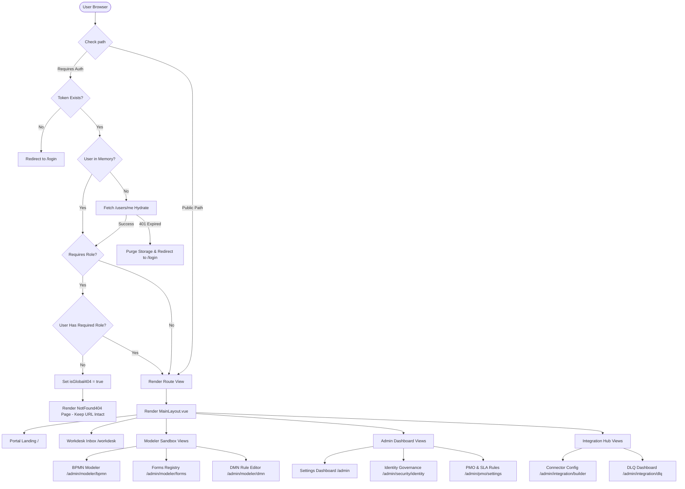

# Audit Analysis Report: Frontend Button Maps and Navigation Flows (R2)

## Executive Summary
This report presents a static code analysis of the frontend application of the `ibpms-platform`. The application is built using Vue 3, Pinia (for state management), Vue Router (for routing), and Axios (via a global wrapper client `apiClient.ts`). 

The main goals of this audit are:
1. Map all route transitions and compile a navigation flow diagram.
2. Intercept and document button-triggered state updates, action handlers, and network payloads—focusing on critical operations: **Claim**, **Unclaim**, **Purgar**, **Skipeo**, and **Publicar**.
3. Verify compliance with non-functional security constraints, optimistic UI updates, and error-handling mechanisms.

---

## 1. Route Navigation Map & Flow Security
All frontend navigation is managed by Vue Router (`src/router/index.ts`) and secured by a decentralized guard (`src/router/RouteGuards.ts`). 

### Navigation Interceptors & Guards
The application utilizes `rbacGuard` as a `beforeResolve` hook to enforce Role-Based Access Control (RBAC):
- **Authentication**: Checks `authStore.token` or `localStorage.getItem('ibpms_token')`. If missing, redirects to `/login`.
- **Session Hydration**: If a token is found but no user object is present in memory, it calls `authStore.hydrateAuth()` to restore the session.
- **Security by Obscurity (CA-3)**: If a route defines `meta.roles` and the user's role list does not intersect, the guard sets `authStore.isGlobal404 = true`. Vue Router continues routing but the UI displays a `NotFound404` component, keeping the restricted URL intact in the browser address bar.

### App Routes Registry

| Path | View Component | Auth Req. | Roles Allowed | Notes |
| :--- | :--- | :---: | :--- | :--- |
| `/login` | `views/Login.vue` | No | Public | Exempted from auth checks (`isPublic: true`) |
| `/public/start/:processKey` | `views/public/PublicIntake.vue` | No | Public | Intake endpoint for anonymous trigger |
| `/portal/tracking` | `views/public/CustomerPortal.vue` | No | Public | Guest client tracking view |
| `/` | `views/Portal.vue` | Yes | All Authenticated | Main Hub / Portal Landing |
| `/workdesk` | `views/Workdesk.vue` | Yes | All Authenticated | Central Workdesk global inbox grid |
| `/intake-triage` | `views/IntakeTriageView.vue` | Yes | `Global Admin`, `ROLE_SUPER_ADMIN` | Triage dashboard for intake events |
| `/kanban` | `views/kanban/KanbanView.vue` | Yes | All Authenticated | Kanban board UI |
| `/inbox` | `views/inbox/InboxView.vue` | Yes | All Authenticated | Team inbox mailbox |
| `/admin` | `views/admin/SettingsView.vue` | Yes | `ROLE_SUPER_ADMIN`, `Global Admin` | General Admin Panel |
| `/admin/incidents` | `views/admin/IncidentCenter.vue` | Yes | All Authenticated | SysAdmin incident dashboard |
| `/admin/modeler/bpmn` | `views/admin/Modeler/BpmnDesigner.vue` | Yes | All Authenticated | Modeler for BPMN process flow schemas |
| `/admin/modeler/forms` | `views/admin/Modeler/FormList.vue` | Yes | All Authenticated | Active UI Forms Repository |
| `/admin/modeler/forms/designer` | `views/admin/Modeler/FormDesigner.vue` | Yes | All Authenticated | Drag-and-drop form definition designer |
| `/admin/modeler/dmn` | `views/admin/Modeler/DmnIntelligence.vue` | Yes | All Authenticated | DMN Rule engine modeler |
| `/admin/intake` | `views/admin/ServiceDelivery/IntakeManual.vue` | Yes | All Authenticated | Service Delivery manual start intake |
| `/admin/customer360` | `views/admin/ServiceDelivery/Customer360.vue` | Yes | All Authenticated | Customer profile 360-degree view |
| `/admin/project-builder` | `views/admin/ProjectBuilder/ProjectBuilder.vue` | Yes | All Authenticated | Work Breakdown Structure builder |
| `/admin/projects/manager` | `views/admin/ProjectBuilder/ProjectManager.vue` | Yes | All Authenticated | Portfolio and resource management |
| `/admin/projects/agile-hub/:projectId?` | `views/admin/ProjectBuilder/AgileHub.vue` | Yes | All Authenticated | PMO Task agile hub dashboard |
| `/admin/analytics/bam` | `views/admin/Analytics/DashboardBAM.vue` | Yes | All Authenticated | Process Health metrics (Bam Dashboard) |
| `/admin/integration/catalog` | `views/admin/Integration/ConnectorCatalog.vue` | Yes | All Authenticated | Integrations Connector catalog |
| `/admin/integration/builder` | `views/admin/Integration/ConnectorBuilder.vue` | Yes | All Authenticated | Custom connector configuration builder |
| `/admin/integration/mapper` | `views/admin/Integration/VisualMapper.vue` | Yes | All Authenticated | Drag-and-drop properties mapper |
| `/admin/integration/dlq` | `views/admin/Integration/DlqDashboard.vue` | Yes | `ADMIN_IT` | RabbitMQ and TaskRescue DLQ Dashboard |
| `/sgdea/vault` | `views/admin/SGDEA/DocumentGrid.vue` | Yes | All Authenticated | SGDEA Document management grid |
| `/ai/prompts` | `views/admin/AI/PromptLibrary.vue` | Yes | `Global Admin`, `prompt_engineer` | AI Prompts and LLM templates repository |
| `/admin/mailboxes` | `views/admin/AI/SacConfigManager.vue` | Yes | `Global Admin` | Inbound Graph Mailbox setup |
| `/admin/security/identity` | `views/admin/Security/IdentityGovernance.vue` | Yes | `ROLE_SUPER_ADMIN`, `SUPER_ADMIN`, `Global Admin` | Identity management & active sessions |
| `/admin/pmo/settings` | `views/admin/PMO/PmoSettings.vue` | Yes | `Global Admin`, `ROLE_SUPER_ADMIN` | SLA metrics configuration & bank holidays |

---

## 2. Draft Mermaid Navigation Flow Diagram
Below is the draft structure mapping out the routes, access paths, and guards.

---

## 3. R2 Detailed Button Mapping
The table below documents button click handlers, matching Pinia stores, REST API endpoints, payload configurations, and error-handling characteristics.

| Component / View | Screen Button Label | HTML Selector / Test ID | Vue Click Handler | Pinia Store & Action | API Endpoint & Payload | Error Handling / UI Rollbacks |
| :--- | :--- | :--- | :--- | :--- | :--- | :--- |
| `views/Workdesk.vue` | **Reclamar** | `data-testid="claim-button-{id}"` | `onClaimTask(task)` | `useWorkdeskStore().claimTask` | **POST** `/api/v1/workbox/tasks/{id}/claim` Payload: *None* | Optimistic: `assignee = 'analista'` and `_isConfirming = true`. Backoff: Retries up to 3 times (2s, 4s, 8s). Rollback: Reverts local array on error and triggers red toast `#claim-rollback-toast` in DOM. |
| `components/workdesk/TaskPreviewModal.vue` | **Reclamar Tarea** | `data-test="btn-claim"` | `handleClaim()` | `useWorkdeskStore().claimTask` | **POST** `/api/v1/workbox/tasks/{id}/claim` Payload: *None* | Sets local `isClaiming = true`. If conflict (HTTP 409) is returned, triggers message `isAlreadyClaimed = true` (Locked badge). |
| `components/workdesk/WorkdeskGrid.vue` | **Reclamar Seleccionadas** | *None* | `handleBulkClaim()` | `useWorkdeskStore().bulkClaimTasks` | **POST** `/api/v1/workbox/tasks/bulk-claim` Payload: `string[]` (IDs list) | Disables button on loading. On success, redirects user to 'PERSONAL' view. |
| `views/Workdesk.vue` | **Liberar (Unclaim)** | `data-testid="btn-release-task"` | `onReleaseTask(task)` | `useWorkdeskStore().unclaimTask` | **POST** `/api/v1/workbox/tasks/{id}/unclaim` Payload: `{ mensajeInterno: '' }` | Optimistic: Slices task from inboxes. Rollback: Restores snapshot state. |
| `components/workdesk/WorkdeskGrid.vue` | **Liberar (Unclaim)** | *None* | `promptUnclaim(taskId)` | `useWorkdeskStore().unclaimTask` | **POST** `/api/v1/workbox/tasks/{id}/unclaim` Payload: `{ mensajeInterno: reason }` | Launches confirmation modal. Clicking "Sí, liberar" executes `confirmUnclaim()` which triggers store action. |
| `views/Workdesk.vue` | **Skipeo Justificado** | `data-testid="btn-skipeo"` | `openSkipReason()` | *None (Local state)* | *None* | Resets `skipForm` details and displays skip modal. |
| `views/Workdesk.vue` | **Confirmar Salto** | `data-testid="confirm-skip"` | `submitSkip()` | `useWorkdeskStore().skipAndNext` | **POST** `/api/v1/workdesk/attend-next/skip` Payload: `{ taskId, skipReason, skipReasonDetail }` | Validates details size (>10 chars if OTHER). On success, closes modal, opens next task (`openedTask = newItem`). |
| `views/admin/Integration/DlqDashboard.vue` | **Purgar Todo** | *None* | `purgeAll()` | *None (Local state)* | *None* | Displays bulk purge warning modal and resets input. |
| `views/admin/Integration/DlqDashboard.vue` | **Confirmar Purga** | *None* | `executePurge()` | `useIntegrationStore().delete` | **DELETE** `/api/v1/admin/queues/dlq/purge` Payload: `{ justification }` | Justification must be $\ge 20$ chars. On success, closes modal and invokes `fetchDLQ()`. |
| `views/admin/Integration/DlqDashboard.vue` | **Descartar** (Msg) | *None* | `purgeMsg(id)` | *Local filter only* | *None* | Instantly filters message out of local items. |
| `views/admin/ProjectBuilder/TemplateBuilder.vue` | **[ PUBLICAR PLANTILLA ]** | *None* | `publishTemplate()` | `useProjectTemplateStore().publishTemplate` | **POST** `/api/v1/design/projects/templates/{id}/publish` Payload: *None* | Disabled unless template is publishable (at least 1 task per milestone, all tasks have non-empty `formKey`). On success, sets status to `PUBLISHED` (Read-only view). |
| `views/admin/Modeler/BpmnDesigner.vue` | **Desplegar (BPMN)** | `data-testid="btn-confirm-deploy"` | `confirmDeploy()` | `useIntegrationStore().deployProcess` (prototype wrapper) | **POST** `/api/v1/design/processes/deploy` Payload: `FormData` (Strategy, Comment, XML file blob) | Strategy can be coexistence/migration. Comment must be $\ge 10$ chars. Removes force_deploy bypass options (Hard Stop). On error (422), closes modal and renders issues in lower validation log panel. |
| `views/admin/Modeler/BpmnDesigner.vue` | **Solicitar Despliegue** | *None* | `requestDeploy()` | `useIntegrationStore().post` | **POST** `/api/v1/design/processes/deploy-request` Payload: `FormData` (XML file blob) | Submits flow schematic file to the Release Manager review queue. |
| `views/admin/Modeler/DmnIntelligence.vue` | **Publicar Ahora** | *None* | `executeControlledDeploy()` | `useDmnStore().saveDmn` | **PUT** `/api/v1/dmn-models/{id}` Payload: `{ key, name, xmlData, formPattern }` | Sudo check: Requires typing validation pass `CONFIRMO_V2`. On success, sets `isManual = true` in store and purges drafts. |

---

## 4. Operational In-Depth Breakdown

### 4.1 Claim (Reclamar)
Reclaiming is a highly transactional operation backed by defensive UI patterns:
1. **Trigger points**: Can be executed via direct click on the "Reclamar" action row in the Workdesk Team Pool, inside the Task Preview modal, or as a bulk operation.
2. **State Updates**:
   - `useWorkdeskStore` creates a snapshot of the current local task items list.
   - It performs an **optimistic UI update**: sets the task's assignee to `'analista'` and sets `_isConfirming = true` immediately.
3. **HTTP Client Requests**: 
   - A POST request is dispatched to `/api/v1/workbox/tasks/{id}/claim`.
4. **Idempotence & Concurrency (J-04/CA-21)**:
   - If the network fails, or if a `429` / `503` status is returned, the Axios response interceptor triggers an automatic retry mechanism. It retries up to 3 times using exponential backoff intervals (`2s`, `4s`, and `8s`).
   - If all retries fail, the store rolls back the task list to the initial snapshot. It then programmatically injects a red failure notification banner `#claim-rollback-toast` into the DOM `body` warning the user: 
     > *"❌ No pudimos confirmar tu reclamo porque la conexión con el servidor no se restableció. La tarea sigue disponible en la cola del equipo."*
   - If the task has already been claimed by another team member, the server returns an HTTP 409 conflict, which is caught to toggle `isAlreadyClaimed = true` (marking the task as locked/unavailable in the UI).

### 4.2 Unclaim (Liberar)
Releasing a task follows a structured flow:
1. **Trigger points**: Initiated by clicking "Liberar (Unclaim)" under "Mis Tareas". In the grid view, this triggers a warning modal explaining that unsaved progress will be lost and asks for an optional reason.
2. **State Updates**:
   - Slices the task out of the local Personal items list immediately (optimistic UI).
3. **HTTP Client Requests**:
   - Dispatches a POST to `/api/v1/workbox/tasks/{id}/unclaim` sending a JSON payload containing `{ mensajeInterno: reason }`.
4. **Error Recovery**:
   - If the API call fails, the store reverts the task list to the snapshot, returning the item to the user's active inbox view.

### 4.3 Purgar (Purge)
"Purge" actions are deployed as highly restricted administrative features:
1. **Trigger points**: Accessible on the DLQ Dashboard (`views/admin/Integration/DlqDashboard.vue`) to purge RabbitMQ dead-letter queues, or under Identity Governance to revoke JWT tokens ("kill-switch").
2. **Security & Justification Constraints**:
   - The "Confirmar Purga" action is guarded. The confirmation modal remains locked unless the administrator inputs a textual justification of at least 20 characters (`purgeJustification.length < 20` disables the button).
3. **HTTP Client Requests**:
   - Dispatches a DELETE request to `/api/v1/admin/queues/dlq/purge` passing the justification payload: `{ justification }`.
4. **Post-execution**:
   - Closes the modal, triggers a status update request (`fetchDLQ`), and synchronizes the RabbitMQ cluster metrics.

### 4.4 Skipeo (Skipeo Justificado)
Used in force routing and active queue atendees:
1. **Trigger points**: Triggered via "Skipeo Justificado" button in the task preview modal footer.
2. **State Updates**:
   - Opens the modal containing predefined reasons: `CLIENT_NO_RESPONSE`, `REQUIRES_DOCUMENTATION`, `OUT_OF_AREA`, or `OTHER`.
   - If the user selects `OTHER`, they must write at least 10 explanatory characters.
3. **HTTP Client Requests**:
   - Dispatches a POST to `/api/v1/workdesk/attend-next/skip` with payload `{ taskId, skipReason, skipReasonDetail }`.
4. **Operational Continuity**:
   - The action returns the next critical task from the queue. On success, the UI closes the modal and binds the returned task to `openedTask.value`, transitioning the user directly to their next task.

### 4.5 Publicar (Publish / Deploy)
Publishing operates differently depending on the asset:
1. **WBS Template Builder**:
   - Triggers `publishTemplate()` in `TemplateBuilder.vue`.
   - Action is disabled unless the template meets structural constraints: it requires at least one task per milestone and all tasks must have a valid `formKey`.
   - Dispatches a POST to `/api/v1/design/projects/templates/{id}/publish`. On success, the template status updates to `PUBLISHED` (Read-only).
2. **BPMN Process Modeler**:
   - Triggers `confirmDeploy()` in `BpmnDesigner.vue` (under `showDeployModal`).
   - The form requires a deployment strategy (`coexist` or `migrate`) and a mandatory comment of at least 10 characters.
   - Note: The bypass option (`forceDeploy` checkbox) was removed as a strict guard.
   - Dispatches a POST request (encoded as `multipart/form-data`) to `/api/v1/design/processes/deploy` sending the process ID, strategy, comment, and raw XML file blob.
   - On success, it displays the updated deployment version details. On failure (HTTP 422), it hides the modal and populates the lower validation console panel with issues returned by Camunda.
3. **DMN Rule Modeler**:
   - Triggers `executeControlledDeploy()` in `DmnIntelligence.vue` (under "Contención de Pánico" modal).
   - Requires typing the passcode validation `CONFIRMO_V2`.
   - Dispatches a PUT to `/api/v1/dmn-models/{id}` saving the XML string, then purges local draft storages.
